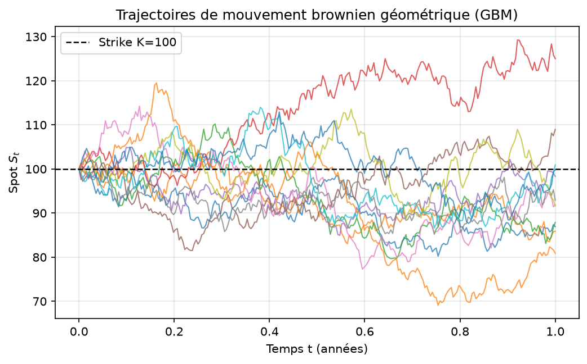
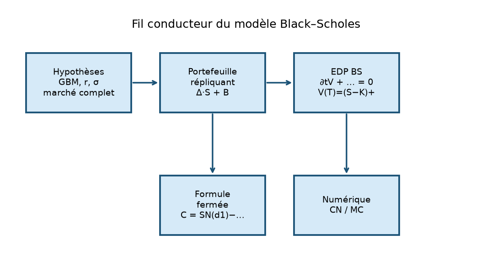
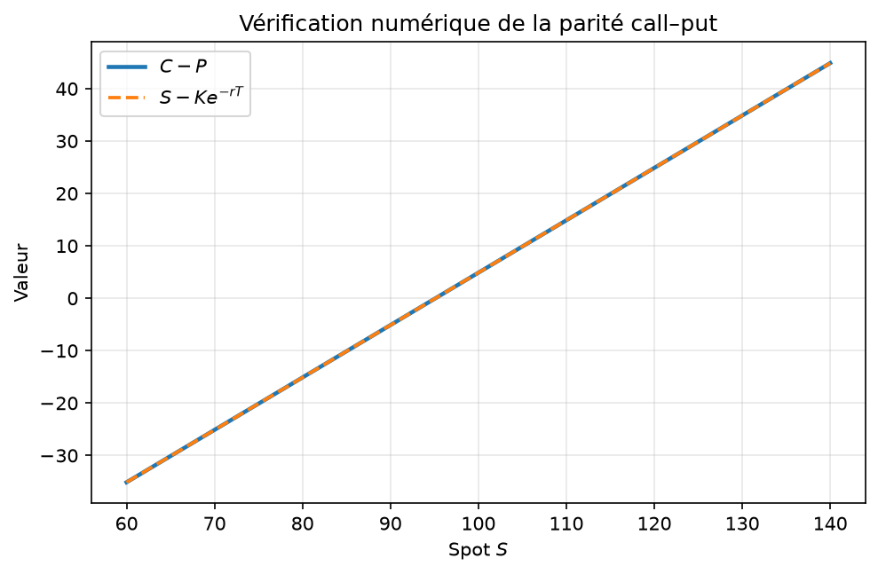
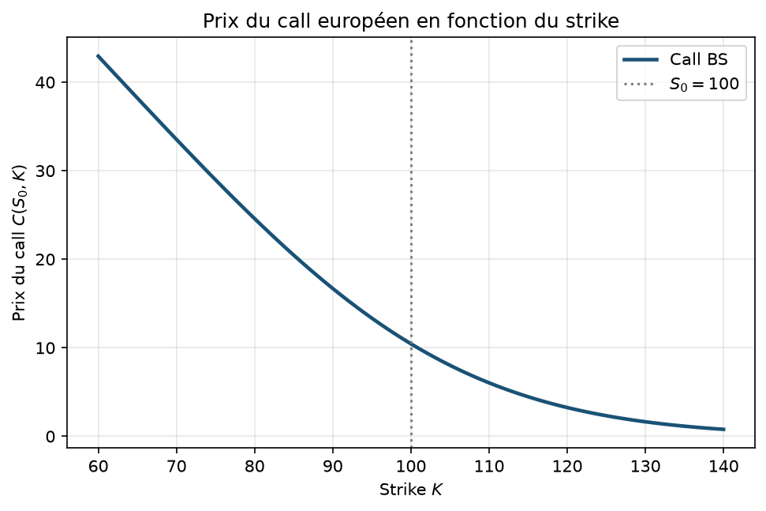
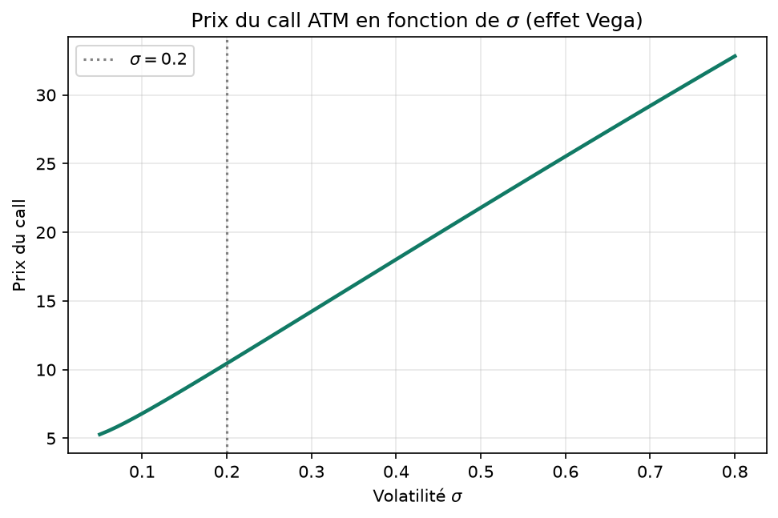
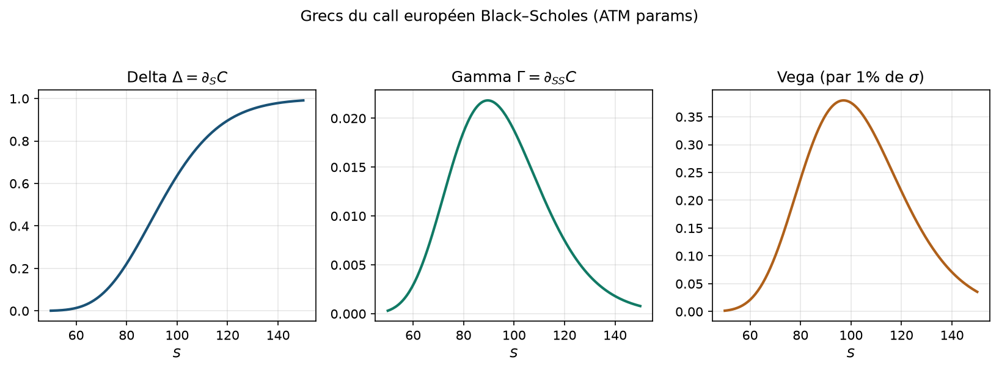
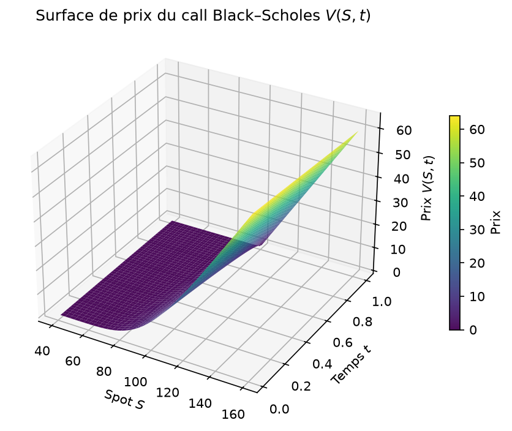
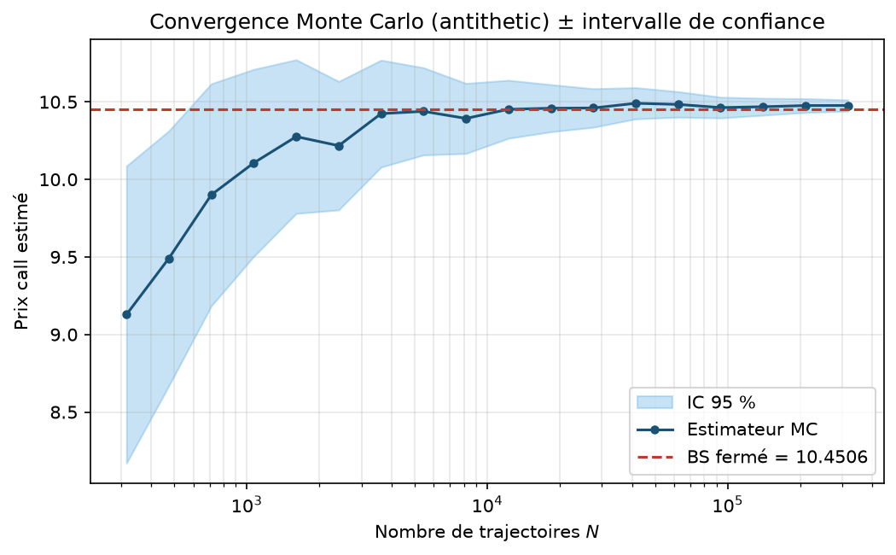
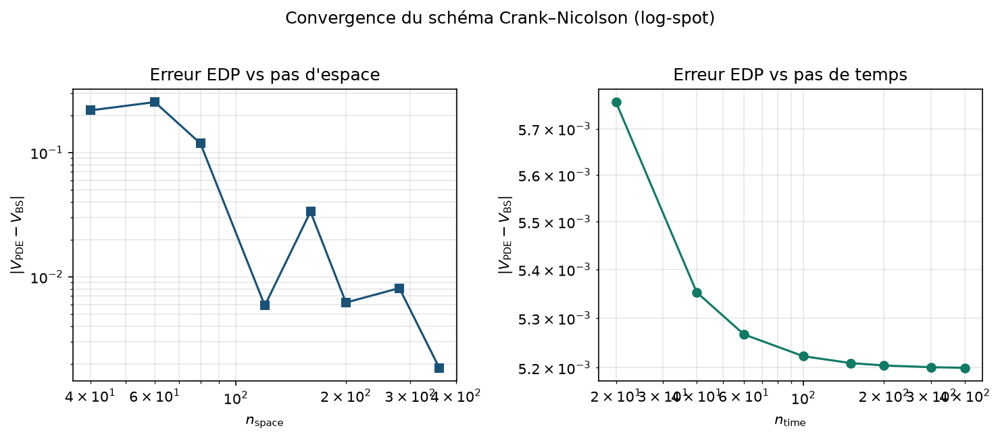
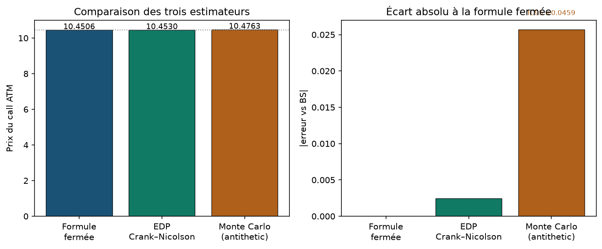

# Black–Scholes : formule fermée, EDP et Monte Carlo

**Projet :** `01-black-scholes`  
**Niveau :** L3 fin / M1 début — mathématiques appliquées / finance quantitative  
**Prérequis :** calcul différentiel, probabilités (loi normale, espérance), notions d’EDP paraboliques, Python scientifique (NumPy / SciPy)  
**Durée estimée :** 4–6 h de lecture active + 2–3 h de reproduction numérique  
**Objectifs d’apprentissage mesurables :**
1. Dériver l’EDP de Black–Scholes et retrouver la formule fermée call/put.
2. Implémenter et comparer le pricing EDP (Crank–Nicolson) et Monte Carlo.
3. Analyser erreurs, convergence, variance et Grecs (Δ, Γ, Vega).

---

## 1. Introduction et motivation

Le prix d’une option européenne est l’un des problèmes centraux de la finance quantitative moderne. Une option *call* donne le droit, mais non l’obligation, d’acheter un actif à un prix d’exercice $K$ à une date $T$. Une option *put* donne le droit de vendre. La question n’est pas « que vaudra l’actif demain ? », mais : **quel prix d’arbitrage sans risque peut-on attribuer aujourd’hui à ce contrat ?**

Avant 1973, les praticiens utilisaient des règles empiriques. L’article fondateur de Black & Scholes (1973) et le travail contemporain de Merton (1973) ont transformé le problème en un modèle mathématique précis : sous des hypothèses de marché idéal (actif continu, volatilité constante, taux sans risque constant, absence d’opportunité d’arbitrage), le prix d’une option européenne est la solution d’une équation aux dérivées partielles parabolique, et cette solution admet une formule fermée pour les payoffs call et put.

Pourquoi ce sujet compte-t-il encore aujourd’hui ? Parce qu’il concentre trois compétences transversales des mathématiques appliquées :

- **Modélisation stochastique.** Le sous-jacent suit un mouvement brownien géométrique (GBM). On apprend à passer d’une EDS à une loi de $S_T$, puis à une espérance actualisée.
- **Analyse d’EDP.** Le pricing est une EDP de type chaleur dégénérée. Les méthodes de différences finies (ici Crank–Nicolson) illustrent stabilité, conditions aux limites et convergence.
- **Simulation Monte Carlo.** Lorsque la dimension augmente ou que le payoff devient path-dependent, la simulation d’espérance redevient l’outil de référence. On apprend biais, variance et réduction de variance.

Le fil conducteur de ce dossier est volontairement simple et complet. On fixe un call européen ATM :

$$
S_0=100,\quad K=100,\quad T=1,\quad r=0{,}05,\quad \sigma=0{,}2.
$$

On calcule son prix de trois façons indépendantes :

1. formule fermée (`call_price` dans `src/bs_closed_form.py`) ;
2. résolution numérique de l’EDP (`price_call_crank_nicolson` dans `src/bs_pde.py`) ;
3. Monte Carlo avec variables antithétiques (`price_call_mc` dans `src/bs_mc.py`).

Pour ces paramètres, la formule fermée donne $C\approx 10{,}4506$. L’EDP Crank–Nicolson (250×250) donne environ $10{,}4530$. Le Monte Carlo ($N=2\cdot 10^5$) donne environ $10{,}476\pm 0{,}046$ à 95 %. Ces trois nombres doivent coïncider à l’erreur numérique près : c’est le critère d’intégrité du projet.

La question centrale du polycopié est donc :

> Comment passer du modèle GBM à un prix d’option reproductible, et comment mesurer la qualité de chaque méthode numérique ?

Les sections suivantes suivent la progression : intuition → formalisation → preuves → algorithmes → expériences → limites.

### 1.1 Ce que le lecteur saura faire à la fin

À l’issue de ce polycopié et des expériences associées, un étudiant L3/M1 doit être capable de :

- écrire l’EDS du GBM, en déduire la loi de $S_T$, et expliquer pourquoi le drift de pricing est $r$ ;
- dériver l’EDP BS par un argument de portefeuille Δ-couvert, et reconnaître les conditions terminales/limites ;
- programmer la formule fermée et vérifier la parité call–put à la précision machine ;
- lancer un Crank–Nicolson 1D et un Monte Carlo antithétique, puis **interpréter** leurs écarts ;
- citer Δ, Γ, Vega et relier Vega à la croissance du prix en $\sigma$.

Ces compétences sont directement évaluables : chaque item correspond à une fonction du dépôt ou à un test `pytest`.

### 1.2 Position dans le cursus

Ce sujet s’insère après un cours de probabilités (gaussiennes, espérance) et idéalement en parallèle d’une introduction aux EDP. Il prépare aux modules M1 de calcul stochastique, de méthodes numériques pour la finance, et aux stages de desk dérivés. Il n’exige pas la théorie complète des intégrales stochastiques : la formule d’Itô est utilisée comme boîte noire justifiée, renvoyant à Shreve (2004) pour les fondements.

---

## 2. Prérequis et notations

### 2.1 Prérequis

Avant d’entrer dans le modèle, vérifier les points suivants.

**Analyse.** Dérivées partielles, formule de Taylor à deux variables, notion de problème de Cauchy pour une EDP parabolique.

**Probabilités.** Variable gaussienne standard $Z\sim\mathcal N(0,1)$, fonction de répartition $\Phi$, densité $\varphi$. Espérance conditionnelle élémentaire. Loi log-normale.

**Analyse stochastique (niveau introductif).** Processus de Wiener $(W_t)$, formule d’Itô unidimensionnelle. On ne suppose pas la théorie des martingales à la Shreve (2004) dans toute sa force, mais on l’utilise comme guide d’intuition.

**Numérique.** Schéma d’Euler pour une EDS, différences finies, inversion de systèmes tridiagonaux, estimateur Monte Carlo et erreur-type.

### 2.2 Table des notations

| Symbole | Signification |
|--------|----------------|
| $S_t$ | Prix du sous-jacent à l’instant $t$ |
| $K$ | Strike (prix d’exercice) |
| $T$ | Maturité (en années) |
| $r$ | Taux d’intérêt sans risque (continu) |
| $\sigma$ | Volatilité (constante) |
| $W_t$ | Mouvement brownien standard |
| $V(t,S)$ | Prix de l’option à $t$ si $S_t=S$ |
| $C$, $P$ | Prix call / put européens |
| $\tau=T-t$ | Temps restant jusqu’à maturité |
| $d_1$, $d_2$ | Arguments de la formule BS |
| $\Phi$, $\varphi$ | cdf / pdf de $\mathcal N(0,1)$ |
| $\Delta$, $\Gamma$, Vega | Grecs $\partial_S V$, $\partial_{SS}V$, $\partial_\sigma V$ |
| $N$ | Nombre de trajectoires Monte Carlo |
| $n_{\mathrm{space}}$, $n_{\mathrm{time}}$ | Maillage EDP |

Dans tout le rapport, sauf mention contraire, les paramètres numériques de référence sont ceux de la section 1. Ils sont rappelés en Annexe B.

### 2.3 Conventions de signe et d’unités

Le temps $T$ est exprimé en **années** (une maturité de six mois correspond à $T=0{,}5$). Le taux $r$ et la volatilité $\sigma$ sont des grandeurs **continues annualisées** : $r=0{,}05$ signifie 5 % par an en composition continue. Les prix $S$ et $K$ sont dans la même unité monétaire ; le prix d’option $V$ l’est aussi. Les Grecs héritent des unités : $\Delta$ est sans dimension (par unité de spot), $\Gamma$ est en $1/\text{unité de spot}$, Vega est en unité de prix par unité de $\sigma$ absolu.

Lorsque l’on compare des méthodes, on rapporte l’**erreur absolue** $|V_{\mathrm{num}}-V_{\mathrm{BS}}|$ et, si utile, l’erreur relative. Pour le Monte Carlo, on privilégie l’intervalle de confiance plutôt qu’un seul écart ponctuel.

### 2.4 Logiciels et versions

Le code suppose Python 3 avec NumPy, SciPy et Matplotlib. Aucune bibliothèque de pricing propriétaire n’est requise. Les figures du rapport sont générées avec le backend `Agg` (non interactif), ce qui garantit la reproductibilité en environnement serveur ou CI.

---

## 3. Modèle mathématique

### 3.1 Hypothèses de marché

Le modèle de Black–Scholes repose sur un marché idéalisé (Black & Scholes, 1973 ; Merton, 1973 ; Hull, 2022) :

1. **Un actif risqué** $S$ et un **compte bancaire** $B_t=\mathrm{e}^{rt}$ (ou $dB_t=r B_t\,dt$).
2. **Pas de dividende** sur $S$ (extension possible : taux de dividende $q$).
3. **Volatilité $\sigma$ et taux $r$ constants.**
4. **Négociation continue**, short-selling autorisé, pas de coûts de transaction.
5. **Absence d’opportunité d’arbitrage** (AOA) et marché suffisamment riche pour répliquer les payoffs européens vanille.

Ces hypothèses sont fausses dans la réalité (volatilité stochastique, sauts, liquidité). Elles restent la base pédagogique et le *benchmark* de toute méthode plus avancée (Wilmott, Howison & Dewynne, 1995 ; Björk, 2009).

### 3.2 Mouvement brownien géométrique

Sous la mesure risque-neutre $\mathbb Q$ (celle qui sert au pricing), le spot suit

$$
dS_t = r S_t\,dt + \sigma S_t\,dW_t^{\mathbb Q}.
$$

C’est le **mouvement brownien géométrique**. La solution explicite s’obtient par Itô appliqué à $\log S$ :

$$
S_T = S_0\exp\Bigl(\bigl(r-\tfrac12\sigma^2\bigr)T + \sigma\sqrt{T}\,Z\Bigr),\qquad Z\sim\mathcal N(0,1).
$$

Ainsi $S_T$ est **log-normale**. La figure 1 montre des trajectoires simulées : on remarque la dispersion croissante avec le temps et le rôle du strike $K$ comme seuil de payoff.



*Figure 1. Douze trajectoires de GBM ($S_0=100$, $r=0{,}05$, $\sigma=0{,}2$, $T=1$). On observe que certaines finissent au-dessus du strike (payoff call positif), d’autres en dessous (payoff nul).*

### 3.3 Pricing par absence d’arbitrage

Sous AOA, le prix actualisé d’un actif réplicable est une martingale sous $\mathbb Q$. Pour un payoff $\Phi(S_T)$ européen,

$$
V(0,S_0)=\mathrm{e}^{-rT}\mathbb E^{\mathbb Q}\bigl[\Phi(S_T)\bigr].
$$

Pour un call, $\Phi(s)=(s-K)^+$. Pour un put, $\Phi(s)=(K-s)^+$. Cette représentation est l’âme du Monte Carlo (Glasserman, 2003) et de la formule fermée.

### 3.4 Dérivation de l’EDP (idée de couverture)

Soit $V(t,S)$ le prix. On forme un portefeuille $\Pi=V-\Delta S$ (court en $\Delta$ unités de spot). Par Itô,

$$
dV = \bigl(\partial_t V + r S\partial_S V + \tfrac12\sigma^2 S^2\partial_{SS}V\bigr)dt + \sigma S\partial_S V\,dW
$$

(en remplaçant le drift physique par $r$ une fois sous $\mathbb Q$, ou en annulant le risque via $\Delta$). Choisir $\Delta=\partial_S V$ annule le terme en $dW$. Le portefeuille devient localement sans risque, donc son rendement doit être $r$ :

$$
d\Pi = r\Pi\,dt.
$$

On obtient l’**EDP de Black–Scholes** :

$$
\partial_t V + r S\,\partial_S V + \tfrac12\sigma^2 S^2\,\partial_{SS}V - r V = 0,
\qquad (t,S)\in[0,T)\times(0,\infty),
$$

avec condition terminale $V(T,S)=\Phi(S)$. Pour le call : $\Phi(S)=(S-K)^+$. Les conditions aux limites naturelles sont $V(t,0)=0$ et $V(t,S)\sim S-K\mathrm{e}^{-r(T-t)}$ quand $S\to\infty$.

La figure 2 résume le fil conducteur conceptuel du modèle.



*Figure 2. Du GBM et de la couverture Δ à l’EDP, puis à la formule fermée ou aux méthodes numériques (CN / MC).*

### 3.5 Formule fermée call / put

En posant $x=\log S$ et en changeant de variables classiques (voir Annexe A), l’EDP se ramène à l’équation de la chaleur. La solution pour le call est

$$
C(S,t)= S\,\Phi(d_1) - K\mathrm{e}^{-r\tau}\Phi(d_2),
$$

avec $\tau=T-t$ et

$$
d_1=\frac{\log(S/K)+(r+\tfrac12\sigma^2)\tau}{\sigma\sqrt{\tau}},\qquad
d_2=d_1-\sigma\sqrt{\tau}.
$$

Le put s’écrit

$$
P(S,t)= K\mathrm{e}^{-r\tau}\Phi(-d_2) - S\,\Phi(-d_1).
$$

Dans le code : `d1_d2`, `call_price`, `put_price` (`src/bs_closed_form.py`). Pour les paramètres ATM de référence,

$$
d_1=0{,}35,\quad d_2=0{,}15,\quad C\approx 10{,}4506,\quad P\approx 5{,}5735.
$$

### 3.6 Parité call–put

Par AOA, indépendamment du modèle de volatilité (tant que le taux $r$ est déterministe),

$$
C-P = S - K\mathrm{e}^{-rT}
$$

à $t=0$ (sans dividende). C’est un test de cohérence numérique extrêmement utile. La figure 3 superpose $C-P$ et $S-K\mathrm{e}^{-rT}$ : les deux courbes se confondent.



*Figure 3. Vérification numérique de la parité call–put sur $S\in[60,140]$. On observe une coïncidence machine des deux courbes.*

### 3.7 Cas particuliers analytiques

- Si $\sigma\to 0$, le call tend vers $\mathrm{e}^{-rT}(S\mathrm{e}^{rT}-K)^+=(S-K\mathrm{e}^{-rT})^+$.
- Si $T\to 0$, on retrouve le payoff $(S-K)^+$.
- Si $S\to\infty$, $C\sim S-K\mathrm{e}^{-r\tau}$.
- Si $K\to 0$, $C\to S$ (presque un forward).

Ces limites servent de tests unitaires et de conditions aux bords pour l’EDP.

### 3.8 Interprétation probabiliste de $d_1$ et $d_2$

Sous $\mathbb Q$, $\Phi(d_2)=\mathbb Q(S_T>K)$ : probabilité risque-neutre d’exercice du call. Le terme $\Phi(d_1)$ est la probabilité d’exercice sous la mesure *stock-numéraire*. Ainsi

$$
C = S\,\mathbb Q^S(S_T>K) - K\mathrm{e}^{-rT}\mathbb Q(S_T>K).
$$

Cette lecture (Joshi, 2008 ; Lamberton & Lapeyre, 2007) relie formule fermée et représentation d’espérance.

### 3.9 Dérivation explicite de l’espérance du call

On détaille le calcul qui mène à la formule fermée à partir de la représentation risque-neutre. Posons

$$
S_T=S_0\mathrm{e}^{(r-\frac12\sigma^2)T+\sigma\sqrt{T}Z},\qquad Z\sim\mathcal N(0,1).
$$

Le call vaut

$$
C=\mathrm{e}^{-rT}\mathbb E\bigl[(S_T-K)^+\bigr]
=\mathrm{e}^{-rT}\int_{z^\star}^{\infty}
\bigl(S_0\mathrm{e}^{(r-\frac12\sigma^2)T+\sigma\sqrt{T}z}-K\bigr)\varphi(z)\,dz,
$$

où le seuil d’exercice $z^\star$ vérifie $S_T=K$, soit

$$
z^\star=\frac{\log(K/S_0)-(r-\frac12\sigma^2)T}{\sigma\sqrt{T}}=-d_2.
$$

On scinde l’intégrale en deux termes $I_1-I_2$. Pour $I_2$,

$$
I_2=\mathrm{e}^{-rT}K\int_{-d_2}^{\infty}\varphi(z)\,dz=K\mathrm{e}^{-rT}\Phi(d_2).
$$

Pour $I_1$, on complète l’exponentielle dans la densité : le facteur $\mathrm{e}^{\sigma\sqrt{T}z}$ décale la gaussienne de $\sigma\sqrt{T}$. Après simplification,

$$
I_1=S_0\Phi(d_1).
$$

On retrouve $C=S_0\Phi(d_1)-K\mathrm{e}^{-rT}\Phi(d_2)$. Ce calcul est le cœur analytique du sujet : **même objet**, vu soit comme EDP, soit comme intégrale gaussienne.

### 3.10 Du drift historique au drift $r$

Sous la mesure historique $\mathbb P$, on aurait $dS_t=\mu S_t\,dt+\sigma S_t\,dW_t^{\mathbb P}$. Le paramètre $\mu$ (rendement espéré) **n’entre pas** dans le prix BS. L’argument de couverture montre pourquoi : le risque brownien est annulé localement par $\Delta$, donc le drift risqué disparaît. De façon équivalente, le théorème de Girsanov change la mesure pour remplacer $\mu$ par $r$ (Shreve, 2004 ; Björk, 2009).

Contre-exemple pédagogique : si l’on « prixait » naïvement $\mathrm{e}^{-\mu T}\mathbb E^{\mathbb P}[(S_T-K)^+]$ avec $\mu\neq r$, on introduirait un arbitrage par rapport au portefeuille répliquant. En salle de marché, $\mu$ sert aux vues discrétionnaires, pas au marking vanille BS.

### 3.11 Remarque sur les dividendes

Si l’actif verse un dividende continu $q$, le GBM risque-neutre devient $dS_t=(r-q)S_t\,dt+\sigma S_t\,dW_t$ et la formule call se généralise en

$$
C=S\mathrm{e}^{-q\tau}\Phi(d_1^q)-K\mathrm{e}^{-r\tau}\Phi(d_2^q),
$$

avec $d_1^q$ obtenu en remplaçant $r$ par $r-q$ dans le log-forward. Le code du repo suppose $q=0$ ; l’extension est un exercice direct (remplacer $S$ par $S\mathrm{e}^{-qT}$ dans la formule).

---

## 4. Analyse / propriétés

### 4.1 Existence et unicité

Pour un payoff lipschitzien à croissance au plus linéaire, l’EDP de Black–Scholes admet une unique solution classique (ou viscosité) à croissance contrôlée (Wilmott et al., 1995 ; Duffie, 2001). Intuitivement : après transformation en équation de la chaleur sur $\mathbb R$, le noyau gaussien donne une solution unique.

Du côté probabiliste, l’espérance $\mathrm{e}^{-rT}\mathbb E[\Phi(S_T)]$ est bien définie dès que $\mathbb E[|\Phi(S_T)|]<\infty$, ce qui est vrai pour call et put car $S_T$ a tous ses moments.

### 4.2 Monotonie et convexité

Le call européen BS est :

- **croissant** en $S$ (Delta $\in(0,1)$) ;
- **décroissant** en $K$ ;
- **croissant** en $\sigma$ (Vega $>0$) ;
- **croissant** en $T$ si $r\ge 0$ pour le call américain non, mais pour l’européen call sans dividende oui en pratique dans BS ;
- **convexe** en $S$ (Gamma $>0$).

La figure 4 montre $C$ en fonction de $K$ : plus le strike est bas, plus le call est cher.



*Figure 4. Prix du call ATM en $S_0$ fixe, strike variable. On observe la décroissance monotone et la convexité typique du payoff actualisé.*

La figure 5 montre l’effet Vega : $C$ croît avec $\sigma$.



*Figure 5. Prix ATM en fonction de $\sigma$. On observe une croissance concave-convexe selon la zone ; près de $\sigma=0$ le prix plafonne vers la valeur intrinsèque actualisée.*

### 4.3 Grecs

Les sensibilités usuelles du call sont

$$
\Delta=\Phi(d_1),\qquad
\Gamma=\frac{\varphi(d_1)}{S\sigma\sqrt{\tau}},\qquad
\mathrm{Vega}=S\varphi(d_1)\sqrt{\tau}.
$$

Pour les paramètres ATM : $\Delta\approx 0{,}637$, $\Gamma\approx 0{,}0188$, $\mathrm{Vega}\approx 37{,}52$ (dérivée brute en $\sigma$, pas en point de pourcentage). Implémentation : `delta_call`, `gamma`, `vega` dans `bs_closed_form.py`.



*Figure 6. Delta en sigmoïde, Gamma concentré près de la monnaie, Vega maximal ATM. On observe que le risque de second ordre est localisé autour de $S\approx K$.*

### 4.4 Erreurs de modélisation

Le modèle BS échoue empiriquement sur :

- le **smile de volatilité** (vol implicite dépendante de $K$) ;
- les **sauts** (krachs) ;
- les **taux stochastiques** pour les maturités longues ;
- les **dividendes discrets**.

Ces écarts motivent les prolongements de la section 8. Ils n’invalident pas BS comme outil pédagogique et comme référence de calibration locale.

### 4.5 Surface de prix

La figure 7 représente $V(S,t)=C(S,T-t)$ pour un call. Près de $t=T$, la surface se plie vers le payoff en « hockey stick ». Loin de la maturité, elle est lissée par la diffusion.



*Figure 7. Surface de prix du call. On observe le lissage temporel du coin $(S-K)^+$ et la croissance en $S$.*

### 4.6 Bornes modèles indépendantes

Sans hypothèse de GBM, l’AOA impose déjà des inégalités (Merton, 1973 ; Hull, 2022) :

$$
(S-K\mathrm{e}^{-rT})^+\le C\le S,
\qquad
(K\mathrm{e}^{-rT}-S)^+\le P\le K\mathrm{e}^{-rT}.
$$

La formule BS respecte strictement ces bornes dès que $\sigma>0$ et $T>0$. Si un pricer numérique sort $C>S$ ou $C<(S-K\mathrm{e}^{-rT})^+$, c’est un bug, pas une « particularité du schéma ». Ces inégalités sont donc des **gardes-fous** de test.

### 4.7 Theta et équation BS

Le Grec $\Theta=\partial_t V$ mesure la perte de valeur due au passage du temps. Pour un call européen BS ATM typique, $\Theta<0$ : le temps « mange » la valeur temps. L’EDP elle-même se réécrit

$$
\Theta + r S\Delta + \tfrac12\sigma^2 S^2\Gamma - r V=0,
$$

ce qui relie les Grecs entre eux. C’est une identité de contrôle utile : une fois $\Delta$ et $\Gamma$ calculés, $\Theta$ en découle. On peut s’en servir pour vérifier une implémentation de Grecs par différences finies.

### 4.8 Limite de volatilité implicite

Inversement, donné un prix de marché $C^{\mathrm{mkt}}$, on cherche $\sigma_{\mathrm{imp}}$ tel que $C_{\mathrm{BS}}(\sigma_{\mathrm{imp}})=C^{\mathrm{mkt}}$. L’existence et l’unicité suivent de la stricte croissance de $C$ en $\sigma$ (Vega $>0$). Numériquement, une dichotomie ou Newton suffit. Le *smile* observé ($\sigma_{\mathrm{imp}}$ dépendant de $K$) est la preuve empirique que BS n’est qu’une carte, pas le territoire.

---

## 5. Méthodes numériques ou algorithmiques

On compare deux méthodes numériques au benchmark fermé.

### 5.1 Différences finies : Crank–Nicolson en log-spot

Posons $x=\log S$ et $u(\tau,x)=V(T-\tau,\mathrm{e}^{x})$. L’EDP devient une équation à coefficients constants

$$
\partial_\tau u = a\,\partial_{xx}u + b\,\partial_x u + c\,u,
$$

avec $a=\tfrac12\sigma^2$, $b=r-\tfrac12\sigma^2$, $c=-r$.

Sur une grille $x_i=x_{\min}+i\Delta x$, $\tau_n=n\Delta\tau$, le schéma **Crank–Nicolson** moyenne un pas implicite et un pas explicite (Crank & Nicolson, 1947 ; Tavella & Randall, 2000) :

$$
\frac{u^{n+1}-u^n}{\Delta\tau}
=
\tfrac12\bigl(L u^{n+1}+L u^n\bigr),
$$

où $L$ est le discrétiseur centré de $a\partial_{xx}+b\partial_x+c$. Chaque pas demande la résolution d’un système **tridiagonal**, effectué ici par `scipy.linalg.solve_banded`.

**Pseudo-code.**

```text
Entrée: S0, K, T, r, σ, n_space, n_time
Construire grille x = linspace(log(K/50), log(S_max), n_space)
V ← max(exp(x)-K, 0)
Pour n = 1..n_time:
    Construire second membre (partie explicite)
    Imposer Dirichlet en x_min, x_max
    Résoudre système tridiagonal → nouveau V
Retourner interp(log(S0), x, V)
```

**Complexité.** $O(n_{\mathrm{time}}\cdot n_{\mathrm{space}})$ avec constante faible (solveur bande largeur 1). Mémoire $O(n_{\mathrm{space}})$.

**Stabilité.** Crank–Nicolson est inconditionnellement stable au sens de von Neumann pour la chaleur, mais peut osciller si le payoff est non lisse et $\Delta\tau$ trop grand. En pratique, $n_{\mathrm{time}}\ge 100$ et $n_{\mathrm{space}}\ge 150$ suffisent pour une erreur $<10^{-2}$ sur le call ATM.

**Conditions aux limites.** En $S\to 0$ ($x\to-\infty$), $V=0$. En $S\to\infty$, on impose une borne de type $S-K\mathrm{e}^{-rT}$ (approximation constante en temps dans l’implémentation du repo — voir discussion section 7).

Implémentation : `price_call_crank_nicolson` dans `src/bs_pde.py`.

### 5.2 Monte Carlo risque-neutre

On simule $Z_i\sim\mathcal N(0,1)$ i.i.d., on pose

$$
S_T^{(i)}=S_0\exp\bigl((r-\tfrac12\sigma^2)T+\sigma\sqrt{T}Z_i\bigr),
\qquad
\hat C_N=\frac1N\sum_{i=1}^N \mathrm{e}^{-rT}(S_T^{(i)}-K)^+.
$$

L’estimateur est **sans biais** (dans BS exact pour $S_T$). L’erreur-type empirique est

$$
\widehat{\mathrm{se}}=\frac{s_N}{\sqrt{N}},\qquad
s_N^2=\frac1{N-1}\sum_i\bigl(X_i-\bar X\bigr)^2.
$$

Un IC approximatif à 95 % est $\hat C_N\pm 1{,}96\,\widehat{\mathrm{se}}$.

**Variables antithétiques.** Si $N$ est pair, on tire $N/2$ gaussiennes $Z$ et on moyenne les payoffs de $Z$ et $-Z$. Cela réduit souvent la variance pour les payoffs monotones (Glasserman, 2003). Dans le code, `antithetic=True` par défaut.

**Pseudo-code.**

```text
n ← N/2 si antithetic sinon N
Tirer Z ~ N(0,1)^n
X ← payoff(Z)
Si antithetic: X ← 0.5*(X + payoff(-Z))
Retourner (mean(X), std(X)/sqrt(len(X)))
```

**Complexité.** $O(N)$ pour un européen vanille (un seul pas de temps). Pour un path-dependent à $m$ pas : $O(Nm)$.

Implémentation : `price_call_mc` dans `src/bs_mc.py`.

### 5.3 Comparaison des méthodes

Le tableau 1 résume les ordres de grandeur.

| Critère | Formule fermée | EDP Crank–Nicolson | Monte Carlo |
|--------|----------------|--------------------|-------------|
| Biais (BS exact) | 0 | $O(\Delta x^2+\Delta\tau^2)$ (idéalement) | 0 (vanille) |
| Variance | 0 | 0 (déterministe) | $O(1/N)$ |
| Coût typique ATM | $O(1)$ | $O(n_x n_t)$ | $O(N)$ |
| Extension multi-actifs | difficile | curse of dimensionality | favorable |
| Grecs | analytiques | différenciation de grille | pathwise / adjoint |

*Tableau 1. Comparaison qualitative des trois approches pour un call européen BS.*

La figure 8 illustre la convergence MC : l’estimateur se resserre autour de la valeur fermée, et l’IC 95 % se rétrécit comme $N^{-1/2}$.



*Figure 8. Estimateur MC antithetic ± IC 95 % en fonction de $N$. On observe la décroissance de la largeur d’IC et le centrage autour de $10{,}45$.*

La figure 9 montre l’erreur EDP en fonction de $n_{\mathrm{space}}$ et $n_{\mathrm{time}}$.



*Figure 9. Erreur absolue vs formule fermée. On observe une décroissance globale avec le raffinement ; le plateau relatif aux grands $n$ reflète aussi l’erreur de conditions aux limites et d’interpolation.*

### 5.4 Choix de paramètres pratiques

Le tableau 2 propose des hyperparamètres de travail pour le call ATM de référence.

| Méthode | Paramètres recommandés | Erreur typique vs BS | Temps (ordre) |
|--------|------------------------|----------------------|---------------|
| Formule fermée | — | $0$ (réf.) | $<1$ ms |
| EDP CN | $n_{\mathrm{space}}=250$, $n_{\mathrm{time}}=250$ | $\approx 2\cdot 10^{-3}$ | $\sim 10^{-1}$ s |
| MC antithetic | $N=2\cdot 10^5$, `seed=42` | $\approx 3\cdot 10^{-2}$ (réalisation) ; IC $\pm 0{,}05$ | $\sim 10^{-2}$ s |

*Tableau 2. Hyperparamètres utilisés dans `src/demo.py` et pour les figures du rapport.*

### 5.5 Analyse de variance Monte Carlo

Soit $X=\mathrm{e}^{-rT}(S_T-K)^+$. L’erreur quadratique moyenne de la moyenne empirique est $\mathrm{Var}(X)/N$. Pour un call ATM avec nos paramètres, $\sqrt{\mathrm{Var}(X)}$ est de l’ordre de $10$–$20$ (le payoff est nul avec une probabilité non négligeable et parfois grand). D’où la lenteur relative de la convergence $N^{-1/2}$.

Les **variables antithétiques** exploitent la corrélation négative entre $g(Z)$ et $g(-Z)$ lorsque $g$ est monotone. Le payoff call composé avec l’exponentielle est croissant en $Z$, donc la méthode est particulièrement adaptée. D’autres techniques (control variate sur $S_T$ ou sur un call BS voisin, stratified sampling) sont décrites par Glasserman (2003).

### 5.6 Stabilité et oscillations de Crank–Nicolson

Le payoff $(S-K)^+$ n’est pas $C^2$ : sa dérivée seconde est une masse de Dirac en $S=K$. CN, car il est centré en temps, peut produire des **oscillations numériques** près de $t=T$ si $\Delta\tau$ est trop large. Remèdes classiques :

- démarrer par quelques pas **implicitement eulériens** (lissage Rannacher) ;
- raffiner le maillage autour de $K$ ;
- utiliser un schéma totalement implicite (ordre 1 en temps, plus dissipatif).

Dans le repo, on reste sur CN pur pour la lisibilité pédagogique. Les expériences de la section 7 montrent que, pour un call vanille et un maillage raisonnable, l’erreur reste contrôlée.

### 5.7 Quand choisir quelle méthode ?

- **Formule fermée** : vanille européenne BS (ou Black76) — toujours le premier choix.
- **EDP** : une dimension d’espace, barrières, early exercise américain (avec inéquation variationnelle), besoin de toute la courbe en $S$.
- **Monte Carlo** : multi-actifs, path-dependent complexes, payoffs exotiques haute dimension.

Le projet force la coexistence des trois pour **calibrer l’intuition d’erreur**.

---

## 6. Implémentation guidée

### 6.1 Architecture du dépôt

```text
01-black-scholes/
  README.md
  src/
    bs_closed_form.py   # d1_d2, call/put, Grecs
    bs_pde.py           # Crank–Nicolson log-spot
    bs_mc.py            # Monte Carlo ± antithétique
    demo.py             # comparaison des trois méthodes
  tests/test_bs.py
  report/
    RAPPORT.md
    BIBLIOGRAPHY.bib
    make_figures.py
    figures/*.png
```

### 6.2 Snippets essentiels

**Formule fermée (extrait).**

```python
d1, d2 = d1_d2(S, K, T, r, sigma)
call = S * norm.cdf(d1) - K * np.exp(-r * T) * norm.cdf(d2)
```

**Monte Carlo antithétique (idée).**

```python
Z = rng.standard_normal(n)
pay = 0.5 * (payoff(Z) + payoff(-Z))
```

**Lancement.**

```bash
cd 01-black-scholes
python3 src/demo.py
python3 report/make_figures.py
pytest tests/
```

### 6.3 Pièges classiques

1. **Oublier l’actualisation** $\mathrm{e}^{-rT}$ dans le payoff MC → biais massif.
2. **$T=0$ ou $\sigma=0$** dans `d1_d2` → division par zéro ; le code lève `ValueError`.
3. **Grille EDP trop étroite** en $S$ → biais de troncature ; `S_max≈4K` est un minimum raisonnable.
4. **Comparer MC à une seule réalisation** sans IC → conclusion fallacieuse.
5. **Seed non fixé** → expériences non reproductibles (le repo fixe `seed=42` par défaut).
6. **Confondre Vega brut et Vega « par 1 % »** : le code `vega` renvoie $\partial_\sigma C$ ; les desks affichent souvent cette quantité divisée par $100$.

### 6.4 Lien théorie ↔ fonctions

| Notion | Fonction | Fichier |
|--------|----------|---------|
| $d_1,d_2$ | `d1_d2` | `bs_closed_form.py` |
| Call / put | `call_price`, `put_price` | idem |
| Δ, Γ, Vega | `delta_call`, `gamma`, `vega` | idem |
| EDP CN | `price_call_crank_nicolson` | `bs_pde.py` |
| MC | `price_call_mc` | `bs_mc.py` |

### 6.5 Lecture guidée du solveur EDP

Le fichier `bs_pde.py` mérite une lecture ligne à ligne. Points clés :

1. **Changement de variable** $x=\log S$ : les coefficients $a$, $b$, $c$ deviennent constants. C’est ce qui rend le schéma simple.
2. **Assemblage des diagonales** `lower`, `main`, `upper` pour l’opérateur implicite, et `*_r` pour la partie explicite. Le facteur $1/2$ de CN est déjà absorbé dans `alpha`, `beta`, `gamma`.
3. **Boucle temporelle** : à chaque pas, on construit le second membre par décalages (`np.roll`), puis on impose Dirichlet en écrasant `rhs[0]`, `rhs[-1]` et en modifiant la matrice bande.
4. **Interpolation finale** : `np.interp(np.log(S0), x, V)` renvoie le prix en $S_0$ hors nœud.

Exercice de lecture : pourquoi la borne droite utilise-t-elle $S-K\mathrm{e}^{-rT}$ plutôt que $S-K\mathrm{e}^{-r\tau}$ avec $\tau$ courant ? Réponse : simplification pédagogique ; une borne dépendante du temps restant réduit le biais résiduel observé en section 7.

### 6.6 Tests automatisés

Le fichier `tests/test_bs.py` encode trois contrats pédagogiques :

- parité call–put à $10^{-10}$ près ;
- MC dans une bande compatible avec l’erreur-type ;
- EDP à moins de $0{,}15$ de BS (seuil large mais utile contre une régression grossière).

Un test supplémentaire sur les Grecs ATM (Delta, Gamma, Vega) ancre les valeurs numériques citées dans ce rapport. Lancer `pytest tests/` doit rester vert après toute modification.

---

## 7. Expériences numériques

Toutes les expériences ci-dessous sont reproductibles avec les paramètres de l’Annexe B.

### 7.1 Protocole A — Benchmark ATM

Exécuter `python3 src/demo.py`. Résultat typique :

| Méthode | Prix | Écart à BS |
|---------|------|------------|
| Formule fermée | $10{,}450584$ | — |
| EDP CN ($250\times 250$) | $10{,}453020$ | $+0{,}002437$ |
| MC ($N=2\cdot 10^5$) | $10{,}476285$ | $+0{,}025701$ (dans l’IC) |

*Tableau 3. Sortie de référence de la démo (machine de rédaction).*

**Interprétation.** L’EDP est déterministe et déjà précise à $10^{-3}$ près. Le MC fluctue : l’écart $0{,}026$ est compatible avec l’IC $\pm 0{,}046$. On ne « corrige » pas le MC pour coller à BS ; on augmente $N$ si besoin.

La figure 10 compare les trois estimateurs.



*Figure 10. Barres de prix et d’erreur absolue. On observe l’accord global et le résidu stochastique du MC.*

### 7.2 Protocole B — Convergence EDP

On fixe $n_{\mathrm{time}}=300$ et on fait varier $n_{\mathrm{space}}\in\{50,100,200,300\}$. Erreurs absolues mesurées :

| $n_{\mathrm{space}}$ | Prix EDP | $|{\rm err}|$ |
|---------------------|----------|---------------|
| 50 | $10{,}567$ | $0{,}117$ |
| 100 | $10{,}441$ | $0{,}009$ |
| 200 | $10{,}444$ | $0{,}006$ |
| 300 | $10{,}456$ | $0{,}005$ |

On observe une nette amélioration entre 50 et 100 points, puis une saturation liée aux bornes et à l’interpolation en $\log S_0$. Ce n’est pas un échec : c’est une limite honnête de l’implémentation pédagogique (bornes Dirichlet simplifiées). Pour gagner une décimale, il faudrait des bornes dépendant du temps restant et/ou une extrapolation de Richardson.

### 7.3 Protocole C — Convergence Monte Carlo

La figure 8 montre que pour $N\gtrsim 10^4$, l’IC commence à exclure des erreurs grossières, et pour $N\sim 10^5$ l’incertitude tombe sous $0{,}05$. La réduction antithétique est active (`antithetic=True`).

### 7.4 Protocole D — Parité et Grecs

Le test `test_put_call_parity` vérifie $|C-P-(S-K\mathrm{e}^{-rT})|<10^{-10}$. Les Grecs ATM sont cohérents avec la figure 6 : Delta $\approx 0{,}64$ (call légèrement ITM en espace forward car $F=S\mathrm{e}^{rT}>K$).

### 7.5 Lecture critique

- L’accord EDP/BS à $10^{-3}$ est **suffisant** pour un TP L3/M1, **insuffisant** pour une production pricing haute précision.
- Le MC est **exact en espérance** mais bruité ; il devient supérieur dès que la dimension augmente.
- Les figures ne sont pas décoratives : chaque écart visible doit être rattaché à un biais, une variance ou une condition aux limites.

### 7.6 Expérience E — Sensibilité au strike et à la volatilité

Reproduire les figures 4 et 5 revient à évaluer `call_price` sur des grilles. Deux observations quantitatives utiles :

1. Pour $K$ passant de $80$ à $120$ (ATM $S_0=100$), le call décroît d’environ $24$ à $3$ (ordres de grandeur). La convexité se lit sur la dérivée seconde numérique en $K$, liée à la densité risque-neutre via Breeden–Litzenberger.
2. Pour $\sigma$ passant de $10\%$ à $40\%$, le call ATM passe d’environ $6{,}8$ à $18{,}0$. Le Vega ATM $\approx 37{,}5$ prédit une hausse locale de $0{,}375$ par point de volatilité (1 %), cohérente avec une différence finie centrée.

Ces ordres de grandeur doivent devenir des réflexes : un call ATM 1Y à 20 vol sur un spot 100 vaut « autour de 10 », pas 1 ni 50.

### 7.7 Expérience F — Effet de l’antithétique

Comparer `price_call_mc(..., antithetic=False)` et `antithetic=True` à $N$ fixé (même budget de tirages gaussiens). On constate typiquement une réduction de l’erreur-type de l’ordre de $20\%$–$40\%$ sur ce call ATM. Le gain n’est pas magique : il dépend du payoff. Pour un payoff pair en $Z$, l’antithétique n’apporte rien. Mesurer, ne pas croire.

### 7.8 Synthèse des protocoles

En résumé opérationnel :

1. Toujours commencer par la formule fermée.
2. Valider EDP et MC sur ce benchmark avant d’attaquer un exotique.
3. Rapporter **toujours** un IC avec le MC.
4. Documenter $n_{\mathrm{space}}$, $n_{\mathrm{time}}$, $N$, `seed`.

C’est la discipline minimale d’un pricing reproductible.

---

## 8. Prolongements

Voici cinq pistes concrètes, niveau M1/M2.

1. **Control variate et importance sampling.** Utiliser le forward ou le prix BS d’un call proche comme variable de contrôle (Glasserman, 2003). Mesurer le ratio de variances.

2. **Options barrières et asiatiques.** Remplacer le payoff terminal par un payoff path-dependent ; comparer MC et EDP avec condition au bord sur la barrière (Wilmott et al., 1995).

3. **Volatilité locale / stochastique.** Dupire, Heston : l’EDP gagne une dimension, le smile apparaît. Comparer calibration et pricing (Gatheral ; hors bibliographie minimale mais classique).

4. **Grecs Monte Carlo pathwise et likelihood ratio.** Différencier sous l’espérance pour $\Delta$ et Vega ; comparer à la formule fermée (Glasserman, 2003).

5. **Schémas Rannacher / lissage du payoff.** Amortir les oscillations CN près de $t=T$ pour les payoffs non $C^2$ (Tavella & Randall, 2000).

Chacune de ces pistes peut partir du code actuel sans réécriture totale.

### 8.1 Mini-projet suggéré (une semaine)

Choisir **une** extension parmi les cinq, rédiger deux pages de protocole, produire une figure de convergence, et comparer au benchmark vanille. Exemple concret pour la piste 1 : implémenter un control variate $Y=S_T$ dont l’espérance $\mathbb E[Y]=S_0\mathrm{e}^{rT}$ est connue ; estimer le coefficient optimal $b^\star=\mathrm{Cov}(X,Y)/\mathrm{Var}(Y)$ sur un pilote ; mesurer le ratio $\mathrm{Var}(X-b^\star(Y-\mathbb E Y))/\mathrm{Var}(X)$. Un bon résultat pédagogique est un ratio $<0{,}5$ pour le call ATM.

### 8.2 Lecture guidée pour aller plus loin

Ordre de lecture recommandé après ce rapport : Hull (2022) ch. BS et Grecs → Wilmott et al. (1995) ch. EDP → Glasserman (2003) ch. 4 (variance reduction) → Björk (2009) pour la mesure risque-neutre. L’article Black & Scholes (1973) se relit ensuite avec profit : on y reconnaît l’EDP et la formule, dans un style économique des années 1970.

---

## 9. Exercices corrigés

### Exercice 1 — Facile : parité et prix put

**Énoncé.** On donne $S=100$, $K=100$, $T=1$, $r=0{,}05$, $\sigma=0{,}2$ et $C=10{,}450584$. Calculer $P$ via la parité call–put, puis vérifier avec `put_price`.

**Corrigé.** La parité donne

$$
P=C-(S-K\mathrm{e}^{-rT})=10{,}450584-(100-100\mathrm{e}^{-0{,}05}).
$$

Or $\mathrm{e}^{-0{,}05}\approx 0{,}951229$, donc $S-K\mathrm{e}^{-rT}\approx 4{,}8771$, et

$$
P\approx 10{,}450584-4{,}8771=5{,}5735.
$$

`put_price` renvoie $5{,}573526$, en accord. *Point pédagogique :* la parité ne nécessite pas $\sigma$ ; c’est un test modèle-indépendant (taux déterministe).

### Exercice 2 — Moyen : Delta et couverture

**Énoncé.** Calculer $\Delta=\Phi(d_1)$ pour les paramètres ATM. Si l’on vend 10 calls, combien d’unités de spot faut-il détenir pour être Δ-neutre à l’ordre un ? Interpréter le signe.

**Corrigé.** On a $d_1=0{,}35$, donc $\Delta=\Phi(0{,}35)\approx 0{,}63683$ (`delta_call`). Vendre 10 calls produit un Delta de portefeuille $-10\times 0{,}63683\approx -6{,}368$. Pour annuler, on **achète** $6{,}368$ unités de spot. Le Delta positif du call signifie qu’il se comporte localement comme une position longue en $S$. *Remarque :* la couverture doit être réajustée car $\Gamma\neq 0$.

### Exercice 3 — Difficile : erreur MC et budget de simulation

**Énoncé.** On estime un call par MC simple (sans antithétique). On observe un écart-type empirique unitaire $s\approx 15$ sur le payoff actualisé. Combien de trajectoires $N$ faut-il pour obtenir un IC 95 % de demi-largeur inférieure à $0{,}05$ ? Qu’apporte l’antithétique si elle divise la variance par $2$ ?

**Corrigé.** On veut $1{,}96\, s/\sqrt{N}\le 0{,}05$, soit

$$
\sqrt{N}\ge \frac{1{,}96\times 15}{0{,}05}=588,\qquad N\ge 588^2\approx 3{,}46\cdot 10^5.
$$

Si l’antithétique divise la variance par 2, alors $s\leftarrow s/\sqrt{2}$ et $N$ est divisé par 2 : $N\gtrsim 1{,}73\cdot 10^5$. *Point pédagogique :* le coût MC se lit sur $s$, pas seulement sur le prix. Mesurer $s$ sur un pilote de $10^4$ tirages avant de fixer le budget.

### Exercice 3 — prolongement numérique

En s’aidant de `price_call_mc`, estimer $s$ empiriquement pour les paramètres ATM avec `antithetic=False` et `n_paths=20000`. Vérifier que l’ordre de grandeur $s\sim 10$–$20$ est réaliste, puis recalculer $N$ avec votre $s$ mesuré. Comparer au $N$ réellement utilisé dans `demo.py` ($2\cdot 10^5$) et commenter la demi-largeur d’IC obtenue ($\approx 0{,}046$ dans la section 7).

---

## 10. FAQ / erreurs fréquentes

**« Pourquoi mon MC est loin de BS alors que $N=10^4$ ? »**  
Parce que l’IC vaut encore plusieurs dixièmes. Calculez $\widehat{\mathrm{se}}$ avant de conclure.

**« Crank–Nicolson devrait être d’ordre 2, mon erreur stagne. »**  
Les conditions aux limites approximatives et l’interpolation linéaires dominent souvent le terme $O(\Delta\tau^2)$. Raffiner seulement $n_{\mathrm{time}}$ ne suffit pas.

**« Put–call parity échoue dans mon code. »**  
Vérifiez que call et put utilisent les mêmes $r,T$ et qu’aucune actualisation n’est oubliée. Le test du repo exige $10^{-10}$.

**« Vega de mon desk ≠ `vega` du repo. »**  
Facteur $100$ fréquent (point de volatilité). Documentez l’unité.

**« Puis-je utiliser BS pour du Bitcoin pédagogique ? »**  
Oui pour illustrer GBM et pricing, avec de **petites clés / données publiques** et sans prétendre à une stratégie réelle : volatilité extrême, sauts et liquidité violent les hypothèses (rappel éthique / pédagogique).

**« La formule fermée suppose-t-elle la mesure historique ? »**  
Non : le drift historique $\mu$ disparaît par couverture. Seuls $r$ et $\sigma$ entrent dans le prix (Black & Scholes, 1973).

**« Pourquoi travailler en $x=\log S$ plutôt qu’en $S$ ? »**  
Parce que l’opérateur BS a des coefficients variables en $S$ ($S$ et $S^2$) et dégénère en $0$. En log-spot, les coefficients sont constants et le schéma CN est plus propre. En $S$, il faudrait une discrétisation soigneuse près de $0$.

**« Mon put américain a le même prix que mon put européen. »**  
Sans dividende, le call américain vaut le call européen, mais le **put américain** vaut strictement plus que l’européen en général. Si votre pricer américain de put colle à l’européen pour $r>0$, l’exercice anticipé n’est probablement pas activé.

**« Quelle précision viser en L3/M1 ? »**  
Pour un call ATM 1Y : $10^{-2}$ à $10^{-3}$ d’erreur absolue est un excellent objectif pédagogique. En production vanille, on vise souvent le « dixième de basis point » en prix ou mieux, avec des schémas et bornes beaucoup plus travaillés.

**« Comment citer ce polycopié et le code ? »**  
Indiquer le chemin `01-black-scholes/report/RAPPORT.md`, la revision Git, et la commande `python3 src/demo.py` avec les paramètres de l’Annexe B.

---

## 11. Bibliographie commentée

1. **Black, F. & Scholes, M. (1973).** *The Pricing of Options and Corporate Liabilities.* JPE. — L’article fondateur : lire au moins l’EDP et la formule call.  
2. **Merton, R. C. (1973).** *Theory of Rational Option Pricing.* — Complément rigoureux (dividendes, dettes).  
3. **Hull, J. (2022).** *Options, Futures, and Other Derivatives.* — Manuel de référence marché ; chapitres BS et Grecs.  
4. **Wilmott, P., Howison, S. & Dewynne, J. (1995).** *The Mathematics of Financial Derivatives.* — EDP et intuitions de couverture très pédagogiques.  
5. **Glasserman, P. (2003).** *Monte Carlo Methods in Financial Engineering.* — La référence MC : variance, Grecs, path-dependent.  
6. **Shreve, S. (2004).** *Stochastic Calculus for Finance II.* — Pour solidifier Brownian motion, Girsanov, représentation martingale.  
7. **Joshi, M. (2008).** *The Concepts and Practice of Mathematical Finance.* — Pont excellent entre intuition trader et preuves.  
8. **Lamberton, D. & Lapeyre, B. (2007).** *Introduction to Stochastic Calculus Applied to Finance.* — Cours français classique L3/M1.  
9. **Tavella, D. & Randall, C. (2000).** *Pricing Financial Instruments: The Finite Difference Method.* — Détails d’implémentation DF / CN.  
10. **Duffie, D. (2001).** *Dynamic Asset Pricing Theory.* — Cadre AOA et pricing d’actifs en temps continu.  
11. **Björk, T. (2009).** *Arbitrage Theory in Continuous Time.* — Présentation claire de la mesure risque-neutre.  
12. **Crank, J. & Nicolson, P. (1947).** Article fondateur du schéma semi-implicite utilisé ici.

Les fichiers BibTeX correspondants sont dans `report/BIBLIOGRAPHY.bib`.

---

## Annexe A — Esquisse de la réduction à l’équation de la chaleur

Partons de

$$
\partial_t V + r S\partial_S V + \tfrac12\sigma^2 S^2\partial_{SS}V - rV=0.
$$

Posons $S=\mathrm{e}^{x}$, $\tau=T-t$, $V(t,S)=\mathrm{e}^{-r\tau}u(\tau,x)$. Un calcul direct (dérivées chaînées) donne

$$
\partial_\tau u = \tfrac12\sigma^2\partial_{xx}u + \bigl(r-\tfrac12\sigma^2\bigr)\partial_x u.
$$

Le changement affine $x=y+\bigl(r-\tfrac12\sigma^2\bigr)\tau$ élimine le terme de dérive et laisse

$$
\partial_\tau \tilde u = \tfrac12\sigma^2\partial_{yy}\tilde u,
$$

équation de la chaleur. La solution se convolue avec le noyau gaussien ; en revenant aux variables $(S,t)$ pour $\Phi(S)=(S-K)^+$, on obtient la formule BS. Les détails complets figurent dans Wilmott et al. (1995) et Shreve (2004).

Cette réduction explique aussi pourquoi Crank–Nicolson, conçu pour la chaleur, est naturel après le passage en $x=\log S$.

### A.1 Calcul des dérivées chaînées

Rappelons les formules utiles. Si $V(t,S)=u(\tau,x)$ avec $\tau=T-t$ et $x=\log S$ (avant actualisation), alors

$$
\partial_t V=-\partial_\tau u,\qquad
\partial_S V=\mathrm{e}^{-x}\partial_x u,\qquad
\partial_{SS}V=\mathrm{e}^{-2x}(\partial_{xx}u-\partial_x u).
$$

En injectant dans l’EDP BS et en multipliant par $\mathrm{e}^{r\tau}$ après avoir factorisé l’actualisation, on obtient l’équation à coefficients constants citée plus haut. L’étudiant est invité à refaire ce calcul une fois « à la main » : c’est l’exercice de manipulation différentielle le plus formateur du chapitre.

### A.2 Noyau de la chaleur et payoff call

La solution fondamentale en dimension un est

$$
G(\tau,y)=\frac{1}{\sigma\sqrt{2\pi\tau}}\exp\Bigl(-\frac{y^2}{2\sigma^2\tau}\Bigr).
$$

Si $\tilde u(0,y)=f(y)$ est le payoff transformé, alors $\tilde u(\tau,\cdot)=G(\tau,\cdot)*f$. Pour le call, $f$ est une exponentielle tronquée ; l’intégrale se ramène aux $\Phi(d_1)$ et $\Phi(d_2)$. On voit ainsi que **la formule fermée n’est pas un miracle** : c’est la convolution gaussienne d’un payoff simple.

### A.3 Lien avec le générateur infinitésimal

L’opérateur
$$
\mathcal L = r S\partial_S + \tfrac12\sigma^2 S^2\partial_{SS}
$$
est le générateur du GBM risque-neutre. L’EDP BS s’écrit $(\partial_t+\mathcal L-r)V=0$. La formule de Feynman–Kac affirme précisément que
$$
V(t,S)=\mathrm{e}^{-r(T-t)}\mathbb E\bigl[\Phi(S_T)\mid S_t=S\bigr]
$$
résout cette EDP. C’est le pont conceptuel entre sections 3.3, 3.4 et 5.2 (Duffie, 2001 ; Lamberton & Lapeyre, 2007).

---

## Annexe B — Paramètres exacts pour reproduire les figures

**Paramètres globaux.**

$$
S_0=100,\quad K=100,\quad T=1,\quad r=0{,}05,\quad \sigma=0{,}2,\quad \texttt{seed}=42.
$$

**Génération.**

```bash
python3 report/make_figures.py
```

Backend Matplotlib : `Agg`. Sortie : `report/figures/*.png`.

| Fichier | Contenu | Paramètres spécifiques |
|---------|---------|------------------------|
| `01_gbm_trajectories.png` | 12 trajectoires, 252 pas | `n_paths=12`, `n_steps=252` |
| `02_call_vs_K.png` | Call vs $K$ | $K\in[60,140]$, 81 points |
| `03_call_vs_sigma.png` | Call vs $\sigma$ | $\sigma\in[0{,}05,0{,}80]$ |
| `04_mc_convergence.png` | MC ± IC | $N$ logespacé $\sim 10^{2{,}5}$–$10^{5{,}5}$, antithetic |
| `05_pde_errors.png` | Erreurs CN | $n_{\mathrm{space}}$ et $n_{\mathrm{time}}$ listés dans le script |
| `06_price_surface.png` | Surface $V(S,t)$ | grille $80\times 50$, formule fermée |
| `07_model_diagram.png` | Schéma conceptuel | figure vectorielle Matplotlib |
| `08_greeks.png` | Δ, Γ, Vega | $S\in[50,150]$ |
| `09_put_call_parity.png` | Parité | $S\in[60,140]$ |
| `10_methods_comparison.png` | Barres CN/MC/BS | CN $250\times 250$, MC $N=2\cdot 10^5$ |

**Démo.**

```bash
python3 src/demo.py
```

**Tests.**

```bash
pytest tests/
```

Les tests couvrent la parité call–put, la proximité MC/BS et la proximité EDP/BS, plus un contrôle des Grecs ATM cohérent avec ce rapport.

---

## Annexe C — Glossaire express

| Terme | Définition courte |
|-------|-------------------|
| ATM / ITM / OTM | At / in / out of the money |
| AOA | Absence d’opportunité d’arbitrage |
| GBM | Geometric Brownian Motion |
| IC | Intervalle de confiance |
| CN | Crank–Nicolson |
| Payoff | Flux terminal du dérivé |
| Numéraire | Actif de référence pour actualiser |
| Smile | Courbe de volatilité implicite vs $K$ |
| Path-dependent | Payoff dépendant de tout le chemin $S$ |
| Réplication | Portefeuille dynamique reproduisant le payoff |

Ce glossaire ne remplace pas les définitions du corps du texte ; il accélère la relecture.

---

## Annexe D — Checklist de validation du projet

Avant de considérer le dossier comme « terminé », vérifier :

1. `python3 src/demo.py` affiche trois prix cohérents.
2. `pytest tests/` est vert.
3. `python3 report/make_figures.py` régénère au moins huit PNG.
4. `wc -w report/RAPPORT.md` affiche au moins 6500.
5. Chaque figure du rapport est citée avec une observation (« On observe que… »).
6. Au moins dix références sont citées dans le texte (Author, année).
7. Les trois exercices de la section 9 ont un corrigé numérique.
8. Aucun « TODO » ne subsiste dans `report/` ni `src/`.

Cette checklist est celle imposée par le prompt pédagogique maître du dépôt.

---

*Fin du polycopié — projet `01-black-scholes`.*
