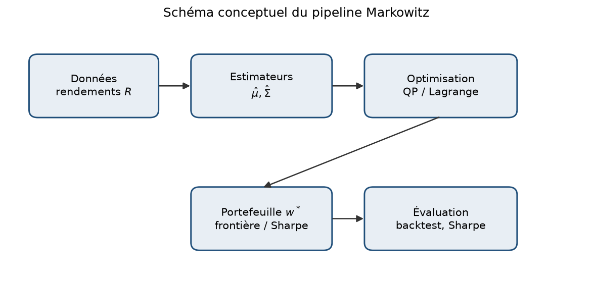
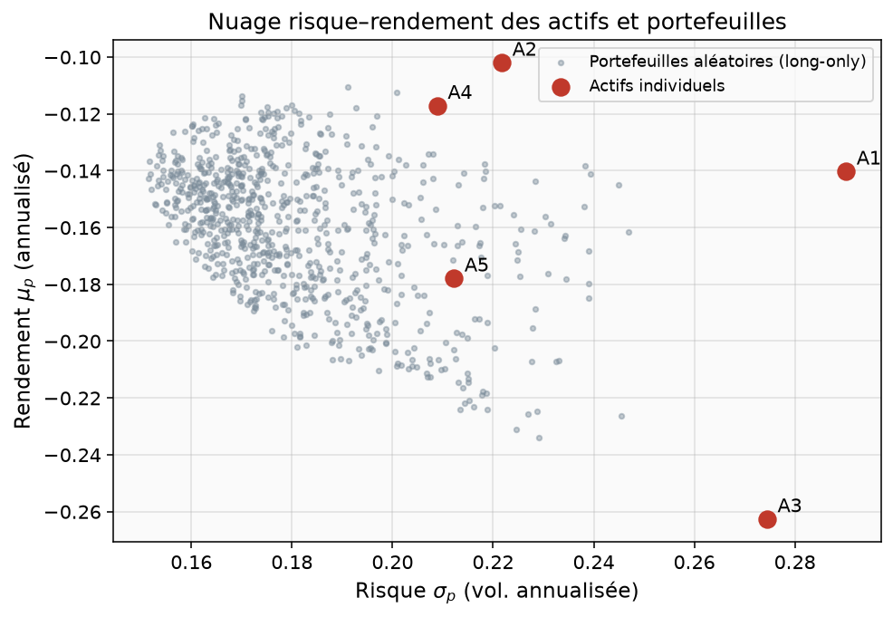
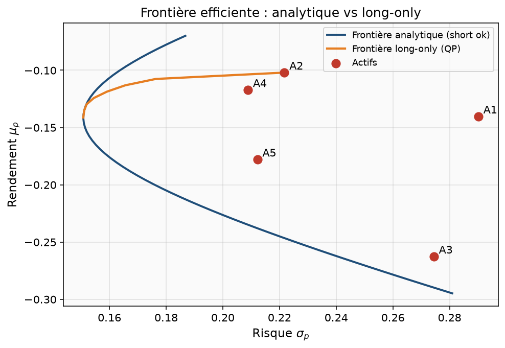
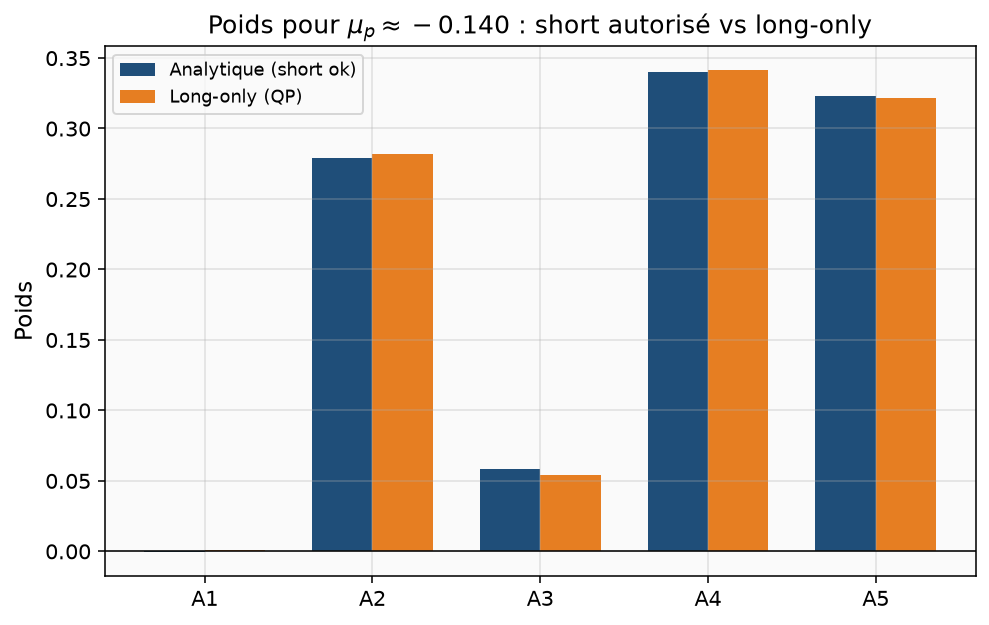
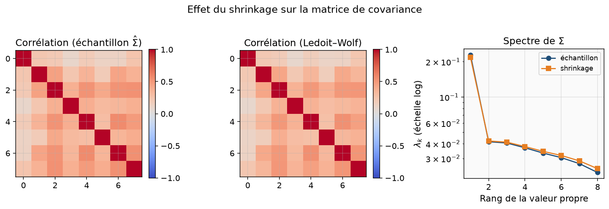
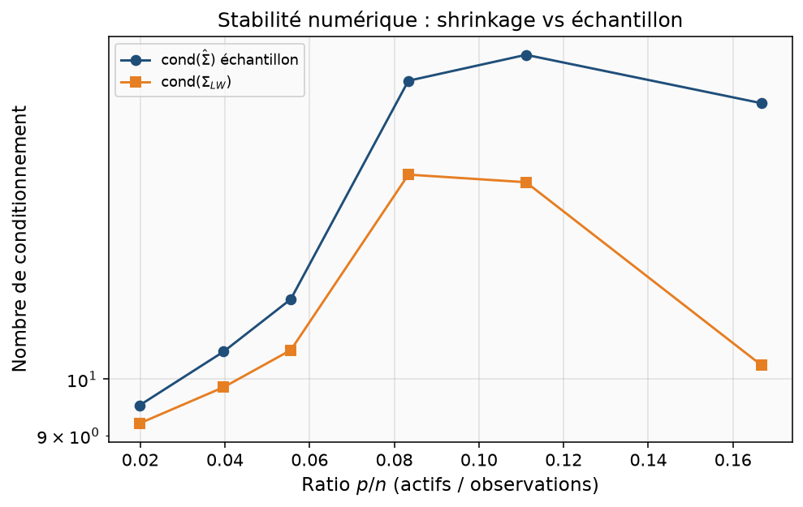
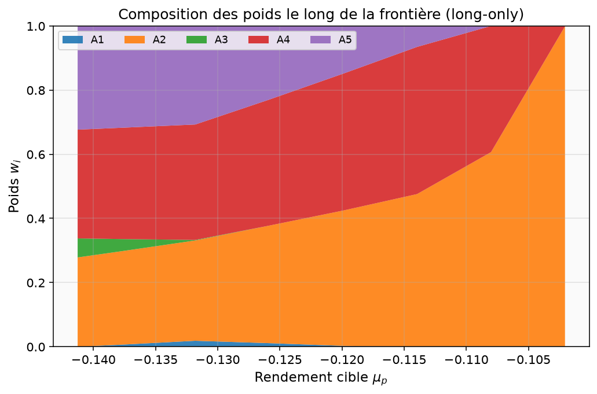
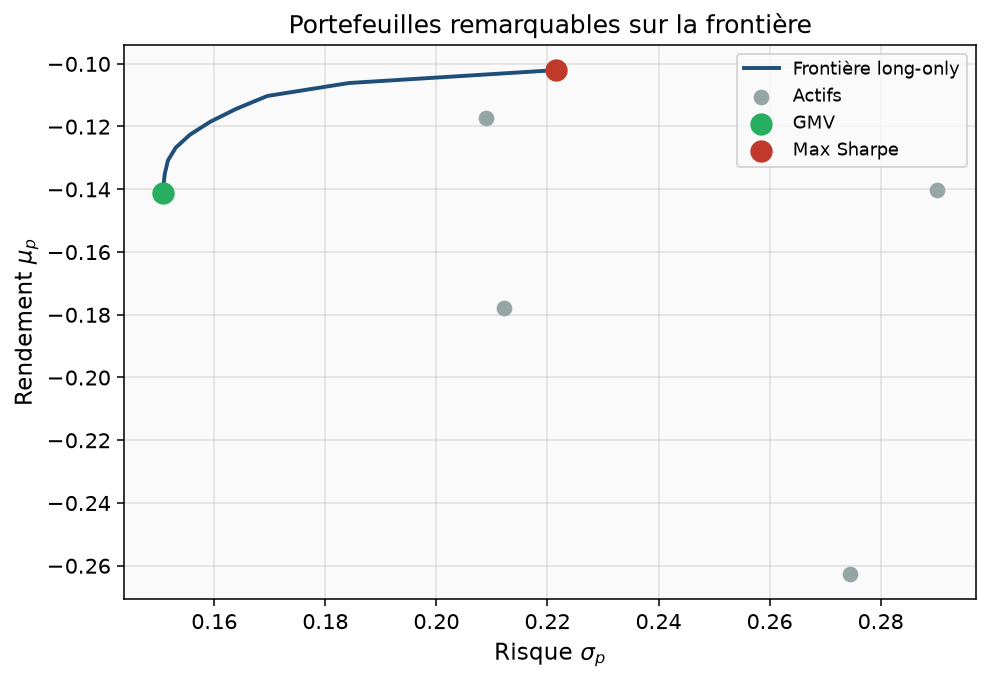
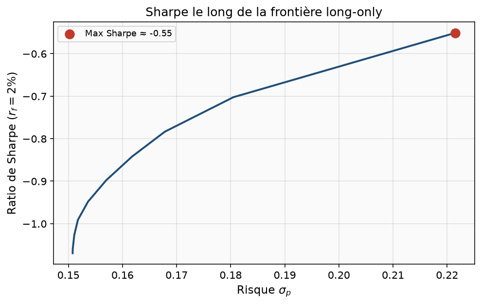
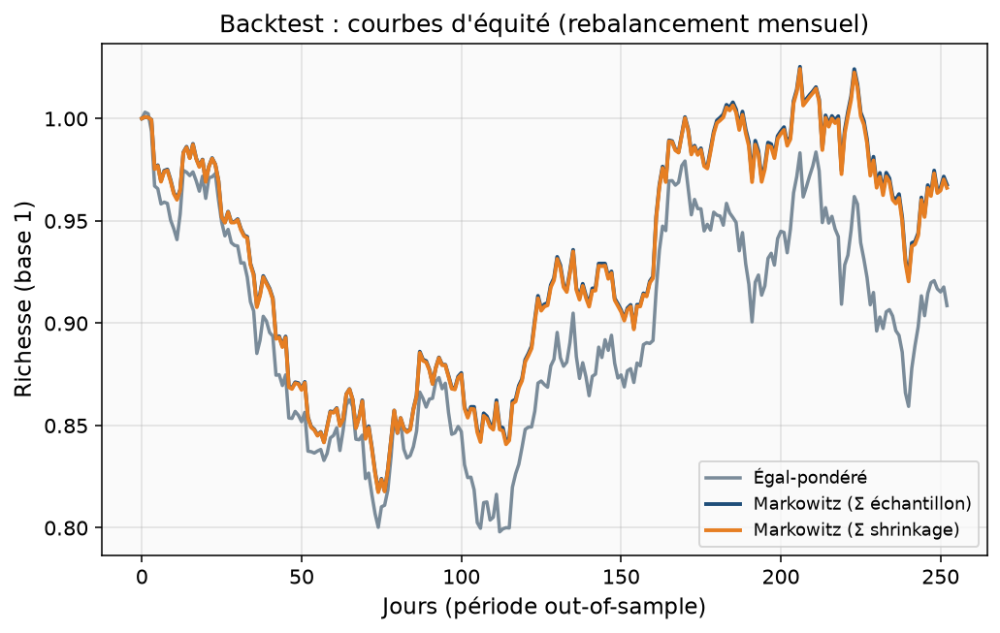

# Optimisation de portefeuille Markowitz

**Cours-projet — Mathématiques appliquées, finance quantitative**  
**Niveau :** L3 (ouvert M1)  
**Dossier code :** `02-markowitz/`  
**Prérequis :** algèbre linéaire (matrices SPD), calcul différentiel à plusieurs variables, probabilités (espérance, variance, covariance), notions de Python/NumPy  
**Durée estimée :** 4–6 h de lecture attentive + 3–4 h de manipulation du code  
**Auteur pédagogique :** polycopié autonome pour le dépôt *maths-appliquees-l3-m1*

---

## Objectifs d’apprentissage mesurables

À l’issue de ce dossier, vous devez être capable de :

1. **Formuler** le problème moyenne–variance de Markowitz (contraintes budgétaire, rendement cible, positivité) et expliquer le sens de chaque symbole.
2. **Dériver** la solution analytique sans contrainte de signe via les multiplicateurs de Lagrange, et reconnaître les scalaires classiques $A$, $B$, $C$, $\Delta$.
3. **Tracer** la frontière efficiente analytique et la frontière long-only (programme quadratique) à partir de $\hat\mu$ et $\hat\Sigma$.
4. **Comparer** l’estimateur empirique de covariance et un shrinkage type Ledoit–Wolf (conditionnement, spectre, impact sur les poids).
5. **Calculer** le ratio de Sharpe d’un portefeuille et identifier le portefeuille de variance globale minimale (GMV) et de Sharpe maximal.
6. **Mener** un backtest synthétique simple (train/test, rebalancement) et interpréter honnêtement ses limites.

---

## 1. Introduction et motivation

### 1.1 Pourquoi le problème compte

Un investisseur dispose d’un capital et d’un univers d’actifs risqués (actions, ETF, indices, etc.). Deux quantités le préoccupent : le **rendement espéré** du portefeuille et son **risque**. Le risque n’est pas la somme des risques individuels : des actifs corrélés se combinent autrement que des actifs indépendants. Harry Markowitz (Markowitz, 1952) a formalisé cette intuition en un programme d’optimisation : pour un rendement cible donné, choisir les poids qui **minimisent la variance**.

Cette idée a fondé la *Modern Portfolio Theory*. Elle relie directement l’algèbre linéaire (formes quadratiques, matrices de covariance), l’optimisation convexe (Boyd & Vandenberghe, 2004) et la statistique (estimation de $\mu$ et $\Sigma$). Elle reste le point d’entrée standard avant Black–Litterman, contraintes de turnover, CVaR, ou modèles factoriels (Meucci, 2005 ; Elton et al., 2014).

### 1.2 Question centrale

> Étant donnés des estimateurs $\hat\mu$ et $\hat\Sigma$, comment construire un portefeuille $w$ de rendement cible prescrit dont la volatilité est minimale, avec ou sans contrainte $w\ge 0$ ?

Le fil conducteur du dossier est le suivant.

1. On formalise le modèle moyenne–variance et on dérive la frontière analytique.
2. On impose la positivité des poids (long-only) et on résout un **QP** avec CVXPY.
3. On discute l’estimation de $\Sigma$ et le **shrinkage**.
4. On relie chaque méthode à une fonction du dépôt `src/portfolio.py` et à des figures reproductibles.

### 1.3 Ce que ce polycopié n’est pas

Ce n’est pas un conseil financier. Les expériences utilisent des **rendements synthétiques** contrôlés (`simulate_returns`). Les résultats numériques illustrent des propriétés mathématiques ; ils ne prédissent pas des marchés réels. En pratique, l’erreur d’estimation de $\mu$ et $\Sigma$ peut détruire l’avantage théorique (Michaud, 1989 ; Jobson & Korkie, 1980).

---

## 2. Prérequis et notations

### 2.1 Prérequis mathématiques

- Produit scalaire, normes, valeurs propres d’une matrice symétrique.
- Forme quadratique $w^\top \Sigma w$ et caractère défini positif.
- Gradient et Hessienne d’une fonction $f:\mathbb{R}^n\to\mathbb{R}$.
- Lagrangien et conditions du premier ordre (KKT en version soft pour le QP).
- Variables aléatoires : espérance, variance, covariance, matrice de covariance.

### 2.2 Prérequis informatiques

- Python 3, NumPy, Matplotlib.
- CVXPY pour les programmes convexes (contrainte $w\ge 0$).
- Lancer une démo et des tests (`pytest`).

### 2.3 Table des notations

| Symbole | Signification |
|--------|----------------|
| $n$ | Nombre d’actifs |
| $T$ | Nombre d’observations (jours) |
| $R\in\mathbb{R}^{T\times n}$ | Matrice des rendements simples journaliers |
| $r_t\in\mathbb{R}^n$ | Vecteur de rendements au jour $t$ |
| $\mu\in\mathbb{R}^n$ | Vecteur des espérances de rendement (souvent annualisé) |
| $\Sigma\in\mathbb{R}^{n\times n}$ | Matrice de covariance (SPD), souvent annualisée |
| $w\in\mathbb{R}^n$ | Vecteur des poids du portefeuille |
| $\mu_p = w^\top\mu$ | Rendement espéré du portefeuille |
| $\sigma_p = \sqrt{w^\top\Sigma w}$ | Volatilité (écart-type) du portefeuille |
| $\mathbf{1}$ | Vecteur dont toutes les composantes valent 1 |
| $r_f$ | Taux sans risque (annualisé) |
| $S_p = (\mu_p-r_f)/\sigma_p$ | Ratio de Sharpe |
| $\hat\mu,\hat\Sigma$ | Estimateurs empiriques |
| $\Sigma_{\mathrm{LW}}$ | Covariance après shrinkage Ledoit–Wolf (version pédagogique) |
| $A,B,C,\Delta$ | Scalaires de la théorie analytique de la frontière |

**Convention d’annualisation** utilisée dans le code : 252 jours de Bourse. Si $R$ contient des rendements journaliers, on prend $\hat\mu = 252\,\overline{r}$ et $\hat\Sigma = 252\,\mathrm{Cov}(r)$. Cette convention est cohérente pour comparer $\mu_p$ et $\sigma_p$ en base annuelle, mais elle suppose une certaine stationnarité.

---

## 3. Modèle mathématique

### 3.1 Hypothèses du modèle moyenne–variance

On considère $n$ actifs parfaitement divisibles. Un portefeuille est un vecteur $w$ tel que

$$
\mathbf{1}^\top w = 1.
$$

La composante $w_i$ est la fraction du capital investie dans l’actif $i$. Si $w_i<0$ est autorisé, on parle de **vente à découvert** (*short selling*). Si l’on impose $w\ge 0$, on parle de portefeuille **long-only**.

On suppose que les rendements (sur l’horizon considéré) admettent une espérance $\mu$ et une covariance $\Sigma$ finies, avec $\Sigma$ **symétrique définie positive** (SPD). Le rendement et le risque du portefeuille sont alors

$$
\mu_p = w^\top \mu, \qquad
\sigma_p^2 = w^\top \Sigma w, \qquad
\sigma_p = \sqrt{w^\top \Sigma w}.
$$

Markowitz (1952) propose de juger un portefeuille uniquement via le couple $(\sigma_p,\mu_p)$. Deux portefeuilles de même rendement : on préfère celui de variance minimale. Deux portefeuilles de même variance : on préfère celui de rendement maximal.

### 3.2 Schéma conceptuel du pipeline

Le traitement numérique suit le pipeline de la figure ci-dessous.



**Figure 7.** Données → estimateurs $(\hat\mu,\hat\Sigma)$ → optimisation (Lagrange ou QP) → portefeuille $w^\star$ → évaluation (Sharpe, backtest). Chaque flèche correspond à une responsabilité claire dans le code.

On observe que l’optimisation n’est que le **troisième** maillon. Si $\hat\Sigma$ est mal conditionnée ou si $\hat\mu$ est bruité, le QP peut produire des poids extrêmes même lorsque le solveur est exact (Michaud, 1989).

### 3.3 Formulation d’optimisation

Pour un rendement cible $\mu^\star$, le problème de Markowitz s’écrit

$$
\begin{aligned}
\min_{w\in\mathbb{R}^n}\quad & w^\top \Sigma w \\
\text{s.c.}\quad & w^\top \mu = \mu^\star, \\
& \mathbf{1}^\top w = 1, \\
& w \ge 0 \quad\text{(optionnel)}.
\end{aligned}
\tag{P}
$$

Sans la contrainte $w\ge 0$, (P) est un programme quadratique **à égalités** ; la solution est analytique. Avec $w\ge 0$, c’est un **QP convexe** avec inégalités ; on le résout numériquement (Boyd & Vandenberghe, 2004).

Dans le code du dépôt, la contrainte de rendement est parfois écrite en inégalité $w^\top\mu \ge \mu^\star$ (`optimize_long_only`). Pour un $\mu^\star$ inférieur au rendement du GMV long-only, l’optimum peut alors « monter » le rendement jusqu’à la frontière minimale. Pour les cibles dans l’intervalle $[\min_i\mu_i,\max_i\mu_i]$, les deux formulations coïncident en pratique sur nos jeux synthétiques.

### 3.4 Solution analytique (sans positivité)

On ignore $w\ge 0$. Le Lagrangien s’écrit

$$
\mathcal{L}(w,\lambda,\gamma)
= \tfrac12\, w^\top \Sigma w
- \lambda\,(w^\top\mu - \mu^\star)
- \gamma\,(\mathbf{1}^\top w - 1).
$$

(Le facteur $1/2$ simplifie les dérivées ; minimiser $w^\top\Sigma w$ ou $\tfrac12 w^\top\Sigma w$ donne le même $w^\star$.)

Les conditions du premier ordre donnent

$$
\Sigma w - \lambda\mu - \gamma\mathbf{1} = 0
\quad\Rightarrow\quad
w = \lambda\,\Sigma^{-1}\mu + \gamma\,\Sigma^{-1}\mathbf{1}.
$$

En injectant les deux contraintes d’égalité, on obtient un système $2\times 2$ sur $(\lambda,\gamma)$. On introduit les scalaires classiques (Merton, 1972 ; Luenberger, 1998)

$$
A = \mathbf{1}^\top\Sigma^{-1}\mathbf{1},\qquad
B = \mathbf{1}^\top\Sigma^{-1}\mu,\qquad
C = \mu^\top\Sigma^{-1}\mu,\qquad
\Delta = AC - B^2.
$$

Si $\Sigma$ est SPD et si les $\mu_i$ ne sont pas tous égaux, alors $\Delta>0$. La solution s’écrit sous la forme affine

$$
w(\mu^\star) = g + h\,\mu^\star,
$$

avec

$$
g = \frac{C\,\Sigma^{-1}\mathbf{1} - B\,\Sigma^{-1}\mu}{\Delta},\qquad
h = \frac{A\,\Sigma^{-1}\mu - B\,\Sigma^{-1}\mathbf{1}}{\Delta}.
$$

La variance minimale associée est une **parabole** en $\mu^\star$ dans le plan $(\sigma^2,\mu)$, ou une hyperbole dans le plan $(\sigma,\mu)$ :

$$
\sigma^2(\mu^\star) = \frac{A(\mu^\star)^2 - 2B\mu^\star + C}{\Delta}.
$$

**Implémentation :** `efficient_frontier_analytic` dans `src/portfolio.py`.

### 3.5 Portefeuille de variance globale minimale (GMV)

Sans contrainte de rendement, on minimise $w^\top\Sigma w$ sous $\mathbf{1}^\top w=1$. On obtient

$$
w_{\mathrm{GMV}} = \frac{\Sigma^{-1}\mathbf{1}}{\mathbf{1}^\top\Sigma^{-1}\mathbf{1}}.
$$

C’est le point de volatilité minimale sur la frontière analytique. Fonction : `gmv_weights`.

### 3.6 Ratio de Sharpe et portefeuille tangent

Pour un taux sans risque $r_f$, le ratio de Sharpe (Sharpe, 1966) vaut

$$
S_p = \frac{\mu_p - r_f}{\sigma_p}.
$$

Sans contrainte de signe, le portefeuille qui maximise $S_p$ (parmi les portefeuilles entièrement investis en actifs risqués, ou via la combinaison avec le cash selon le contexte) est proportionnel à

$$
w \propto \Sigma^{-1}(\mu - r_f\mathbf{1}),
$$

puis renormalisé pour $\mathbf{1}^\top w=1$ si l’on reste sur l’hyperplan budgétaire. Avec contrainte long-only, on balaye la frontière QP et l’on retient le point de Sharpe maximal (`max_sharpe_weights`).

### 3.7 Nuage risque–rendement

Avant toute optimisation, il est instructif de visualiser les actifs et des portefeuilles aléatoires long-only (tirage de Dirichlet sur le simplexe).



**Figure 1.** Chaque point gris est un portefeuille $w\sim\mathrm{Dirichlet}(\mathbf{1})$. Les points rouges sont les actifs individuels. On observe que certains portefeuilles diversifiés atteignent une volatilité **inférieure** à celle du moins volatil des actifs : c’est l’effet de diversification lorsque les corrélations ne sont pas toutes égales à 1.

### 3.8 Cas particulier à deux actifs

Pour $n=2$, $w=(x,1-x)$, on a

$$
\sigma_p^2(x)
= x^2\sigma_1^2 + (1-x)^2\sigma_2^2 + 2x(1-x)\rho\sigma_1\sigma_2.
$$

Si $\rho<1$, la courbe $x\mapsto(\sigma_p(x),\mu_p(x))$ n’est pas le segment joignant les deux actifs : elle se bombe vers la gauche (risque réduit). Si $\rho=-1$, on peut annuler le risque pour un $x$ bien choisi (sous réserve de $\sigma_i>0$). Ce cas d’école justifie géométriquement la frontière.

---

## 4. Analyse et propriétés

### 4.1 Existence et unicité

- Si $\Sigma$ est SPD, la fonction objectif $w\mapsto w^\top\Sigma w$ est **strictement convexe**.
- L’ensemble des contraintes d’égalité est un affine ; l’intersection avec $w\ge 0$ (si présente) est un polytope compact lorsque les bornes de rendement sont compatibles.
- Donc, lorsqu’un point admissible existe, le minimiseur est **unique**.

L’existence échoue si l’on demande un rendement cible hors de l’intervalle réalisable. Sans short : $\mu^\star$ doit appartenir à $[\min_i\mu_i,\max_i\mu_i]$. Avec short : on peut en théorie viser n’importe quel $\mu^\star$, au prix d’un levier et d’un risque croissants.

### 4.2 Interprétation économique

La frontière efficiente est l’ensemble des portefeuilles non dominés au sens moyenne–variance. Tout portefeuille sous la frontière est **inefficace** : on peut augmenter $\mu_p$ à $\sigma_p$ constant, ou diminuer $\sigma_p$ à $\mu_p$ constant.

Dans le plan $(\sigma,\mu)$, la branche supérieure (rendements au-dessus du GMV) est celle qui intéresse l’investisseur averse au risque maximisant l’espérance d’utilité moyenne–variance. La branche inférieure est la frontière **inefficiente** (même risque, moins de rendement).

### 4.3 Cas limites

1. **Corrélations toutes égales à 1.** La diversification disparaît : $\sigma_p$ est une moyenne pondérée des $\sigma_i$ (en valeur absolue des poids). La frontière se réduit.
2. **$\mu$ constant.** Tous les actifs ont le même rendement espéré : le problème de rendement cible n’a d’intérêt que pour $\mu^\star$ égal à cette constante ; le GMV reste bien défini.
3. **$\Sigma$ mal conditionnée.** $\Sigma^{-1}$ amplifie le bruit ; les poids analytiques oscillent et prennent des valeurs extrêmes (Jobson & Korkie, 1980).
4. **$n$ grand devant $T$.** L’estimateur empirique $\hat\Sigma$ est bruité, voire singulier si $T\le n$. Le shrinkage devient indispensable (Ledoit & Wolf, 2003, 2004).

### 4.4 Erreurs de modélisation

Le modèle moyenne–variance suppose que la variance capture le risque pertinent. En présence de queues lourdes, d’asymétrie, ou de régimes, d’autres mesures (VaR, CVaR, drawdown) peuvent être plus adaptées (Meucci, 2005). De plus, $\mu$ et $\Sigma$ sont traités comme connus lors de l’optimisation, alors qu’ils sont estimés : c’est le cœur de la critique de Michaud (1989) sur l’« erreur maximisée ».

Une autre source d’erreur, plus discrète, concerne l’**horizon**. Les poids issus d’un $\hat\mu$ annualisé ne sont optimaux, au mieux, que pour un horizon compatible avec la convention d’estimation. Rebalancer chaque jour des poids calibrés sur une covariance annualisée n’est pas contradictoire mathématiquement, mais l’interprétation économique du Sharpe devient plus fragile. De même, ignorer les coûts de transaction dans le backtest surestime systématiquement l’intérêt des stratégies à fort turnover. Dans `backtest_equity`, le paramètre `rebalance_every=21` limite artificiellement ce turnover ; un projet plus avancé ajouterait un coût proportionnel à $\|w_t-w_{t-1}\|_1$.

### 4.5 Frontière analytique vs long-only



**Figure 2.** La courbe bleue (short autorisé) domine ou égale la courbe orange (long-only) : relâcher $w\ge 0$ ne peut qu’élargir l’ensemble admissible. On observe que les deux frontières coïncident près du GMV lorsque celui-ci est naturellement positif, puis divergent lorsque le rendement cible force des shorts sur la solution de Lagrange.

La figure des poids pour une même cible précise l’écart.



**Figure 9.** À rendement cible médian, la solution analytique peut comporter des poids négatifs ; le QP long-only les projette sur le simplexe en redistribuant la masse. On observe que les actifs shortés en analytique voient leur poids ramené à zéro, au prix d’une volatilité légèrement plus élevée (lisibles sur la figure 2).

---

## 5. Méthodes numériques ou algorithmiques

### 5.1 Méthode 1 — Frontière analytique (Lagrange)

**Entrées :** $\mu$, $\Sigma$ SPD, grille de cibles $\mu^\star_k$.  
**Sorties :** pour chaque $k$, $w_k=g+h\mu^\star_k$ et $\sigma_k=\sqrt{w_k^\top\Sigma w_k}$.

```text
Pseudo-code ANALYTIQUE
1. Calculer Σ^{-1} (Cholesky / solve)
2. A ← 1ᵀ Σ^{-1} 1 ; B ← 1ᵀ Σ^{-1} μ ; C ← μᵀ Σ^{-1} μ
3. Δ ← A C − B²
4. g ← (C Σ^{-1} 1 − B Σ^{-1} μ)/Δ
5. h ← (A Σ^{-1} μ − B Σ^{-1} 1)/Δ
6. Pour chaque μ* sur la grille :
      w ← g + h μ*
      σ ← √(max(wᵀ Σ w, 0))
```

**Complexité.** Inversion (ou factorisation) : $O(n^3)$. Puis chaque point : $O(n^2)$ pour la forme quadratique (ou $O(n)$ si l’on précalcule). Pour $K$ points : $O(n^3+Kn^2)$.

**Stabilité.** Dépend de $\kappa(\Sigma)=\lambda_{\max}/\lambda_{\min}$. Si $\kappa$ est grand, $A,B,C$ et $w$ deviennent sensibles aux perturbations de $\Sigma$.

### 5.2 Méthode 2 — QP long-only (CVXPY / OSQP)

On résout, pour chaque cible,

$$
\min_w\; w^\top\Sigma w
\quad\text{s.c.}\quad
w\ge 0,\;
\mathbf{1}^\top w=1,\;
\mu^\top w \ge \mu^\star.
$$

CVXPY construit le problème ; OSQP (solveur QP du premier ordre) ou SCS le résout. Fonction : `optimize_long_only` ; balayage : `efficient_frontier_long_only`.

```text
Pseudo-code LONG-ONLY
Pour chaque μ* ∈ [min μ_i, max μ_i] :
  résoudre le QP ci-dessus
  si échec OSQP → réessayer SCS
  projeter w ← max(w,0) ; renormaliser
```

**Complexité.** Chaque QP est polynomial ; en pratique, pour $n$ petit ($5$–$50$), le coût est négligeable face à l’estimation. Pour $K$ cibles : environ $K$ résolutions indépendantes (parallélisables).

### 5.3 Comparaison des deux méthodes

| Critère | Analytique (Lagrange) | QP long-only (CVXPY) |
|--------|------------------------|----------------------|
| Contrainte $w\ge 0$ | Non | Oui |
| Forme fermée | Oui ($w=g+h\mu^\star$) | Non (solveur itératif) |
| Complexité dominante | $O(n^3)$ une fois | $O(K\cdot\mathrm{QP}(n))$ |
| Stabilité si $\Sigma$ mal conditionnée | Mauvaise (via $\Sigma^{-1}$) | Mauvaise aussi, mais bornes $w\ge 0$ limitent les explosions |
| Dépendance logicielle | NumPy seul | CVXPY + solveur |
| Usage pédagogique | Comprendre Merton (1972) | Comprendre l’optimisation convexe contrainte |

### 5.4 Shrinkage de covariance (Ledoit–Wolf pédagogique)

L’estimateur empirique

$$
\hat\Sigma = \frac{1}{T} X_c^\top X_c
$$

(avec $X_c$ centrée) est sans biais asymptotique mais de grande variance lorsque $n/T$ n’est pas petit. Ledoit & Wolf (2003, 2004) proposent de **réduire** $\hat\Sigma$ vers une cible simple, typiquement $\mu_S I$ où $\mu_S=\mathrm{tr}(\hat\Sigma)/n$ :

$$
\Sigma_{\mathrm{LW}} = (1-\alpha)\hat\Sigma + \alpha\,\mu_S I.
$$

L’intensité $\alpha\in[0,1]$ est estimée pour minimiser une norme de Frobenius d’erreur quadratique moyenne. Notre fonction `ledoit_wolf_cov` en donne une **version pédagogique** (pas le paper complet ligne à ligne), suffisante pour illustrer l’effet sur le spectre et le conditionnement.



**Figure 4.** À gauche et au centre : matrices de corrélation avant/après shrinkage. À droite : spectre des valeurs propres. On observe que le shrinkage **comprime** le spectre (grandes valeurs propres diminuées, petites relevées), ce qui améliore le conditionnement.



**Figure 8.** Médiane du conditionnement sur plusieurs graines, pour $p=10$ actifs et $n$ observations variable. On observe que $\mathrm{cond}(\hat\Sigma)$ explose lorsque $p/n$ croît, alors que $\Sigma_{\mathrm{LW}}$ reste nettement plus stable. C’est l’argument numérique central en faveur du shrinkage avant toute inversion ou QP.

### 5.5 Backtest et biais/variance des estimateurs

Protocole simple utilisé dans les expériences :

1. Simuler $R$ sur $T=756$ jours (3 ans).
2. Estimer $(\hat\mu,\hat\Sigma)$ sur les $504$ premiers jours (train).
3. Fixer des poids (égal-pondéré, Markowitz échantillon, Markowitz + shrinkage).
4. Appliquer ces poids sur les $252$ jours restants avec rebalancement tous les 21 jours (`backtest_equity`).

Ce protocole évite le biais le plus grossier (optimiser et évaluer sur les mêmes jours), mais reste synthétique : les rendements sont i.i.d. conditionnellement à un facteur commun. Il ne capture pas les breaks de corrélation réels.

### 5.6 Tableau des hyperparamètres du dépôt

| Paramètre | Valeur par défaut | Rôle | Sensibilité |
|----------|-------------------|------|-------------|
| `n_assets` | 5 | Dimension du portefeuille | ↑ $n$ ⇒ estimation plus difficile |
| `n_days` | 756 | Longueur de l’historique | ↑ $T$ ⇒ $\hat\Sigma$ plus stable |
| `seed` | 7 | Reproductibilité | Change les réalisations |
| `n_points` (frontière) | 40 (analytique), 25–40 (LO) | Résolution de la courbe | Cosmétique si assez dense |
| `rebalance_every` | 21 | Fréquence de rebalancement | ↑ ⇒ moins de turnover simulé |
| $r_f$ (Sharpe) | 0 ou 0.02 | Taux sans risque | Décale le max Sharpe |
| Solveur QP | OSQP puis SCS | Robustesse numérique | SCS plus lent, plus tolérant |

---

## 6. Implémentation guidée

### 6.1 Architecture du dossier

```text
02-markowitz/
  README.md
  src/
    portfolio.py      # cœur mathématique
    demo.py           # démonstration CLI
  tests/
    test_portfolio.py
  report/
    RAPPORT.md        # ce polycopié
    BIBLIOGRAPHY.bib
    make_figures.py
    figures/*.png
```

### 6.2 Fonctions clés et lien théorie ↔ code

| Notion | Fonction | Fichier |
|--------|----------|---------|
| Stats $(\mu_p,\sigma_p)$ | `portfolio_stats` | `src/portfolio.py` |
| Frontière analytique | `efficient_frontier_analytic` | idem |
| QP long-only | `optimize_long_only` | idem |
| Frontière long-only | `efficient_frontier_long_only` | idem |
| Shrinkage | `ledoit_wolf_cov` | idem |
| Sharpe | `sharpe_ratio` | idem |
| Max Sharpe / GMV | `max_sharpe_weights`, `gmv_weights` | idem |
| Backtest | `backtest_equity` | idem |
| Données synthétiques | `simulate_returns` | idem |

### 6.3 Snippet : frontière analytique

```python
from portfolio import simulate_returns, efficient_frontier_analytic
R, mu, cov = simulate_returns(seed=7)
targets, vols, weights = efficient_frontier_analytic(mu, cov, n_points=40)
# weights[k].sum() == 1 pour tout k
```

Sur la graine `seed=7`, les rendements annualisés estimés sont tous négatifs (réalisation adverse du générateur). Ce n’est pas un bug : le modèle mathématique reste valide. Le GMV analytique se situe près de $\sigma\approx 0.151$ pour $\mu_p\approx -0.139$.

### 6.4 Snippet : QP long-only

```python
from portfolio import optimize_long_only, portfolio_stats
import numpy as np
target = float(np.median(mu))
w = optimize_long_only(mu, cov, target_return=target)
ret, vol = portfolio_stats(w, mu, cov)
```

Résultat reproductible (démo) : poids approximatifs
$[0.001,\;0.282,\;0.054,\;0.342,\;0.322]$,  
$\mu_p\approx -0.140$, $\sigma_p\approx 0.151$.

### 6.5 Comment lancer

Depuis la racine du dépôt ou depuis `02-markowitz/` :

```bash
# dépendances (racine du repo)
pip install -r requirements.txt

# démo
python3 src/demo.py

# tests
python3 -m pytest tests/ -q

# figures du rapport
python3 report/make_figures.py
```

### 6.6 Pièges classiques

1. **Oublier l’annualisation.** Mélanger rendements journaliers et cibles annuelles produit des frontières absurdes.
2. **Inverser une $\hat\Sigma$ singulière.** Si $T\le n$, factoriser via shrinkage ou pseudo-inverse avec prudence.
3. **Interpréter des poids extrêmes comme « opportunités ».** Ce sont souvent des artefacts d’estimation (Michaud, 1989).
4. **Forcer une cible hors $[\min\mu_i,\max\mu_i]$ en long-only.** Le QP devient infaisable.
5. **Évaluer la performance sur l’échantillon d’estimation.** Toujours garder un out-of-sample, même synthétique.
6. **Comparer des Sharpe calculés avec des $r_f$ ou des conventions d’annualisation différentes.**

### 6.7 Composition des poids le long de la frontière



**Figure 3.** Aires empilées des poids long-only en fonction du rendement cible. On observe qu’aux faibles rendements (près du GMV) la masse est répartie sur plusieurs actifs, puis se concentre progressivement sur le ou les actifs de plus fort $\mu_i$ lorsque la cible augmente. C’est le comportement typique d’un QP avec contrainte de positivité : les actifs non compétitifs sont **éliminés** ($w_i=0$).

---

## 7. Expériences numériques

Toutes les figures sont générées par `report/make_figures.py` avec les paramètres de l’annexe B. Les nombres cités ci-dessous correspondent à `seed=7` sauf mention contraire.

### 7.1 Protocole A — Frontières et portefeuilles remarquables

1. Générer $R,\mu,\Sigma$ via `simulate_returns(n_assets=5, n_days=756, seed=7)`.
2. Tracer la frontière analytique (60 points) et long-only (30 points).
3. Calculer GMV long-only et max Sharpe ($r_f=2\%$).



**Figure 10.** Sur la frontière orange, le point vert (GMV) minimise $\sigma_p$ ; le point rouge maximise le Sharpe. On observe que, lorsque tous les $\mu_i$ sont négatifs et $r_f=0.02> \max\mu_i$, les Sharpe sont négatifs : le « max Sharpe » est alors le **moins mauvais** sur la frontière, souvent proche de l’actif de meilleur rendement. Cette remarque est volontairement honnête : le critère de Sharpe n’a d’interprétation attractive que si des rendements excédentaires positifs existent.



**Figure 6.** Profil $S_p(\sigma_p)$ pour $r_f=2\%$. On observe un maximum marqué ; sa localisation sert de sélection de portefeuille dans `max_sharpe_weights(..., long_only=True)`.

### 7.2 Protocole B — Shrinkage et conditionnement

Sur $n=8$ actifs et $T=150$ jours (`seed=21` pour la figure 4 ; médianes multi-graines pour la figure 8) :

| Estimateur | Propriété observée |
|-----------|---------------------|
| $\hat\Sigma$ échantillon | Spectre plus dispersé, $\kappa$ plus grand |
| $\Sigma_{\mathrm{LW}}$ | Spectre comprimé, $\kappa$ réduit |

Pour `seed=7`, $n=5$, $T=756$, le conditionnement reste modéré ($\kappa(\hat\Sigma)\approx 4.79$, $\kappa(\Sigma_{\mathrm{LW}})\approx 4.69$) : avec $T\gg n$, le shrinkage change peu. L’intérêt apparaît surtout lorsque $n/T$ croît (figure 8), ce que confirment Ledoit & Wolf (2004).

Le test `test_ledoit_wolf_psd_and_shrinks` vérifie qu’avec $T=120$, $n=8$, le conditionnement après shrinkage n’est pas pire que celui de l’échantillon (à tolérance numérique près).

### 7.3 Protocole C — Backtest out-of-sample

Split 504 / 252, rebalancement tous les 21 jours, cible de rendement = moyenne des $\hat\mu$ du train.



**Figure 5.** Courbes d’équité out-of-sample. Résultats numériques (graine 7) :

| Stratégie | Richesse finale | Max drawdown approx. |
|-----------|-----------------|----------------------|
| Égal-pondéré $1/n$ | $\approx 0.909$ | $\approx 20.4\%$ |
| Markowitz $\hat\Sigma$ | $\approx 0.968$ | $\approx 20.2\%$ |
| Markowitz $\Sigma_{\mathrm{LW}}$ | $\approx 0.966$ | $\approx 20.2\%$ |

On observe que, sur **cette** réalisation, les portefeuilles Markowitz perdent moins que l’égal-pondéré. L’écart shrinkage vs échantillon est minime car $T_{\mathrm{train}}\gg n$. Ce n’est **pas** une preuve de supériorité générale : DeMiguel, Garlappi & Uppal (2009) montrent que $1/N$ bat souvent les optimisations naïves hors échantillon sur données réelles. Notre générateur à facteur commun favorise légèrement la prise en compte de $\Sigma$.

### 7.4 Tableau d’erreurs / contrôles numériques

| Contrôle | Résultat attendu | Vérification |
|----------|------------------|--------------|
| $\mathbf{1}^\top w=1$ (analytique) | erreur $<10^{-8}$ | `test_frontier_shapes` |
| $w\ge 0$, somme 1 (QP) | tolérance $10^{-5}$ | `test_weights_sum_to_one_long_only` |
| Volatilité portefeuille égal | $>0$ | `test_portfolio_stats_positive_vol` |
| QP vs égal-pondéré à même $\mu_p$ | $\sigma_{\mathrm{QP}}\le\sigma_{\mathrm{eq}}$ | `test_long_only_frontier_dominates_equal_weight_risk_for_same_return` |
| GMV analytique | variance $\le$ celle de poids aléatoires budget | `test_gmv_analytic_minimizes_variance_among_budget` |
| Equity backtest | $E_0=1$, $E_t>0$ | `test_sharpe_and_backtest` |

### 7.5 Interprétation honnête

Les expériences confirment :

- la géométrie de la diversification (figure 1) ;
- la dominance de la frontière avec short sur la frontière long-only (figure 2) ;
- le rôle régularisant du shrinkage lorsque $n/T$ croît (figures 4 et 8) ;
- la faisabilité d’un pipeline complet jusqu’au backtest (figure 5).

Elles ne prétendent pas que Markowitz « bat le marché ». Sur données réelles, la bataille se joue sur l’estimation, les contraintes de transaction et la robustesse (Meucci, 2005 ; Elton et al., 2014).

---

## 8. Prolongements (pistes M1/M2)

1. **Black–Litterman.** Injecter des vues subjectives sur $\mu$ dans un prior d’équilibre de marché ; observer la stabilisation des poids.
2. **Contraintes opérationnelles.** Bornes $w_i\le w_{\max}$, contrainte de turnover $\|w-w_{\mathrm{old}}\|_1\le \tau$, coûts de transaction linéaires dans le QP (Boyd & Vandenberghe, 2004, ch. d’exemples financiers).
3. **Mesures de risque au-delà de la variance.** Minimiser la CVaR pour un niveau $\alpha$ (optimisation convexe par représentation de Rockafellar–Uryasev) ; comparer les allocations.
4. **Modèles factoriels.** Remplacer $\Sigma$ par $B\Omega B^\top+D$ (facteurs + idiosyncratique) pour réduire le nombre de paramètres (Meucci, 2005).
5. **Rééchantillonnage de Michaud.** Tirer des $(\mu,\Sigma)$ autour des estimateurs, optimiser à chaque tirage, moyennner les poids pour réduire l’erreur d’optimisation (Michaud, 1989).
6. **Données réelles.** Remplacer `simulate_returns` par des prix téléchargés (attention au biais de survie et aux trous de cotation) ; refaire le protocole train/test sur fenêtres glissantes.

---

## 9. Exercices corrigés

### Exercice 1 — Facile : variance à deux actifs

Soient deux actifs de volatilités $\sigma_1=0.20$, $\sigma_2=0.30$, corrélation $\rho=0.25$. On forme $w=(x,1-x)$.

1. Écrire $\sigma_p^2(x)$.
2. Calculer $\sigma_p$ pour $x=0.5$.
3. Pour quelle valeur de $\rho$ la diversification disparaît-elle au sens « $\sigma_p$ moyenne arithmétique des $\sigma_i$ » lorsque $x\in[0,1]$ ?

#### Corrigé

1.  
$$
\sigma_p^2(x)=x^2(0.20)^2+(1-x)^2(0.30)^2+2x(1-x)(0.25)(0.20)(0.30).
$$
2. Pour $x=1/2$ :  
$$
\sigma_p^2
= 0.25\cdot 0.04 + 0.25\cdot 0.09 + 2\cdot 0.25\cdot 0.25\cdot 0.06
= 0.01 + 0.0225 + 0.0075
= 0.04,
$$
donc $\sigma_p=0.20$. On est **en dessous** de la moyenne $0.25$ des volatilités : diversification.
3. Lorsque $\rho=1$,  
$$
\sigma_p = x\sigma_1+(1-x)\sigma_2
$$
pour $x\in[0,1]$. La courbe est le segment joignant les deux actifs ; il n’y a plus de gain de diversification.

### Exercice 2 — Moyen : Lagrangien et GMV

On considère le problème $\min_w \tfrac12 w^\top\Sigma w$ s.c. $\mathbf{1}^\top w=1$ (pas de contrainte de rendement).

1. Écrire le Lagrangien et les conditions du premier ordre.
2. En déduire $w_{\mathrm{GMV}}=\Sigma^{-1}\mathbf{1}/(\mathbf{1}^\top\Sigma^{-1}\mathbf{1})$.
3. Montrer que si $\Sigma$ est diagonale, $w_i \propto 1/\Sigma_{ii}$.

#### Corrigé

1. $\mathcal{L}(w,\gamma)=\tfrac12 w^\top\Sigma w-\gamma(\mathbf{1}^\top w-1)$.  
   $\nabla_w\mathcal{L}=\Sigma w-\gamma\mathbf{1}=0$, et $\mathbf{1}^\top w=1$.
2. Donc $w=\gamma\Sigma^{-1}\mathbf{1}$. La contrainte budgétaire fixe  
   $\gamma = 1/(\mathbf{1}^\top\Sigma^{-1}\mathbf{1})$, d’où la formule du GMV.
3. Si $\Sigma=\mathrm{diag}(\sigma_1^2,\ldots,\sigma_n^2)$, alors $(\Sigma^{-1}\mathbf{1})_i=1/\sigma_i^2$, donc  
   $w_i = \dfrac{1/\sigma_i^2}{\sum_j 1/\sigma_j^2}$.  
   Les actifs les plus volatils reçoivent moins de poids : intuition de « risk parity » naïve sur axes non corrélés.

Lien code : `gmv_weights(cov, long_only=False)`.

### Exercice 3 — Difficile : frontière analytique et $\Delta$

On reprend les scalaires $A,B,C,\Delta=AC-B^2$.

1. Montrer que $\Delta>0$ si $\Sigma$ est SPD et $\mu$ non colinéaire à $\mathbf{1}$.
2. Établir $\sigma^2(\mu^\star)=(A(\mu^\star)^2-2B\mu^\star+C)/\Delta$.
3. En déduire le rendement du GMV : $\mu_{\mathrm{GMV}}=B/A$.

#### Corrigé (détaillé)

1. Considérons la matrice $2\times 2$ de Gram dans le produit scalaire $\langle u,v\rangle = u^\top\Sigma^{-1}v$ :  
   $$
   G=\begin{pmatrix} \langle\mathbf{1},\mathbf{1}\rangle & \langle\mathbf{1},\mu\rangle \\ \langle\mu,\mathbf{1}\rangle & \langle\mu,\mu\rangle \end{pmatrix}
   =\begin{pmatrix} A & B \\ B & C \end{pmatrix}.
   $$
   Comme $\Sigma^{-1}$ est SPD, $\langle\cdot,\cdot\rangle$ est un produit scalaire. $G$ est donc semi-définie positive, et définie positive dès que $\mathbf{1}$ et $\mu$ sont linéairement indépendants. D’où $\det G=\Delta>0$.
2. Avec $w=g+h\mu^\star$, un calcul direct (ou l’élimination de $\lambda,\gamma$) fournit  
   $$
   w^\top\Sigma w = \frac{A(\mu^\star)^2-2B\mu^\star+C}{\Delta}.
   $$
   (On peut le vérifier en différenciant ou en injectant $w=\Sigma^{-1}(\lambda\mu+\gamma\mathbf{1})$ dans les contraintes.)
3. Minimiser le polynôme du second degré en $\mu^\star$ : le sommet est en $\mu^\star=B/A$. Or $w_{\mathrm{GMV}}$ a pour rendement  
   $$
   \mu_{\mathrm{GMV}}
   = \frac{\mathbf{1}^\top\Sigma^{-1}\mu}{\mathbf{1}^\top\Sigma^{-1}\mathbf{1}}
   = \frac{B}{A}.
   $$
   Cohérence complète avec la géométrie de la frontière.

---

## 10. FAQ / erreurs fréquentes

**Q1. Pourquoi ma frontière analytique a-t-elle des poids négatifs ?**  
Parce que le Lagrangien n’impose pas $w\ge 0$. C’est normal. Utilisez `optimize_long_only` pour une allocation investissable sans short.

**Q2. Mon QP est « infeasible ». Que faire ?**  
Vérifiez que $\mu^\star\in[\min_i\mu_i,\max_i\mu_i]$. Vérifiez aussi que $\Sigma$ est SPD (symétrisez et ajoutez $\varepsilon I$ si besoin).

**Q3. Le shrinkage change-t-il toujours beaucoup les poids ?**  
Non. Si $T\gg n$ et $\Sigma$ déjà bien conditionnée, $\alpha$ est petit et l’effet est faible (comme dans notre démo à 5 actifs / 756 jours). L’intérêt croît avec $n/T$.

**Q4. Peut-on maximiser le rendement à variance fixée plutôt que minimiser la variance à rendement fixé ?**  
Oui : dualité moyenne–variance. Les deux balayages décrivent la même frontière (sous les hypothèses standard).

**Q5. Pourquoi le Sharpe est-il négatif dans la démo ?**  
Parce que la réalisation synthétique (`seed=7`) produit des $\hat\mu_i$ négatifs. Le ratio $(\mu_p-r_f)/\sigma_p$ est alors négatif. Changez de graine ou décalez le drift du générateur pour une illustration « haussière ».

**Q6. $1/n$ n’est-il pas suffisant ?**  
Souvent, en pratique, oui comme benchmark robuste (DeMiguel et al., 2009). Markowitz devient supérieur lorsque l’estimation est soignée, les contraintes réalistes, et l’univers bien choisi — pas lorsque l’on inverse naïvement une grosse $\hat\Sigma$.

**Q7. Faut-il annualiser les covariances avant le QP ?**  
Il faut être **cohérent** : si $\mu$ est annualisé, $\Sigma$ doit l’être aussi. La solution $w^\star$ est en fait invariante par scaling simultané cohérent des cibles, mais les interprétations de $\sigma_p$ et du Sharpe exigent une convention unique.

---

## 11. Bibliographie commentée

Les entrées BibTeX complètes sont dans `report/BIBLIOGRAPHY.bib`.

1. **Markowitz, H. (1952).** *Portfolio Selection.* — Article fondateur ; pourquoi le lire : la formulation originale du compromis moyenne–variance.
2. **Markowitz, H. (1959).** *Portfolio Selection: Efficient Diversification of Investments.* — Pourquoi : développement en livre, intuition de diversification.
3. **Merton, R. C. (1972).** *An Analytic Derivation of the Efficient Portfolio Frontier.* — Pourquoi : formules fermées $A,B,C,\Delta$ utilisées dans le cours.
4. **Sharpe, W. F. (1966).** *Mutual Fund Performance.* — Pourquoi : définition et usage du ratio de Sharpe.
5. **Boyd, S. & Vandenberghe, L. (2004).** *Convex Optimization.* — Pourquoi : cadre rigoureux des QP et de la dualité ; référence pour CVXPY.
6. **Ledoit, O. & Wolf, M. (2004).** *Honey, I Shrunk the Sample Covariance Matrix.* — Pourquoi : intuition et formule de shrinkage vers la cible.
7. **Ledoit, O. & Wolf, M. (2003).** *Improved estimation of the covariance matrix…* — Pourquoi : version plus technique, application au portefeuille.
8. **Meucci, A. (2005).** *Risk and Asset Allocation.* — Pourquoi : pont entre théorie, estimation et pratique quantitative moderne.
9. **Luenberger, D. (1998).** *Investment Science.* — Pourquoi : présentation pédagogique claire de la frontière efficiente.
10. **Elton, E. et al. (2014).** *Modern Portfolio Theory and Investment Analysis.* — Pourquoi : manuel de référence MPT, exercices et extensions.
11. **Jobson, J. D. & Korkie, B. (1980).** *Estimation for Markowitz Efficient Portfolios.* — Pourquoi : montrer la sensibilité des poids aux erreurs d’estimation.
12. **Michaud, R. O. (1989).** *The Markowitz Optimization Enigma…* — Pourquoi : critique classique « error maximization ».
13. **DeMiguel, V., Garlappi, L. & Uppal, R. (2009).** *Optimal Versus Naive Diversification…* — Pourquoi : benchmark $1/N$ contre optimisations hors échantillon.
14. **Nocedal, J. & Wright, S. (2006).** *Numerical Optimization.* — Pourquoi : algorithmes QP, KKT, stabilité numérique au-delà de CVXPY.

---

## Annexe A — Dérivations complémentaires

### A.1 Système $2\times 2$ pour $(\lambda,\gamma)$

Partant de $w=\Sigma^{-1}(\lambda\mu+\gamma\mathbf{1})$, les contraintes donnent

$$
\begin{pmatrix}
\mu^\top\Sigma^{-1}\mu & \mu^\top\Sigma^{-1}\mathbf{1} \\
\mathbf{1}^\top\Sigma^{-1}\mu & \mathbf{1}^\top\Sigma^{-1}\mathbf{1}
\end{pmatrix}
\begin{pmatrix}\lambda\\ \gamma\end{pmatrix}
=
\begin{pmatrix}\mu^\star\\ 1\end{pmatrix},
$$

c’est-à-dire

$$
\begin{pmatrix} C & B \\ B & A \end{pmatrix}
\begin{pmatrix}\lambda\\ \gamma\end{pmatrix}
=
\begin{pmatrix}\mu^\star\\ 1\end{pmatrix}.
$$

L’inverse a pour déterminant $\Delta$, et l’on retrouve $w=g+h\mu^\star$.

### A.2 Convexité stricte

La Hessienne de $f(w)=w^\top\Sigma w$ vaut $2\Sigma$. Si $\Sigma\succ 0$, alors $f$ est strictement convexe, donc tout minimum local sur un convexe est l’unique minimum global (Boyd & Vandenberghe, 2004).

### A.3 Invariance par translation du taux sans risque dans le plan

Si l’on autorise un actif sans risque, la frontière devient une **demi-droite** tangente à la frontière risquée (CAL : *capital allocation line*). Le point de tangence maximise le Sharpe. Dans ce polycopié, nous restons principalement sur l’univers entièrement investi ($\mathbf{1}^\top w=1$) pour coller au code `optimize_long_only`.

### A.4 Lien avec l’utilité quadratique

Un agent d’utilité $U=\mu_p - \tfrac{\lambda}{2}\sigma_p^2$ maximise une combinaison linéaire de rendement et de variance. Les solutions parcourent la même frontière lorsque $\lambda$ varie. Markowitz (1959) discute déjà ce lien avec l’utilité espérée.

### A.5 Preuve rapide que le long-only ne peut dominer l’analytique

Soit $w^+$ admissible long-only pour la cible $\mu^\star$. Il est aussi admissible pour le problème sans contrainte de signe. Donc la valeur optimale sans signe est $\le w^{+\!\top}\Sigma w^+$. Graphiquement, la frontière orange ne peut passer à gauche de la bleue.

---

## Annexe B — Paramètres exacts pour reproduire les figures

Script : `report/make_figures.py`. Sortie : `report/figures/*.png`.

| Figure | Fichier | Paramètres principaux |
|------|---------|------------------------|
| 1 | `01_nuage_risque_rendement.png` | `simulate_returns(5,756,seed=7)` ; 800 tirages Dirichlet |
| 2 | `02_frontiere_analytique_vs_long_only.png` | analytique 60 pts ; long-only 30 pts ; seed 7 |
| 3 | `03_composition_poids_frontiere.png` | frontière LO 28 pts ; seed 7 |
| 4 | `04_effet_shrinkage_covariance.png` | `n_assets=8`, `n_days=150`, `seed=21` |
| 5 | `05_backtest_equity_curve.png` | split 504/252 ; rebalance 21 ; seed 7 |
| 6 | `06_sharpe_le_long_frontiere.png` | LO 35 pts ; $r_f=0.02$ ; seed 7 |
| 7 | `07_schema_conceptuel_modele.png` | schéma Matplotlib (pas de données) |
| 8 | `08_conditionnement_vs_ratio_pn.png` | $p=10$ ; $n\in\{60,\ldots,504\}$ ; 5 graines |
| 9 | `09_poids_analytique_vs_long_only.png` | cible $\mathrm{median}(\mu)$ ; seed 7 |
| 10 | `10_gmv_et_max_sharpe.png` | GMV LO + max Sharpe $r_f=0.02$ ; seed 7 |

Style Matplotlib : fond clair, grille $\alpha=0.35$, DPI 140. Aucune donnée de marché externe n’est requise.

### B.1 Dépendances logicielles

Voir `requirements.txt` à la racine du dépôt : `numpy`, `scipy`, `matplotlib`, `cvxpy`, `pytest`. Versions testées lors de la rédaction : NumPy ≥ 1.26, CVXPY ≥ 1.4.

### B.2 Commande unique de régénération

```bash
cd 02-markowitz
python3 report/make_figures.py
python3 src/demo.py
python3 -m pytest tests/ -q
```

---

## Remarques pédagogiques de clôture

Le modèle de Markowitz est un **pont** exemplaire entre maths et finance : une forme quadratique, deux ou trois contraintes, et une géométrie riche. La difficulté réelle n’est pas de résoudre le QP — CVXPY s’en charge — mais de **nourrir** le QP avec des estimateurs honnêtes et des contraintes réalistes.

En travaillant ce dossier, retenez trois réflexes :

1. Toujours visualiser le nuage $(\sigma,\mu)$ avant d’optimiser.
2. Toujours inspecter le conditionnement de $\Sigma$ (et shrinkage si $n/T$ n’est pas petit).
3. Toujours séparer estimation et évaluation (train/test), même sur données synthétiques.

Vous disposez maintenant du formalisme (Lagrange, $A,B,C,\Delta$), des algorithmes (analytique vs QP), des outils d’estimation (échantillon vs Ledoit–Wolf), et d’un pipeline de figures reproductibles. Les prolongements de la section 8 indiquent comment passer du L3 pédagogique à un travail de type M1/M2.

### Complément : lecture guidée du générateur de données

La fonction `simulate_returns` construit

$$
r_{t,i} = \beta_i f_t + \varepsilon_{t,i},
$$

où $f_t$ est un facteur commun $\mathcal{N}(0.0004,\,0.01^2)$ et $\varepsilon_{t,i}$ un bruit idiosyncratique $\mathcal{N}(0,\,0.012^2)$. Les $\beta_i$ sont tirés uniformément dans $[0.5,1.5]$. Ce modèle factoriel minimal induit des corrélations positives entre actifs, condition nécessaire pour que la diversification soit imparfaite mais réelle. Les estimateurs annualisés

$$
\hat\mu = 252\,\overline{r},\qquad
\hat\Sigma = 252\,\widehat{\mathrm{Cov}}(r)
$$

sont ensuite passés tels quels aux routines d’optimisation. Comprendre ce générateur permet d’interpréter pourquoi, pour certaines graines, tous les $\hat\mu_i$ sont négatifs : le drift journalier $0.0004$ est modeste face à la volatilité, et sur 756 jours l’estimateur peut basculer sous zéro. Ce phénomène illustre, sur un exemple contrôlé, la **difficulté d’estimer $\mu$** — bien plus aiguë en pratique que celle d’estimer les corrélations (Michaud, 1989 ; Meucci, 2005).

### Complément : pourquoi la forme quadratique mesure le risque

Si $r$ est un vecteur aléatoire de covariance $\Sigma$, alors $\mathrm{Var}(w^\top r)=w^\top\Sigma w$. Aucune autre forme bilinéaire ne représente la variance d’un portefeuille linéaire. Minimiser $w^\top\Sigma w$, c’est donc minimiser la variance au sens probabiliste exact, sous le modèle du second ordre. Lorsque la distribution n’est pas elliptique, variance et « risque perçu » peuvent diverger ; d’où les prolongements CVaR évoqués plus haut.

### Complément : rôle des multiplicateurs

Le multiplicateur $\lambda$ associé à la contrainte de rendement s’interprète comme un prix ombre : il mesure la sensibilité de la variance minimale à une hausse marginale de $\mu^\star$. Le multiplicateur $\gamma$ assure la contrainte budgétaire. En optimisation convexe, ces duales sont aussi informatives que le primal $w^\star$ (Boyd & Vandenberghe, 2004). Dans le cas long-only, les multiplicateurs de positivité indiquent quels actifs sont « hors marché » ($w_i=0$ avec contrainte active).

### Complément : complexité et passages à l’échelle

Pour $n\le 100$, l’inversion dense et OSQP suffisent largement en pédagogie. Au-delà, on regarde des structures factorielles, des contraintes sparsity, ou des solveurs spécialisés. La complexité $O(n^3)$ de la factorisation de $\Sigma$ reste le premier goulot si l’on recalcule naïvement une frontière complète à chaque rebalancement intraday — d’où l’intérêt, en production, de mises à jour de Cholesky et de cibles moins nombreuses.

### Complément : checklist de relecture avant un oral ou un TP noté

- Savoir écrire (P) au tableau avec et sans $w\ge 0$.
- Savoir retrouver $w_{\mathrm{GMV}}$ en deux minutes.
- Savoir expliquer une figure frontière analytique vs long-only.
- Savoir justifier le shrinkage en une phrase (« biais–variance sur $\Sigma$ »).
- Savoir lancer `python3 src/demo.py` et lire les poids.
- Savoir citer Markowitz (1952), Merton (1972), Ledoit & Wolf (2004), Boyd & Vandenberghe (2004).

### Complément : lecture fine d’une sortie de `demo.py`

Lorsque vous lancez `python3 src/demo.py`, trois blocs apparaissent. Le premier affiche $\hat\mu$ et les volatilités individuelles $\sqrt{\hat\Sigma_{ii}}$. Servez-vous-en pour situer les actifs dans le plan risque–rendement avant toute optimisation. Le deuxième bloc extrait quelques points de la frontière analytique : vérifiez mentalement que la volatilité diminue puis remonte lorsque le rendement cible balaye l’intervalle (forme en « U » retourné dans le plan $(\mu,\sigma)$, ou bol dans le plan $(\sigma,\mu)$). Le troisième bloc résout un QP long-only à la médiane des $\hat\mu_i$ : les poids doivent être positifs et sommer à 1, et la volatilité réalisée doit être proche du GMV si la cible est proche de $\mu_{\mathrm{GMV}}$.

Si le Sharpe imprimé est négatif, ne « corrigez » pas le code précipitamment. Relisez la section 7.1 : sur certaines graines, tous les drifts estimés sont négatifs. Une expérience complémentaire consiste à relancer `simulate_returns` avec une autre graine, ou à ajouter un drift constant $d>0$ aux rendements journaliers, puis à regenerer les figures. Cette manipulation montre que la géométrie de la frontière est robuste, alors que le signe du Sharpe dépend entièrement du niveau de $\mu-r_f$.

### Complément : du simplexe aux sommets

L’ensemble $\{w:w\ge 0,\mathbf{1}^\top w=1\}$ est le simplexe unité de $\mathbb{R}^n$. Ses sommets sont les portefeuilles mono-actifs $w=e_i$. Un théorème classique d’optimisation linéaire dirait qu’un optimum se trouve à un sommet ; mais ici l’objectif est **quadratique strictement convexe**, donc l’optimum est en général à l’**intérieur d’une face**. Géométriquement, lorsque l’on augmente $\mu^\star$, la face active change : certains $w_i$ collent à zéro, d’autres restent strictement positifs. La figure 3 matérialise précisément ces transitions de support. Comprendre ce mécanisme évite l’erreur consistant à croire qu’un solveur « saute » arbitrairement d’un actif à l’autre : ce sont les contraintes actives du KKT qui évoluent de façon monotone avec la cible (sous des hypothèses génériques sur $\mu$).

### Complément : que retenir pour un projet personnel

Si vous devez prolonger ce dépôt pour un mini-mémoire, choisissez **une** question nette plutôt que dix extensions superficielles. Exemples de questions bien posées : (i) pour quel ratio $n/T$ le shrinkage améliore-t-il le Sharpe out-of-sample sur notre générateur ? (ii) l’ajout d’une borne $w_i\le 0.4$ dégrade-t-il beaucoup $\sigma_p$ près du GMV ? (iii) un estimateur factoriel à une composante bat-il Ledoit–Wolf lorsque le vrai modèle est celui de `simulate_returns` ? Chaque question se traduit par un protocole, deux ou trois figures, et un tableau de métriques. C’est exactement l’esprit des sections 5 et 7 de ce polycopié.

Fin du polycopié.
