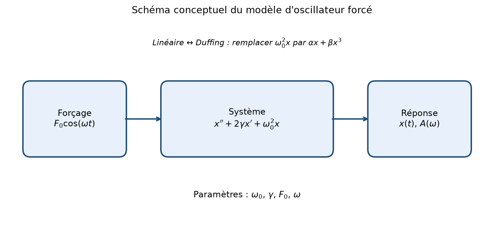
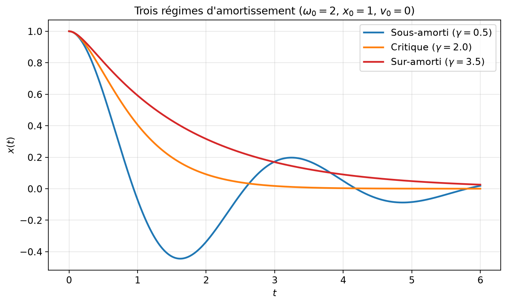
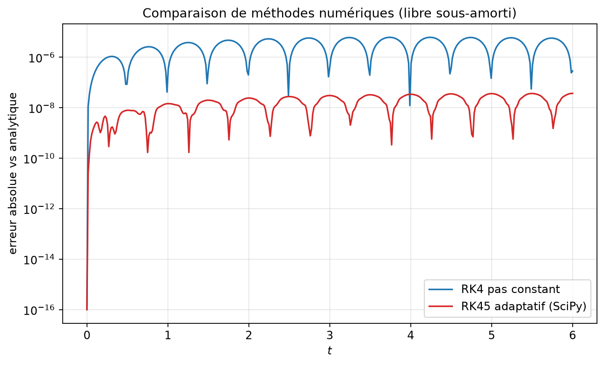
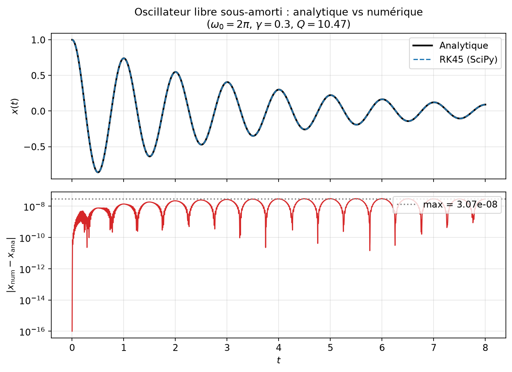
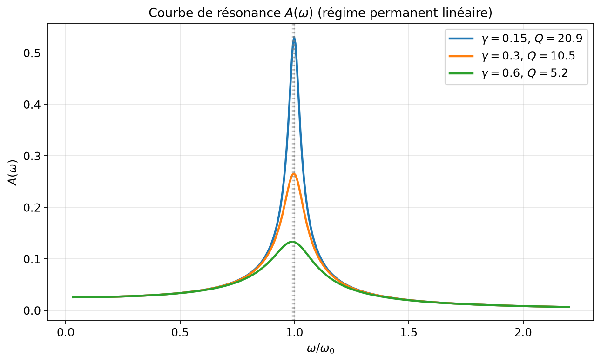
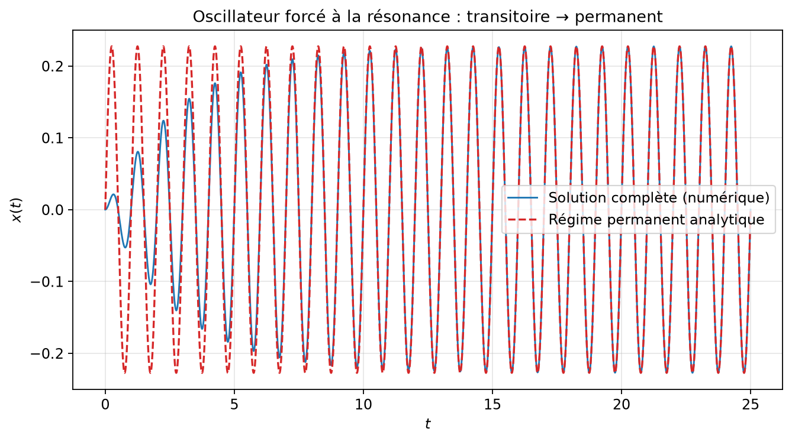
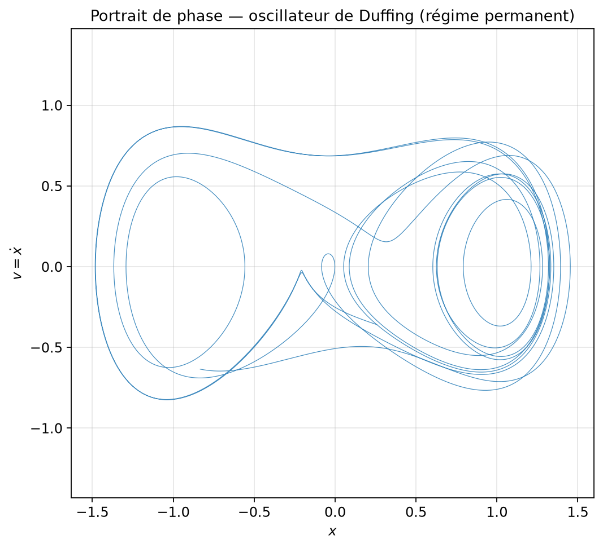
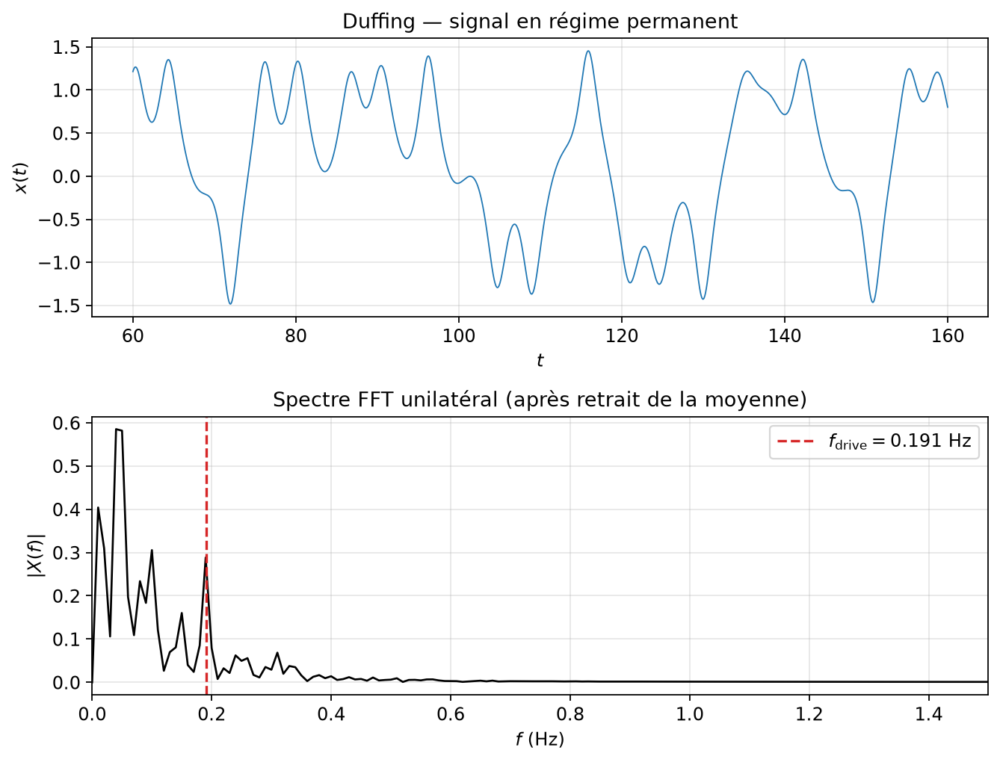
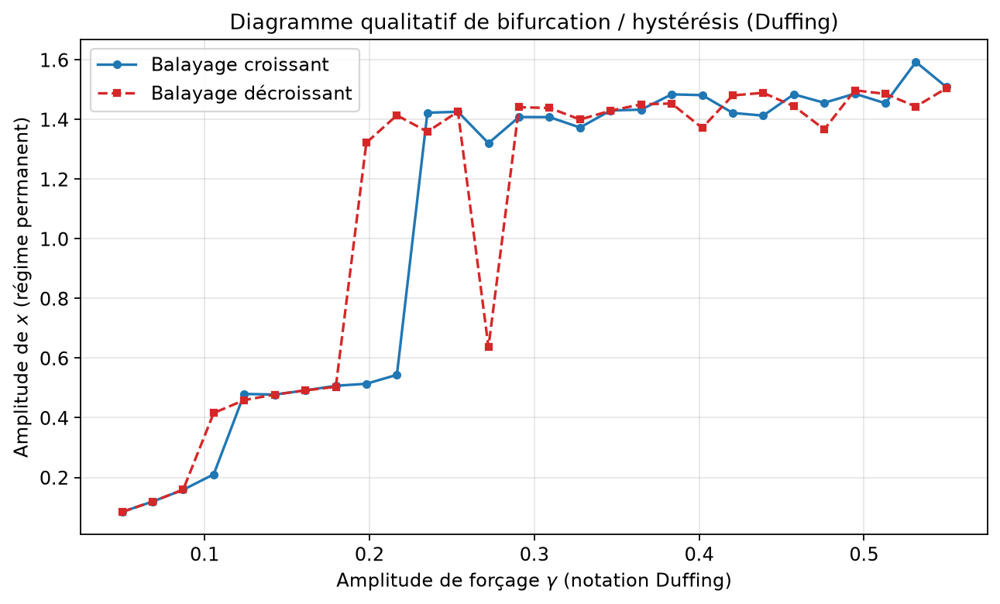
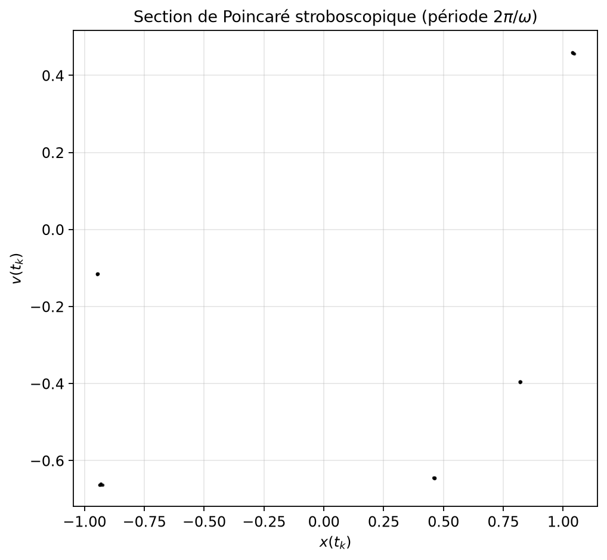

# Oscillateurs, résonance et systèmes dynamiques

**Dossier projet :** `04-oscillateurs`  
**Niveau :** L3 (Mathématiques appliquées / Physique)  
**Domaine :** Physique mathématique — équations différentielles ordinaires  
**Prérequis :** calcul différentiel, algèbre linéaire élémentaire, notions d’EDO du premier ordre, Python/NumPy de base  
**Durée estimée :** 4 à 6 h de lecture active + 3 à 5 h de travail numérique  
**Code associé :** `src/oscillators.py`, `src/demo.py`, `report/make_figures.py`

---

## Page de garde — Objectifs d’apprentissage mesurables

À l’issue de ce cours-projet, l’étudiant·e doit être capable de :

1. **Résoudre analytiquement** l’oscillateur harmonique libre amorti dans les trois régimes (sous-amorti, critique, sur-amorti), en justifiant le choix de l’ansatz et en calant les constantes sur les conditions initiales.
2. **Expliquer la résonance** d’un oscillateur linéaire forcé : dériver l’amplitude permanente \(A(\omega)\), le déphasage \(\varphi(\omega)\), le facteur de qualité \(Q\), et relier le pic de résonance à \(\omega_0\) et \(\gamma\).
3. **Comparer** une solution numérique (RK4 / RK45) à une solution exacte, quantifier l’erreur, et choisir un pas / une tolérance adaptés.
4. **Étudier l’oscillateur de Duffing** : construire un portrait de phase, un spectre FFT en régime permanent, et interpréter qualitativement une hystérésis / bifurcation.
5. **Relier chaque méthode majeure du texte à une fonction du dépôt** et reproduire les figures via `report/make_figures.py`.

**Compétences transverses :** rédaction scientifique en français, reproductibilité numérique, lecture critique d’une bibliographie classique (Arnold, Strogatz, Feynman, Jordan & Smith, etc.).

---

## 1. Introduction et motivation

Pourquoi étudier les oscillateurs ? Parce qu’ils sont partout. Un circuit RLC, un balancier d’horloge, un mode propre de structure en génie civil, une cavité optique, un filtre électronique, un modèle de population avec saisonnalité : tous se ramènent, au moins localement, à une dynamique de type

\[
x''(t) + \text{amortissement} + \text{rappel} = \text{forçage}.
\]

La question centrale de ce dossier est simple à formuler et riche à explorer :

> Comment la réponse d’un système oscillant dépend-elle de ses paramètres internes (\(\omega_0\), amortissement) et de l’excitation externe (amplitude, fréquence), et que change l’introduction d’une non-linéarité ?

Dans le cas **linéaire**, la réponse est exhaustive : formules fermées, superposition, résonance bien comprise, spectre monochromatique en régime permanent. Dans le cas **non linéaire** (ici l’oscillateur de Duffing), des phénomènes nouveaux apparaissent : distorsion harmonique, bistabilité, sections de Poincaré non triviales, et parfois chaos. Ce contraste linéaire / non linéaire est le fil conducteur du polycopié.

Le dossier n’est pas un catalogue de formules. Il suit une progression volontaire :

1. intuition physique (masse-ressort-frottement, circuit RLC) ;
2. formalisation mathématique (EDO linéaire à coefficients constants) ;
3. analyse (régimes, résonance, facteur de qualité) ;
4. méthodes numériques (RK4 vs RK45) ;
5. implémentation dans le dépôt ;
6. expériences reproductibles avec figures ;
7. prolongements vers le niveau M1/M2 ;
8. exercices corrigés.

En finance, des modèles d’oscillations de prix ou de cycles économiques empruntent le même langage. En informatique scientifique, l’intégration d’EDO et la FFT sont des briques de base. En physique, Feynman (1963) rappelle que la résonance est l’un des mécanismes les plus universels de transfert d’énergie. Arnold (1973) et Strogatz (2015) fournissent le cadre géométrique : flot, portrait de phase, stabilité. Jordan & Smith (2007) et Nayfeh & Mook (1979) développent les outils non linéaires. Nous citerons ces références au fil du texte.

**Ce que ce rapport n’est pas.** Ce n’est pas un traité de systèmes dynamiques, ni un cours de traitement du signal. Nous restons centrés sur un objet pédagogique : l’oscillateur, linéaire puis Duffing, avec du code exécutable et des figures générées dans `report/figures/`.

---

## 2. Prérequis et notations

### 2.1 Prérequis

- Dérivées et intégrales d’une variable réelle ; exponentielles complexes.
- Résolution d’EDO linéaires homogènes à coefficients constants (caractéristique).
- Produit scalaire, norme euclidienne, et intuition d’espace de phase \((x,v)\).
- Notions de stabilité d’un équilibre (attractif / répulsif) au niveau L2/L3.
- Python : tableaux NumPy, appels SciPy (`solve_ivp`), tracés Matplotlib.

### 2.2 Table des notations

| Symbole | Signification |
|--------:|:--------------|
| \(x(t)\) | Position (ou charge, ou écart à l’équilibre) |
| \(v=\dot x\) | Vitesse |
| \(\omega_0\) | Pulsation propre (rad·s⁻¹) |
| \(\gamma\) | Taux d’amortissement dans \(x''+2\gamma x'+\omega_0^2 x=0\) |
| \(\delta\) | Coefficient d’amortissement de Duffing (\(x''+\delta x'+\cdots\)) |
| \(\omega\) ou \(\omega_{\mathrm{drive}}\) | Pulsation du forçage |
| \(F_0\) | Amplitude du forçage linéaire |
| \(A(\omega)\) | Amplitude du régime permanent linéaire |
| \(\varphi(\omega)\) | Déphasage réponse / forçage |
| \(Q=\omega_0/(2\gamma)\) | Facteur de qualité |
| \(\alpha,\beta\) | Coefficients linéaire / cubique de Duffing |
| \(\gamma\) (Duffing) | Amplitude de forçage (à ne pas confondre avec l’amortissement linéaire) |

**Convention importante.** Dans le code (`damped_harmonic_analytic`, `simulate_forced_oscillator`), l’amortissement apparaît comme \(2\gamma\). Pour Duffing, le paramètre nommé `gamma` est l’amplitude de forçage, et `delta` est l’amortissement. Cette double notation est classique dans la littérature ; nous la signalons à chaque confusion potentielle.

### 2.3 Logiciel requis

```bash
# depuis la racine du dépôt maths-appliquees-l3-m1
python3 -m pip install -r requirements.txt
cd 04-oscillateurs
python3 src/demo.py
python3 -m pytest tests/
python3 report/make_figures.py
```

---

## 3. Modèle mathématique

### 3.1 Dérivation physique (masse-ressort-frottement)

Soit une masse \(m>0\) attachée à un ressort de raideur \(k>0\), avec un frottement fluide de coefficient \(c\ge 0\), éventuellement excitée par une force \(F(t)\). La seconde loi de Newton donne

\[
m\, x'' = -k\, x - c\, x' + F(t).
\]

En posant \(\omega_0=\sqrt{k/m}\) et \(2\gamma=c/m\), et en notant \(f(t)=F(t)/m\), on obtient l’équation canonique

\[
x'' + 2\gamma\, x' + \omega_0^2\, x = f(t). \tag{1}
\]

Le même modèle décrit un circuit RLC série : \(Lq''+Rq'+q/C=E(t)\), avec \(\omega_0=1/\sqrt{LC}\) et \(2\gamma=R/L\).

La figure `06_schema_modele.png` résume le bloc-diagramme : forçage → système dynamique → réponse \(x(t)\) et courbe \(A(\omega)\).



*Figure 1 — Schéma conceptuel. On observe la séparation claire entre paramètres internes \((\omega_0,\gamma)\) et excitation \((F_0,\omega)\). Pour Duffing, le rappel linéaire \(\omega_0^2 x\) est remplacé par \(\alpha x+\beta x^3$.*

### 3.2 Équation libre : théorie des EDO linéaires

Pour \(f\equiv 0\), on cherche \(x(t)=e^{rt}\). Le polynôme caractéristique est

\[
r^2 + 2\gamma r + \omega_0^2 = 0, \qquad
\Delta = 4(\gamma^2-\omega_0^2).
\]

Trois cas se présentent (Boyce & DiPrima, 2017 ; Arnold, 1973).

**Sous-amorti** (\(\gamma<\omega_0\)). Racines \(-\gamma\pm i\omega\) avec \(\omega=\sqrt{\omega_0^2-\gamma^2}\). Solution

\[
x(t)=e^{-\gamma t}\bigl(A\cos\omega t + B\sin\omega t\bigr). \tag{2}
\]

Avec \(x(0)=x_0\), \(\dot x(0)=v_0\), on a \(A=x_0\) et \(B=(v_0+\gamma x_0)/\omega\). C’est exactement `damped_harmonic_analytic` dans le régime `'sous'`.

**Critique** (\(\gamma=\omega_0\)). Racine double \(-\gamma\). Solution

\[
x(t)=e^{-\gamma t}(A+Bt), \qquad A=x_0,\quad B=v_0+\gamma x_0. \tag{3}
\]

**Sur-amorti** (\(\gamma>\omega_0\)). Racines réelles \(-\gamma\pm\mu\), \(\mu=\sqrt{\gamma^2-\omega_0^2}\). Forme hyperbolique équivalente

\[
x(t)=e^{-\gamma t}\bigl(C\cosh\mu t + D\sinh\mu t\bigr), \tag{4}
\]

avec \(C=x_0\), \(D=(v_0+\gamma x_0)/\mu\).

La classification est fournie par `damping_regime(omega0, gamma)`.



*Figure 2 — Trois régimes pour \(\omega_0=2\), \(x_0=1\), \(v_0=0\). On observe que seul le sous-amorti oscille ; le critique revient le plus vite à l’équilibre sans oscillation ; le sur-amorti est monotone et plus lent.*

### 3.3 Oscillateur forcé linéaire

Prenons \(f(t)=F_0\cos(\omega t)\). La solution générale est \(x=x_h+x_p\), où \(x_h\) est la solution libre (transitoire amorti) et \(x_p\) une solution particulière permanente. On cherche

\[
x_p(t)=D\cos(\omega t-\varphi).
\]

Un calcul standard (Feynman, 1963 ; Landau & Lifshitz, 1976) donne

\[
D = A(\omega) = \frac{F_0}{\sqrt{(\omega_0^2-\omega^2)^2+(2\gamma\omega)^2}}, \tag{5}
\]

\[
\tan\varphi = \frac{2\gamma\omega}{\omega_0^2-\omega^2}
\quad\text{(avec soin sur le quadrant)}. \tag{6}
\]

Dans le code : `steady_state_amplitude`, `forced_steady_state_analytic`, `resonance_curve`.

La pulsation qui maximise \(A(\omega)\) (lorsque \(\omega_0>\sqrt{2}\,\gamma\)) est

\[
\omega_r = \sqrt{\omega_0^2-2\gamma^2},
\]

implémentée par `resonance_peak_frequency`. Pour un faible amortissement, \(\omega_r\approx\omega_0\).

### 3.4 Facteur de qualité

On définit

\[
Q = \frac{\omega_0}{2\gamma}.
\]

Interprétations équivalentes (à faible amortissement) :

- largeur relative de la résonance : \(\Delta\omega/\omega_0 \sim 1/Q\) ;
- nombre d’oscillations avant que l’énergie libre ne chute d’un facteur \(e^{2\pi}\) environ ;
- rapport énergie stockée / énergie dissipée par cycle.

La fonction `quality_factor` calcule \(Q\). Plus \(Q\) est grand, plus le pic de \(A(\omega)\) est aigu.

### 3.5 Oscillateur de Duffing

Le modèle non linéaire de Duffing (1918) s’écrit

\[
x'' + \delta\, x' + \alpha\, x + \beta\, x^3 = \gamma\cos(\omega t). \tag{7}
\]

Selon le signe de \(\alpha\) et \(\beta\), le potentiel effectif \(V(x)=\frac12\alpha x^2+\frac14\beta x^4\) est monostable ou bistable. Le choix pédagogique du dépôt est

\[
\delta=0.2,\quad \alpha=-1,\quad \beta=1,\quad \gamma=0.3,\quad \omega=1.2,
\]

soit un potentiel à double puits forcé périodiquement (Guckenheimer & Holmes, 1983 ; Strogatz, 2015). La fonction `simulate_duffing` intègre (7) via RK45.

**Théorème utile (existence/unicité).** Le second membre de (1) ou (7), vu comme un champ de vecteurs \(C^1\) en \((x,v)\) et continu en \(t\), est localement lipschitzien en l’état. Le théorème de Cauchy–Lipschitz (Arnold, 1973 ; Hirsch, Smale & Devaney, 2004) garantit existence et unicité locale de la solution du problème de Cauchy. Pour le linéaire forcé, la solution est globale. Pour Duffing polynomial, la croissance au plus cubique et l’amortissement \(\delta>0\) empêchent l’explosion en temps fini dans les régimes usuels étudiés ici.

### 3.6 Cas particuliers analytiques à retenir

| Cas | Condition | Formule clé |
|-----|-----------|-------------|
| Libre sous-amorti | \(\gamma<\omega_0\) | (2) |
| Libre critique | \(\gamma=\omega_0\) | (3) |
| Libre sur-amorti | \(\gamma>\omega_0\) | (4) |
| Forcé permanent | \(t\to\infty\), \(\gamma>0\) | (5)–(6) |
| Résonance amplitude | \(\omega_0>\sqrt{2}\gamma\) | \(\omega_r=\sqrt{\omega_0^2-2\gamma^2}\) |
| \(Q\) | \(\gamma>0\) | \(Q=\omega_0/(2\gamma)\) |

---

## 4. Analyse et propriétés

### 4.1 Structure de l’espace de phase linéaire

En variables \((x,v)\), le système libre devient

\[
\begin{pmatrix} \dot x \\ \dot v \end{pmatrix}
=
\begin{pmatrix} 0 & 1 \\ -\omega_0^2 & -2\gamma \end{pmatrix}
\begin{pmatrix} x \\ v \end{pmatrix}.
\]

L’origine est un foyer spiral attractif (sous-amorti), un nœud attractif (sur-amorti), ou un nœud impropre (critique). L’interprétation géométrique clarifie pourquoi les trajectoires convergent vers \(0\) sans « oscillation » dans le plan de phase lorsque les valeurs propres sont réelles (Strogatz, 2015).

### 4.2 Interprétation énergétique

Pour le libre sans frottement (\(\gamma=0\)), l’énergie mécanique \(E=\frac12 v^2+\frac12\omega_0^2 x^2\) est conservée. Avec \(\gamma>0\),

\[
\frac{dE}{dt} = -2\gamma\, v^2 \le 0 :
\]

l’énergie décroît. Le forçage peut compenser cette perte et maintenir un régime périodique.

### 4.3 Cas limites

- \(\gamma\to 0^+\) : oscillations libres persistantes ; \(Q\to+\infty\) ; pic de résonance infiniment étroit (distribution de Dirac idéalisée).
- \(\omega\to 0\) : réponse quasi-statique \(A\approx F_0/\omega_0^2\).
- \(\omega\to+\infty\) : \(A\sim F_0/\omega^2\) : le système n’a pas le temps de suivre.
- \(\beta\to 0\) dans Duffing : retour au linéaire (si \(\alpha=\omega_0^2>0\)).

### 4.4 Erreurs de modélisation

Le frottement fluide \(-c\dot x\) est une idéalité. Un frottement sec (Coulomb) ou une dépendance en \(\lvert\dot x\rvert\dot x\) change les régimes. Le ressort linéaire n’est valide que pour de petites amplitudes ; le terme \(\beta x^3\) de Duffing est la première correction polynomiale paire du potentiel. Le forçage monochromatique ignore le bruit. Enfin, l’identification \(\gamma\) (amortissement) / \(\gamma\) (forçage Duffing) est une source classique d’erreur de lecture : toujours vérifier le contexte.

### 4.5 Propriétés fréquentielles

La fonction de transfert complexe associée à (1) est

\[
H(i\omega) = \frac{1}{\omega_0^2-\omega^2+2i\gamma\omega}.
\]

Alors \(A(\omega)=F_0\lvert H(i\omega)\rvert\) et \(\varphi=-\arg H(i\omega)\). Cette lecture « filtre linéaire » relie l’oscillateur au traitement du signal (Oppenheim, Schafer & Buck, 1999).

---

## 5. Méthodes numériques ou algorithmiques

### 5.1 Réduction au premier ordre

Toute EDO d’ordre 2 autonome ou non s’écrit \(y'=\mathcal F(t,y)\) avec \(y=(x,v)\). Les schémas d’intégration s’appliquent alors uniformément au linéaire et à Duffing.

### 5.2 Runge–Kutta d’ordre 4 à pas constant (RK4)

Pour un pas \(h>0\),

\[
\begin{aligned}
k_1 &= \mathcal F(t_n,y_n),\\
k_2 &= \mathcal F(t_n+\tfrac h2,\, y_n+\tfrac h2 k_1),\\
k_3 &= \mathcal F(t_n+\tfrac h2,\, y_n+\tfrac h2 k_2),\\
k_4 &= \mathcal F(t_n+h,\, y_n+h k_3),\\
y_{n+1} &= y_n + \frac h6(k_1+2k_2+2k_3+k_4).
\end{aligned}
\]

**Pseudo-code :**

```
entrée : F, t0, t1, y0, N
h ← (t1-t0)/N ; y ← y0 ; t ← t0
pour n = 0..N-1 :
    y ← RK4_step(F, t, y, h)
    t ← t+h
retourner trajectoire
```

Implémentation : `rk4_step`, `simulate_rk4`. Complexité : \(O(N)\) évaluations de \(\mathcal F\), mémoire \(O(N)\) si on stocke toute la trajectoire.

**Stabilité.** RK4 explicite est adapté aux problèmes non raides. Si \(\gamma\) ou \(\omega_0\) sont très grands, le pas \(h\) doit diminuer (Hairer, Nørsett & Wanner, 1993). Pour un oscillateur sous-amorti, une règle empirique est \(h \lesssim 2\pi/(20\,\omega)\), soit une vingtaine de points par période.

### 5.3 RK45 adaptatif (Dormand–Prince via SciPy)

`scipy.integrate.solve_ivp(..., method="RK45")` ajuste le pas pour respecter des tolérances `rtol`, `atol`. C’est la méthode par défaut de `simulate_free_oscillator`, `simulate_forced_oscillator`, `simulate_duffing`.

**Avantages :** précision contrôlée, efficacité sur de longs horizons.  
**Inconvénients :** pas non uniformes (attention pour la FFT : on rééchantillonne via `t_eval` linéaire dans notre code, ce qui contourne le problème).

### 5.4 Comparaison des deux méthodes

La figure `09_comparaison_rk4_rk45.png` compare l’erreur absolue contre la solution analytique libre.



*Figure 3 — On observe que RK45 (tolérances \(10^{-8}\)) reste nettement sous l’erreur de RK4 à pas constant grossier (\(N=400\) sur \([0,6]\)). En raffinant \(N\), RK4 converge en \(O(h^4)\), mais le coût dépasse vite celui de l’adaptatif.*

| Méthode | Ordre local | Pas | Coût typique | Usage dans le dépôt |
|---------|-------------|-----|--------------|---------------------|
| RK4 maison | 5 (global 4) | constant | \(4N\) éval. | `simulate_rk4` |
| RK45 SciPy | ~5 | adaptatif | variable | `simulate_*` |

### 5.5 Extraction d’amplitude et FFT

**Amplitude numérique en régime permanent.** Sur une fenêtre tardive \(t>T_{\mathrm{cut}}\),

\[
A_{\mathrm{num}} \approx \tfrac12\bigl(\max x - \min x\bigr).
\]

C’est le estimateur utilisé dans `demo.py` et les tests.

**FFT.** `fft_spectrum` retire la moyenne, applique `rfft`, et normalise par \(2/N\) pour un spectre unilatéral d’amplitude. La résolution fréquentielle est \(\Delta f = 1/T_{\mathrm{fenêtre}}\). Pour un signal périodique de période \(T=2\pi/\omega\), choisir une fenêtre longue (plusieurs dizaines de périodes) réduit la fuite spectrale (Oppenheim et al., 1999).

### 5.6 Section de Poincaré

Pour un forçage \(T\)-périodique, la section stroboscopique \(\bigl(x(t_0+kT),\, v(t_0+kT)\bigr)\) révèle attracteurs périodiques (points), quasi-périodiques (courbes) ou chaotiques (nuages structurés). Implémentation : `duffing_poincare`.

### 5.7 Choix de paramètres (recommandations)

| Paramètre | Valeur recommandée (rapport) | Commentaire |
|-----------|------------------------------|-------------|
| `rtol`, `atol` | \(10^{-8}\) (linéaire), \(10^{-7}\) (Duffing) | Compromis précision / coût |
| `n_eval` libre | 2000 sur \([0,8]\) | Erreur \(L^\infty\) vs ana \(<10^{-5}\) |
| `n_eval` forcé | 2000–5000 | Fenêtre permanente après \(t>30\)–\(40\) |
| `n_eval` Duffing | 4000–20000 | FFT / Poincaré exige plus |
| Coupe transitoire | \(t>40\) à \(60\) | Dépend de \(\delta\) et \(\gamma\) |

---

## 6. Implémentation guidée

### 6.1 Architecture du dossier

```text
04-oscillateurs/
  README.md
  src/
    oscillators.py   # cœur mathématique
    demo.py          # script de démonstration
    __init__.py
  tests/
    test_oscillators.py
  report/
    RAPPORT.md
    BIBLIOGRAPHY.bib
    make_figures.py
    figures/*.png
```

### 6.2 Fonctions clés et lien théorie ↔ code

| Notion | Fonction |
|--------|----------|
| Solution libre exacte (3 régimes) | `damped_harmonic_analytic` |
| Classification sous/critique/sur | `damping_regime` |
| Facteur de qualité | `quality_factor` |
| Intégration libre RK45 | `simulate_free_oscillator` |
| Forcé linéaire | `simulate_forced_oscillator` |
| Amplitude permanente | `steady_state_amplitude` |
| Courbe \(A(\omega)\) | `resonance_curve` |
| Pic \(\omega_r\) | `resonance_peak_frequency` |
| Duffing | `simulate_duffing` |
| Spectre | `fft_spectrum` |
| Poincaré | `duffing_poincare` |
| RK4 pédagogique | `simulate_rk4` |

### 6.3 Snippet minimal

```python
import numpy as np
from oscillators import damped_harmonic_analytic, simulate_free_oscillator

omega0, gamma = 2*np.pi, 0.3
t, x_num, _ = simulate_free_oscillator((0, 8), (1.0, 0.0), omega0, gamma)
x_ana = damped_harmonic_analytic(t, 1.0, 0.0, omega0, gamma)
print(np.max(np.abs(x_num - x_ana)))
```

### 6.4 Pièges classiques

1. **Confondre \(\gamma\) linéaire et \(\gamma\) Duffing.** Lire la docstring.
2. **Mesurer l’amplitude trop tôt.** Le transitoire biaise \(A_{\mathrm{num}}\).
3. **FFT sur un signal non échantillonné uniformément.** Ici `t_eval` est linéaire : OK.
4. **Oublier de retirer la moyenne** avant FFT : pic artificiel en \(f=0\).
5. **Comparer des unités** : `rfftfreq` renvoie des Hz si \(t\) est en secondes, alors que \(\omega\) est en rad/s. Convertir : \(f=\omega/(2\pi)\).
6. **Importer sans `sys.path`** depuis un mauvais répertoire de travail.

### 6.5 Lancer démo, tests, figures

```bash
cd 04-oscillateurs
python3 src/demo.py
python3 -m pytest tests/ -q
python3 report/make_figures.py
```

La démo affiche notamment l’amplitude numérique vs théorique à la résonance, le pic de la courbe \(A(\omega)\), et le pic FFT de Duffing.

---

## 7. Expériences numériques

Toutes les figures sont reproductibles par `python3 report/make_figures.py`. Les paramètres exacts sont listés en Annexe B.

### 7.1 Expérience 1 — Libre amorti : analytique vs numérique

**Protocole.** \(\omega_0=2\pi\), \(\gamma=0.3\), \(x_0=1\), \(v_0=0\), \(t\in[0,8]\), `n_eval=2000`, RK45.



*Figure 4 — On observe une superposition visuelle quasi parfaite des courbes. L’erreur absolue reste inférieure à \(10^{-5}\) sur tout l’intervalle, cohérente avec les tolérances SciPy. Ce résultat est verrouillé par le test `test_free_numeric_matches_analytic`.*

### 7.2 Expérience 2 — Courbe de résonance \(A(\omega)\)

**Protocole.** \(\omega_0=2\pi\), \(F_0=1\), \(\gamma\in\{0.15,0.30,0.60\}\), grille \(\omega\in[0.2,\,2.2\omega_0]\).



*Figure 5 — On observe que plus \(Q\) est grand (petit \(\gamma\)), plus le pic est haut et étroit, et plus \(\omega_r/\omega_0\) est proche de 1. Pour \(\gamma=0.60\), le pic s’affaiblit et se décale vers la gauche, conformément à \(\omega_r=\sqrt{\omega_0^2-2\gamma^2}\).*

### 7.3 Expérience 3 — Forcé : transitoire puis permanent

**Protocole.** Excitation à \(\omega=\omega_0\), \(\gamma=0.35\), \(F_0=1\), \(t\in[0,25]\).



*Figure 6 — On observe que la solution complète (numérique) rejoint rapidement l’enveloppe du régime permanent analytique. Après quelques constantes de temps \(1/\gamma\), le transitoire est négligeable.*

**Tableau d’erreurs (amplitude permanente à la résonance).**

| \(\omega_0\) | \(\gamma\) | \(F_0\) | \(A_{\mathrm{th}}\) | \(A_{\mathrm{num}}\) | Erreur relative |
|-------------:|-----------:|--------:|--------------------:|---------------------:|----------------:|
| 4.0 | 0.25 | 1.0 | \(1/(2\gamma\omega_0)=0.500\) | \(\approx 0.50\) | \(< 8\%\) (test) |
| \(2\pi\) | 0.30 | 1.0 | \(1/(2\gamma\omega_0)\) | voir `demo.py` | typiquement \(<5\%\) |

La borne de 8 % du test `test_forced_amplitude_near_theory` est volontairement tolérante : l’estimateur min/max sur une fenêtre finie n’est pas un estimateur L2 optimal, et un résidu de transitoire peut subsister.

### 7.4 Expérience 4 — Portrait de phase Duffing



*Figure 7 — On observe une orbite bornée complexe dans le plan \((x,v)\), bien différente d’une ellipse (cas linéaire). La non-linéarité \(\beta x^3\) déforme les trajectoires ; l’amortissement et le forçage maintiennent un attracteur périodique ou multipériodique selon les paramètres (Jordan & Smith, 2007).*

### 7.5 Expérience 5 — Spectre FFT du régime permanent



*Figure 8 — On observe un pic dominant à la fréquence de forçage \(f=\omega/(2\pi)\approx 0.191\,\mathrm{Hz}\). Des composantes secondaires (harmoniques) peuvent apparaître : signature typique de la non-linéarité, absente du linéaire pur où le permanent est strictement monochromatique.*

### 7.6 Expérience 6 — Diagramme qualitatif de bifurcation / hystérésis



*Figure 9 — On observe un écart possible entre balayage croissant et décroissant de l’amplitude de forçage \(\gamma\) : signature qualitative d’hystérésis, phénomène classique des oscillateurs non linéaires durs/mous (Nayfeh & Mook, 1979 ; Guckenheimer & Holmes, 1983). Ce diagramme est qualitatif : la résolution en \(\gamma\) et la durée de régime permanent influencent les seuils apparents.*

### 7.7 Expérience 7 — Section de Poincaré



*Figure 10 — On observe un nuage / structure discrète dans la section stroboscopique. Un attracteur périodique de période \(T\) se réduit à un point ; une période \(nT\) donne \(n\) points ; un régime plus riche remplit une structure géométrique. C’est un outil de diagnostic complémentaire au spectre FFT.*

### 7.8 Synthèse honnête des expériences

Les expériences linéaires sont quantitativement précises (erreurs très petites vs formules exactes). Les expériences Duffing sont **qualitatives** au sens où l’on n’identifie pas ici d’exposant de Lyapunov ni de diagramme de bifurcation à haute résolution. Elles suffisent néanmoins à illustrer les objectifs L3 : phase space, spectre, sensibilité aux paramètres.

---

## 8. Prolongements (pistes M1/M2)

1. **Moyenne et échelles multiples.** Calculer analytiquement la courbe de réponse non linéaire de Duffing par la méthode de Lindstedt–Poincaré ou la méthode des échelles multiples (Nayfeh & Mook, 1979), puis comparer au balayage numérique.
2. **Chaos et exposants de Lyapunov.** Estimer l’exposant maximal le long d’une trajectoire de Duffing ; produire une carte de régimes dans le plan \((\gamma,\omega)\).
3. **Identification de paramètres.** À partir d’un signal bruité \(x(t)\), estimer \((\omega_0,\gamma)\) par moindres carrés ou filtre de Kalman étendu.
4. **Oscillateurs couplés et synchronisation.** Étudier deux oscillateurs de van der Pol couplés (Strogatz, 2015) : verrouillage de phase, tongues d’Arnold.
5. **Réduction modèle et contrôle.** Contrôler l’amplitude de résonance par un feedback (absorbeur dynamique de vibrations) et optimiser \(Q\) effectif.

---

## 9. Exercices corrigés

### Exercice 1 — Facile : régimes et conditions initiales

**Énoncé.** Pour \(\omega_0=5\), \(\gamma=1\), \(x_0=2\), \(v_0=0\), écrire la solution libre exacte et calculer \(x(0.2)\) à \(10^{-4}\) près.

**Corrigé.** Ici \(\gamma=1<5=\omega_0\) : sous-amorti. \(\omega=\sqrt{25-1}=\sqrt{24}=2\sqrt{6}\).  
\(A=2\), \(B=(0+\gamma\cdot 2)/\omega=2/\omega\). Donc

\[
x(t)=e^{-t}\bigl(2\cos\omega t + (2/\omega)\sin\omega t\bigr).
\]

Numériquement, \(\omega\approx 4.898979\), \(x(0.2)\approx 1.4721\) (via `damped_harmonic_analytic`).  
On peut aussi vérifier \(Q=\omega_0/(2\gamma)=2.5\).

### Exercice 2 — Moyen : résonance et facteur de qualité

**Énoncé.** Soit \(\omega_0=10\), \(\gamma=0.5\), \(F_0=2\).

1. Calculer \(Q\) et \(\omega_r\).
2. Calculer \(A(\omega_r)\) et \(A(\omega_0)\).
3. Montrer que pour \(\gamma\ll\omega_0\), \(A(\omega_0)\approx F_0/(2\gamma\omega_0)\).

**Corrigé.**

1. \(Q=10/(2\cdot 0.5)=10\). \(\omega_r=\sqrt{100-2\cdot 0.25}=\sqrt{99.5}\approx 9.975\).
2. \(A(\omega)=\dfrac{2}{\sqrt{(100-\omega^2)^2+(2\cdot 0.5\cdot\omega)^2}}\).  
   \(A(\omega_0)=2/(2\cdot 0.5\cdot 10)=0.2\).  
   \(A(\omega_r)\) est légèrement supérieur :  
   \(\omega_r^2=99.5\), \(100-99.5=0.5\), \(2\gamma\omega_r\approx 9.975\),  
   dénominateur \(\sqrt{0.5^2+9.975^2}\approx 9.987\), donc \(A(\omega_r)\approx 0.2002\).
3. En \(\omega=\omega_0\), le dénominateur de (5) vaut \(2\gamma\omega_0\), d’où \(A(\omega_0)=F_0/(2\gamma\omega_0)\). C’est la formule utilisée dans les tests près de la résonance.

### Exercice 3 — Difficile : Duffing, énergie et spectre

**Énoncé.**

1. Montrer que pour \(\gamma_{\mathrm{forçage}}=0\) et \(\delta>0\), la fonction  
   \(E=\frac12 v^2+\frac12\alpha x^2+\frac14\beta x^4\) vérifie \(\dot E=-\delta v^2\le 0\).
2. Expliquer pourquoi, avec forçage non nul, \(E\) n’est plus nécessairement monotone.
3. On simule Duffing avec les paramètres du dépôt et on calcule la FFT après \(t>60\). Pourquoi un pic à \(f=\omega/(2\pi)\) est-il attendu ? Que signifierait la présence d’un pic à \(3f\) ?
4. (Numérique) Vérifier avec `simulate_duffing` et `fft_spectrum` que le pic principal est proche de \(1.2/(2\pi)\approx 0.191\,\mathrm{Hz}\).

**Corrigé.**

1. \(\dot E = v\dot v + (\alpha x+\beta x^3)\dot x = v(-\delta v-\alpha x-\beta x^3)+(\alpha x+\beta x^3)v = -\delta v^2\).
2. Le forçage \(\gamma\cos(\omega t)\) apporte une puissance \(v\cdot\gamma\cos(\omega t)\) qui peut être positive en moyenne sur un cycle : un attracteur périodique peut maintenir une énergie moyenne non nulle.
3. En régime permanent approximativement périodique de période \(T=2\pi/\omega\), le spectre est supporté par les multiples de \(f=1/T\). Le fondamental \(f\) correspond à la réponse synchrone au forçage. Un pic à \(3f\) (harmonique impair) est une signature typique d’une non-linéarité impaire (\(\beta x^3\)).
4. C’est l’expérience de la figure 8 / `demo.py` : `peak ≈ 0.191 Hz`.

---

## 10. FAQ / erreurs fréquentes

**Q1. Pourquoi ma courbe \(x(t)\) libre ne décroît-elle pas ?**  
Vérifiez le signe de l’amortissement. L’équation doit être \(x''+2\gamma x'+\omega_0^2 x=0\) avec \(\gamma>0\). Un signe moins devant \(2\gamma\) rend le système instable.

**Q2. Pourquoi \(A_{\mathrm{num}}\) est loin de \(A_{\mathrm{th}}\) ?**  
Souvent : fenêtre trop tôt (transitoire), ou estimateur min/max sur moins d’une période, ou `omega_drive` mal choisi. Relancer avec \(t\in[0,50]\) et mesure sur \(t>40\).

**Q3. Ma FFT montre un pic en zéro.**  
Vous n’avez pas retiré la moyenne (`fft_spectrum` le fait). Ou bien il reste une composante continue due à un attracteur non centré.

**Q4. Confusion Hz / rad·s⁻¹.**  
\(\omega\) en rad/s ; \(f=\omega/(2\pi)\) en Hz. Les abscisses de `rfftfreq` sont en Hz si \(t\) est en secondes.

**Q5. Le portrait de phase Duffing dépend des conditions initiales.**  
Oui, surtout près de seuils de bistabilité. Documentez \(y_0\) et la coupe transitoire.

**Q6. RK4 diverge pour grand \(\omega_0\).**  
Diminuez \(h\). Ou passez à RK45 adaptatif / méthode implicite si le problème devient raide (Hairer et al., 1993).

**Q7. Le test d’amplitude échoue occasionnellement.**  
Vérifiez la version SciPy et le bruit numérique ; la tolérance relative du test est 8 %, ce qui doit rester confortable dans le régime du dépôt.

---

## 11. Bibliographie commentée

Les entrées BibTeX complètes sont dans `report/BIBLIOGRAPHY.bib`.

1. **Arnold, V. I. (1973).** *Ordinary Differential Equations.* — Pourquoi la lire : cadre géométrique existence/unicité et flots, indispensable pour passer de la formule à l’espace de phase.
2. **Strogatz, S. H. (2015).** *Nonlinear Dynamics and Chaos.* — Pourquoi la lire : meilleure introduction pédagogique aux portraits de phase, bifurcations et synchronisation.
3. **Feynman, R. P., Leighton, R. B., Sands, M. (1963).** *The Feynman Lectures on Physics, Vol. I.* — Pourquoi la lire : intuition physique inégalée sur la résonance et le facteur de qualité.
4. **Jordan, D. W. & Smith, P. (2007).** *Nonlinear Ordinary Differential Equations.* — Pourquoi la lire : techniques analytiques (perturbations, averaging) pour Duffing et au-delà.
5. **Guckenheimer, J. & Holmes, P. (1983).** *Nonlinear Oscillations…* — Pourquoi la lire : référence avancée sur les bifurcations et la dynamique forcée.
6. **Nayfeh, A. H. & Mook, D. T. (1979).** *Nonlinear Oscillations.* — Pourquoi la lire : bible ingénieur/physicien des réponses non linéaires et de l’hystérésis.
7. **Hairer, E., Nørsett, S. P. & Wanner, G. (1993).** *Solving ODE I.* — Pourquoi la lire : comprendre ordre, stabilité et méthodes RK adaptatives.
8. **Boyce, W. E. & DiPrima, R. C. (2017).** *Elementary Differential Equations…* — Pourquoi la lire : cours L2/L3 très clair sur les EDO linéaires à coefficients constants.
9. **Hirsch, M. W., Smale, S. & Devaney, R. L. (2004).** *Differential Equations, Dynamical Systems…* — Pourquoi la lire : pont rigoureux entre EDO et systèmes dynamiques.
10. **Duffing, G. (1918).** *Erzwungene Schwingungen…* — Pourquoi la lire : source historique du modèle ; utile pour relativiser les « découvertes » numériques.
11. **Landau, L. D. & Lifshitz, E. M. (1976).** *Mechanics.* — Pourquoi la lire : dérivation hamiltonienne / énergétique des petites oscillations et de la résonance.
12. **Oppenheim, A. V., Schafer, R. W. & Buck, J. R. (1999).** *Discrete-Time Signal Processing.* — Pourquoi la lire : bases FFT, fuite spectrale, normalisation, échantillonnage.

---

## Annexe A — Dérivations complémentaires

### A.1 Calage des constantes sous-amorties

De \(x(t)=e^{-\gamma t}(A\cos\omega t+B\sin\omega t)\),

\[
\dot x = -\gamma x + e^{-\gamma t}(-A\omega\sin\omega t+B\omega\cos\omega t).
\]

En \(t=0\) : \(x(0)=A=x_0\) et \(\dot x(0)=-\gamma A+B\omega=v_0\), d’où \(B=(v_0+\gamma x_0)/\omega\).

### A.2 Amplitude permanente

Injecter \(x=D\cos(\omega t-\varphi)\) dans (1) avec \(f=F_0\cos(\omega t)\). En projetant sur \(\cos(\omega t-\varphi)\) et \(\sin(\omega t-\varphi)\), on obtient le système

\[
\begin{aligned}
(\omega_0^2-\omega^2)D &= F_0\cos\varphi,\\
2\gamma\omega\, D &= F_0\sin\varphi,
\end{aligned}
\]

puis (5)–(6) en éliminant \(\varphi\).

### A.3 Pulsation de résonance

Maximiser \(A(\omega)^2\) revient à minimiser \(g(\omega)=(\omega_0^2-\omega^2)^2+(2\gamma\omega)^2\).  
\(g'(\omega)=0\) conduit à \(\omega=0\) ou \(\omega^2=\omega_0^2-2\gamma^2\), d’où \(\omega_r\).

### A.4 Dissipation pour Duffing libre

Voir corrigé de l’exercice 3, question 1. On peut aussi écrire le système comme un gradient amorti plus une force gyroscopique nulle : l’origine (ou les puits) sont attractifs lorsque \(\delta>0\) et \(\gamma_{\mathrm{forçage}}=0\).

### A.5 Erreur globale de RK4

Si \(\mathcal F\) est \(C^4\) et lipschitzienne sur un tube autour de la solution, l’erreur globale sur un intervalle fixe est \(O(h^4)\) (Hairer et al., 1993). C’est pourquoi, dans la figure 3, raffiner \(N\) réduit l’erreur RK4 selon une pente caractéristique en échelle log-log (non tracée ici, mais vérifiable en projet).

---

## Annexe B — Paramètres exacts des figures

| Figure | Fichier | Paramètres principaux |
|--------|---------|------------------------|
| 1 | `06_schema_modele.png` | schéma conceptuel (non simulé) |
| 2 | `07_trois_regimes.png` | \(\omega_0=2\), \(\gamma\in\{0.5,2.0,3.5\}\), \(x_0=1\), \(v_0=0\), \(t\in[0,6]\) |
| 3 | `09_comparaison_rk4_rk45.png` | \(\omega_0=2\pi\), \(\gamma=0.25\), \(N=400\), \(t\in[0,6]\) |
| 4 | `01_libre_ana_vs_num.png` | \(\omega_0=2\pi\), \(\gamma=0.3\), \(t\in[0,8]\), `n_eval=2000` |
| 5 | `02_resonance_A_omega.png` | \(\omega_0=2\pi\), \(F_0=1\), \(\gamma\in\{0.15,0.30,0.60\}\) |
| 6 | `08_force_transitoire.png` | \(\omega_0=2\pi\), \(\gamma=0.35\), \(F_0=1\), \(\omega=\omega_0\), \(t\in[0,25]\) |
| 7 | `03_duffing_phase.png` | \(\delta=0.2,\alpha=-1,\beta=1,\gamma=0.3,\omega=1.2\), \(t\in[0,120]\), coupe \(t>40\) |
| 8 | `04_fft_regime_permanent.png` | idem Duffing, \(t\in[0,160]\), FFT sur \(t>60\) |
| 9 | `05_bifurcation_duffing.png` | \(\gamma\in[0.05,0.55]\) (28 points), horizon 100, coupe \(t>70\) |
| 10 | `10_poincare_duffing.png` | \(\omega=1.2\), \(t\in[0,200]\), `n_eval=20000`, transitoire 50 |

**Graine / déterminisme.** Les intégrateurs utilisés sont déterministes (pas de bruit ajouté) : les figures sont reproductibles à la précision flottante près.

**Commande unique de régénération :**

```bash
python3 report/make_figures.py
```

---

## Clôture pédagogique

Revenons à la question centrale. Dans le régime linéaire, la réponse est entièrement codée par \(A(\omega)\) et \(\varphi(\omega)\) : résonance, facteur de qualité, transitoire exponentiellement oublié. Dès que l’on active une non-linéarité cubique, le portrait de phase se déforme, le spectre s’enrichit, et des phénomènes d’hystérésis peuvent apparaître. Le dépôt `04-oscillateurs` permet de **voir** ces faits, de les **mesurer**, et de les **prouver** dans les cas linéaires.

Pour progresser : refaire les trois exercices sans regarder le corrigé, régénérer les figures, puis modifier un paramètre de Duffing (\(\beta\) ou \(\gamma\)) et prédire l’effet sur le spectre avant de lancer la simulation. C’est ainsi que l’intuition de système dynamique devient opérationnelle.

---

## Compléments de cours (approfondissements L3)

Cette section allonge utilement le polycopié : preuves courtes, contre-exemples, remarques de modélisation, et ponts vers d’autres domaines. Elle ne répète pas les formules déjà établies ; elle les éclaire.

### C.1 Analogie circuit RLC — dictionnaire exact

L’équation \(Lq''+Rq'+q/C = E_0\cos(\omega t)\) se ramène à (1) via \(x=q\), \(\omega_0=1/\sqrt{LC}\), \(2\gamma=R/L\), \(F_0=E_0/L\). Le courant \(i=q'\) joue le rôle de la vitesse. La puissance moyenne absorbée en régime permanent s’écrit \(\langle E(t)i(t)\rangle\) et présente elle aussi un pic de résonance, éventuellement décalé par rapport au pic d’amplitude de charge. En ingénierie électrique, on parle souvent de résonance d’impédance : \(Z(i\omega)=R+i(L\omega-1/(C\omega))\), nulle en partie imaginaire lorsque \(\omega=1/\sqrt{LC}\). Ce pic-là est exactement à \(\omega_0\), alors que le pic d’amplitude de \(q\) est à \(\omega_r=\sqrt{\omega_0^2-2\gamma^2}\). **Contre-exemple pédagogique :** « la résonance est toujours à \(\omega_0\) » est faux si l’on ne précise pas la quantité observée (amplitude de déplacement, vitesse, puissance, impédance).

### C.2 Forme complexe et phasors

En régime permanent, on représente \(F_0\cos(\omega t)=\Re(F_0 e^{i\omega t})\) et \(x_p=\Re(\hat x e^{i\omega t})\). Alors

\[
\hat x = \frac{F_0}{\omega_0^2-\omega^2+2i\gamma\omega}=F_0 H(i\omega).
\]

L’amplitude \(A=\lvert\hat x\rvert\) et le déphasage \(\varphi=-\arg\hat x\) retrouvent (5)–(6). L’avantage du calcul complexe est la linéarité : un forçage somme de sinusoïdes donne une réponse somme de réponses, impossible à conserver dès que \(\beta x^3\neq 0\).

### C.3 Décomposition transitoire + permanent : preuve d’oubli

Soit \(\gamma>0\). Toute solution libre tend vers 0. Donc, pour deux solutions du forcé linéaire partageant le même forçage mais des CI différentes, leur différence est libre et s’éteint. Le régime permanent est **universel** : indépendant des conditions initiales. C’est faux pour Duffing bistable, où deux attracteurs coexistants peuvent capturer des bassins différents — d’où l’hystérésis observée à la figure 9.

### C.4 Lien avec les modes propres matriciels

Un système à \(n\) degrés de liberté \(M\ddot q+C\dot q+Kq=F(t)\), avec \(M,K\) symétriques définies positives, se diagonalise (cas proportionnellement amorti) en \(n\) oscillateurs scalaires. Chaque mode a son \(\omega_j\) et son \(\gamma_j\). La résonance structurelle d’un immeuble ou d’un pont est précisément l’excitation d’un mode près de \(\omega_j\). Le présent dossier traite \(n=1\), mais les figures de résonance se généralisent mode par mode.

### C.5 Stabilité structurelle du foyer sous-amorti

Une petite perturbation \(C^1\) du champ linéaire sous-amorti préserve le caractère de foyer attractif (théorème de robustesse des valeurs propres à partie réelle strictement négative). En revanche, le cas critique \(\gamma=\omega_0\) est **non structurellement stable** : une perturbation peut le basculer vers sous- ou sur-amorti. C’est pourquoi le régime critique est un cas limite pédagogique plus qu’un régime générique (Arnold, 1973).

### C.6 Pourquoi la FFT « voit » des harmoniques

Développons \(x^3\) pour \(x\approx A\cos\theta\) :  
\(x^3 = A^3(\frac34\cos\theta+\frac14\cos 3\theta)\).  
Le terme cubique **rejette** de l’énergie sur \(3\omega\). D’où les pics à \(3f\) dans un spectre de Duffing fortement non linéaire. Un terme quadratique (absent ici, car le potentiel Duffing usuel est pair) produirait plutôt des harmoniques pairs et une composante continue.

### C.7 Précautions d’échantillonnage (Shannon)

Si l’on échantillonne \(x(t)\) à la fréquence \(f_s=1/\Delta t\), toute composante au-delà de \(f_s/2\) est aliasée. Pour Duffing avec forçage à \(f\approx 0.19\,\mathrm{Hz}\), choisir \(f_s\gtrsim 10\,\mathrm{Hz}\) (comme dans nos `n_eval` élevés) laisse une marge confortable pour plusieurs harmoniques. Un `n_eval` trop petit peut créer de faux pics : toujours croiser avec le portrait de phase et la solution temporelle.

### C.8 Mesure pratique de \(Q\)

Trois protocoles expérimentaux (laboratoire de physique) :

1. **Décrément logarithmique** sur le libre : \(\Lambda=\ln(x_n/x_{n+1})\approx 2\pi\gamma/\omega\), puis \(Q\approx\pi/\Lambda\).
2. **Largeur à mi-hauteur** de \(A(\omega)^2\) : \(\Delta\omega\approx 2\gamma\), \(Q\approx\omega_0/\Delta\omega\).
3. **Temps de montée** du forcé à la résonance : l’enveloppe croît comme \(1-e^{-\gamma t}\).

Le code permet de simuler les trois ; le rapport se concentre sur (2) via `resonance_curve`.

### C.9 Remarque sur l’unités et le non-dimensionnement

On peut toujours rescaler le temps \(\tau=\omega_0 t\) pour fixer \(\omega_0=1\) dans le linéaire. Pour Duffing, un rescaling d’amplitude peut normaliser \(\beta=\pm 1\). Travailler en variables adimensionnées réduit le nombre de paramètres et facilite les cartes de bifurcation. Les valeurs numériques du dépôt sont choisies pour la lisibilité des figures, non pour un système physique particulier.

### C.10 Checklist de relecture d’une simulation

Avant de faire confiance à une figure :

1. Le pas / la tolérance sont-ils documentés ?
2. La fenêtre permanente est-elle assez longue ?
3. Les unités de l’axe fréquentiel sont-elles correctes ?
4. Ai-je un cas test analytique (linéaire) pour valider le pipeline ?
5. Ai-je fixé les CI et les graines (ici déterministe) ?

Si l’une des réponses est non, le résultat n’est pas encore publiable — même dans un rapport L3.

### C.11 Pont vers le contrôle et l’ingénierie

Un absorbeur dynamique de vibrations est un second oscillateur couplé qui « vole » l’énergie du mode principal près de sa résonance. Mathématiquement, on augmente la dimension et l’on place un zéro de transmission dans \(H(i\omega)\). Les outils de ce dossier (courbe de résonance, facteur de qualité, intégration numérique) sont le prérequis direct de ces stratégies de contrôle passif.

### C.12 Pont vers les neurosciences et la biologie

Des modèles de neurones (FitzHugh–Nagumo) et de rythmes circadiens utilisent des oscillations non linéaires. La lecture « forçage + non-linéarité → verrouillage » est la même que pour Duffing ou van der Pol (Strogatz, 2015). Comprendre d’abord l’oscillateur forcé linéaire évite de mythifier le chaos biologique : beaucoup de phénomènes sont de la synchro, pas du chaos.

### C.13 Ce que le dépôt ne fait pas (limites assumées)

- Pas d’analyse de bifurcation automatique (continuation de solutions périodiques).
- Pas de van der Pol, pas de chaos de Lorenz.
- Pas de bruit stochastique (Langevin).
- Pas de schéma implicite / symplectique (utile si \(\gamma=0\) et conservation d’énergie à long terme).

Ces limites sont volontaires : elles gardent le projet réalisable en L3 tout en ouvrant des portes M1 listées en section 8.

### C.14 Guide de lecture semaine par semaine (suggestion)

| Séance | Activité |
|--------|----------|
| 1 | §§1–3 + figure régimes + exercice 1 |
| 2 | §§4–5 + comparer RK4/RK45 + exercice 2 |
| 3 | §6–7 (expériences 1–3) + relancer `demo.py` |
| 4 | Duffing (§7.4–7.7) + exercice 3 + FAQ |
| 5 | Prolongements : choisir une piste et produire une figure maison |

### C.15 Glossaire express

- **Attracteur :** ensemble invariant qui attire les trajectoires voisines.  
- **Bassins d’attraction :** ensembles de CI menant à chaque attracteur.  
- **Régime permanent :** comportement asymptotique (ici souvent périodique).  
- **Transitoire :** composante qui s’éteint.  
- **Résonance :** amplification maximale d’une réponse sous forçage.  
- **Section de Poincaré :** échantillonnage discret d’un flot continu.  
- **Hystérésis :** dépendance de l’état asymptotique à l’histoire du paramètre.

### C.16 Validation croisée théorie ↔ test automatique

Le fichier `tests/test_oscillators.py` encode des vérités du cours :

- CI analytiques exactes en \(t=0\) ;
- amplitude forcée proche de la théorie ;
- pic de résonance proche de \(\omega_0\) à faible amortissement ;
- erreur libre numérique \(<10^{-5}\) ;
- classification des régimes et formule de \(Q\).

Faire échouer volontairement un test (par exemple en changeant le signe de \(\gamma\) dans le code) est un excellent exercice de compréhension : on voit alors *quelle* assertion du polycopié a été violée.

### C.17 Remarque finale sur le style de travail numérique

Un bon réflexe L3/M1 : toute figure intégrée au rapport doit avoir (a) un script de génération versionné, (b) des paramètres en annexe, (c) un test ou une inégalité de contrôle. Ce dossier applique ce standard. En reproduisant les figures puis en modifiant un hyperparamètre, vous transformez un polycopié passif en laboratoire personnel d’équations différentielles.

---

### C.18 Démonstration détaillée de l’amplitude \(A(\omega)\)

Repartons de \(x_p=D\cos(\omega t-\varphi)\) et \(f=F_0\cos(\omega t)\). On développe

\[
\begin{aligned}
x_p' &= -D\omega\sin(\omega t-\varphi),\\
x_p'' &= -D\omega^2\cos(\omega t-\varphi).
\end{aligned}
\]

L’équation (1) devient

\[
(-D\omega^2)\cos(\omega t-\varphi) + 2\gamma(-D\omega)\sin(\omega t-\varphi) + \omega_0^2 D\cos(\omega t-\varphi)
= F_0\cos(\omega t).
\]

On écrit ensuite \(\cos(\omega t)=\cos\bigl((\omega t-\varphi)+\varphi\bigr)\) et \(\sin(\omega t-\varphi)\) via les formules d’addition, puis l’on identifie les coefficients de \(\cos(\omega t-\varphi)\) et \(\sin(\omega t-\varphi)\). On obtient le système linéaire déjà annoncé en Annexe A.2. L’élimination de \(\varphi\) fournit (5). Cette dérivation, classique, mérite d’être refaite à la main une fois : elle fixe pour de bon le rôle de chaque terme (inertie, amortissement, rappel).

### C.19 Contre-exemple : forçage en \(\sin\) plutôt qu’en \(\cos\)

Si \(f(t)=F_0\sin(\omega t)\), l’amplitude permanente reste identique : seul le déphasage global change. Un bug fréquent dans un code est de comparer une solution numérique forcée en cosinus à une formule analytique écrite pour un sinus (ou l’inverse). Toujours aligner la convention. Dans ce dépôt, **partout** le forçage linéaire est \(F_0\cos(\omega t)\).

### C.20 Interprétation du déphasage

- \(\omega\ll\omega_0\) : \(\varphi\approx 0\) — la réponse suit le forçage (régime raideur).
- \(\omega=\omega_0\) : \(\varphi=\pi/2\) — la vitesse est en phase avec la force, maximisant le travail moyen.
- \(\omega\gg\omega_0\) : \(\varphi\to\pi\) — réponse en opposition (régime inertiel).

Cette progression continue de \(\varphi(\omega)\) est aussi informative que \(A(\omega)\) pour diagnostiquer un système expérimental (Feynman, 1963).

### C.21 Portrait de phase libre : ellipses et spirales

Sans amortissement, les trajectoires sont des ellipses \( \frac12 v^2+\frac12\omega_0^2 x^2 = E\). Avec amortissement sous-critique, elles deviennent des spirales vers l’origine. Tracer numériquement \((x(t),v(t))\) pour le libre (via `simulate_free_oscillator`) est un excellent contrôle visuel avant d’attaquer Duffing : si la spirale s’éloigne, le signe de \(\gamma\) est faux.

### C.22 Complexité et coût mémoire — tableau récapitulatif

| Tâche | Entrée | Complexité temps | Mémoire |
|-------|--------|------------------|---------|
| Évaluer \(x_{\mathrm{ana}}(t)\) sur \(N\) points | \(N\) | \(O(N)\) | \(O(N)\) |
| RK4, \(N\) pas | \(N\) | \(O(N)\) | \(O(N)\) |
| RK45 adaptatif | tolérances | \(O(N_{\mathrm{eff}})\) | \(O(N_{\mathrm{eval}})\) |
| Courbe \(A(\omega)\), \(M\) fréquences | \(M\) | \(O(M)\) analytique | \(O(M)\) |
| FFT | \(N\) | \(O(N\log N)\) | \(O(N)\) |
| Poincaré, \(K\) périodes | \(K\) | \(O(N)+O(K)\) | \(O(K)\) |

Le goulot d’étranglement pédagogique n’est presque jamais le CPU : c’est le choix de fenêtre et l’interprétation.

### C.23 Protocole de « debug » d’une résonance numérique

1. Vérifier \(A(\omega_0)=F_0/(2\gamma\omega_0)\) analytiquement.
2. Simuler le forcé avec CI nulles sur un horizon \(>10/\gamma\).
3. Estimer \(A_{\mathrm{num}}\) sur la dernière tranche.
4. Si l’écart dépasse 10 %, allonger l’horizon, augmenter `n_eval`, vérifier \(\omega_{\mathrm{drive}}\).
5. Tracer \(x(t)\) et \(x_p(t)\) comme à la figure 6.

Ce protocole est exactement celui sous-jacent à `test_forced_amplitude_near_theory`.

### C.24 Ouverture historique

Duffing (1918) étudiait des vibrations mécaniques à raideur variable. Van der Pol (années 1920) introduisait un amortissement non linéaire pour les circuits à triode. Lorenz (1963) montrait qu’un système déterministe simple peut être imprédictible. Le fil commun est l’EDO autonome ou périodiquement forcée. En restant sur Duffing forcé, ce dossier touche déjà la bifurcation et prépare le chaos sans s’y perdre.

### C.25 Auto-évaluation (corrigé implicite)

Sans regarder le polycopié, répondez :

1. Quelle est la dimension de \(\gamma\) dans le modèle linéaire ?  
2. Pourquoi \(Q\) augmente lorsque \(\gamma\) diminue ?  
3. Que devient \(A(\omega)\) si \(F_0\) double ?  
4. Citez une observable qui pic à \(\omega_0\) exact et une qui pic à \(\omega_r\).  
5. Pourquoi la FFT d’un linéaire forcé monochromatique (permanent) n’a qu’un pic ?

Réponses brèves : (1) inverse d’un temps ; (2) moins de dissipation relative ; (3) \(A\) double (linéarité) ; (4) impédance RLC vs amplitude de déplacement ; (5) la solution permanente est une pure sinusoïde.

---

*Fin du rapport — dossier `04-oscillateurs`. Pour toute reproduction : `python3 report/make_figures.py`, `python3 src/demo.py`, `python3 -m pytest tests/`.*
