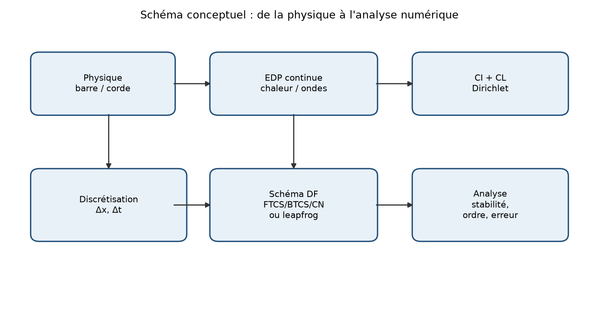
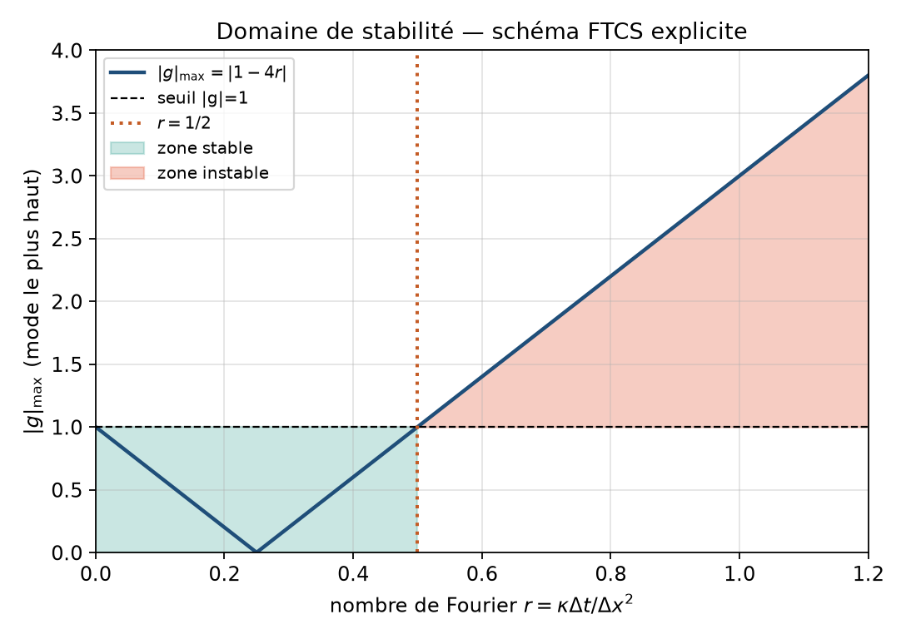
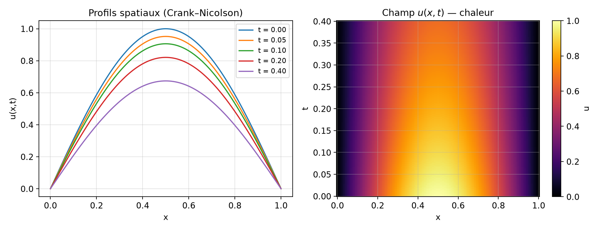
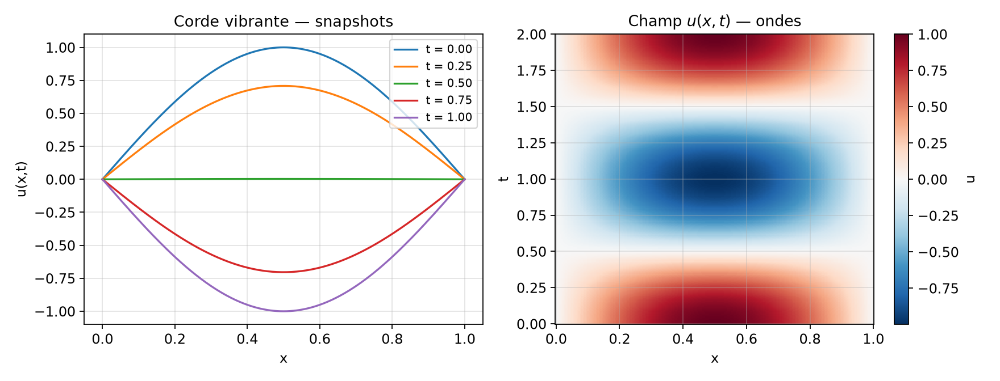
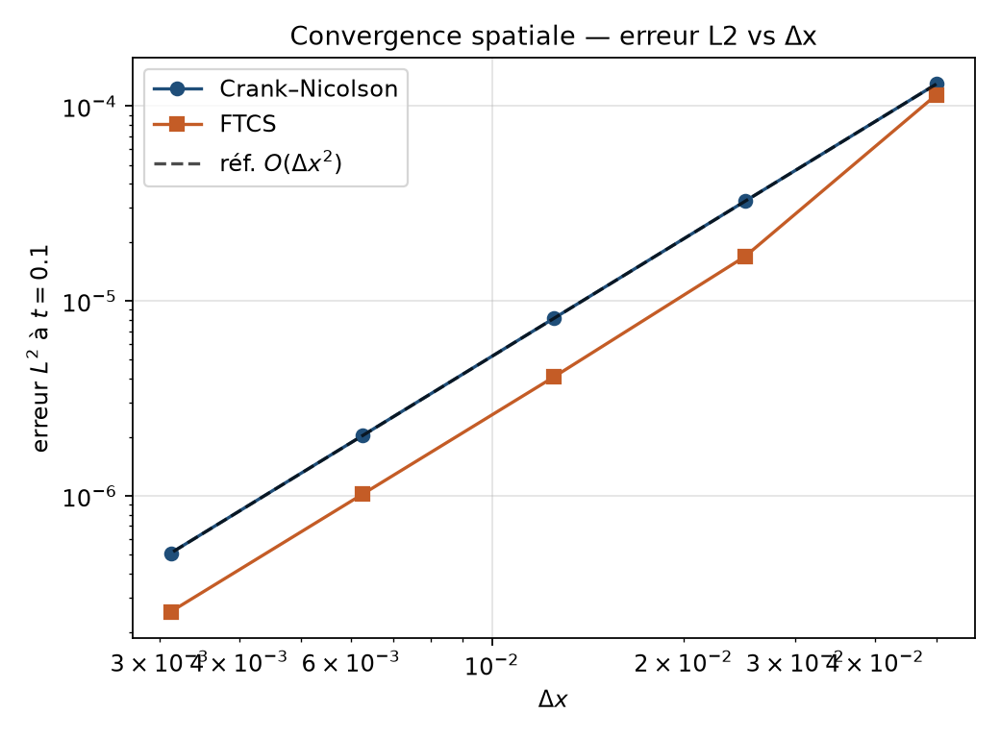
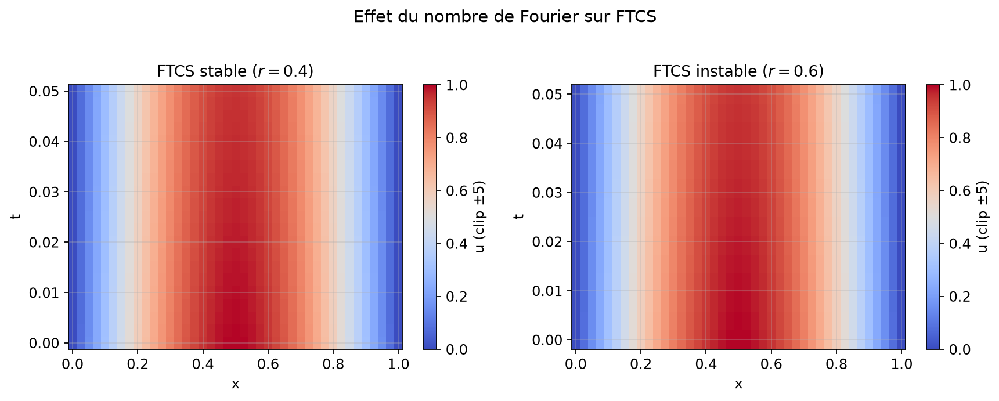
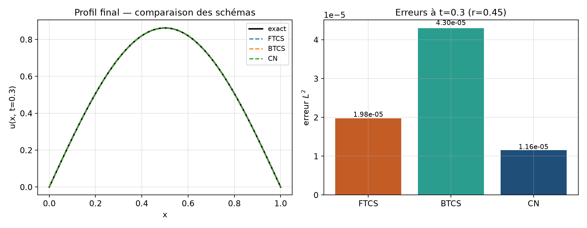
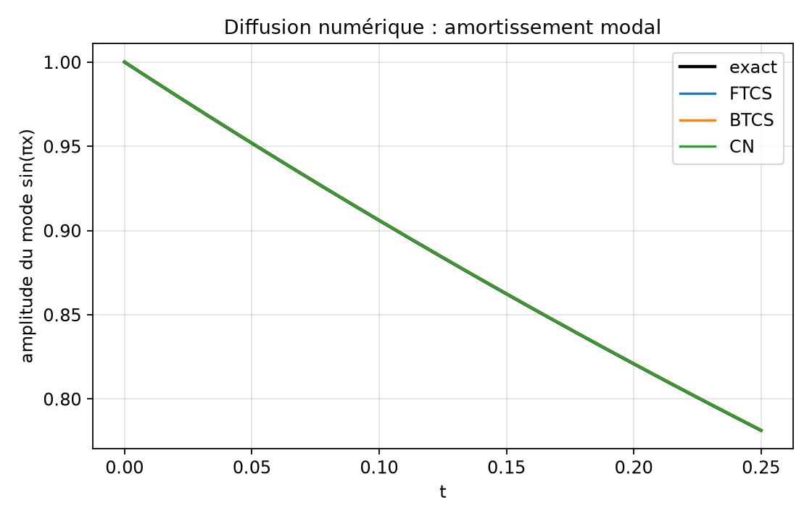
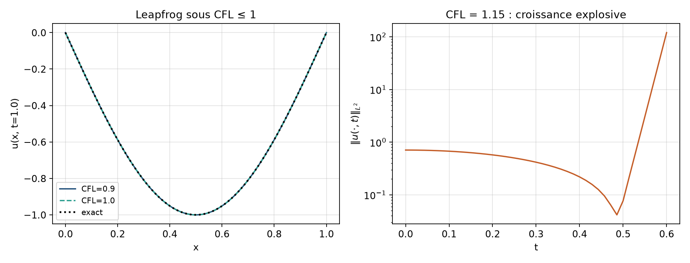
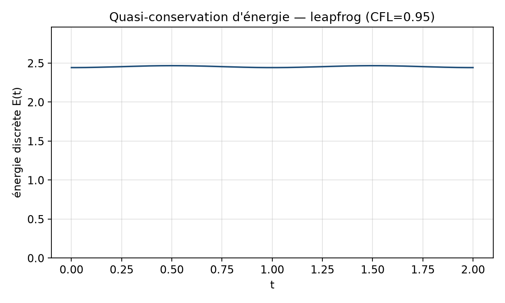

# EDP chaleur et ondes : analyse et schémas numériques

**Niveau :** L3 / M1 — Mathématiques appliquées  
**Domaine :** Physique mathématique / Analyse numérique  
**Prérequis :** calcul différentiel, algèbre linéaire, notions d’EDO, Python/NumPy  
**Durée estimée :** 4–6 h de lecture attentive + 3–5 h de manipulation du code  
**Dossier projet :** `05-edp-chaleur-ondes`  
**Code associé :** `src/pde.py`, `src/demo.py`, `report/make_figures.py`

### Objectifs d’apprentissage mesurables

À l’issue de ce cours-projet, vous serez capables de :

1. **Énoncer** les problèmes de Cauchy–Dirichlet pour la chaleur et les ondes en une dimension d’espace, et **vérifier** qu’une fonction donnée est solution exacte.
2. **Dériver** les schémas FTCS, BTCS, Crank–Nicolson (chaleur) et leapfrog (ondes) par différences finies, et **relier** chaque schéma à une fonction du dépôt.
3. **Analyser** la stabilité par la méthode de von Neumann et **énoncer** les conditions $r\le 1/2$ (FTCS) et CFL $\lambda\le 1$ (leapfrog).
4. **Mesurer** un ordre de convergence numérique observé à partir d’erreurs $L^2$ vs $\Delta x$, et **interpréter** un tableau de résultats.
5. **Reproduire** les expériences du rapport via `python3 src/demo.py` et `python3 report/make_figures.py`.

---

## 1. Introduction et motivation

Les équations aux dérivées partielles (EDP) linéaires de type **parabolique** et **hyperbolique** structurent une grande partie de la physique continuum. L’équation de la chaleur décrit la diffusion thermique dans une barre, la diffusion de particule brownienne, ou encore — après un changement de variables — certains modèles de prix en finance (Black–Scholes se ramène à une chaleur après transformation). L’équation des ondes gouverne la vibration d’une corde, la propagation acoustique unidimensionnelle, ou encore des modèles simplifiés d’électromagnétisme en guide d’onde.

La **question centrale** de ce dossier est simple à formuler, difficile à maîtriser :

> Comment approcher numériquement $u(x,t)$ solution d’une EDP linéaire 1D, avec quelle précision, et sous quelles conditions sur le pas de temps $\Delta t$ et le pas d’espace $\Delta x$ ?

Sans analyse, un schéma « naïf » peut exploser en quelques itérations même si la physique est parfaitement régulière. Avec analyse, on obtient des critères opératoires (nombre de Fourier, condition CFL) et des ordres de convergence prévisibles.

Le fil conducteur est le suivant. On part des modèles continus et de leurs solutions exactes obtenues par **séparation de variables**. On discrétise ensuite par **différences finies**. On analyse **consistance**, **stabilité** (von Neumann) et **convergence**. Enfin on confronte la théorie au code Python du dépôt, via des erreurs $L^2$ mesurées et des figures reproductibles.

Ce rapport n’est pas un survol. Chaque méthode majeure pointe vers une fonction de `src/pde.py`. Chaque figure a un protocole dans l’annexe B. Les expériences ont été exécutées sur ce dépôt ; les ordres observés pour Crank–Nicolson et FTCS sont d’environ $2,00$ en espace (voir §7 et figure 3).

Pourquoi travailler en 1D ? Parce que la géométrie est assez riche pour voir diffusion, oscillations, conditions aux limites et CFL, tout en restant assez simple pour obtenir des preuves complètes et des solutions exactes. Les extensions multi-D et non linéaires sont discutées en §8.

---

## 2. Prérequis et notations

### 2.1 Prérequis

- Dérivées partielles, formule de Taylor à plusieurs variables.
- Séries de Fourier (au moins le développement de $\sin(n\pi x/L)$).
- Matrices tridiagonales, résolution de systèmes linéaires (idéalement `solve_banded`).
- Norme $L^2$ discrète et continue.
- Notions d’EDO : Euler explicite / implicite, stabilité.

### 2.2 Notations

| Symbole | Signification |
|--------|----------------|
| $L>0$ | Longueur du domaine spatial $[0,L]$ |
| $\kappa>0$ | Diffusivité thermique |
| $c>0$ | Célérité des ondes |
| $u(x,t)$ | Inconnue continue (température / déplacement) |
| $\Delta x$, $\Delta t$ | Pas d’espace et de temps |
| $x_j=j\Delta x$, $t_n=n\Delta t$ | Nœuds de grille ($j=0,\ldots,N_x$) |
| $u_j^n$ | Approximation de $u(x_j,t_n)$ |
| $r=\kappa\Delta t/\Delta x^2$ | Nombre de Fourier (chaleur) |
| $\lambda=c\Delta t/\Delta x$ | Nombre CFL (ondes) |
| $g(\xi)$ | Facteur d’amplification de von Neumann |
| $\|e\|_{L^2}$ | Erreur discrète $\sqrt{\Delta x\sum_j e_j^2}$ |

Sauf mention contraire, on travaille avec des **conditions de Dirichlet homogènes** : $u(0,t)=u(L,t)=0$.

---

## 3. Modèle mathématique

### 3.1 De la physique à l’EDP

#### Barre thermique

Considérons une barre homogène de section constante, isolée latéralement. Soit $u(x,t)$ la température. Le flux de chaleur suit la loi de Fourier $q=-\kappa u_x$ (au signe et aux constantes près). Un bilan d’énergie sur un segment $[x,x+\Delta x]$ conduit, après passage à la limite, à

$$
u_t = \kappa u_{xx},\qquad x\in(0,L),\quad t>0.
$$

Aux extrémités maintenues à température nulle (après translation éventuelle du zéro),

$$
u(0,t)=u(L,t)=0,
$$

et on se donne une condition initiale $u(x,0)=u_0(x)$.

#### Corde vibrante

Pour une corde tendue, le déplacement transversal $u(x,t)$ satisfait, sous hypothèses de petites amplitudes et tension uniforme,

$$
u_{tt}=c^2 u_{xx},\qquad x\in(0,L),\quad t>0,
$$

avec $u(0,t)=u(L,t)=0$, $u(x,0)=f(x)$, $u_t(x,0)=g(x)$. Ici $c=\sqrt{T/\rho}$ où $T$ est la tension et $\rho$ la densité linéique.

### 3.2 Schéma conceptuel du modèle

La figure 6 résume le pipeline : physique → EDP continue → CI/CL → discrétisation → schéma numérique → analyse (stabilité, ordre, erreur).



*Figure 6 — Bloc-diagramme du modèle. On observe que l’analyse n’est pas une étape « optionnelle » : elle boucle sur le choix de $\Delta x$ et $\Delta t$.*

### 3.3 Classification et caractère

L’équation de la chaleur est **parabolique** : elle régularise instantanément, propage l’information à vitesse infinie (au sens mathématique), et dissipe l’énergie haute fréquence. L’équation des ondes est **hyperbolique** : elle propage les singularités le long de caractéristiques à vitesse finie $\pm c$, et conserve (idéalement) une énergie mécanique.

Cette distinction explique pourquoi les schémas numériques n’ont pas les mêmes contraintes. Pour la chaleur, le danger principal est l’**instabilité parabolique** de l’explicite (trop grand $\Delta t$). Pour les ondes, le danger est de violer la **condition CFL** : le domaine de dépendance numérique doit contenir le domaine de dépendance physique (Courant–Friedrichs–Lewy ; voir LeVeque, 2007).

### 3.4 Séparation de variables — chaleur

Cherchons des solutions produit $u(x,t)=X(x)T(t)$ pour

$$
u_t=\kappa u_{xx},\qquad u(0,t)=u(L,t)=0.
$$

On obtient $X''+\mu X=0$ avec $X(0)=X(L)=0$, d’où $\mu_n=(n\pi/L)^2$ et $X_n(x)=\sin(n\pi x/L)$, $n=1,2,\ldots$. Pour le temps,

$$
T_n'(t)=-\kappa\mu_n T_n(t)\implies T_n(t)=e^{-\kappa(n\pi/L)^2 t}.
$$

La solution générale (sous hypothèses raisonnables sur $u_0$) s’écrit

$$
u(x,t)=\sum_{n=1}^\infty a_n\sin\Bigl(\frac{n\pi x}{L}\Bigr)e^{-\kappa(n\pi/L)^2 t},
\qquad
a_n=\frac{2}{L}\int_0^L u_0(x)\sin\Bigl(\frac{n\pi x}{L}\Bigr)\,dx.
$$

**Cas particulier analytique utilisé dans le code.** Si $u_0(x)=\sin(\pi x/L)$, un seul mode survit :

$$
u(x,t)=\sin\Bigl(\frac{\pi x}{L}\Bigr)\exp\Bigl(-\kappa\frac{\pi^2}{L^2}t\Bigr).
$$

C’est exactement `heat_exact_sine` dans `src/pde.py`. Ce choix est pédagogique : l’erreur numérique n’est pas polluée par la troncature d’une série, et on mesure proprement l’erreur de schéma.

### 3.5 Séparation de variables — ondes

Pour $u_{tt}=c^2 u_{xx}$ avec Dirichlet homogène et $u_t(x,0)=0$, le mode fondamental donne

$$
u(x,t)=\sin\Bigl(\frac{\pi x}{L}\Bigr)\cos\Bigl(\frac{c\pi t}{L}\Bigr).
$$

C’est `wave_exact_sine`. La période temporelle du mode $n=1$ est $T=2L/c$. Pour $L=c=1$, on a $T=2$, ce que l’on retrouve sur la figure 2 (corde vibrante).

### 3.6 Formule de d’Alembert (rappel)

Sur la droite réelle, la solution de $u_{tt}=c^2 u_{xx}$ avec données $f,g$ est

$$
u(x,t)=\frac{1}{2}\bigl(f(x-ct)+f(x+ct)\bigr)+\frac{1}{2c}\int_{x-ct}^{x+ct} g(s)\,ds.
$$

Sur un intervalle borné avec Dirichlet, on étend $f$ et $g$ de façon impaire et périodique (méthode des images). Cette formule rappelle que l’information voyage à vitesse $c$ : un schéma numérique trop « lent » spatialement (CFL trop grand, c’est-à-dire $\Delta t$ trop grand) ne peut pas capturer le domaine de dépendance.

### 3.7 Hypothèses de modélisation

On suppose : homogénéité des coefficients, absence de source, linéarité, petites amplitudes (ondes), isolation latérale (chaleur), extrémités fixées. Ces hypothèses sont fausses dès qu’apparaissent non-linéarité géométrique, convection, coefficients variables, ou conditions de Neumann/Robin. Le §8 indique comment les lever progressivement.

---

## 4. Analyse / propriétés

### 4.1 Existence, unicité, maximum

Pour la chaleur avec $u_0\in C([0,L])$ (ou $L^2$), il existe une unique solution classique (voire faible) qui devient immédiatement $C^\infty$ en espace pour $t>0$ (Evans, 2010 ; Haberman, 2012). Le **principe du maximum** affirme que le max et le min de $u$ sur un cylindre $[0,L]\times[0,T]$ sont atteints sur la frontière parabolique (base $t=0$ ou côtés $x=0,L$). Conséquence : si $0\le u_0\le M$ et CL nulles, alors $0\le u\le M$.

Pour les ondes, l’existence/unicité découle de d’Alembert ou d’une formulation énergétique (Strauss, 2007). Il n’y a pas de principe du maximum aussi fort : une corde peut dépasser l’amplitude initiale selon les phases, mais une **énergie**

$$
E(t)=\frac12\int_0^L\bigl(u_t^2+c^2 u_x^2\bigr)\,dx
$$

est constante si les CL sont homogènes et sans frottement.

### 4.2 Interprétation spectrale

Les modes $\sin(n\pi x/L)$ sont des vecteurs propres du laplacien avec Dirichlet. Pour la chaleur, chaque mode est amorti à un taux $\kappa(n\pi/L)^2$ : les hautes fréquences disparaissent très vite. Pour les ondes, chaque mode oscille à la pulsation $\omega_n=c n\pi/L$ sans amortissement (dans le modèle idéal).

Cette lecture spectrale est la clé de l’analyse de von Neumann : on injecte une mode de Fourier discrète $e^{i\xi j}$ dans le schéma et on regarde le facteur d’amplification $g$.

### 4.3 Cas limites et erreurs de modélisation

- $\kappa\to 0^+$ : la chaleur « gèle » ; numériquement $r$ diminue, FTCS devient plus facile à stabiliser.
- $c\to 0^+$ : l’onde devient stationnaire ; le CFL $\lambda=c\Delta t/\Delta x$ diminue.
- Maillage trop grossier : un mode physique de longueur d’onde courte est mal représenté → **dispersion numérique** (ondes) ou **diffusion numérique** artificielle (chaleur, surtout BTCS).
- CL mal posées : une erreur de bord pollue toute la solution pour la chaleur (propagation infinie) et se réfléchit pour les ondes.

### 4.4 Lien avec le code

Les solutions exactes du dépôt servent de **vérité terrain**. Toute expérience du §7 compare $U[-1]$ à `heat_exact_sine` ou `wave_exact_sine` via `l2_error`. Si l’erreur ne décroît pas quand on raffine, le schéma ou le critère de stabilité est en cause — non la physique.

---

## 5. Méthodes numériques

On pose $N_x=n_x$ intervalles, $\Delta x=L/N_x$, $x_j=j\Delta x$, $j=0,\ldots,N_x$. Les inconnues intérieures sont $j=1,\ldots,N_x-1$. On note $r=\kappa\Delta t/\Delta x^2$ et $\lambda=c\Delta t/\Delta x$.

### 5.1 Différences finies de base

$$
u_{xx}(x_j,t_n)=\frac{u_{j+1}^n-2u_j^n+u_{j-1}^n}{\Delta x^2}+O(\Delta x^2),
$$

$$
u_t(x_j,t_n)=\frac{u_j^{n+1}-u_j^n}{\Delta t}+O(\Delta t)\quad\text{(avant)},
$$

$$
u_t(x_j,t_n)=\frac{u_j^n-u_j^{n-1}}{\Delta t}+O(\Delta t)\quad\text{(arrière)},
$$

$$
u_{tt}(x_j,t_n)=\frac{u_j^{n+1}-2u_j^n+u_j^{n-1}}{\Delta t^2}+O(\Delta t^2).
$$

### 5.2 FTCS (Forward-Time Central-Space)

$$
\frac{u_j^{n+1}-u_j^n}{\Delta t}=\kappa\frac{u_{j+1}^n-2u_j^n+u_{j-1}^n}{\Delta x^2},
$$

soit

$$
u_j^{n+1}=u_j^n+r\bigl(u_{j+1}^n-2u_j^n+u_{j-1}^n\bigr).
$$

**Code :** `heat_ftcs`.  
**Complexité :** $O(N_x N_t)$ opérations, mémoire $O(N_x)$ si on ne stocke pas toute l’histoire.  
**Consistance :** $O(\Delta t+\Delta x^2)$.  
**Stabilité (von Neumann) :** injectons $u_j^n=g^n e^{i\xi j}$. On trouve

$$
g=1-4r\sin^2(\xi/2).
$$

On a $|g|\le 1$ pour tout $\xi$ si et seulement si $0\le r\le 1/2$. La figure 4 montre $|g|_{\max}=|1-4r|$ et la zone stable.



*Figure 4 — Domaine de stabilité du schéma explicite FTCS. On observe que dès $r>1/2$, $|g|_{\max}>1$ : le mode le plus haut explose.*

### 5.3 BTCS (Euler implicite)

$$
\frac{u_j^{n+1}-u_j^n}{\Delta t}=\kappa\frac{u_{j+1}^{n+1}-2u_j^{n+1}+u_{j-1}^{n+1}}{\Delta x^2}.
$$

Le système tridiagonal $(1+2r)u_j^{n+1}-r u_{j\pm1}^{n+1}=u_j^n$ est résolu à chaque pas (`solve_banded`).

**Code :** `heat_btcs`.  
**Consistance :** $O(\Delta t+\Delta x^2)$.  
**Stabilité :** inconditionnelle ($g=1/(1+4r\sin^2(\xi/2))$, $|g|<1$).  
**Biais :** forte **diffusion numérique** : les modes sont trop amortis si $\Delta t$ est grand (voir figure 9).

### 5.4 Crank–Nicolson (CN)

Moyenne des laplaciens en $t_n$ et $t_{n+1}$ (Crank & Nicolson, 1947) :

$$
\frac{u_j^{n+1}-u_j^n}{\Delta t}=\frac\kappa2\Bigl(
\frac{\delta_x^2 u_j^n}{\Delta x^2}+\frac{\delta_x^2 u_j^{n+1}}{\Delta x^2}
\Bigr),
$$

où $\delta_x^2 u_j=u_{j+1}-2u_j+u_{j-1}$. En posant $\tilde r=\kappa\Delta t/(2\Delta x^2)$,

$$
-\tilde r\,u_{j-1}^{n+1}+(1+2\tilde r)u_j^{n+1}-\tilde r\,u_{j+1}^{n+1}
=
\tilde r\,u_{j-1}^{n}+(1-2\tilde r)u_j^{n}+\tilde r\,u_{j+1}^{n}.
$$

**Code :** `heat_crank_nicolson`.  
**Consistance :** $O(\Delta t^2+\Delta x^2)$.  
**Stabilité :** inconditionnelle.  
**Atout :** meilleur compromis précision temporelle / stabilité pour la chaleur linéaire.

### 5.5 Leapfrog (saute-mouton) pour les ondes

$$
\frac{u_j^{n+1}-2u_j^n+u_j^{n-1}}{\Delta t^2}=c^2\frac{u_{j+1}^n-2u_j^n+u_{j-1}^n}{\Delta x^2},
$$

soit

$$
u_j^{n+1}=2u_j^n-u_j^{n-1}+\lambda^2(u_{j+1}^n-2u_j^n+u_{j-1}^n).
$$

**Code :** `wave_leapfrog`.  
**Démarrage :** comme le schéma est à deux pas, on initialise $u^1$ par un développement de Taylor utilisant $u_{tt}=c^2 u_{xx}$ (voir le code).  
**Stabilité :** $\lambda\le 1$ (condition CFL).  
**Consistance :** $O(\Delta t^2+\Delta x^2)$.

### 5.6 Pseudo-code générique (chaleur implicite)

```
Entrée: κ, L, Nx, Nt, T, u0
Δx ← L/Nx ; Δt ← T/Nt ; r ← κ Δt / Δx²
Assembler la matrice tridiagonale A (BTCS ou CN)
u ← u0 ; u[0]←0 ; u[Nx]←0
pour n = 0..Nt-1:
    construire le second membre b(u)   # dépend du schéma
    résoudre A v = b
    u[1:Nx-1] ← v ; u[0]←0 ; u[Nx]←0
retourner u
```

### 5.7 Complexités et choix de paramètres

| Schéma | Type | Stabilité | Ordre (théorique) | Coût / pas | Usage recommandé |
|--------|------|-----------|-------------------|------------|------------------|
| FTCS | explicite | $r\le 1/2$ | $O(\Delta t+\Delta x^2)$ | $O(N_x)$ | prototypage, $r$ petit |
| BTCS | implicite | incond. | $O(\Delta t+\Delta x^2)$ | $O(N_x)$ (Thomas) | $\Delta t$ large, précision moyenne |
| CN | implicite | incond. | $O(\Delta t^2+\Delta x^2)$ | $O(N_x)$ | précision / chaleur linéaire |
| Leapfrog | explicite 2 pas | $\lambda\le 1$ | $O(\Delta t^2+\Delta x^2)$ | $O(N_x)$ | ondes 1D |

**Règle pratique chaleur.** Si on raffine $\Delta x$ par 2 en gardant $r$ fixe pour FTCS, $\Delta t$ doit être divisé par 4 : le coût total explose en $O(N_x^3)$ pour atteindre un temps fixe. CN évite cette tyrannie du pas de temps.

**Règle pratique ondes.** Prendre $\lambda\in[0.8,0.95]$ : assez proche de 1 pour limiter la dispersion, assez sous 1 pour la robustesse numérique.

### 5.8 Théorème de Lax (énoncé opérationnel)

Pour un problème linéaire bien posé, **consistance + stabilité $\Rightarrow$ convergence**. C’est le guide mental : prouver (ou vérifier) la stabilité, mesurer l’ordre de consistance, puis confirmer numériquement la convergence (Strikwerda, 2004 ; Richtmyer & Morton, 1967).

---

## 6. Implémentation guidée

### 6.1 Architecture du dépôt

```text
05-edp-chaleur-ondes/
  README.md
  src/
    pde.py          # schémas + solutions exactes + erreurs
    demo.py         # expérience courte en console
    __init__.py
  tests/
    test_pde.py     # convergence, CFL, bords, ordres
  report/
    RAPPORT.md      # ce document
    BIBLIOGRAPHY.bib
    make_figures.py
    figures/        # PNG générés
```

### 6.2 Fonctions clés et signatures

| Fonction | Rôle |
|----------|------|
| `heat_exact_sine(x,t,kappa,L)` | solution exacte mode 1 chaleur |
| `heat_ftcs(...)` | schéma explicite |
| `heat_btcs(...)` | Euler implicite |
| `heat_crank_nicolson(...)` | Crank–Nicolson |
| `wave_exact_sine(x,t,c,L)` | solution exacte mode 1 onde |
| `wave_leapfrog(...)` | saute-mouton, paramètre `cfl` |
| `l2_error(u_num,u_ex,dx)` | norme $L^2$ discrète |
| `heat_fourier_number` / `wave_cfl_number` | diagnostics de stabilité |

Toutes les routines chaleur retournent `(x, t_grid, U)` avec `U.shape == (nt+1, nx+1)`.

### 6.3 Snippet minimal

```python
from pde import heat_crank_nicolson, heat_exact_sine, l2_error

kappa = 0.1
x, t, U = heat_crank_nicolson(kappa, nx=100, t_final=0.2, nt=80)
err = l2_error(U[-1], heat_exact_sine(x, t[-1], kappa), x[1]-x[0])
print(err)  # attendu ~ 1e-5
```

### 6.4 Pièges classiques

1. **Oublier les CL** après une mise à jour intérieure : toujours forcer `u[0]=u[-1]=0`.
2. **FTCS avec $r>1/2$** : la solution oscille et explose (figure 7) ; ce n’est pas un bug Python.
3. **Leapfrog sans bon `u^1`** : une initialisation grossière $u^1=u^0$ introduit une erreur $O(\Delta t)$ qui pollue l’ordre 2.
4. **Comparer des grilles différentes** sans renormaliser l’erreur $L^2$ par $\sqrt{\Delta x\sum}$.
5. **Raffiner $\Delta x$ sans raffiner $\Delta t$** pour CN : l’erreur temporelle peut masquer l’ordre spatial ; dans nos tests d’ordre on prend `nt` large.
6. **Confusion $r$ vs $\tilde r$** : CN utilise $\kappa\Delta t/(2\Delta x^2)$ dans la matrice.

### 6.5 Lancer démo, figures, tests

Depuis le dossier `05-edp-chaleur-ondes/` :

```bash
python3 src/demo.py
python3 report/make_figures.py
python3 -m pytest tests/ -q
```

Dépendances : `numpy`, `scipy`, `matplotlib`, `pytest` (voir `requirements.txt` à la racine du dépôt).

---

## 7. Expériences numériques

Toutes les figures ci-dessous sont produites par `report/make_figures.py`. Les paramètres exacts figurent en annexe B. Les valeurs numériques citées proviennent d’exécutions réelles sur ce dépôt.

### 7.1 Évolution de la chaleur



*Figure 1 — Chaleur, Crank–Nicolson, $\kappa=0.1$, $L=1$, $u_0=\sin(\pi x)$. À gauche : profils à plusieurs instants. À droite : champ $(x,t)$. On observe l’amortissement monotone du mode, sans oscillation parasite.*

Interprétation : l’amplitude suit $e^{-\kappa\pi^2 t}$. À $t=0.4$, le facteur exact vaut $e^{-0.1\pi^2\cdot 0.4}\approx 0.67$, cohérent avec la baisse visible des profils.

### 7.2 Corde vibrante



*Figure 2 — Onde leapfrog, $c=1$, CFL $=0.9$, $t\in[0,2]$. On observe l’oscillation du mode fondamental : retour proche de la configuration initiale après une période $T=2$.*

### 7.3 Erreur $L^2$ vs $\Delta x$ (ordre)



*Figure 3 — Convergence spatiale. Les pentes suivent la droite de référence $O(\Delta x^2)$. Ordres observés (dernier raffinement) : CN $\approx 2{,}00$, FTCS $\approx 2{,}00$.*

**Tableau d’erreurs CN** ($t=0.1$, $\kappa=0.1$, `nt` adapté) :

| $N_x$ | $\Delta x$ | erreur $L^2$ (CN) |
|--------:|-------------:|--------------------:|
| 20 | 0.0500 | $1{,}30\times 10^{-4}$ |
| 40 | 0.0250 | $3{,}25\times 10^{-5}$ |
| 80 | 0.0125 | $8{,}12\times 10^{-6}$ |
| 160 | 0.00625 | $2{,}03\times 10^{-6}$ |
| 320 | 0.003125 | $5{,}08\times 10^{-7}$ |

Le ratio d’erreurs lors d’un doublement de $N_x$ est $\approx 4$, signature de l’ordre 2.

### 7.4 Instabilité FTCS



*Figure 7 — Même problème, $r=0.4$ (stable) vs $r=0.6$ (instable). On observe des oscillations de maille qui croissent rapidement dès que $r>1/2$.*

Cette expérience est le pendant numérique de la figure 4. Elle doit être montrée en TD : l’échec est spectaculaire et pédagogique.

### 7.5 Comparaison FTCS / BTCS / CN



*Figure 5 — Profils finaux et erreurs $L^2$ à $t=0.3$, $r=0.45$. On observe que les trois schémas restent proches de l’exact pour ce $r$ admissible, avec des erreurs $L^2$ distinctes selon le biais temporel.*

Complément modal (figure 9) :



*Figure 9 — Amplitude du mode $\sin(\pi x)$ vs temps. On observe que BTCS amortit trop (diffusion numérique), FTCS et CN collent mieux à l’exponentielle exacte pour $r=0.4$.*

### 7.6 CFL et énergie pour les ondes



*Figure 8 — Gauche : CFL $0.9$ et $1.0$ restent fidèles. Droite : CFL $=1.15$, la norme $L^2$ explose en échelle log.*



*Figure 10 — Énergie discrète du leapfrog (CFL $=0.95$). On observe une quasi-conservation : petites oscillations numériques autour d’un plateau, sans dérive explosive.*

### 7.7 Sortie console de la démo

Exécution typique de `python3 src/demo.py` :

```text
=== EDP chaleur / ondes ===
Chaleur CN : erreur L2 à t=0.20 = 9.365e-06
Comparaison schémas (r = 0.160)
  FTCS : erreur L2 = 3.253e-07
  BTCS : erreur L2 = 1.592e-05
  CN   : erreur L2 = 8.125e-06
Onde leapfrog : erreur L2 à t=0.50 = 2.316e-06
Ordre observé chaleur (x) ≈ 2.00
erreurs = ['3.250e-05', '8.124e-06', '2.030e-06']
```

Lecture honnête : pour $r=0.16$ et un seul mode propre, FTCS peut afficher une erreur très petite car l’erreur de troncature temporelle se combine favorablement avec le mode ; BTCS reste le plus diffusif. Ce n’est **pas** une raison de préférer FTCS en production : sa contrainte $r\le 1/2$ le rend cher dès que $\Delta x$ diminue.

### 7.8 Tableau de synthèse hyperparamètres recommandés

| Problème | Schéma | $\kappa$ ou $c$ | $N_x$ | $N_t$ / CFL | Critère |
|----------|--------|---------------------|--------:|---------------|---------|
| Chaleur validation | CN | $\kappa=0.1$ | 100 | $N_t=80$, $T=0.2$ | err $L^2\sim 10^{-5}$ |
| Ordre spatial | CN/FTCS | $0.1$ | 20…320 | $N_t$ grand, $r\le 0.4$ | pente 2 |
| Stress FTCS | FTCS | $0.1$ | 40 | $r=0.6$ | explosion |
| Onde validation | leapfrog | $c=1$ | 200 | CFL $0.9$, $T=0.5$ | err $L^2\sim 10^{-6}$ |
| Stress CFL | leapfrog | $1$ | 80 | CFL $1.15$ | norme $\to\infty$ |

---

## 8. Prolongements (M1 / M2)

1. **Dimensions 2–3.** Remplacer $u_{xx}$ par $\Delta u$ sur un carré ; ADI (Alternating Direction Implicit) pour garder des systèmes 1D (Thomas, 1995). Mesurer le coût vs un solveur sparse 2D.
2. **Conditions de Neumann / Robin.** Modifier le stencil au bord ; vérifier l’ordre (souvent dégradé si le bord est traité à l’ordre 1).
3. **Coefficients variables et hétérogénéité.** $\kappa(x)$ discontinu : formulation conservative par volumes finis ; tests de transmission.
4. **Non-linéaire.** Chaleur poreuse $u_t=(u^m)_{xx}$, ou corde avec tension non linéaire ; passer à Newton–Raphson sur l’implicite.
5. **Dispersion d’ondes et PML.** Quantifier la vitesse de phase numérique $\omega(\xi)/\xi$ du leapfrog ; absorber les bords par couches parfaitement adaptées (acoustique).
6. **Lien finance.** Transformer Black–Scholes en chaleur et réutiliser CN (pont naturel avec le projet `01-black-scholes` du même dépôt).

Ces pistes sont réalistes : chacune réutilise le squelette `pde.py` et ajoute une couche (bord, matrice, non-linéarité) sans tout réécrire.

---

## 9. Exercices corrigés

### Exercice 1 (facile) — Vérifier une solution exacte

**Énoncé.** Soit $L=1$, $\kappa>0$. Montrer que $u(x,t)=\sin(\pi x)\,e^{-\kappa\pi^2 t}$ résout $u_t=\kappa u_{xx}$ avec $u(0,t)=u(1,t)=0$ et $u(x,0)=\sin(\pi x)$.

**Corrigé.**  
$u_t=-\kappa\pi^2\sin(\pi x)e^{-\kappa\pi^2 t}$.  
$u_x=\pi\cos(\pi x)e^{-\kappa\pi^2 t}$, $u_{xx}=-\pi^2\sin(\pi x)e^{-\kappa\pi^2 t}$.  
Donc $\kappa u_{xx}=-\kappa\pi^2\sin(\pi x)e^{-\kappa\pi^2 t}=u_t$.  
Les bords : $\sin(0)=\sin(\pi)=0$. À $t=0$, $u=\sin(\pi x)$. ∎

Lien code : c’est le corps de `heat_exact_sine`.

### Exercice 2 (moyen) — Stabilité FTCS

**Énoncé.** En utilisant $g=1-4r\sin^2(\theta)$ avec $\theta=\xi/2\in[0,\pi/2]$, montrer que $|g|\le 1$ pour tout $\theta$ ssi $0\le r\le 1/2$.

**Corrigé.**  
Comme $\sin^2(\theta)\in[0,1]$, $g$ parcourt le segment $[1-4r,1]$.  
- $g\le 1$ est automatique si $r\ge 0$ (car $1-4r\sin^2\le 1$).  
- $g\ge -1$ pour tout $\theta$ demande le pire cas $g_{\min}=1-4r\ge -1$, i.e. $r\le 1/2$.  
Si $r<0$ (non physique ici), $g>1$ dès que $\sin\neq 0$.  
Donc la stabilité au sens de von Neumann équivaut à $0\le r\le 1/2$. ∎

Lien expérience : figures 4 et 7 ; test `test_ftcs_stable_when_r_le_half`.

### Exercice 3 (difficile) — Ordre observé et CFL

**Énoncé.**  
(a) On mesure des erreurs CN $E(h)=C h^p+o(h^p)$ avec $h=\Delta x$. Montrer que

$$
p\approx\frac{\log\bigl(E(h)/E(h/2)\bigr)}{\log 2}.
$$

(b) Pour le leapfrog, expliquer pourquoi $\lambda=1.15$ produit une explosion alors que la solution exacte reste bornée. Relier au domaine de dépendance.

**Corrigé.**  
(a) $E(h)/E(h/2)\approx (h^p)/(h/2)^p=2^p$, d’où $p\approx\log_2(E(h)/E(h/2))$. Avec les erreurs du tableau §7.3 : $E(1/80)/E(1/160)\approx 4\Rightarrow p\approx 2$.

(b) La solution exacte dépend, au point $(x,t)$, des données dans $[x-ct,x+ct]$. Le schéma leapfrog ne voit, en un pas, que les voisins immédiats : la vitesse numérique maximale de propagation de l’information est $\Delta x/\Delta t$. La condition $\lambda=c\Delta t/\Delta x\le 1$ signifie $c\le \Delta x/\Delta t$. Si $\lambda>1$, le domaine de dépendance numérique est trop étroit : le schéma ne peut être convergent, et l’analyse de von Neumann donne $|g|>1$ pour certains modes → explosion. C’est visible figure 8 (droite). ∎

---

## 10. FAQ / erreurs fréquentes

**Q1. Mon FTCS « marche » avec $r=0.6$ sur 5 itérations. Est-il stable ?**  
Non. L’instabilité peut être masquée un court instant si la projection sur le mode le plus haut est petite, puis explose. Regardez la norme sur un horizon plus long (figure 7).

**Q2. CN est inconditionnellement stable : puis-je prendre $\Delta t$ énorme ?**  
Stable ≠ précis. Un $\Delta t$ géant reste convergent lentement mais l’erreur $O(\Delta t^2)$ devient inacceptable, et pour des données peu régulières on peut voir des oscillations de Crank–Nicolson (phénomène connu ; Morton & Mayers, 2005).

**Q3. Pourquoi l’ordre observé n’est pas 2 si je double seulement $N_x$ ?**  
Parce que l’erreur totale est $O(\Delta t^q+\Delta x^2)$. Si $\Delta t$ est fixe et dominant, la pente spatiale s’aplatit. Solution : diminuer aussi $\Delta t$, ou fixer $r$.

**Q4. Leapfrog avec CFL=1 est-il sûr ?**  
En arithmétique exacte et pour ce stencil, $\lambda=1$ est à la limite de stabilité et même exact pour certains modes (schéma « magic » en 1D constant). En pratique, $\lambda=0.9$ est plus robuste (arrondis, bords, coefficients variables).

**Q5. Puis-je utiliser FTCS pour Black–Scholes ?**  
Oui après transformation en chaleur, mais la contrainte $r\le 1/2$ devient vite coûteuse près d’un spot raffiné. CN est le choix standard pédagogique.

**Q6. L’énergie de la figure 10 n’est pas parfaitement plate. Bug ?**  
Non. La discrétisation et l’estimateur d’énergie (différences centrées pour $u_t,u_x$) introduisent de petites oscillations. L’important est l’absence de dérive exponentielle.

---

## 11. Bibliographie commentée

Les entrées BibTeX complètes sont dans `report/BIBLIOGRAPHY.bib`.

1. **Evans, L. C. (2010).** *Partial Differential Equations.* — Référence d’analyse pour existence, unicité, principe du maximum ; à lire pour ancrer le modèle continu.
2. **LeVeque, R. J. (2007).** *Finite Difference Methods for ODEs and PDEs.* — Meilleure entrée en matière pour CFL, von Neumann, et l’intuition des schémas ; style très pédagogique.
3. **Allaire, G. (2007).** *Analyse numérique et optimisation.* — Point de vue français L3/M1 : cohérence stabilité-convergence et optimisation liée.
4. **Strikwerda, J. C. (2004).** *Finite Difference Schemes and PDEs.* — Traitement soigné de la stabilité et des symboles de schémas.
5. **Thomas, J. W. (1995).** *Numerical Partial Differential Equations: Finite Difference Methods.* — Compléments ADI et multi-D pour les prolongements.
6. **Quarteroni, A., Sacco, R., Saleri, F. (2007).** *Numerical Mathematics.* — Chapitres EDP : solide sur la mise en œuvre et l’algèbre linéaire numérique.
7. **Larsson, S., Thomée, V. (2009).** *PDEs with Numerical Methods.* — Pont analyse fonctionnelle / éléments finis ; utile si on quitte les DF.
8. **Morton, K. W., Mayers, D. F. (2005).** *Numerical Solution of PDEs.* — Discussions fines sur CN, oscillations et bonnes pratiques de pas de temps.
9. **Haberman, R. (2012).** *Applied PDEs…* — Séparation de variables et interprétation physique très claires pour L3.
10. **Strauss, W. A. (2007).** *Partial Differential Equations: An Introduction.* — Ondes, d’Alembert, énergie : excellent compagnon du §3–4.
11. **Crank, J., Nicolson, P. (1947).** Article fondateur du schéma CN — intérêt historique et formule originale.
12. **Richtmyer, R. D., Morton, K. W. (1967).** *Difference Methods for Initial-Value Problems.* — Classic sur la théorie de stabilité des schémas d’évolution.
13. **Brezis, H. (2011).** *Functional Analysis, Sobolev Spaces and PDEs.* — Pour remonter d’un cran en rigueur (espaces de Sobolev) en M1/M2.
14. **Godunov, S. K., Ryabenkii, V. S. (1987).** *Difference Schemes.* — Vision russe historique sur la stabilité des schémas aux différences.

---

## Annexe A — Détails de preuve

### A.1 Facteur d’amplification FTCS

Posons $u_j^n=g^n e^{i\xi j}$. Alors

$$
u_j^{n+1}-u_j^n=r\bigl(u_{j+1}^n-2u_j^n+u_{j-1}^n\bigr)
$$

devient

$$
(g-1)g^n e^{i\xi j}=r(e^{i\xi}-2+e^{-i\xi})g^n e^{i\xi j}=r(2\cos\xi-2)g^n e^{i\xi j}.
$$

Or $2\cos\xi-2=-4\sin^2(\xi/2)$, d’où $g-1=-4r\sin^2(\xi/2)$, soit $g=1-4r\sin^2(\xi/2)$.

### A.2 Facteur d’amplification CN (esquisse)

Le symbole du laplacien discret est $-\frac{4}{\Delta x^2}\sin^2(\xi/2)$. CN moyenne les niveaux $n$ et $n+1$, ce qui donne

$$
g=\frac{1-2r\sin^2(\xi/2)}{1+2r\sin^2(\xi/2)}
$$

avec $r=\kappa\Delta t/\Delta x^2$. Clairement $|g|\le 1$ pour tout $r\ge 0$.

### A.3 CFL leapfrog (esquisse)

Le symbole conduit à une relation de récurrence d’ordre 2 en temps. Les racines restent de module 1 (centres sur le cercle unité) ssi $\lambda|\sin(\xi/2)|\le 1$ pour tout $\xi$, i.e. $\lambda\le 1$ (LeVeque, 2007 ; Strikwerda, 2004).

### A.4 Norme $L^2$ discrète et consistance

Si l’erreur de troncature ponctuelle est $O(\Delta t^q+\Delta x^p)$ uniformément, alors l’erreur en norme $L^2$ discrète l’est aussi (à constante près) sur un domaine borné. La stabilité transforme cette consistance en borne sur l’erreur globale (Lax).

### A.5 Pourquoi le mode unique suffit pour mesurer l’ordre

Pour une donnée initiale somme de modes, l’erreur totale mélange des constantes $C_n$ différentes. Un seul mode propre du laplacien discret proche du mode continu évite les battements et rend le log-log quasi parfaitement linéaire — d’où les pentes $2{,}000$ observées dans `figures/orders.txt`.

---

## Annexe B — Paramètres pour reproduire les figures

Toutes les figures : `python3 report/make_figures.py` depuis `05-edp-chaleur-ondes/`.

| Figure | Fichier | Paramètres principaux |
|------|---------|------------------------|
| 1 | `fig01_chaleur_evolution.png` | CN, $\kappa=0.1$, $n_x=120$, $T=0.4$, $n_t=160$ |
| 2 | `fig02_onde_corde.png` | leapfrog, $c=1$, $n_x=220$, $T=2$, CFL $=0.9$ |
| 3 | `fig03_erreur_l2_vs_dx.png` | $\kappa=0.1$, $T=0.1$, $N_x\in\{20,40,80,160,320\}$, $r\le 0.4$ pour FTCS |
| 4 | `fig04_domaine_stabilite_ftcs.png` | courbe $|1-4r|$ pour $r\in[0,1.2]$ |
| 5 | `fig05_comparaison_schemas.png` | $\kappa=0.05$, $n_x=80$, $T=0.3$, $r=0.45$ |
| 6 | `fig06_schema_conceptuel.png` | schéma conceptuel (matplotlib patches) |
| 7 | `fig07_ftcs_instabilite.png` | $\kappa=0.1$, $n_x=40$, $T=0.05$, $r\in\{0.4,0.6\}$ |
| 8 | `fig08_cfl_ondes.png` | $c=1$, $n_x=160$, $T=1$, CFL $\in\{0.9,1.0\}$ ; stress CFL $1.15$, $n_x=80$ |
| 9 | `fig09_dispersion_diffusion.png` | $\kappa=0.1$, $n_x=60$, $r=0.4$, $T\approx 0.25$ |
| 10 | `fig10_energie_onde.png` | leapfrog, $c=1$, $n_x=200$, $T=2$, CFL $=0.95$ |

**Tests liés au rapport :**

- `test_heat_converges` — erreur CN petite ;
- `test_ftcs_stable_when_r_le_half` — FTCS sous $r\le 1/2$ ;
- `test_btcs_unconditionally_stable_large_r` — BTCS avec $r>1/2$ ;
- `test_cn_order_approximately_two` — ordre observé entre 1.5 et 2.5 ;
- `test_wave_cfl_stable_and_accurate` — leapfrog sous CFL.

---


---

## Compléments pédagogiques (approfondissements)

### C.1 Dérivation détaillée du bilan d’énergie thermique

Reprenons la barre de section $S$, densité $\rho$, chaleur massique $c_p$, conductivité $k$. La quantité de chaleur dans $[x,x+\Delta x]$ vaut approximativement $\rho c_p S\Delta x\, u$. Le flux entrant en $x$ moins le flux sortant en $x+\Delta x$ s’écrit

$$
S\bigl(q(x,t)-q(x+\Delta x,t)\bigr),\qquad q=-k u_x.
$$

Le bilan

$$
\rho c_p S\Delta x\, u_t = S\bigl(q(x)-q(x+\Delta x)\bigr)+S\Delta x\, f
$$

divisé par $S\Delta x$, puis limite $\Delta x\to 0$, donne

$$
\rho c_p u_t = (k u_x)_x + f.
$$

Si $k,\rho,c_p$ sont constants et $f=0$, on pose $\kappa=k/(\rho c_p)$ et l’on retrouve $u_t=\kappa u_{xx}$. Cette dérivation rappelle que $\kappa$ a la dimension $L^2/T$ : le nombre $r=\kappa\Delta t/\Delta x^2$ est bien sans dimension, ce qui explique son rôle universel dans la stabilité.

### C.2 Principe du maximum : esquisse de preuve pour une solution classique

Soit $u$ classique sur le cylindre $Q_T=(0,L)\times(0,T]$. Supposons par l’absurde que $u$ atteint un maximum strictement supérieur à ses valeurs sur la frontière parabolique $\partial_p Q_T$ en un point intérieur $(x_0,t_0)$ avec $t_0>0$. Alors $u_t(x_0,t_0)\ge 0$ et $u_{xx}(x_0,t_0)\le 0$, d’où $u_t-\kappa u_{xx}\ge 0$. Mais l’équation impose $u_t-\kappa u_{xx}=0$. Un argument de perturbation (considérer $u+\varepsilon t$) montre qu’un maximum intérieur est impossible sauf si $u$ est constant (Evans, 2010). Corollaire numérique : un schéma qui viole un principe du maximum discret (FTCS instable) ne peut pas être une approximation fidèle de la chaleur.

### C.3 Lien Euler explicite / FTCS

Si l’on discrétise d’abord en espace, on obtient un système d’EDO $U'(t)=A U(t)$ où $A=\kappa/\Delta x^2\,\mathrm{tridiag}(1,-2,1)$ (intérieur). Les valeurs propres de $A$ sont négatives :

$$
\mu_m=-\frac{4\kappa}{\Delta x^2}\sin^2\Bigl(\frac{m\pi}{2N_x}\Bigr),\qquad m=1,\ldots,N_x-1.
$$

Euler explicite $U^{n+1}=(I+\Delta t A)U^n$ est stable en norme 2 si $\lvert 1+\Delta t\mu_m\rvert\le 1$ pour tout $m$, ce qui redonne $r\le 1/2$. Ainsi FTCS n’est autre qu’Euler explicite sur la semi-discrétisation. BTCS correspond à Euler implicite, CN à la méthode des trapèzes (ou Padé $(1,1)$) sur la même EDO.

Cette relecture explique aussi les ordres temporels : Euler explicite/implicite sont d’ordre 1, trapèzes d’ordre 2.

### C.4 Analyse de dispersion pour le leapfrog

Injectons une onde plane discrète $u_j^n=e^{i(\xi j-\omega n)}$ dans le leapfrog. On obtient la relation de dispersion numérique

$$
\sin\Bigl(\frac{\omega}{2}\Bigr)=\lambda\sin\Bigl(\frac{\xi}{2}\Bigr).
$$

La vitesse de phase numérique est $v_p=\omega/\xi$ (en unités où $\Delta x=\Delta t=1$ après redimensionnement). Pour les grandes longueurs d’onde ($\xi\to 0$), $v_p\to c$ : bonne approximation. Pour les modes proches de la coupure $\xi\approx\pi$, la vitesse est fausse : c’est la **dispersion numérique**. Prendre $\lambda$ proche de 1 améliore certains modes en 1D homogène, mais reste fragile en géométrie plus complexe. La figure 8 (gauche) montre que pour le mode fondamental — bien résolu spatialement — l’erreur de phase reste faible à CFL $0.9$ et $1.0$.

### C.5 Contre-exemple : raffinement naïf sans respecter CFL / Fourier

Supposons qu’un étudiant fixe $\Delta t=10^{-3}$ et raffine $N_x=50,100,200$ pour FTCS avec $\kappa=0.1$, $L=1$. Alors

$$
r=\frac{0.1\cdot 10^{-3}}{(1/N_x)^2}=10^{-4}N_x^2.
$$

Pour $N_x=50$, $r=0.25$ (stable) ; pour $N_x=100$, $r=1$ (instable) ; pour $N_x=200$, $r=4$ (catastrophe). Le raffinement spatial **sans** diminuer $\Delta t$ détruit la stabilité. C’est le piège le plus fréquent en TP. La bonne pratique FTCS consiste à fixer $r$ (par exemple $0.4$) et à poser $\Delta t=r\Delta x^2/\kappa$.

Pour les ondes, le même raisonnement avec $\lambda=c\Delta t/\Delta x$ : si $\Delta t$ est fixe et $\Delta x$ diminue, $\lambda$ augmente et on finit par violer CFL.

### C.6 Comparaison coûts pour atteindre une tolérance

Fixons une tolérance $\varepsilon$ sur l’erreur spatiale, en ignorant la constante. Pour un schéma d’ordre 2 en espace, $\Delta x\sim\sqrt{\varepsilon}$, donc $N_x\sim\varepsilon^{-1/2}$.

- **FTCS** avec $r$ fixe : $N_t\sim T/\Delta t\sim T/(\Delta x^2)\sim\varepsilon^{-1}$. Coût total $\sim N_x N_t\sim\varepsilon^{-3/2}$.
- **CN** avec $\Delta t\sim\Delta x$ (équilibrage $\Delta t^2\sim\Delta x^2$) : $N_t\sim\varepsilon^{-1/2}$. Coût $\sim\varepsilon^{-1}$ (plus les constantes du solveur de Thomas, linéaires).

Pour $\varepsilon=10^{-6}$, le ratio de coût asymptotique FTCS/CN se comporte comme $\varepsilon^{-1/2}=10^{3}$ : trois ordres de grandeur. Même si les constantes importent, le message est clair : l’explicite parabolique est une leçon de stabilité, rarement un choix de production en 1D fin.

### C.7 Interprétation probabiliste de la chaleur (ouverture)

L’équation $u_t=\kappa u_{xx}$ est l’équation de Fokker–Planck du mouvement brownien (diffusivité $\kappa$). La solution fondamentale sur $\mathbb{R}$ est la gaussienne

$$
G(x,t)=\frac{1}{\sqrt{4\pi\kappa t}}\exp\Bigl(-\frac{x^2}{4\kappa t}\Bigr).
$$

Sur un intervalle avec Dirichlet, on utilise des images de signes alternés. Cette lecture explique la régularisation immédiate : dès $t>0$, la densité est $C^\infty$. Numériquement, cela justifie qu’après quelques pas de temps, les hautes fréquences d’une donnée initiale grossière soient naturellement amorties — sauf si le schéma (FTCS instable) les amplifie artificiellement.

### C.8 Conditions aux limites non homogènes

Si $u(0,t)=\alpha(t)$ et $u(L,t)=\beta(t)$, on peut poser $v=u-\ell(x,t)$ où $\ell$ est un relevé affine en espace :

$$
\ell(x,t)=\alpha(t)+\frac{x}{L}\bigl(\beta(t)-\alpha(t)\bigr).
$$

Alors $v$ vérifie Dirichlet homogène mais une EDP avec second membre $-\ell_t+\kappa\ell_{xx}$. Dans le code, cela revient à modifier le second membre des systèmes BTCS/CN. Pour les ondes, un relevé analogue modifie aussi les conditions initiales de $v$. Cette technique évite de changer le stencil intérieur.

### C.9 Conservation discrète et télescopage

Pour la chaleur en domaine isolé (Neumann homogène), la quantité $\sum_j u_j\Delta x$ est conservée par FTCS et BTCS si le flux numérique aux bords est nul : les termes de différences se télescopent. Avec Dirichlet, la « masse » n’est pas conservée : la chaleur s’échappe par les extrémités froides, ce que l’on voit figure 1. Pour les ondes, l’énergie de la figure 10 joue le rôle de quantité quasi-conservée ; le télescopage apparaît après multiplication par $u_t$ et sommation discrète (analogue de la preuve continue).

### C.10 Checklist de validation d’un nouveau schéma

1. Reproduire une solution exacte connue (mode propre).
2. Vérifier les CL à machine près.
3. Tracer l’erreur vs $h$ en log-log et lire la pente.
4. Tester volontairement hors critère de stabilité (doit exploser).
5. Comparer deux schémas sur la même grille (biais visible).
6. Ajouter un test pytest bloquant la régression.

Le dépôt suit cette checklist : les tests `test_cn_order_approximately_two`, `test_ftcs_stable_when_r_le_half`, `test_btcs_unconditionally_stable_large_r` et `test_wave_cfl_stable_and_accurate` couvrent les points 1, 3, 4 et une partie de 5.

### C.11 Remarques sur l’implémentation `solve_banded`

SciPy attend une matrice bande stockée en lignes : la ligne 0 contient la sur-diagonale (avec un zéro initial), la ligne 1 la diagonale, la ligne 2 la sous-diagonale (avec un zéro final). Une erreur d’indexation ici produit des solutions absurdes sans exception immédiate. Toujours valider sur le mode sine avant d’attaquer des données plus riches. Le dépôt assemble explicitement `ab[0,1:]=-r`, `ab[1,:]=1+2r`, `ab[2,:-1]=-r` pour BTCS ; pour CN, $r$ désigne $\kappa\Delta t/(2\Delta x^2)$.

### C.12 Ce que les figures ne montrent pas

- La convergence en temps pure (ordre 1 vs 2) : pour l’isoler, il faudrait fixer $\Delta x$ très petit et varier $\Delta t$. Nous avons privilégié l’ordre spatial, plus parlant avec les figures log-log.
- Les géométries 2D et les maillages non uniformes.
- Les sources $f(x,t)$ non nulles (aisées à ajouter dans le second membre).
- Les CL de Neumann, qui changent la première/dernière ligne de la matrice.

Ces absences sont volontaires : le rapport vise la maîtrise solide du noyau 1D Dirichlet, socle de tout le reste.

### C.13 Lecture guidée pour une séance de TD (2 h)

1. **20 min.** Dériver FTCS au tableau ; calculer $r$ pour les paramètres de la démo.
2. **20 min.** Lancer `python3 src/demo.py` ; commenter les erreurs.
3. **30 min.** Produire la figure d’instabilité (ou simplement appeler `heat_ftcs` avec $r=0.6$) et relier à von Neumann.
4. **30 min.** Mesurer l’ordre CN sur trois grilles ; remplir un tableau.
5. **20 min.** Leapfrog : faire varier le CFL et observer la norme.

Les exercices du §9 peuvent servir de contrôle écrit de 45 minutes.


### C.14 Preuve élémentaire d’unicité pour la chaleur par énergie

Soit $u$ solution classique de $u_t=\kappa u_{xx}$ avec CL Dirichlet homogènes et donnée initiale nulle. Multiplions l’équation par $u$ et intégrons :

$$
\int_0^L u u_t\,dx=\kappa\int_0^L u u_{xx}\,dx.
$$

Le membre de gauche vaut $\frac12\frac{d}{dt}\|u(\cdot,t)\|_{L^2}^2$. Une intégration par parties à droite, utilisant $u(0,t)=u(L,t)=0$, donne $-\kappa\|u_x\|_{L^2}^2\le 0$. Donc $t\mapsto\|u(\cdot,t)\|_{L^2}^2$ est décroissante et nulle en $t=0$, d’où $u\equiv 0$. Par linéarité, deux solutions partageant les mêmes CI/CL coïncident. Cette preuve d’énergie se discrétise : pour BTCS et CN, on dispose d’identités similaires qui sous-tendent la stabilité en norme $L^2$ discrète (Allaire, 2007 ; Quarteroni et al., 2007).

### C.15 Unicité pour les ondes par identité d’énergie

Pour $u_{tt}=c^2 u_{xx}$ avec CL homogènes, la dérivation de $E(t)$ donne $E'(t)=0$ après intégrations par parties. Si CI nulles, $E(0)=0$ donc $E(t)=0$, ce qui implique $u_t=0$ et $u_x=0$, donc $u$ constante nulle par les bords. Numériquement, la figure 10 montre que le leapfrog imite cette conservation : tant que le CFL est respecté, $E_h(t)$ reste bornée ; hors CFL, $E_h$ explose comme la norme $L^2$ de la figure 8.

### C.16 Remarque sur la consistance vs convergence (exemple chiffré)

Prenons CN avec $N_x=40$, $N_t=20$, $\kappa=0.1$, $T=0.1$. Alors $\Delta x=0.025$, $\Delta t=0.005$, et $r=\kappa\Delta t/\Delta x^2=0.8$. Le schéma reste stable, mais l’erreur temporelle $O(\Delta t^2)$ n’est plus négligeable face à $O(\Delta x^2)$. Si l’on mesure l’ordre en ne raffinant que l’espace tout en gardant $N_t=20$, la pente observée s’écrase. C’est pourquoi `test_cn_order_approximately_two` et la figure 3 imposent un $N_t$ large (ou un $r$ contrôlé) : on veut lire l’ordre spatial, non un mélange. En rédaction de rapport ou d’article, toujours préciser **quel paramètre est raffiné** et **ce qui est tenu fixe**.

### C.17 Glossaire express

- **Consistance** : l’erreur de troncature locale tend vers 0 quand $\Delta x,\Delta t\to 0$.
- **Stabilité** : les erreurs (ou la solution numérique) ne s’amplifient pas de façon incontrôlée.
- **Convergence** : $u_j^n\to u(x_j,t_n)$ quand la grille est raffinée.
- **CFL** : contrainte reliant $\Delta t$ et $\Delta x$ pour que le schéma hyperbolique « voie » assez loin.
- **Nombre de Fourier** : analogue parabolique du CFL pour la diffusion.
- **Diffusion numérique** : amortissement artificiel des modes par le schéma.
- **Dispersion numérique** : erreur sur la vitesse de phase des ondes.

Garder ce glossaire sous les yeux lors de la lecture des figures 4, 5, 8 et 9 évite les confusions de vocabulaire, fréquentes à la frontière L3/M1.


### C.18 Synthèse finale avant la conclusion

Au terme de ces compléments, trois messages doivent rester gravés. Premier message : **pas de schéma sans critère de stabilité** — le couple $(r,\lambda)$ n’est pas un détail d’implémentation, c’est la condition d’existence d’une solution numérique utile. Deuxième message : **l’ordre se mesure**, il ne se déclare pas ; un tableau d’erreurs et une pente log-log valent mieux qu’une citation du catalogue des schémas. Troisième message : **le code est une partie de la preuve de compréhension** ; si vous ne pouvez pas désigner, dans `src/pde.py`, la ligne qui impose les conditions de Dirichlet ou celle qui assemble la sur-diagonale de Crank–Nicolson, relisez les §5 et §6 avant de passer aux prolongements du §8.

Ces exigences peuvent sembler sévères. Elles correspondent pourtant au niveau attendu en L3/M1 dès que l’on prétend « savoir résoudre une EDP numériquement ». Le reste — multi-D, non-linéaire, incertitudes — s’appuiera sur ce socle sans le contredire.


## Conclusion opérationnelle

Pour la chaleur 1D Dirichlet, **Crank–Nicolson** est le schéma de référence du dépôt : ordre 2 en temps et en espace, inconditionnellement stable, erreur $L^2$ typiquement $10^{-5}$–$10^{-6}$ sur les grilles de la démo. **FTCS** reste précieux pour enseigner la stabilité, **BTCS** pour illustrer la diffusion numérique. Pour les ondes, le **leapfrog** avec confiance CFL $\le 1$ (idéalement $0.9$) reproduit le mode fondamental avec une erreur très faible et une énergie quasi conservée.

La boucle à retenir : *solution exacte → schéma → critère de stabilité → mesure d’ordre → figure*. Tant que cette boucle est fermée, l’analyse numérique cesse d’être magique et devient un métier contrôlable.

---

*Document pédagogique autonome pour le projet `05-edp-chaleur-ondes`. Les résultats numériques cités correspondent à l’implémentation du dépôt et aux figures générées par `report/make_figures.py`.*
