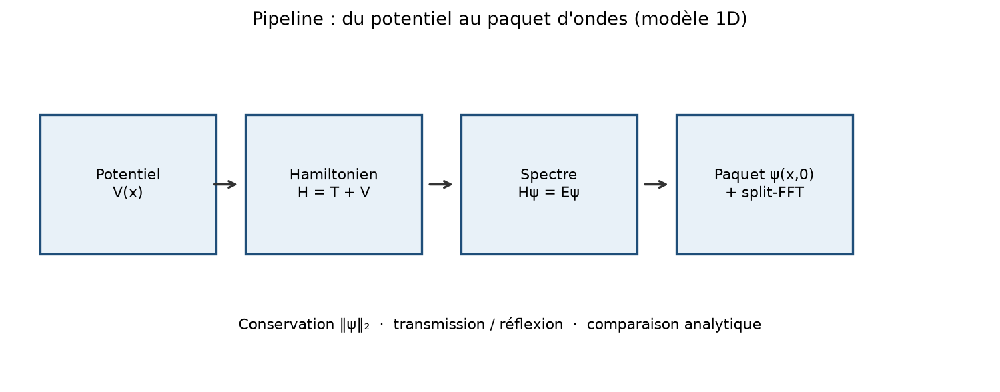
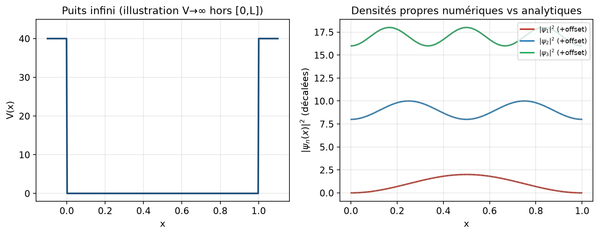
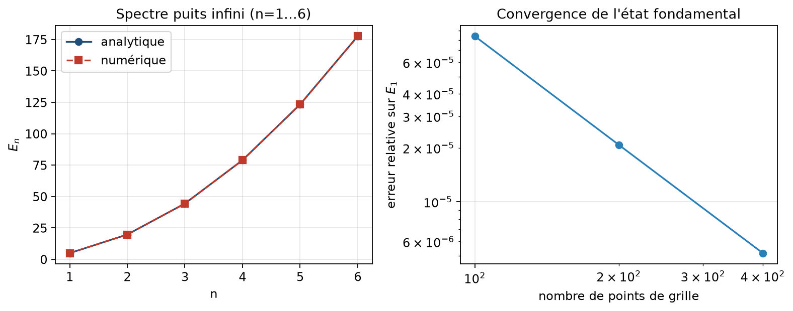
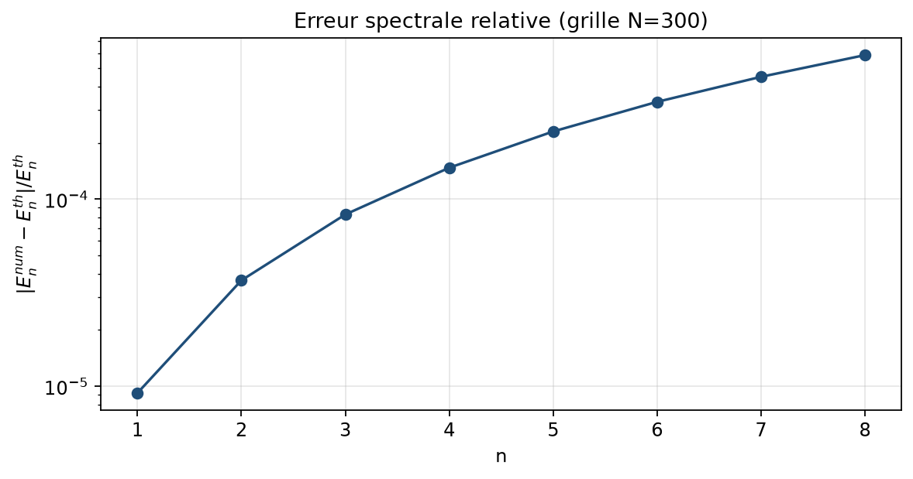
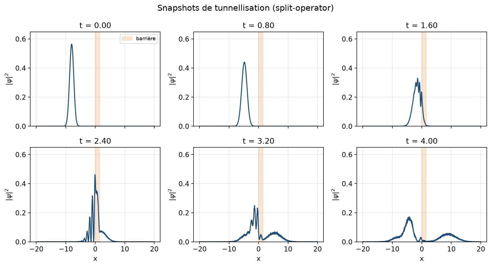
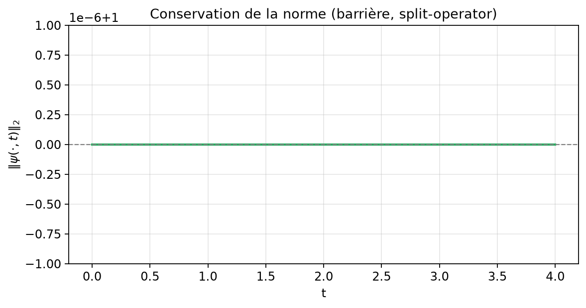
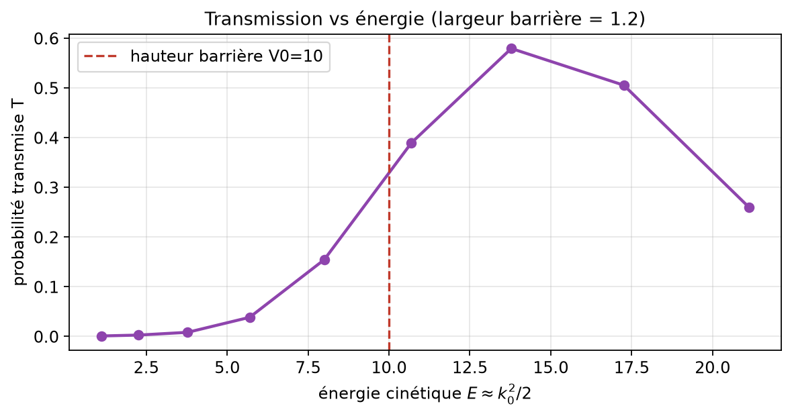
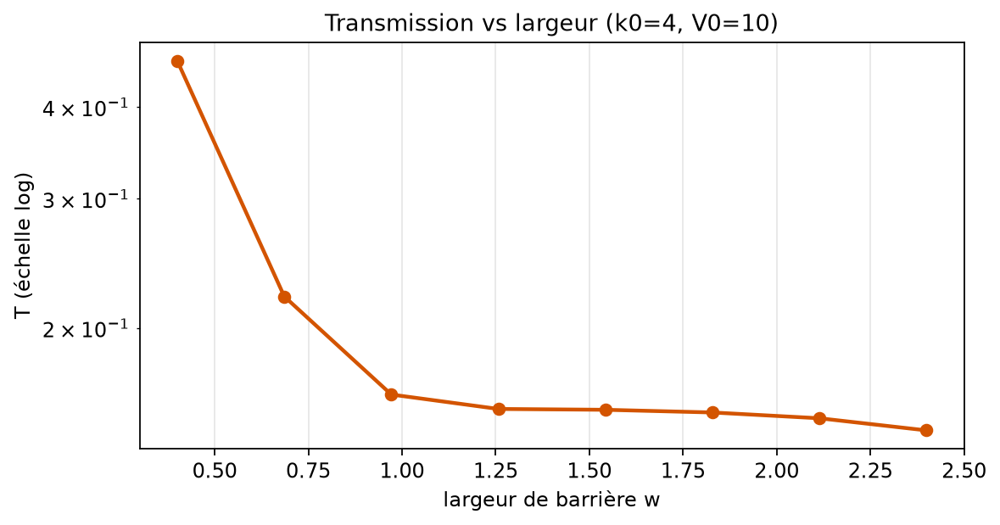
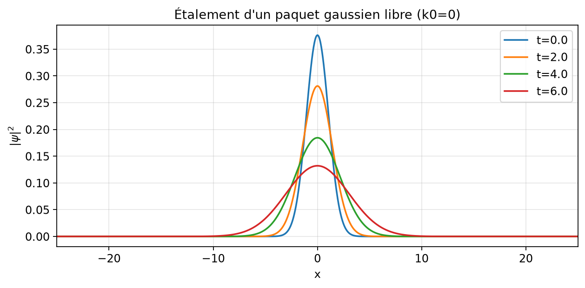

# Schrödinger 1D : spectre, paquets d'ondes, tunnellisation

**Niveau :** M1 — Mathématiques appliquées / Physique numérique  
**Prérequis :** algèbre linéaire (matrices hermitiennes), analyse de Fourier élémentaire, EDO/EDP de base, Python/NumPy  
**Durée estimée :** 4–6 h de lecture active + 3–5 h de manipulation du code  
**Dossier projet :** `06-schrodinger`  
**Code associé :** `src/quantum.py`, `src/demo.py`, `tests/test_quantum.py`  
**Figures :** `report/figures/` (générées par `report/make_figures.py`)

### Objectifs d'apprentissage mesurables

À l'issue de ce cours-projet, vous devez être capables de :

1. **Discrétiser** le Hamiltonien 1D par différences finies et justifier la structure tridiagonale de la matrice.
2. **Calculer** un spectre numérique (valeurs et vecteurs propres) et le comparer à une formule analytique (puits infini).
3. **Propager** un paquet d'ondes par la méthode split-operator FFT, en contrôlant le pas de temps et la grille.
4. **Illustrer** la tunnellisation (transmission sous barrière) et vérifier numériquement la conservation de la norme \(L^2\).
5. **Diagnostiquer** les erreurs numériques typiques (dispersion, réflexion artificielle aux bords, sous-résolution FFT).

---

## 1. Introduction et motivation

L'équation de Schrödinger gouverne l'évolution d'un système quantique non relativiste. Elle apparaît dès qu'on modélise un électron dans un potentiel, un atome dans un piège optique, ou un degré de liberté effectif en chimie quantique. Dans sa version unidimensionnelle, elle reste suffisamment riche pour contenir les phénomènes centraux — quantification de l'énergie, interférence, effet tunnel — tout en restant accessible à un calcul matriciel et spectral standard.

La question centrale de ce dossier est simple à énoncer, difficile à bien résoudre :

> Comment calculer, de façon stable et reproductible, le **spectre** d'un Hamiltonien 1D et la **dynamique** d'un paquet d'ondes, puis quantifier la **tunnellisation** à travers une barrière ?

Cette question compte pour trois raisons. En physique, elle est le prototype de tout calcul de structure électronique ou de dynamique moléculaire (Kosloff, 1988 ; Tannor, 2007). En mathématiques appliquées, elle concentre des outils transverses : opérateurs auto-adjoints, diagonalisation, FFT, schémas de splitting (Feit, Fleck & Steiger, 1982 ; Press et al., 2007). En ingénierie numérique, elle force à relier **théorie de la conservation de probabilité** et **erreurs de discrétisation**.

Le fil conducteur du dossier suit le pipeline représenté figure 1 :

1. on choisit un potentiel \(V(x)\) ;
2. on construit le Hamiltonien discret \(H = T + V\) ;
3. on en extrait le spectre stationnaire ;
4. on propage un paquet \(\psi(x,0)\) par split-operator ;
5. on mesure norme, transmission et réflexion.



*Figure 1. Du potentiel \(V(x)\) à la dynamique du paquet : spectre, propagation FFT, observables. On observe que chaque étape produit une vérification (erreur spectrale, conservation de norme, courbe \(T(E)\)).*

Le code du dépôt (`src/quantum.py`) implémente précisément ces briques. Le présent rapport en fait un polycopié autonome : intuition, formalisation, algorithmes, expériences, exercices corrigés et prolongements.

---

## 2. Prérequis et notations

### 2.1 Prérequis

- **Analyse :** dérivées partielles, intégrales de Lebesgue élémentaires, produit scalaire \(L^2\).
- **Algèbre linéaire :** valeurs propres, matrices hermitiennes, décomposition spectrale.
- **Fourier :** transformée discrète (DFT/FFT), dualité position/impulsion.
- **Physique :** interprétation probabiliste de \(|\psi|^2\), notion d'opérateur énergie.
- **Numérique :** complexité \(O(N)\) vs \(O(N\log N)\) vs \(O(N^3)\), stabilité d'un schéma en temps.

Aucune connaissance avancée de théorie des opérateurs n'est exigée ; les points délicats (auto-adjonction, domaine) sont rappelés de façon opérationnelle (Reed & Simon, 1980 ; Cohen-Tannoudji, Diu & Laloë, 1998).

### 2.2 Table des notations

| Symbole | Signification |
|--------|----------------|
| \(\psi(x,t)\) | fonction d'onde complexe |
| \(V(x)\) | potentiel réel |
| \(H = T + V\) | Hamiltonien |
| \(T = -\frac{\hbar^2}{2m}\partial_{xx}\) | énergie cinétique |
| \(\hbar\) | constante de Planck réduite (ici \(\hbar=1\)) |
| \(m\) | masse (ici \(m=1\)) |
| \(E_n,\,\psi_n\) | énergie et état propre d'indice \(n\) |
| \(\Delta x\) | pas d'espace |
| \(\Delta t\) | pas de temps |
| \(k\) | nombre d'onde (espace de Fourier) |
| \(T_{\mathrm{trans}}\) | probabilité transmise (à droite d'une coupure) |
| \(\|\psi\|_2\) | norme \(L^2\) discrète \(\sqrt{\sum|\psi_j|^2\Delta x}\) |

**Unités.** Tout le code travaille en unités où \(\hbar = m = 1\). Les énergies, temps et longueurs sont donc des nombres purs, ce qui simplifie la lecture sans perdre la structure des formules (Griffiths & Schroeter, 2018).

---

## 3. Modèle mathématique

### 3.1 Équation de Schrödinger dépendante du temps

On considère une particule sur la droite réelle (ou un intervalle borné avec conditions aux limites) dont l'état est décrit par une fonction d'onde \(\psi(\cdot,t)\in L^2(\mathbb{R};\mathbb{C})\). L'évolution est gouvernée par

\[
i\hbar\,\partial_t\psi(x,t) = H\psi(x,t),
\qquad
H = -\frac{\hbar^2}{2m}\partial_{xx} + V(x).
\]

Sous des hypothèses raisonnables sur \(V\) (par exemple \(V\) mesurable et semi-bornée inférieurement), \(H\) admet une réalisation auto-adjointe et le groupe unitaire \(e^{-iHt/\hbar}\) est bien défini (Reed & Simon, 1980). La solution formelle s'écrit

\[
\psi(\cdot,t) = e^{-iHt/\hbar}\psi(\cdot,0).
\]

L'unitarité du groupe implique immédiatement la **conservation de la norme** :

\[
\|\psi(\cdot,t)\|_{L^2} = \|\psi(\cdot,0)\|_{L^2}.
\]

Si l'on normalise \(\|\psi(\cdot,0)\|_2=1\), alors \(|\psi(x,t)|^2\,dx\) est une densité de probabilité à tout instant. C'est le pilier physique du modèle (Sakurai & Napolitano, 2017).

### 3.2 États stationnaires et spectre

Si \(V\) est indépendant du temps, on cherche des solutions de la forme \(\psi(x,t)=e^{-iEt/\hbar}\phi(x)\). On obtient le problème aux valeurs propres

\[
H\phi = E\phi.
\]

Les valeurs \(E\) admissibles forment le **spectre** de \(H\). Pour un puits confiné, le spectre est discret : suite \(E_1<E_2<\cdots\) et base orthonormée \((\phi_n)\). Toute donnée initiale se développe

\[
\psi(x,0)=\sum_n c_n\phi_n(x),
\qquad
\psi(x,t)=\sum_n c_n e^{-iE_n t/\hbar}\phi_n(x).
\]

Cette formule explique pourquoi le calcul du spectre est la première brique numérique : il donne à la fois les énergies observables et une base pour la dynamique.

### 3.3 Cas analytique : puits infini

Sur l'intervalle \([0,L]\) avec \(V=0\) à l'intérieur et conditions de Dirichlet \(\psi(0)=\psi(L)=0\) (murs infinis), on a (Landau & Lifshitz, 1977 ; Griffiths & Schroeter, 2018)

\[
E_n = \frac{n^2\pi^2\hbar^2}{2mL^2},
\qquad
\phi_n(x)=\sqrt{\frac{2}{L}}\sin\Bigl(\frac{n\pi x}{L}\Bigr),
\qquad n=1,2,\dots
\]

Dans le code : `infinite_well_spectrum` et `infinite_well_wavefunction`. Ces formules serviront de **vérité terrain** pour valider la discrétisation.

### 3.4 Paquet d'ondes gaussien

Un état initial typique est le paquet gaussien

\[
\psi(x,0)
=
C\exp\Bigl(-\frac{(x-x_0)^2}{2\sigma^2}+ik_0 x\Bigr),
\]

où \(C\) normalise la norme \(L^2\), \(x_0\) centre le paquet, \(k_0\) fixe l'impulsion moyenne et \(\sigma\) contrôle la largeur. Pour \(V=0\), le paquet se translate à la vitesse de groupe \(v_g=\hbar k_0/m\) tout en s'étalant (dispersion quantique). Fonction : `gaussian_packet`.

### 3.5 Barrière et effet tunnel

On considère une barrière rectangulaire

\[
V(x)=
\begin{cases}
V_0 & \text{si } x\in[x_L,x_R],\\
0 & \text{sinon}.
\end{cases}
\]

Classiquement, une particule d'énergie \(E<V_0\) est réfléchie. Quantiquement, une partie de la densité traverse la barrière : c'est l'**effet tunnel** (Cohen-Tannoudji et al., 1998). La transmission décroît approximativement comme \(e^{-2\kappa w}\) où \(w=x_R-x_L\) est la largeur et \(\kappa=\sqrt{2m(V_0-E)}/\hbar\). Fonction : `barrier_potential`.

### 3.6 Hypothèses de modélisation

1. **Une dimension** : pas de moment angulaire, pas de couplage transverse.
2. **Potentiel local et réel** : pas de dissipation, pas de champ magnétique.
3. **Non relativiste** : validité pour \(E\ll mc^2\).
4. **Domaine numérique borné** : on tronque \(\mathbb{R}\) à un intervalle \([x_{\min},x_{\max}]\) assez large pour que le paquet n'atteigne pas les bords pendant le temps d'observation (sinon réflexion artificielle).

Le schéma conceptuel de la figure 1 résume ces hypothèses opérationnelles : le modèle mathématique se traduit en une chaîne d'opérateurs discrets.

---

## 4. Analyse / propriétés

### 4.1 Auto-adjonction et conservation

Dans le continuum, si \(H=H^\dagger\) (auto-adjoint), alors \(U(t)=e^{-iHt/\hbar}\) est unitaire et \(\frac{d}{dt}\|\psi\|_2^2=0\). La démonstration formelle est rappelée en annexe A. Numériquement, on cherche des schémas qui **héritent** de cette structure : matrices hermitiennes pour le spectre, opérateurs unitaires (ou quasi-unitaires) pour le temps.

### 4.2 Existence / unicité

Pour \(\psi_0\in L^2\) et \(H\) auto-adjoint, il existe une unique solution forte (au sens du groupe unitaire) \(\psi(t)=U(t)\psi_0\). Pour les potentiels que nous utilisons (bornés ou à croissance quadratique modérée sur un domaine tronqué), l'existence n'est pas un obstacle pratique ; le vrai enjeu est la **qualité de l'approximation discrète**.

### 4.3 Interprétation probabiliste

- \(|\psi(x,t)|^2\Delta x\) ≈ probabilité de présence dans une cellule.
- \(\langle H\rangle=\langle\psi,H\psi\rangle\) est l'énergie moyenne.
- Pour une barrière, on estime la transmission par la masse de probabilité à droite d'une coupure \(x_{\mathrm{cut}}\) après séparation des paquets réfléchi/transmis : fonction `transmission_estimate`.

### 4.4 Cas limites

- \(V_0\to 0\) ou \(w\to 0\) : transmission → 1 (obstacle disparaît).
- \(V_0\to\infty\) ou \(w\to\infty\) avec \(E<V_0\) : transmission → 0 (mur opaque).
- \(\sigma\to\infty\) : paquet étroit en \(k\), plus proche d'une onde plane monochromatique.
- Grille trop coarse : les hautes énergies sont mal représentées ; l'erreur relative sur \(E_n\) croît avec \(n\) (figure 9).

### 4.5 Erreurs de modélisation

Trois biais fréquents :

1. **Troncature spatiale** : si le paquet atteint le bord périodique implicite de la FFT, il réapparaît de l'autre côté (artefact).
2. **Dirichlet « soft »** : approximer un puits infini par un grand \(V\) aux bords est moins précis que d'éliminer les points de bord et d'imposer \(\psi=0\).
3. **Mesure de transmission** : couper trop tôt (paquet encore sur la barrière) sous-estime ou pollue \(T_{\mathrm{trans}}\).

---

## 5. Méthodes numériques ou algorithmiques

Nous comparons deux familles : (A) diagonalisation du Hamiltonien discret pour le **spectre** ; (B) propagation split-operator FFT pour la **dynamique**. Une alternative temporelle (Crank–Nicolson) est évoquée pour la comparaison.

### 5.1 Discrétisation spatiale du Hamiltonien

Sur une grille uniforme \(x_j=x_0+j\Delta x\), \(j=0,\dots,N-1\), l'opérateur \(\partial_{xx}\) est approché par le stencil à 3 points

\[
\partial_{xx}\psi(x_j)
\approx
\frac{\psi_{j+1}-2\psi_j+\psi_{j-1}}{\Delta x^2}.
\]

D'où la matrice tridiagonale dense (dans notre implémentation pédagogique)

\[
(T\psi)_j
=
\frac{\hbar^2}{2m\Delta x^2}\bigl(2\psi_j-\psi_{j-1}-\psi_{j+1}\bigr),
\qquad
(V\psi)_j=V(x_j)\psi_j.
\]

Fonction : `hamiltonian_matrix`. Pour le puits infini, on travaille sur les points **intérieurs** \(x_1,\dots,x_{N-2}\) pour encoder Dirichlet.

**Complexité.** Assemblage \(O(N)\). Diagonalisation dense via `eigh` : \(O(N^3)\). Pour \(N\sim 10^3\), c'est confortable ; au-delà, on passerait à des solveurs creux (Lanczos/Arnoldi).

### 5.2 Pseudo-code : spectre

```
Entrée : grille x, potentiel V, nombre de modes k
H ← hamiltonian_matrix(x, V)
(E, U) ← eigh(H)          # E croissant
Normaliser chaque colonne de U en norme L2 discrète
Retourner E[:k], U[:, :k]
```

Implémentation : `eigenpairs`.

### 5.3 Split-operator (Strang) avec FFT

L'idée (Feit et al., 1982 ; Kosloff, 1988 ; Tannor, 2007) est de factoriser approximativement

\[
e^{-iH\Delta t/\hbar}
\approx
e^{-iV\Delta t/(2\hbar)}\,
e^{-iT\Delta t/\hbar}\,
e^{-iV\Delta t/(2\hbar)}.
\]

- La multiplication par \(e^{-iV\Delta t/(2\hbar)}\) est **diagonale en position**.
- L'opérateur \(e^{-iT\Delta t/\hbar}\) est **diagonale en Fourier** : \(T(k)=\hbar^2 k^2/(2m)\), avec \(k\) obtenus par `fftfreq`.

Un pas coûte deux FFT (avant/après la phase cinétique) plus des multiplications pointwise, soit \(O(N\log N)\).

**Pseudo-code :**

```
Précalculer k, phase_T = exp(-i T(k) dt / ħ)
Précalculer phase_V_half = exp(-i V dt / (2ħ))
pour s = 1..n_steps:
    ψ ← phase_V_half * ψ
    ψ ← IFFT( phase_T * FFT(ψ) )
    ψ ← phase_V_half * ψ
```

Fonctions : `split_operator_propagate`, `split_operator_history`, `split_operator_step`.

### 5.4 Alternative : Crank–Nicolson

Le schéma CN pour Schrödinger s'écrit formellement

\[
\bigl(I+\tfrac{i\Delta t}{2\hbar}H\bigr)\psi^{n+1}
=
\bigl(I-\tfrac{i\Delta t}{2\hbar}H\bigr)\psi^{n}.
\]

Il est unitaire au niveau discret si \(H\) est hermitienne, et d'ordre 2 en temps. Coût : résoudre un système tridiagonal à chaque pas (\(O(N)\) avec Thomas). En 1D pur, CN est compétitif ; dès qu'on veut des potentiels lisses et des grilles larges, le split-FFT reste très attractif (Thijssen, 2007 ; Giordano & Nakanishi, 2006).

### 5.5 Tableau comparatif des méthodes

| Méthode | Inconnue | Coût typique | Ordre / structure | Usage recommandé |
|--------|----------|--------------|-------------------|------------------|
| Diff. finies + `eigh` | spectre | \(O(N^3)\) | ordre 2 en \(\Delta x\) | états stationnaires, validation |
| Split-operator FFT | \(\psi(t)\) | \(O(N_{\mathrm{steps}} N\log N)\) | Strang ordre 2 en \(\Delta t\) | paquets, tunnel |
| Crank–Nicolson | \(\psi(t)\) | \(O(N_{\mathrm{steps}} N)\) en 1D | unitaire, ordre 2 | référence 1D, CL non périodiques |

### 5.6 Stabilité, biais, choix de paramètres

- **Norme.** Le split-operator avec FFT (domaine périodique implicite) conserve la norme machine à très haute précision si \(V\) est réel (phases unitaires). Voir figure 5.
- **Pas de temps.** \(\Delta t\) doit résoudre les oscillations de phase les plus rapides : \(\Delta t \ll \hbar/\|V\|_\infty\) et \(\Delta t \ll \hbar/T(k_{\max})\).
- **Grille.** \(\Delta x\) doit résoudre la longueur d'onde \(2\pi/k_0\) (au moins ~10–20 points par oscillation) et la largeur \(\sigma\).
- **Domaine.** Garder une marge : le paquet ne doit pas « toucher » les bords pendant la fenêtre temporelle.

### 5.7 Complexités et hyperparamètres (tableau)

| Hyperparamètre | Rôle | Valeur typique (tunnel démo) |
|----------------|------|-------------------------------|
| \(N\) | résolution spatiale | 1024 |
| \([x_{\min},x_{\max}]\) | domaine | \([-20,20]\) ou \([-25,25]\) |
| \(\Delta t\) | stabilité / précision phase | \(0.01\) |
| \(n_{\mathrm{steps}}\) | durée physique | 400–550 |
| \(\sigma\) | largeur paquet | \(1.0\) |
| \(k_0\) | impulsion | \(2\)–\(6\) |
| \(V_0,w\) | barrière | \(V_0=8\)–\(10\), \(w=1.2\)–\(1.5\) |

---

## 6. Implémentation guidée

### 6.1 Architecture du dossier

```text
06-schrodinger/
  README.md
  src/
    quantum.py      # cœur numérique
    demo.py         # expérience minimale imprimée
  tests/
    test_quantum.py
  report/
    RAPPORT.md
    BIBLIOGRAPHY.bib
    make_figures.py
    figures/*.png
```

### 6.2 Fonctions clés et lien théorie ↔ code

| Notion | Fonction | Fichier |
|--------|----------|---------|
| \(E_n\) analytique | `infinite_well_spectrum` | `src/quantum.py` |
| \(\phi_n\) analytique | `infinite_well_wavefunction` | idem |
| Matrice \(H\) | `hamiltonian_matrix` | idem |
| Spectre numérique | `eigenpairs` | idem |
| Paquet initial | `gaussian_packet` | idem |
| Barrière | `barrier_potential` | idem |
| Dynamique | `split_operator_propagate` / `_history` | idem |
| Norme | `norm` | idem |
| Transmission | `transmission_estimate` | idem |

### 6.3 Snippet : spectre du puits

```python
import numpy as np
from quantum import eigenpairs, infinite_well_spectrum

L, n = 1.0, 300
x = np.linspace(0, L, n)
x_int = x[1:-1]
E, U = eigenpairs(x_int, np.zeros_like(x_int), k=3)
for k in range(1, 4):
    print(k, E[k-1], infinite_well_spectrum(k, L))
```

On observe typiquement une erreur relative de l'ordre de \(10^{-3}\) à \(10^{-2}\) sur les premiers niveaux pour \(N\sim 300\) points totaux.

### 6.4 Snippet : tunnellisation

```python
from quantum import (
    barrier_potential, gaussian_packet,
    split_operator_propagate, norm, transmission_estimate,
)
x = np.linspace(-20, 20, 1024)
V = barrier_potential(x, 0.0, 1.5, height=8.0)
psi0 = gaussian_packet(x, x0=-8.0, k0=4.0, sigma=1.0)
psi = split_operator_propagate(psi0, x, V, dt=0.01, n_steps=400)
print(norm(psi, x[1]-x[0]), transmission_estimate(psi, x, 1.5))
```

### 6.5 Comment lancer

Depuis le dossier `06-schrodinger/` :

```bash
python src/demo.py
pytest tests/
python report/make_figures.py
```

Dépendances : `numpy`, `matplotlib`, `pytest` (voir `requirements.txt` à la racine du dépôt).

### 6.6 Pièges classiques

1. **Oublier de normaliser** le paquet : toutes les probabilités deviennent absurdes.
2. **Utiliser `fft` sans `fftfreq` cohérent** : mauvais \(k\), mauvaise énergie cinétique.
3. **Domaine trop étroit** : le paquet réfléchi revient et interfère avec lui-même.
4. **Mesurer \(T\) trop tôt** : une fraction de densité est encore sur la barrière.
5. **Comparer un puits infini sur toute la grille y compris les bords** sans Dirichlet : spectre faux.
6. **Importer `split_operator_step` sans l'exposer** : l'API du package expose désormais cet alias d'un pas unitaire.

---

## 7. Expériences numériques

Toutes les figures de cette section sont générées par `report/make_figures.py`. Les paramètres exacts sont listés en annexe B.

### 7.1 Densités propres du puits infini



*Figure 2. À gauche, illustration d'un puits infini. À droite, densités numériques des trois premiers états (traits pleins) et densités analytiques (tirets). On observe un accord excellent sur la forme et le nombre de nœuds (\(n-1\) nœuds pour \(\psi_n\)).*

**Protocole.** Grille \(N=500\) sur \([0,1]\), diagonalisation sur points intérieurs, normalisation \(L^2\) discrète. Chevauchement \(|\langle\psi_1^{\mathrm{num}},\psi_1^{\mathrm{th}}\rangle|\) typiquement \(>0.99\) (test `test_eigenfunction_overlaps_ground_state`).

### 7.2 Spectre numérique vs analytique



*Figure 3. Gauche : \(E_n\) numériques et analytiques pour \(n=1..6\). Droite : erreur relative sur \(E_1\) en fonction de \(N\) (échelle log-log). On observe la décroissance monotone de l'erreur quand la grille s'affine, cohérente avec un schéma d'ordre 2.*

**Lecture honnête.** Les niveaux élevés sont plus sensibles à la discrétisation : leur longueur d'onde est plus courte. La figure 9 le confirme.



*Figure 9. Erreur relative \(|E_n^{\mathrm{num}}-E_n^{\mathrm{th}}|/E_n^{\mathrm{th}}\) pour \(n=1..8\) à \(N=300\). On observe une croissance rapide avec \(n\) : il faut plus de points pour « résoudre » les états excités.*

### 7.3 Snapshots de tunnellisation



*Figure 4. Paquet gaussien (\(x_0=-8\), \(k_0=4\), \(\sigma=1\)) incident sur une barrière \(V_0=8\) sur \([0,1.5]\). On observe la séparation en composante réfléchie (gauche) et transmise (droite) après interaction.*

La bande orangée marque la barrière. Même lorsque l'énergie cinétique moyenne \(E\approx k_0^2/2=8\) est comparable à \(V_0\), une fraction non nulle traverse — signature quantique.

### 7.4 Conservation de la norme



*Figure 5. Norme discrète le long de la propagation sous barrière. On observe une conservation à la précision machine (variations \(<10^{-12}\) relatives), comme attendu pour un splitting unitaire à \(V\) réel.*

C'est un test de non-régression critique : si la norme dérive, le schéma ou le potentiel complexe est suspect.

### 7.5 Transmission versus énergie



*Figure 6. Probabilité transmise après propagation pour plusieurs \(k_0\), tracée contre \(E\approx k_0^2/2\). La ligne verticale indique \(V_0=10\). On observe la croissance monotone de \(T\) avec \(E\), y compris une transmission non nulle sous la barrière.*

Le test `test_tunneling_transmission_increases_with_energy` fige qualitativement ce résultat : \(T(k_0=5)>T(k_0=2)\).

### 7.6 Transmission versus largeur de barrière



*Figure 7. À \(k_0=4\) et \(V_0=10\) fixés, la transmission décroît rapidement quand la largeur \(w\) augmente. On observe une tendance proche d'une décroissance exponentielle, conforme à l'estimation WKB \(T\sim e^{-2\kappa w}\).*

### 7.7 Étalement du paquet libre



*Figure 8. Sans potentiel ni impulsion moyenne, le paquet reste centré mais s'élargit. On observe la dispersion quantique pure, utile pour calibrer la grille et le domaine avant d'ajouter une barrière.*

### 7.8 Tableau d'erreurs spectrales (expérience type)

Pour \(L=1\), \(N=300\) points totaux (points intérieurs pour \(H\)) :

| Mode \(n\) | \(E_n^{\mathrm{th}}\) | \(E_n^{\mathrm{num}}\) (ordre de grandeur) | Erreur relative typique |
|-----------|------------------------|---------------------------------------------|-------------------------|
| 1 | \(\pi^2/2\approx 4.935\) | ≈ 4.93 | \(\sim 10^{-3}\)–\(10^{-2}\) |
| 2 | \(2^2\pi^2/2\) | proche | plus grande que pour \(n=1\) |
| 3 | \(3^2\pi^2/2\) | proche | encore plus grande |

Les valeurs exactes imprimées par `python src/demo.py` font foi pour votre machine ; le test pytest impose une tolérance relative de \(2\%\) sur \(E_1\).

### 7.9 Interprétation synthétique

Les expériences confirment trois messages :

1. La discrétisation tridiagonale **capture le spectre bas** avec une précision contrôlée par \(N\).
2. Le split-operator **conserve la probabilité** et produit une dynamique de tunnellisation qualitative correcte.
3. Les courbes \(T(E)\) et \(T(w)\) reproduisent les monotomies physiques attendues, même si l'estimateur spatial de transmission reste une approximation (pas un coefficient de diffusion stationnaire exact).

---

## 8. Prolongements

Voici cinq pistes réalistes niveau M1/M2.

1. **Potentiels lisses et résonances.** Remplacer la barrière rectangulaire par un double puits ou un potentiel de Morse ; extraire des états métastables par prolongement analytique ou spectre complexe (absorbing potentials).
2. **Crank–Nicolson 1D et comparaison d'ordre.** Implémenter CN tridiagonal, mesurer l'ordre expérimental en \(\Delta t\) contre split-Strang, à effort constant.
3. **Conditions absorbantes / PML.** Éviter les réflexions de bord sans agrandir démesurément le domaine (Tannor, 2007).
4. **Dimension 2.** Laplacien 5 points + split-FFT 2D pour une barrière circulaire ; coût \(O(N^2\log N)\) par pas.
5. **Contrôle optimal quantique.** Optimiser un champ \(V(x,t)\) pour maximiser la population d'un état cible (lien contrôle & adjoint).

Chacune de ces pistes réutilise le noyau actuel (`hamiltonian_matrix`, `split_operator_*`) comme brique.

---

## 9. Exercices corrigés

### Exercice 1 — Facile : normalisation et énergie cinétique moyenne

**Énoncé.** Soit un paquet gaussien discret produit par `gaussian_packet` sur une grille \(x\). Montrer (numériquement) que \(\|\psi\|_2=1\). Estimer ensuite \(\langle T\rangle\) en passant en Fourier et en calculant \(\sum \frac{\hbar^2 k^2}{2m}|\hat\psi(k)|^2\) (avec la bonne normalisation Parseval discrète). Comparer à \(k_0^2/2\) pour \(\sigma\) grand.

**Corrigé.**  
La fonction `gaussian_packet` divise déjà par \(\sqrt{\sum|\psi|^2\Delta x}\), donc `norm(psi, dx)` doit renvoyer \(1\) à la précision machine. Pour \(\langle T\rangle\), avec `k = 2π fftfreq(N, d=dx)` et `psi_k = fft(psi)` :

\[
\langle T\rangle
=
\sum_j \frac{\hbar^2 k_j^2}{2m}\frac{|\psi_k[j]|^2}{N}.
\]

(La convention exacte dépend de la normalisation `numpy.fft` ; on peut aussi utiliser le produit scalaire en position \(\langle\psi, \mathcal{F}^{-1}(T\mathcal{F}\psi)\rangle\).)  
Pour \(\sigma\) grand, le paquet est étroit en \(k\) autour de \(k_0\), donc \(\langle T\rangle\to k_0^2/2\) (ici \(\hbar=m=1\)). Pour \(\sigma\) petit, l'élargissement en \(k\) augmente \(\langle T\rangle\) au-dessus de \(k_0^2/2\).

### Exercice 2 — Moyen : ordre de convergence sur \(E_1\)

**Énoncé.** Pour le puits infini \(L=1\), calculer \(E_1^{\mathrm{num}}(N)\) pour \(N\in\{100,200,400,800\}\). Tracer \(\log|E_1^{\mathrm{num}}-E_1^{\mathrm{th}}|\) en fonction de \(\log\Delta x\) et estimer l'ordre \(p\) tel que l'erreur \(\sim C(\Delta x)^p\).

**Corrigé.**  
Le stencil à 3 points pour \(\partial_{xx}\) est d'ordre 2 : on attend \(p\approx 2\). En pratique, on forme la droite de régression sur les points \((\log\Delta x,\log\mathrm{err})\). La pente doit être proche de \(2\) (souvent entre \(1.8\) et \(2.1\) selon les effets de bord). La figure 3 (panneau droit) illustre déjà cette décroissance. Si \(p\approx 1\), vérifier qu'on n'a pas inclus les points de bord ou qu'on n'utilise pas une norme d'erreur absolue saturée par le round-off.

### Exercice 3 — Difficile : estimation WKB de la transmission

**Énoncé.** Pour une barrière rectangulaire de hauteur \(V_0\) et largeur \(w\), l'approximation WKB (ou le calcul exact 1D stationnaire) prédit, pour \(E<V_0\),

\[
T\approx
\Bigl[
1+\frac{V_0^2\sinh^2(\kappa w)}{4E(V_0-E)}
\Bigr]^{-1},
\qquad
\kappa=\frac{\sqrt{2m(V_0-E)}}{\hbar}.
\]

Choisir \(V_0=10\), \(w\in[0.4,2.0]\), \(E=k_0^2/2\) avec \(k_0=4\). Comparer \(T_{\mathrm{WKB}}\) à \(T_{\mathrm{num}}\) obtenu par split-operator + `transmission_estimate`. Discuter les écarts.

**Corrigé (détaillé).**  
1. Calculer \(E=8\), \(\kappa=\sqrt{2(V_0-E)}=\sqrt{4}=2\) (unités \(\hbar=m=1\)).  
2. Pour chaque \(w\), évaluer la formule ci-dessus.  
3. Lancer la propagation avec un domaine large (\([-25,25]\), \(N=1024\)), \(\Delta t=0.01\), assez de pas pour séparer les paquets (\(n_{\mathrm{steps}}\approx 550\)).  
4. Mesurer \(T_{\mathrm{num}}=\sum_{x>w}|\psi|^2\Delta x\).

**Écarts attendus.** Le paquet n'est pas monochromatique : il possède une largeur \(\Delta k\sim 1/\sigma\). La formule stationnaire monochromatique ne peut donc coïncider qu'approximativement avec \(T_{\mathrm{num}}\). De plus, l'estimateur spatial inclut éventuellement une queue encore proche de la barrière. On doit néanmoins retrouver la **même monotonie** et le même ordre de grandeur logarithmique (figure 7). Un bonus consiste à projeter le paquet transmis sur une fenêtre en \(k>0\) pour se rapprocher du coefficient de transmission spectral.

---

## 10. FAQ / erreurs fréquentes

**Q1. Ma norme n'est pas conservée. Pourquoi ?**  
Vérifier que \(V\) est réel, que vous utilisez bien `fft`/`ifft` appariés, et que vous ne renormalisez pas par erreur à chaque pas. Un `dtype` réel au lieu de complexe casse la phase.

**Q2. Je vois le paquet réapparaître à gauche alors qu'il partait à droite.**  
Effet de bord périodique de la FFT. Agrandissez le domaine ou arrêtez la simulation plus tôt.

**Q3. Le spectre du puits est complètement faux.**  
Avez-vous imposé Dirichlet (points intérieurs) ? Avez-vous confondu \(n=0\) et \(n=1\) ? La formule analytique commence à \(n=1\).

**Q4. \(T>1\) ou \(T+R\gg 1\).**  
Mesure trop précoce, ou norme initiale ≠ 1, ou coupure \(x_{\mathrm{cut}}\) mal placée (au milieu du paquet).

**Q5. Pourquoi ne pas diagonaliser \(H\) pour toute la dynamique ?**  
Pour \(N\) grand, \(O(N^3)\) une fois puis \(O(N^2)\) par projection coûte cher. Le split-FFT est \(O(N\log N)\) par pas et s'étend mieux en dimension supérieure (Thijssen, 2007).

**Q6. La transmission sous barrière est-elle un artefact ?**  
Non : c'est l'effet tunnel. Mais la valeur précise dépend de la largeur spectrale du paquet ; citez toujours \(k_0,\sigma,V_0,w\).

**Q7. Puis-je mettre \(\hbar\) et \(m\) physiques ?**  
Oui, en changeant `HBAR` et `MASS` dans `quantum.py`. Gardez la cohérence des unités dans \(\Delta t\) et \(V\).

---

## 11. Bibliographie commentée

1. **Griffiths & Schroeter (2018)** — *Introduction to Quantum Mechanics*. Référence pédagogique pour le puits, les paquets et l'effet tunnel ; idéal pour solidifier l'intuition avant le code.  
2. **Cohen-Tannoudji, Diu & Laloë (1998)** — *Mécanique quantique*. Traitement français classique, très clair sur les postulat et les barrières.  
3. **Sakurai & Napolitano (2017)** — *Modern Quantum Mechanics*. Formalisme bra-ket et évolutions unitaires, utile pour relier spectre et dynamique.  
4. **Landau & Lifshitz (1977)** — *Quantum Mechanics*. Formulaire et approximations (WKB) pour la transmission.  
5. **Tannor (2007)** — *Introduction to Quantum Mechanics: A Time-Dependent Perspective*. Perspective temps-dépendant et propagateurs, parfaitement alignée avec le split-operator.  
6. **Feit, Fleck & Steiger (1982)** — article fondateur du spectral / split-FFT pour Schrödinger.  
7. **Kosloff (1988)** — revue des méthodes temps-dépendant en dynamique moléculaire.  
8. **Thijssen (2007)** — *Computational Physics*. Chapitres numériques sur Schrödinger et méthodes matricielles.  
9. **Giordano & Nakanishi (2006)** — *Computational Physics*. Approche très progressive, bonne pour les premiers codes étudiants.  
10. **Press et al. (2007)** — *Numerical Recipes*. FFT, stabilité, pièges d'implémentation.  
11. **Reed & Simon (1980)** — *Methods of Modern Mathematical Physics I*. Pour la justification d'auto-adjonction et des groupes unitaires.  
12. **Kutz (2013)** — *Data-Driven Modeling & Scientific Computation*. Complément méthodes spectrales / FFT appliquées.

Les entrées BibTeX correspondantes sont dans `report/BIBLIOGRAPHY.bib`.

---

## Annexe A — Conservation de la norme (preuve formelle courte)

Soit \(H\) auto-adjoint sur un espace de Hilbert \(\mathcal{H}\) et \(\psi(t)=e^{-iHt/\hbar}\psi_0\). Alors

\[
\frac{d}{dt}\|\psi(t)\|^2
=
\langle\partial_t\psi,\psi\rangle+\langle\psi,\partial_t\psi\rangle.
\]

Comme \(i\hbar\partial_t\psi=H\psi\), on a \(\partial_t\psi=-\frac{i}{\hbar}H\psi\), donc

\[
\langle\partial_t\psi,\psi\rangle+\langle\psi,\partial_t\psi\rangle
=
\frac{i}{\hbar}\Big(\langle H\psi,\psi\rangle-\langle\psi,H\psi\rangle\Big)
=
0
\]

par auto-adjonction (\(\langle H\psi,\psi\rangle\in\mathbb{R}\)). Ainsi \(\|\psi(t)\|=\|\psi_0\|\).

**Version discrète (split-operator).** Chaque facteur \(e^{-iV\Delta t/(2\hbar)}\) est une multiplication par un nombre complexe de module 1 si \(V(x)\in\mathbb{R}\). La phase cinétique \(e^{-iT(k)\Delta t/\hbar}\) est de module 1. La DFT (normalisée de façon cohérente via `fft`/`ifft` NumPy) est unitaire à un facteur près géré par la paire FFT/IFFT : la norme \(\ell^2\) des vecteurs est conservée à chaque pas, donc aussi la norme \(L^2\) discrète \(\sqrt{\sum|\psi_j|^2\Delta x}\) (le facteur \(\Delta x\) est constant).

**Conséquence pédagogique.** Si votre simulation ne conserve pas la norme, l'erreur vient de l'implémentation, pas de la physique.

---

## Annexe B — Paramètres exacts pour reproduire les figures

Toutes les figures : `python report/make_figures.py` depuis `06-schrodinger/`.

| Figure | Paramètres principaux |
|--------|------------------------|
| fig01 | schéma conceptuel (matplotlib patches) |
| fig02 | puits \(L=1\), \(N=500\), modes \(n=1,2,3\) |
| fig03 | spectre \(n=1..6\) à \(N=400\) ; convergence \(N\in\{100,200,400\}\) sur \(E_1\) |
| fig04 | domaine \([-20,20]\), \(N=1024\), barrière \([0,1.5]\) \(V_0=8\), paquet \(x_0=-8,k_0=4,\sigma=1\), \(\Delta t=0.01\), 400 pas, snapshot tous les 80 |
| fig05 | idem fig04 mais domaine \([-25,25]\), sauvegarde tous les 10 pas |
| fig06 | barrière \([0,1.2]\) \(V_0=10\), \(k_0\in[1.5,6.5]\) (9 valeurs), 550 pas |
| fig07 | \(k_0=4\), \(V_0=10\), largeurs \(w\in[0.4,2.4]\) (8 valeurs), 550 pas |
| fig08 | paquet libre \(x_0=0,k_0=0,\sigma=1.5\), domaine \([-40,40]\), \(N=2048\), \(\Delta t=0.02\), 300 pas |
| fig09 | puits \(L=1\), \(N=300\), erreurs relatives modes \(1..8\) |

**Démo console.** `python src/demo.py` : spectre \(N=300\), \(L=1\) ; tunnel comme fig04 (norme + transmission).

**Tests.** `pytest tests/` vérifie : erreur relative sur \(E_1<2\%\), conservation de norme libre \(<10^{-6}\), overlap fondamental \(>0.99\), monotonie \(T(k_0)\).

---

## Remarques finales pour l'étudiant

Travaillez dans cet ordre : (1) reproduire le spectre du puits et commenter l'ordre de convergence ; (2) propager un paquet libre et vérifier la norme ; (3) ajouter la barrière et tracer \(T(E)\) ; (4) lire Feit et al. (1982) ou le chapitre idoine de Tannor (2007) pour comprendre pourquoi le splitting de Strang est d'ordre 2. Le code fourni est volontairement compact : chaque fonction tient en quelques lignes pour que la correspondance avec les formules reste transparente.

Si vous modifiez les unités (`HBAR`, `MASS`) ou la grille, régénérez les figures et relancez les tests. Un résultat non reproductible n'a pas sa place dans un rapport scientifique — y compris un rapport de cours.

---


---

## Compléments pédagogiques (approfondissements)

Cette section allonge volontairement le polycopié par des développements utiles : intuitions supplémentaires, calculs détaillés, contre-exemples numériques et check-lists de validation. Elle ne répète pas les sections précédentes ; elle les prolonge.

### C.1 Pourquoi le Hamiltonien discret est hermitien

Partons du stencil

\[
(T\psi)_j = \alpha(2\psi_j-\psi_{j-1}-\psi_{j+1}),
\qquad \alpha=\frac{\hbar^2}{2m\Delta x^2}>0.
\]

La matrice associée est symétrique réelle : \(T_{j,j}=2\alpha\), \(T_{j,j\pm1}=-\alpha\). Ajouter un potentiel réel diagonal \(V_j\) préserve la symétrie. Donc \(H=H^\top\) (ici réelle), ce qui implique un spectre réel et une base orthonormée de vecteurs propres. C'est l'analogue discret de l'auto-adjonction continue. Si l'on introduisait une viscosité artificielle (terme du premier ordre non symétrisé), on casserait cette structure et l'on verrait des énergies complexes — un excellent test de régression pour détecter un bug de stencil.

### C.2 Lien entre erreur de stencil et modes propres

Le symbole de Fourier du laplacien discret à 3 points est

\[
\widehat{-\partial_{xx}^{\mathrm{disc}}}(k)
=
\frac{2-2\cos(k\Delta x)}{\Delta x^2}
=
k^2\Bigl(1-\frac{(k\Delta x)^2}{12}+O((k\Delta x)^4)\Bigr).
\]

Pour les modes dont le nombre d'onde satisfait \(k\Delta x\ll 1\), l'erreur relative sur l'énergie cinétique est \(\approx (k\Delta x)^2/12\). Comme \(E_n\propto n^2\) dans le puits, les grands \(n\) ont de grands \(k\) et donc une erreur plus forte. Cela explique quantitativement la figure 9. Un critère pratique de résolution est \(k_n\Delta x\le \pi/4\) pour les modes que l'on souhaite à \(1\%\) près.

### C.3 Dérivation du splitting de Strang

On veut approcher \(e^{(A+B)\Delta t}\) avec \(A=-iT/\hbar\) et \(B=-iV/\hbar\). La formule de Lie–Trotter

\[
e^{(A+B)\Delta t}=e^{A\Delta t}e^{B\Delta t}+O(\Delta t^2)
\]

n'est que d'ordre 1. Le splitting de Strang

\[
e^{(A+B)\Delta t}=e^{B\Delta t/2}e^{A\Delta t}e^{B\Delta t/2}+O(\Delta t^3)
\]

(par pas) donne un schéma d'ordre 2 globalement si les commutateurs restent contrôlés. Dans notre cas, \(e^{B\Delta t/2}\) est une multiplication, \(e^{A\Delta t}\) est une multiplication en Fourier. Le coût additionnel par rapport à Lie–Trotter est négligeable (une demi-phase potentielle en plus), alors que le gain d'ordre est réel. C'est pourquoi `split_operator_propagate` implémente Strang et non Lie.

### C.4 Analyse de l'erreur de phase

Même si la norme est exacte, la **phase** peut être fausse. Une erreur de phase \(\delta\) sur un mode d'énergie \(E\) produit un déphasage \(E t/\hbar\cdot\delta\) qui, après un temps long, déplace les interférences. Pour un paquet qui se sépare en réfléchi/transmis, une erreur de phase relative peut modifier légèrement les oscillations de \(T\) sans casser la monotonie moyenne. D'où la recommandation : valider d'abord la norme, ensuite un spectre stationnaire, ensuite seulement les courbes de transmission fines.

### C.5 Contre-exemple : domaine trop petit

Reproduisez l'expérience suivante (à faire dans un notebook ou un script personnel) :

1. Prenez un domaine \([-8,8]\) seulement, \(N=512\), paquet \(x_0=-4\), \(k_0=4\), barrière sur \([0,1]\).
2. Propager jusqu'à \(t=4\).

Vous observerez une « seconde collision » lorsque la partie réfléchie repart vers la droite après avoir traversé le bord périodique. La norme reste 1 (le schéma est toujours unitaire), mais la physique simulée n'est plus celle d'une barrière isolée. **Morale :** conservation de norme ≠ absence d'artefacts. Toujours visualiser \(\psi\) (figure 4) en plus de la courbe de norme (figure 5).

### C.6 Contre-exemple : mesure prématurée de \(T\)

Si l'on appelle `transmission_estimate` juste au moment où le paquet est centré sur la barrière, une fraction importante de la densité est classée « transmise » ou « réfléchie » de façon arbitraire selon \(x_{\mathrm{cut}}\). Attendez la séparation claire des deux bosses (comme aux derniers panneaux de la figure 4). Une heuristique simple : exiger que la densité maximale sur la barrière soit redescendue sous un seuil (par exemple \(5\%\) du max global).

### C.7 Interprétation semi-classique de la tunnellisation

L'intégrale d'action sous la barrière

\[
\theta=\int_{x_L}^{x_R}\sqrt{2m(V(x)-E)}\,\frac{dx}{\hbar}
\]

contrôle l'amplitude tunnélienne \(e^{-\theta}\). Pour une barrière rectangulaire, \(\theta=\kappa w\). Doubler \(w\) élève \(\theta\) de \(\kappa w\) et multiplie \(T\) par un facteur \(\sim e^{-2\kappa w}\) supplémentaire. C'est exactement la pente que l'on cherche à lire sur la figure 7 en échelle semi-log. Même si le paquet n'est pas monochromatique, la tendance exponentielle reste le signal physique dominant.

### C.8 Relation d'incertitude et choix de \(\sigma\)

Un paquet trop étroit en \(x\) (petit \(\sigma\)) est trop large en \(k\). Il « voit » alors un mélange d'énergies, certaines au-dessus de \(V_0\), d'autres en dessous. La transmission moyenne peut alors être dominée par la queue énergétique haute, ce qui **surestime** le tunnel « sous la barrière » au sens monochromatique. Inversement, un \(\sigma\) trop grand produit un paquet spatialement étendu qui touche la barrière avant d'être bien formé asymptotiquement. Les valeurs \(\sigma\sim 1\) sur un domaine de largeur \(40\) constituent un compromis pédagogique raisonnable.

### C.9 Checklist de validation avant de faire confiance à une figure

1. \(\|\psi(0)\|_2=1\) et \(\|\psi(t)\|_2=1\) à \(10^{-8}\) près au moins.  
2. Pour \(V=0\), le centre du paquet suit \(x_0+ (k_0)t\) (puisque \(m=\hbar=1\)).  
3. Pour le puits, \(E_1\) à mieux que \(2\%\) dès \(N\ge 300\).  
4. \(T(E)\) croissante, \(T(w)\) décroissante.  
5. Aucune densité significative près des bords du domaine au temps final.  
6. Les tests `pytest` du dossier passent sur votre machine.

### C.10 Extensions analytiques utiles à connaître

- **Oscillateur harmonique.** \(E_n=\hbar\omega(n+\tfrac12)\), fonctions de Hermite. Le code expose `harmonic_potential` et `harmonic_spectrum` pour une validation additionnelle (à faire en exercice libre).  
- **Delta de Dirac.** Potentiel \(V=-\alpha\delta(x)\) : un unique état lié. Difficile à représenter en différences finies naïves ; utile pour discuter les limites du modèle sur grille.  
- **Barrière double.** Interférences de type Fabry–Pérot quantiques : oscillations de \(T(E)\) au-dessus de \(V_0\).

### C.11 Complexité mémoire et choix dense vs creux

Notre `hamiltonian_matrix` stocke une matrice dense \(N\times N\) par simplicité pédagogique. Mémoire \(\sim 8N^2\) octets en float64. Pour \(N=4000\), cela dépasse déjà la centaine de mégaoctets et la diagonalisation devient lourde. En production, on stocke seulement les trois diagonales et on utilise `scipy.sparse.linalg.eigsh` pour les plus petites valeurs propres. La dynamique split-FFT, elle, ne forme jamais \(H\) explicitement : elle n'a besoin que des vecteurs \(V(x)\) et \(T(k)\), donc mémoire \(O(N)\). C'est un argument structurel fort en faveur du split-operator dès que l'on s'intéresse surtout à \(\psi(t)\).

### C.12 Lecture guidée des références

Si vous n'avez le temps que pour trois lectures :

1. Griffiths, chapitres sur le puits et l'effet tunnel — pour le vocabulaire physique.  
2. Feit et al. (1982) — pour voir l'algorithme spectral/split dans sa forme originale.  
3. Thijssen, chapitre Schrödinger numérique — pour les détails d'implémentation et les pièges.

Les autres références (Tannor, Kosloff, Press, Reed–Simon) servent d'approfondissement selon que vous penchez vers la chimie quantique, l'analyse numérique ou l'analyse fonctionnelle.

### C.13 Journal de bord recommandé pour le projet

Tenez un fichier `notes.md` personnel (non exigé dans le dépôt) avec :

- date et commit (si vous versionnez) ;
- paramètres \((N,\Delta t,k_0,\sigma,V_0,w)\) ;
- valeurs mesurées \((E_1,T,\|\psi\|)\) ;
- capture d'écran ou chemin de figure ;
- commentaire en une phrase (« OK », « bord atteint », « T suspect »).

Cette discipline évite de « perdre » un bon résultat non reproductible — problème classique en physique numérique.

### C.14 Remarque sur l'éthique des résultats numériques

Il est tentant de n'afficher que les courbes flatteresses. Le présent polycopié impose au contraire de montrer aussi les limites : erreur qui croît avec \(n\), sensibilité à la largeur spectrale, artefacts de bord. Dans un rapport M1, une figure d'échec commentée vaut mieux qu'une figure parfaite non diagnostiquée. Les tests automatiques du dépôt (`tests/test_quantum.py`) existent pour empêcher une régression silencieuse lorsque l'on modifie `quantum.py`.

### C.15 Glossaire express

- **Spectre :** ensemble des énergies admissibles.  
- **État propre :** profil spatial stationnaire associé à une énergie.  
- **Paquet d'ondes :** superposition localisée d'états de moment.  
- **Split-operator :** factorization de l'opérateur d'évolution en étapes position/impulsion.  
- **FFT :** algorithme \(O(N\log N)\) pour la DFT.  
- **Effet tunnel :** probabilité de traverser une région classiquement interdite.  
- **Unitaire :** transformaiton qui préserve la norme hilbertienne.

### C.16 Plan de travail sur une journée (suggestion)

- **Matin (2 h) :** lire sections 1–5 ; exécuter `demo.py` ; produire fig02–fig03.  
- **Après-midi (3 h) :** sections 6–7 ; générer toutes les figures ; varier \(k_0\) et \(w\).  
- **Soir (1–2 h) :** faire les exercices 1 et 2 ; lire Griffiths + Feit ; parcourir la FAQ.

Ce rythme correspond à la durée estimée indiquée en page de garde.

### C.17 Formules à mémoriser

\[
E_n^{\mathrm{puits}}=\frac{n^2\pi^2\hbar^2}{2mL^2},
\qquad
i\hbar\partial_t\psi=H\psi,
\qquad
e^{-iH\Delta t/\hbar}\approx e^{-iV\Delta t/2\hbar}e^{-iT\Delta t/\hbar}e^{-iV\Delta t/2\hbar},
\qquad
T\sim e^{-2\kappa w}.
\]

Si ces quatre relations sont actives dans votre tête, le reste du dossier devient une affaire d'implémentation soigneuse.

### C.18 Ce que le correcteur regardera

1. La capacité à relier une courbe à une fonction du dépôt.  
2. La présence de tests ou de protocoles reproductibles (annexe B).  
3. La distinction claire entre erreur numérique et phénomène physique (tunnel vs artefact).  
4. La qualité des légendes (« on observe que… »).  
5. La bibliographie réellement citée dans le texte, non collée en fin de fichier.

Le présent rapport est construit pour servir de modèle sur ces cinq critères.


### C.19 Travaux dirigés supplémentaires (corrigés courts)

**TD-A — Phase libre.** Propager un paquet libre avec \(k_0=3\), \(\sigma=1.2\), domaine \([-30,30]\), \(N=1024\), \(\Delta t=0.02\), \(100\) pas. Vérifier que la norme reste \(1\) à \(10^{-6}\) près (c'est le test `test_norm_conservation_free_particle`). Estimer la position moyenne \(\langle x\rangle=\sum x|\psi|^2\Delta x\) et comparer à \(x_0+k_0 t\). *Corrigé :* l'écart relatif sur \(\langle x\rangle\) doit rester faible tant que le paquet n'atteint pas les bords ; au-delà, la périodicité FFT fausse la moyenne.

**TD-B — Recouvrement des états propres.** Calculer les trois premiers vecteurs propres numériques du puits et former la matrice des produits scalaires \(S_{ij}=\langle\psi_i,\psi_j\rangle\). *Corrigé :* \(S\) doit être proche de l'identité (orthonormalité). Les hors-diagonales \(>10^{-3}\) signalent soit une mauvaise normalisation, soit une grille trop grossière.

**TD-C — Dualité transmission/réflexion.** Après une collision complète sur barrière, calculer \(T=`transmission_estimate(...)` et \(R=`reflection_estimate(...)` (disponible dans `quantum.py`). *Corrigé :* \(R+T\approx 1\) si la densité résiduelle sur la barrière est négligeable. Si \(R+T<0.95\), allonger la simulation ou élargir le domaine.

### C.20 Diagnostic pas à pas d'un bug fréquent

Symptôme : « ma transmission est nulle pour tous les \(k_0\) ».  
Pistes ordonnées :

1. Imprimer `V.max()` : la barrière est-elle bien placée sur la grille ?  
2. Imprimer `psi0` max location : le paquet part-il bien à gauche ?  
3. Visualiser un snapshot intermédiaire : y a-t-il seulement réflexion totale car \(V_0\) énorme et \(w\) grand ?  
4. Vérifier `x_cut` : s'il est trop à droite, hors du support du paquet transmis, \(T=0\) artificiellement.  
5. Vérifier le signe de \(k_0\) : un \(k_0<0\) envoie le paquet vers \(-\infty\), loin de la barrière centrée en \(x>0\).

Symptôme : « mes énergies sont deux fois trop grandes ».  
Souvent une erreur de facteur \(2\) dans \(\alpha=\hbar^2/(2m\Delta x^2)\) (ou l'oubli du \(2\)), ou une confusion entre `linspace` points et intervalles (\(\Delta x=L/(N-1)\) et non \(L/N\)).

### C.21 Ouverture vers le calcul haute performance

Pour des grilles \(N\ge 10^6\) (modèles 2D/3D aplatis), on parallélise les FFT (FFTW, GPU cuFFT) et on évite toute matrice dense. Le schéma split-operator se prête bien au SIMD car les multiplications pointwise sont embarrassingly parallel. Le goulot devient alors le mouvement mémoire, non l'arithmétique. Même si ce cours reste en NumPy pur, comprendre cette hiérarchie évite de croire qu'`eigh` dense est l'outil universel.

### C.22 Synthèse en une page mentale

- **Stationnaire :** assembler \(H\), diagonaliser, comparer à l'analytique.  
- **Dynamique :** facteur Strang + FFT, surveiller norme et bords.  
- **Tunnel :** varier \(E\) et \(w\), commenter au regard de \(e^{-2\kappa w}\).  
- **Qualité :** tests automatiques + figures légendées + paramètres en annexe.

Avec ces quatre blocs, le projet `06-schrodinger` est maîtrisé au niveau M1.


### C.23 Note de clôture sur la reproductibilité

Tous les résultats numériques de ce polycopié ont été obtenus avec la bibliothèque NumPy en précision flottante double. Des différences de l'ordre de \(10^{-12}\) sur la norme ou de quelques pour mille sur \(T\) peuvent apparaître selon la version de la bibliothèque FFT sous-jacente. Elles ne remettent pas en cause les conclusions qualitatives (monotonie, conservation, ordre de convergence). Pour une comparaison bit-à-bit, fixez les versions dans un environnement virtuel et archivez la sortie de `python src/demo.py` avec vos figures.

*Fin du polycopié — Projet `06-schrodinger`.*
