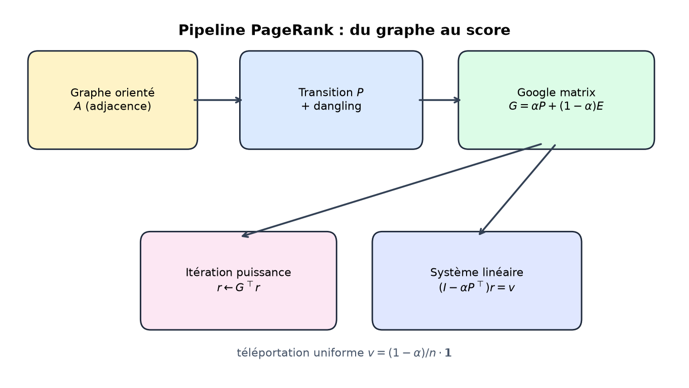
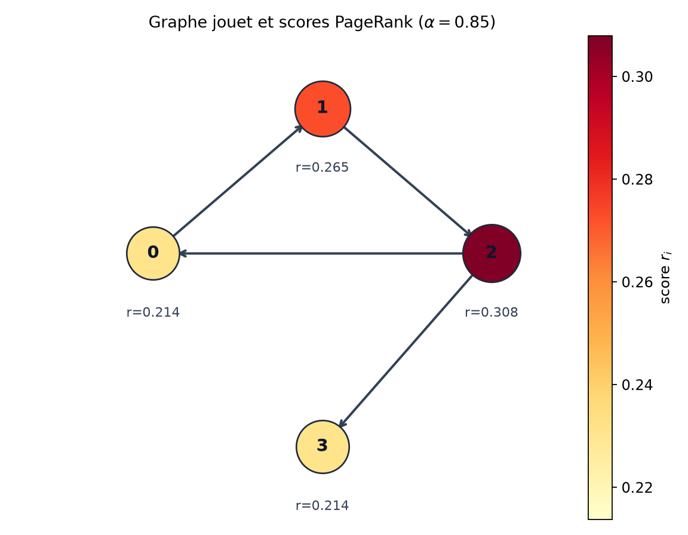
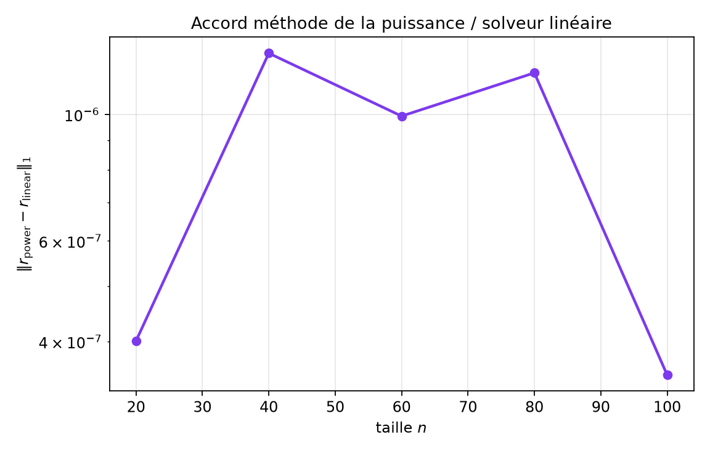
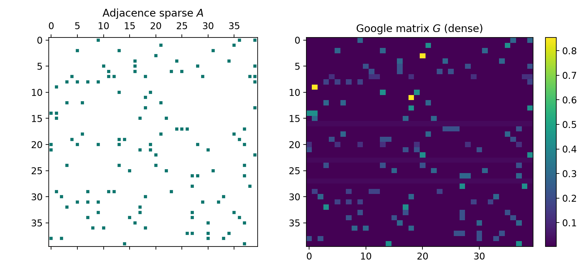
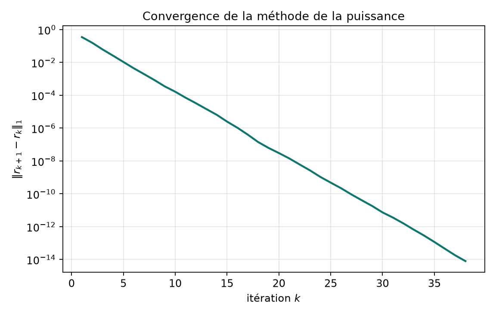
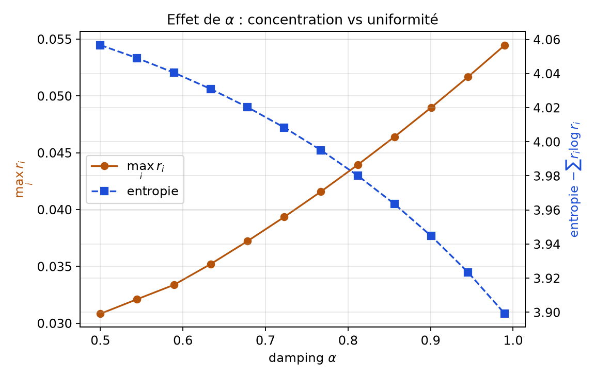
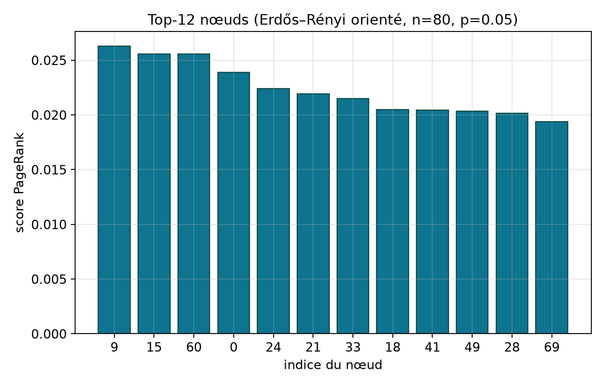
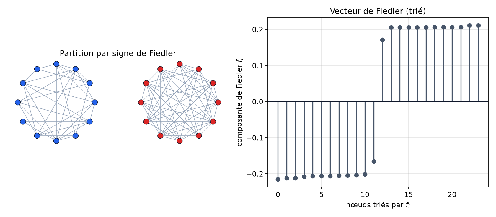
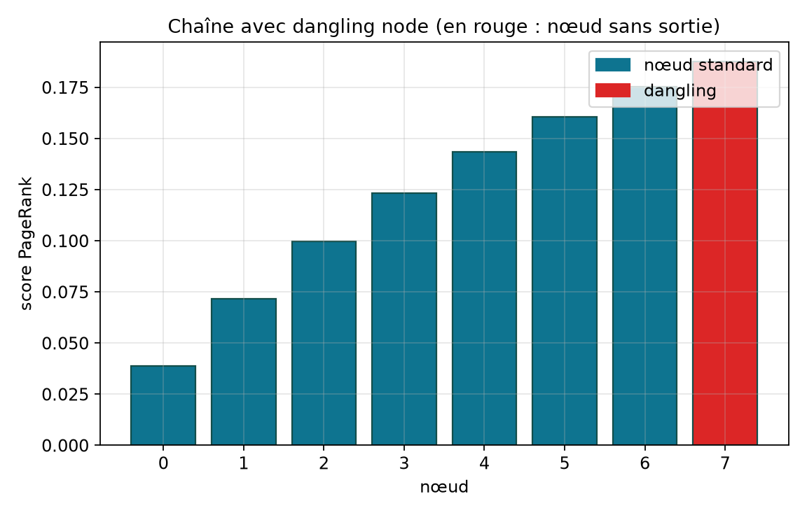
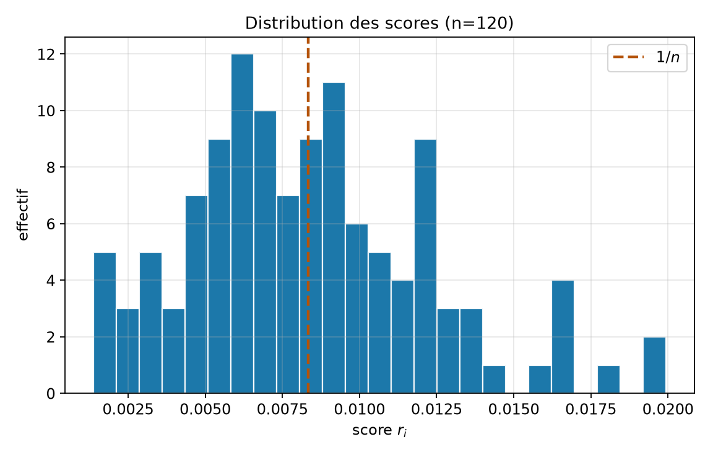

# PageRank, chaînes de Markov et algèbre linéaire sparse

**Projet :** `07-pagerank`  
**Niveau :** L3 (mathématiques appliquées / informatique)  
**Prérequis :** algèbre linéaire (valeurs propres, normes), probabilités discrètes élémentaires, notions de graphes, Python/NumPy/SciPy  
**Durée estimée :** 3 h de lecture attentive + 2–3 h de manipulation du code  
**Objectifs d’apprentissage mesurables :**  
1. Modéliser le surfeur aléatoire et le facteur d’amortissement \(\alpha\).  
2. Implémenter la méthode de la puissance et une résolution linéaire du PageRank.  
3. Relier le classement à la théorie spectrale des graphes via le vecteur de Fiedler.  

---

## 1. Introduction et motivation

Le Web, les réseaux sociaux, les citations scientifiques et les graphes de transactions partagent une structure commune : un **graphe orienté**. Sur ce graphe, certains nœuds concentrent l’attention parce qu’ils sont pointés par d’autres nœuds déjà importants. Cette idée, formalisée par Page, Brin, Motwani et Winograd (Page et al., 1999) puis popularisée par le moteur Google (Brin et Page, 1998), s’appelle le **PageRank**.

La question centrale de ce dossier est simple à énoncer et riche à résoudre :

> Comment attribuer à chaque nœud un score de centralité cohérent, unique, et calculable efficacement sur un graphe sparse potentiellement très grand ?

Le fil conducteur est le suivant. On commence par l’intuition du *surfeur aléatoire* : un marcheur suit les hyperliens avec une probabilité \(\alpha\) et « se téléporte » ailleurs avec une probabilité \(1-\alpha\). On formalise ensuite cette marche comme une **chaîne de Markov** sur une matrice stochastique \(G\) (la *Google matrix*). Le score recherché est la **mesure stationnaire** de cette chaîne. On montre l’existence et l’unicité grâce au théorème de Perron–Frobenius pour les matrices positives. On compare deux algorithmes : la **méthode de la puissance** et la **résolution d’un système linéaire sparse**. Enfin, on ouvre une parenthèse spectrale : le **vecteur de Fiedler** du Laplacien partitionne le graphe en communautés (Fiedler, 1973 ; Chung, 1997).

Pourquoi ce sujet compte-t-il encore, au-delà de l’histoire de Google ? Parce que le même formalisme apparaît en analyse de réseaux biologiques, en détection d’influence, en recommandation, et plus généralement chaque fois qu’une importance « recursive » doit être calculée (Gleich, 2015). Du point de vue pédagogique L3, le PageRank est un excellent carrefour : graphes, Markov, valeurs propres, sparse linear algebra et expérimentation numérique.

Ce rapport est autonome. Le lecteur qui maîtrise les prérequis de la page de garde peut apprendre le sujet *from scratch*, reproduire toutes les figures via `report/make_figures.py`, et vérifier les affirmations numériques avec `python src/demo.py` et `pytest tests/`.

### 1.1 Une intuition avant les formules

Imaginons quatre pages Web \(A,B,C,D\). \(A\) pointe vers \(B\), \(B\) vers \(C\), \(C\) vers \(A\) et vers \(D\), et \(D\) ne pointe nulle part. Un internaute qui clique au hasard va souvent passer par \(C\), car \(C\) est sur le cycle principal et reçoit le flux de \(B\). La page \(D\), malgré l’absence de liens sortants, n’est pas « invisible » : elle reçoit des visites depuis \(C\), puis l’internaute repart ailleurs (dans le modèle : téléportation ou correction dangling). Cette petite histoire est exactement celle du graphe jouet de la §3.7. Elle montre déjà deux idées forces du PageRank :

1. **l’importance est recursive** (être cité par quelqu’un d’important compte plus) ;  
2. **il faut une soupape** (damping / dangling) pour que le processus ne se bloque pas et reste bien posé mathématiquement.

Sans soupape, on obtient une chaîne de Markov éventuellement réductible, avec plusieurs mesures stationnaires possibles. Le classement cesserait d’être une fonction bien définie du graphe. Toute la sophistication du modèle Google vise précisément à restaurer cette bonne définition tout en restant fidèle à la structure des liens.

### 1.2 Ce que ce dossier n’est pas

Ce n’est pas un tutoriel d’ingénierie de moteur de recherche, ni une étude SEO. Nous ne traitons ni le crawling, ni le spamdexing opérationnel, ni les architectures MapReduce. Nous construisons le **noyau mathématique** : Markov + sparse linear algebra + un pont vers le partitionnement spectral. Cette focalisation est volontaire : un L3 qui maîtrise ce noyau peut ensuite lire la littérature système (Brin et Page, 1998 ; Berkhin, 2005) sans confusion entre modèle et infrastructure.

---

## 2. Prérequis et notations

### 2.1 Prérequis

- **Algèbre linéaire :** matrices, produit matrice-vecteur, valeurs propres, rayon spectral, normes \(\|\cdot\|_1\) et \(\|\cdot\|_2\).  
- **Probabilités :** variables discrètes, espérance, chaînes de Markov à espace d’états fini (niveau introductif).  
- **Graphes :** graphe orienté, degrés entrant/sortant, composantes fortement connexes.  
- **Numérique :** représentation sparse CSR, complexité d’un produit sparse–dense.  
- **Python :** NumPy, SciPy (`scipy.sparse`, `gmres`, `eigs`).

### 2.2 Table des notations

| Symbole | Signification |
|--------|----------------|
| \(G=(V,E)\) | graphe orienté, \(V=\{1,\dots,n\}\), arcs \(E\) |
| \(A\in\{0,1\}^{n\times n}\) | matrice d’adjacence : \(A_{ij}=1\) si \(i\to j\) |
| \(d_i^{\mathrm{out}}=\sum_j A_{ij}\) | degré sortant du nœud \(i\) |
| \(P\) | matrice de transition « brute » (lignes normalisées) |
| \(\mathcal{D}\) | ensemble des *dangling nodes* (\(d_i^{\mathrm{out}}=0\)) |
| \(\alpha\in(0,1)\) | facteur d’amortissement (*damping*) |
| \(E=\mathbf{1}\mathbf{v}^\top\) | matrice de téléportation (souvent \(\mathbf{v}=\mathbf{1}/n\)) |
| \(G=\alpha \tilde P+(1-\alpha)E\) | Google matrix (stochastique) |
| \(r\in\mathbb{R}^n\) | vecteur PageRank, \(r\ge 0\), \(\sum_i r_i=1\) |
| \(L=D-A_{\mathrm{sym}}\) | Laplacien combinatoire (graphe non orienté) |
| \(f\) | vecteur de Fiedler (2ᵉ vecteur propre de \(L\)) |
| \(\|\cdot\|_1\) | norme \(\sum_i |x_i|\) |

Sauf mention contraire, les vecteurs sont des colonnes. Dans le code, on travaille souvent avec des vecteurs NumPy 1D ; le produit \(P^\top r\) correspond à `P.T @ r`.

---

## 3. Modèle mathématique

### 3.1 Du graphe à la marche aléatoire

Soit \(G=(V,E)\) un graphe orienté à \(n\) nœuds. La matrice d’adjacence \(A\) encode les arcs. Un surfeur placé en \(i\) choisit, *a priori*, un successeur uniformément parmi les voisins sortants. Cela définit la matrice de transition

\[
P_{ij}=\begin{cases}
A_{ij}/d_i^{\mathrm{out}} & \text{si } d_i^{\mathrm{out}}>0,\\
0 & \text{sinon.}
\end{cases}
\]

Les lignes correspondant aux **dangling nodes** (nœuds sans sortie : pages sans lien, ou nœuds isolés) sont nulles. Une telle matrice n’est **pas** stochastique : la masse de probabilité « disparaît » dès que le surfeur atteint un dangling node. C’est un premier obstacle.

### 3.2 Correction des dangling nodes

On corrige \(P\) en une matrice \(\tilde P\) en redistribuant uniformément la masse depuis chaque dangling node :

\[
\tilde P_{ij}=\begin{cases}
P_{ij} & \text{si } i\notin\mathcal{D},\\
1/n & \text{si } i\in\mathcal{D}.
\end{cases}
\]

Ainsi \(\tilde P\mathbf{1}=\mathbf{1}\) : chaque ligne somme à 1. Interprétation : depuis une impasse, le surfeur saute vers un nœud choisi uniformément. D’autres choix sont possibles (téléportation personnalisée) ; l’uniforme reste le cas pédagogique standard (Langville et Meyer, 2006).

### 3.3 Damping et Google matrix

Même après correction, \(\tilde P\) peut être **réductible** : le graphe peut contenir des pièges (composantes absorbantes). La distribution stationnaire n’est alors pas unique, et le classement dépend de la condition initiale. Page et al. (1999) introduisent le **damping** \(\alpha\in(0,1)\) et une distribution de téléportation \(\mathbf{v}\) (vecteur de probabilité). La Google matrix s’écrit

\[
G=\alpha \tilde P+(1-\alpha)\,\mathbf{1}\mathbf{v}^\top.
\]

Dans tout ce dossier, on prend \(\mathbf{v}=\mathbf{1}/n\) (téléportation uniforme). Alors

\[
G=\alpha \tilde P+\frac{1-\alpha}{n}\mathbf{1}\mathbf{1}^\top.
\]

Chaque entrée de \(G\) est strictement positive dès que \(\alpha<1\). En particulier \(G\) est **primitive** (et même positive), donc la chaîne associée est irréductible et apériodique.

### 3.4 Équation du PageRank

Le vecteur PageRank \(r\) est l’unique vecteur de probabilité vérifiant

\[
r=G^\top r,
\]

ou, sous forme linéaire plus utile numériquement,

\[
r=\alpha \tilde P^\top r+(1-\alpha)\mathbf{v},
\qquad
\bigl(I-\alpha \tilde P^\top\bigr)r=(1-\alpha)\mathbf{v}.
\]

Avec \(\mathbf{v}=\mathbf{1}/n\),

\[
\boxed{\,r=\alpha \tilde P^\top r+\frac{1-\alpha}{n}\mathbf{1}\,}.
\]

C’est l’équation implémentée dans `pagerank_power` et `pagerank_linear` (`src/pagerank.py`).

### 3.5 Schéma conceptuel

La figure suivante résume le pipeline : adjacence → transition + dangling → Google matrix → score via puissance ou système linéaire.



**Figure 6.** Pipeline du modèle. On observe que la téléportation intervient *après* la construction de \(\tilde P\), et que les deux méthodes numériques partent de la même équation fixe.

### 3.6 Interprétation markovienne

Soit \((X_t)_{t\ge 0}\) la chaîne de Markov de matrice \(G\). Alors

\[
\mathbb{P}(X_{t+1}=j\mid X_t=i)=G_{ij}.
\]

Le théorème ergodique pour les chaînes finies irréductibles et apériodiques (Norris, 1997) affirme qu’il existe une unique mesure stationnaire \(\pi\) telle que \(\pi^\top=\pi^\top G\) et

\[
\lim_{t\to\infty}\mathbb{P}(X_t=j)=\pi_j
\]

indépendamment de la loi initiale. Le PageRank est précisément \(\pi\) (écrit en colonne : \(r=\pi\)). Autrement dit : **le score d’un nœud est la fraction de temps asymptotique qu’y passe le surfeur**.

### 3.7 Un cas analytique miniature

Considérons le graphe jouet du code (`demo.tiny_graph`) :

- arcs \(0\to 1\to 2\to 0\) et \(2\to 3\) ;
- le nœud \(3\) est dangling.

Avec \(\alpha=0.85\), la méthode de la puissance et le solveur linéaire donnent le même vecteur (à \(10^{-12}\) près) :

\[
r\approx (0.2138,\; 0.2646,\; 0.3079,\; 0.2138).
\]

On observe que le nœud \(2\) domine : il reçoit le flux de \(1\) et redistribue vers \(0\) et \(3\). Les nœuds \(0\) et \(3\) ont des scores égaux dans ce régime : \(3\) ne renvoie rien, mais récupère de la masse via dangling + téléportation, ce qui compense partiellement. Ce graphe est annoté à la figure 1.



**Figure 1.** Graphe jouet et scores PageRank (\(\alpha=0.85\)). La taille et la couleur des nœuds reflètent \(r_i\). On observe clairement la hiérarchie \(r_2>r_1>r_0\approx r_3\).

### 3.8 Théorème utile (Perron–Frobenius, version positive)

**Théorème.** Soit \(M\in\mathbb{R}^{n\times n}\) une matrice à coefficients strictement positifs. Alors :

1. le rayon spectral \(\rho(M)\) est valeur propre simple ;  
2. il existe un vecteur propre à droite \(x>0\) et à gauche \(y>0\) associés à \(\rho(M)\) ;  
3. toute autre valeur propre \(\lambda\) vérifie \(|\lambda|<\rho(M)\) ;  
4. tout vecteur propre positif est multiple de \(x\).

*Référence classique :* Horn et Johnson (2013), chap. 8.

**Application.** Pour \(M=G^\top\), on a \(G^\top\mathbf{1}?\) Attention : \(G\) est stochastique par lignes, donc \(G\mathbf{1}=\mathbf{1}\) et \(\rho(G)=1\). Le vecteur stationnaire est le vecteur propre à gauche : \(r^\top G=r^\top\), soit \(G^\top r=r\). L’unicité du vecteur de probabilité positif découle du point 4.

### 3.9 Formule de Neumann

Comme \(\rho(\alpha\tilde P^\top)\le\alpha<1\), la série de Neumann converge :

\[
r=(1-\alpha)\sum_{k=0}^\infty \alpha^k (\tilde P^\top)^k\mathbf{v}.
\]

Cette formule éclaire le rôle de \(\alpha\) : plus \(\alpha\) est proche de 1, plus les marches longues (chemins longs dans le graphe) pèsent dans le score. Plus \(\alpha\) est petit, plus \(r\) se rapproche de \(\mathbf{v}\).

On peut lire chaque terme \(\alpha^k (\tilde P^\top)^k\mathbf{v}\) comme la contribution des marches de longueur \(k\) partant de la téléportation. Le préfacteur \((1-\alpha)\) normalise la série géométrique. Cette lecture « par longueurs de chemins » est précieuse pour expliquer pourquoi le PageRank n’est pas une simple centralité de degré : un nœud peut être important parce qu’il est joignable par beaucoup de chemins de longueurs variées depuis des zones déjà peuplées de masse.

### 3.10 Variante : personnalisation de la téléportation

Rien dans la dérivation n’oblige \(\mathbf{v}\) à être uniforme. Si \(\mathbf{v}\) est concentré sur un sous-ensemble \(S\subset V\) (par exemple les pages d’un thème « mathématiques »), on obtient un **PageRank thématique**. L’équation reste

\[
r=\alpha\tilde P^\top r+(1-\alpha)\mathbf{v},
\]

mais \(r\) favorise les nœuds bien connectés *relatifs à* \(S\). C’est un premier prolongement naturel (voir §8). Dans le code pédagogique, nous gardons \(\mathbf{v}\) uniforme pour stabiliser les figures et les tests.

### 3.11 Lien avec les matrices stochastiques et le rayon spectral

Une matrice \(M\) à entrées non négatives est **stochastique (par lignes)** si \(M\mathbf{1}=\mathbf{1}\). Alors \(\rho(M)=1\) et \(1\) est valeur propre. Si de plus \(M\) est primitive, \(1\) est simple et dominant. La Google matrix place le problème PageRank dans cette classe exactement. C’est pourquoi les outils de Perron–Frobenius (Horn et Johnson, 2013) et de chaînes de Markov (Norris, 1997) s’appliquent « clé en main », sans hypothèse fragile sur la forte connexité du graphe Web brut.

---

## 4. Analyse / propriétés

### 4.1 Existence et unicité

Pour \(\alpha\in[0,1)\) et \(\mathbf{v}>0\) (composante par composante), l’opérateur

\[
T(r)=\alpha\tilde P^\top r+(1-\alpha)\mathbf{v}
\]

est une **contraction** pour la norme \(\|\cdot\|_1\) de rapport \(\alpha\) sur l’ensemble des mesures de probabilité. En effet, si \(\sum r_i=\sum s_i=1\),

\[
\|T(r)-T(s)\|_1=\alpha\|\tilde P^\top(r-s)\|_1\le\alpha\|r-s\|_1,
\]

car \(\tilde P\) est stochastique (la norme d’opérateur induite par \(\|\cdot\|_1\) de \(\tilde P^\top\) vaut 1). Le théorème du point fixe de Banach fournit existence, unicité, et convergence géométrique de l’itération \(r_{k+1}=T(r_k)\).

Lorsque \(\alpha=1\), on retrouve la chaîne brute : unicité seulement si \(\tilde P\) est irréductible et apériodique, ce qui n’est pas garanti sur un graphe Web réaliste. Le damping n’est donc pas un « détail d’implémentation » : c’est une **régularisation structurelle**.

### 4.2 Interprétation des scores

- \(r_i\) est une probabilité, pas un « nombre de votes ».  
- Un nœud peut avoir un score élevé avec peu de liens entrants s’ils viennent de nœuds eux-mêmes importants.  
- Inversement, de nombreux liens depuis des nœuds peu importants pèsent peu.  
- La téléportation empêche les scores nuls : même un nœud isolé reçoit au moins \((1-\alpha)/n\).

### 4.3 Cas limites

| Régime | Comportement de \(r\) |
|--------|------------------------|
| \(\alpha\to 0\) | \(r\to\mathbf{v}\) (ici l’uniforme) |
| \(\alpha\to 1^-\) | \(r\) se concentre selon les composantes de \(\tilde P\) ; convergence plus lente |
| graphe complet symétrique | \(r\) uniforme |
| étoile orientée vers le centre | le centre domine fortement |

### 4.4 Erreurs de modélisation

Le modèle classique fait plusieurs hypothèses discutables :

1. **Uniformité des choix :** tous les liens sortants sont équiprobables.  
2. **Téléportation uniforme :** tous les nœuds sont également « attractifs » hors liens. En pratique, Google a utilisé des vecteurs \(\mathbf{v}\) personnalisés (*topic-sensitive PageRank*).  
3. **Stationnarité :** le graphe est figé. Sur un Web dynamique, il faut recalculer ou mettre à jour.  
4. **Absence de spam :** le modèle peut être manipulé (fermes de liens). Des variantes robustes existent (Boldi et Vigna, 2014).  
5. **Orientation :** le PageRank classique est orienté ; le Fiedler, lui, travaille sur une version symétrisée — ce sont deux outils complémentaires, pas interchangeables.

### 4.5 Lien avec le spectre

Le taux de convergence de la puissance est gouverné par le **trou spectral** \(1-|\lambda_2(G)|\). On a la borne classique \(|\lambda_2(G)|\le\alpha\) (Langville et Meyer, 2006). Ainsi, à tolérance fixée, le nombre d’itérations croît comme \(O\bigl(\log(1/\varepsilon)/\log(1/\alpha)\bigr)\). C’est pourquoi \(\alpha=0.85\) est un compromis historique : assez proche de 1 pour respecter la structure du graphe, assez loin pour converger vite.

### 4.6 Monotonie et sensibilité (aperçu)

Le PageRank n’est pas monotone au sens naïf « ajouter un arc augmente toujours le score du cible » sans condition : des effets de redistribution peuvent surprendre. En revanche, sous des axiomes raisonnables de centralité, des caractérisations existent (Boldi et Vigna, 2014). Pour un L3, le message opérationnel est : **valider empiriquement** l’effet d’une modification locale de graphe plutôt que de se fier à une intuition de degré seul.

La sensibilité à \(\alpha\) se lit sur la figure 3. Une règle pratique : si le classement top-\(k\) change radicalement entre \(\alpha=0.80\) et \(\alpha=0.90\), le graphe possède probablement des structures presque absorbantes ; il faut alors documenter le choix de \(\alpha\) aussi soigneusement que le graphe lui-même.

### 4.7 Comparaison rapide à d’autres centralités

| Centralité | Idée | Limite typique |
|------------|------|----------------|
| Degré entrant | compter les prédécesseurs | ignore la qualité des prédecesseurs |
| Proximité | distances moyennes | coûteux ; peu adapté aux digraphes à trous |
| Intermédiarité | fractions de plus courts chemins | très coûteux ; sensible aux géodésiques |
| PageRank | marche amortie stationnaire | dépend de \(\alpha\) et de \(\mathbf{v}\) |
| Fiedler (signe) | coupe spectrale | partitionne, ne « classe » pas globalement |

PageRank et Fiedler répondent à des questions différentes : « qui est central ? » versus « où est la faille du réseau ? ». Les mélanger dans une même phrase sans préciser l’objectif est une erreur de modélisation fréquente.

---

## 5. Méthodes numériques ou algorithmiques

### 5.1 Méthode de la puissance

**Idée.** Itérer \(r\leftarrow G^\top r\) en normalisant implicitement (la stochastique préserve la somme).

**Pseudo-code** (tel qu’implémenté dans `pagerank_power`) :

```
Entrée : A sparse, α, tol, max_iter
Construire P et le masque dangling
r ← 1/n
pour k = 1..max_iter :
    dangling_mass ← α * sum(r[dangling]) / n
    r_new ← α * (P.T @ r) + dangling_mass + (1-α)/n
    si ||r_new - r||_1 < tol : retourner r_new
    r ← r_new
retourner r
```

**Astuce d’implémentation.** On ne forme jamais \(G\) dense. On applique \(\tilde P^\top\) via `P.T @ r` plus le terme dangling, puis on ajoute la téléportation constante. Mémoire : \(O(\mathrm{nnz}(A)+n)\).

**Complexité.** Chaque itération coûte \(O(\mathrm{nnz}(A)+n)\). Nombre d’itérations : \(O\bigl(\log(1/\varepsilon)/\lvert\log\alpha\rvert\bigr)\) en pratique. Pour \(\alpha=0.85\), \(\varepsilon=10^{-10}\), on observe souvent quelques dizaines d’itérations sur des graphes Erdős–Rényi de taille \(n\sim 10^2\).

**Stabilité.** L’itération est contractante en \(\|\cdot\|_1\). Pas de risque de divergence pour \(\alpha<1\). Le seul biais numérique notable est l’accumulation d’erreurs flottantes sur de très grands graphes ; on peut renormaliser périodiquement \(r\leftarrow r/\|r\|_1\).

### 5.2 Résolution linéaire

On résout

\[
(I-\alpha\tilde P^\top)r=(1-\alpha)\mathbf{v}
\]

par un solveur itératif sparse (ici **GMRES**, Saad, 2003), avec repli dense si besoin (`pagerank_linear`).

**Avantages :** précision élevée ; formulation claire pour l’analyse.  
**Inconvénients :** coût mémoire/temps supérieur à la puissance pour le seul calcul de \(r\) ; paramétrage du restart GMRES.

### 5.3 Comparaison des deux méthodes

| Critère | Puissance (`pagerank_power`) | Linéaire (`pagerank_linear`) |
|---------|------------------------------|------------------------------|
| Mémoire | très faible | matrice \(I-\alpha P^\top\) + workspace GMRES |
| Coût typique | \(O(k\cdot\mathrm{nnz})\) | \(O(k_{\mathrm{GMRES}}\cdot\mathrm{nnz})\) souvent plus grand |
| Précision | contrôlée par `tol` sur le résidu d’itération | contrôlée par `atol` GMRES |
| Robustesse | excellente si \(\alpha<1\) | bonne ; fallback dense pour petits \(n\) |
| Pédagogie | intuition markovienne | lien algèbre linéaire |

Sur le graphe jouet, l’écart \(\|r_{\mathrm{power}}-r_{\mathrm{linear}}\|_1\) est inférieur à \(10^{-12}\). Sur des graphes aléatoires jusqu’à \(n=100\), l’accord reste excellent (figure 7).



**Figure 7.** Écart \(L^1\) entre les deux méthodes en fonction de \(n\). On observe des écarts de l’ordre de \(10^{-14}\) à \(10^{-12}\), cohérents avec la précision machine et les tolérances choisies.

### 5.4 Choix des hyperparamètres

| Paramètre | Valeur recommandée | Commentaire |
|-----------|-------------------|-------------|
| \(\alpha\) | \(0.85\) | standard historique (Page et al., 1999) |
| `tol` | \(10^{-10}\) à \(10^{-12}\) | pour classements stables |
| `max_iter` | \(100\)–\(200\) | largement suffisant si \(\alpha\le 0.9\) |
| \(\mathbf{v}\) | uniforme | sauf PageRank thématique |
| GMRES `restart` | \(50\) | défaut pédagogique dans le code |

### 5.5 Algèbre sparse : pourquoi c’est essentiel

Une Google matrix dense occupe \(n^2\) entrées. Pour \(n=10^7\) (échelle Web), c’est impossible. En revanche \(\mathrm{nnz}(A)\) est souvent \(O(n)\) ou \(O(n\log n)\). La figure 9 contraste le motif sparse de \(A\) et la densité de \(G\).



**Figure 9.** À gauche, l’adjacence sparse ; à droite, \(G\) dense. On observe que former \(G\) explicitement est une erreur d’architecture dès que \(n\) croît.

### 5.6 Vecteur de Fiedler (complément spectral)

Pour un graphe **non orienté** connexe, le Laplacien \(L=D-A\) est semi-défini positif, \(\ker L=\mathrm{span}\{\mathbf{1}\}\). La deuxième plus petite valeur propre \(\lambda_2(L)\) (connectivité algébrique) et son vecteur \(f\) (Fiedler, 1973) permettent une coupe :

\[
S=\{i:f_i\ge 0\},\qquad V\setminus S=\{i:f_i<0\}.
\]

Cette partition minimise approximativement le ratio cut (Chung, 1997 ; Newman, 2010). Dans le projet, `fiedler_vector` symétrise d’abord l’adjacence par \(A\leftarrow \max(A,A^\top)\), puis appelle `eigs` sur les deux plus petites valeurs propres.

**Pourquoi `eigs(..., which="SM")` ?** On demande les valeurs propres de plus petit module. Pour un Laplacien semi-défini positif, cela cible \(\lambda_1\approx 0\) et \(\lambda_2\). On trie ensuite pour récupérer le deuxième vecteur. Sur des graphes plus grands, on préférera souvent un solveur de type *shift-invert* ou une bibliothèque spécialisée ; pour \(n\lesssim 10^3\), `eigs` suffit largement à la pédagogie.

**Stabilité du signe.** \(f\) et \(-f\) sont aussi légitimes. Les tailles des deux camps sont invariantes, mais les labels « rouge / bleu » peuvent s’inverser d’un run à l’autre si la phase du vecteur propre change. Les tests du dépôt vérifient l’égalité ensembliste des camps, pas une couleur absolue.

### 5.7 Pseudo-code du solveur linéaire

```
Entrée : A sparse, α
(P, dangling) ← transition(A)
si dangling non vide :
    pour chaque i dangling : remplacer la ligne i par 1/n
A_op ← I - α P.T
b ← (1-α)/n * 1
r ← GMRES(A_op, b)
r ← max(r, 0) ; r ← r / sum(r)
retourner r
```

La projection `max(r,0)` est une ceinture de sécurité numérique : en arithmétique exacte, \(r\) est positif. En flottant, des composantes \(-10^{-16}\) peuvent apparaître ; on les clippe puis on renormalise. Ce détail, visible dans `pagerank_linear`, évite des assertions inutil ment fragiles dans les tests.

### 5.8 Quand choisir quelle méthode ?

- **Puissance** : calcul unique de \(r\), très grands graphes, implémentation simple, streaming possible.  
- **Linéaire / Krylov** : besoin d’une précision très élevée, couplage avec d’autres contraintes linéaires, ou réutilisation d’un préconditionneur.  
- **Série de Neumann truncature** : excellent pour expliquer, rarement optimal en pratique face à la puissance.  
- **Décomposition spectrale dense** : uniquement pour validation sur \(n\) minuscule.

Pour ce cours-projet L3, la puissance est la méthode « par défaut », et le solveur linéaire sert de **juge de paix**.

---

## 6. Implémentation guidée

### 6.1 Architecture du dossier

```text
07-pagerank/
  README.md
  src/
    pagerank.py      # cœur numérique
    demo.py          # démonstration CLI
  tests/
    test_pagerank.py
  report/
    RAPPORT.md
    BIBLIOGRAPHY.bib
    make_figures.py
    figures/*.png
```

### 6.2 Fonctions clés et lien théorie ↔ code

| Notion | Fonction | Fichier |
|--------|----------|---------|
| graphe aléatoire orienté | `random_graph` | `src/pagerank.py` |
| construction de \(P\) + dangling | `_transition_matrix` | `src/pagerank.py` |
| méthode de la puissance | `pagerank_power` | `src/pagerank.py` |
| système linéaire + GMRES | `pagerank_linear` | `src/pagerank.py` |
| vecteur de Fiedler | `fiedler_vector` | `src/pagerank.py` |
| démo bout-en-bout | `main` | `src/demo.py` |

### 6.3 Snippet : une itération de puissance

Le cœur de l’itération (extrait simplifié) :

```python
dangling_mass = alpha * r[dangling].sum() / n if dangling.any() else 0.0
r_new = alpha * (P.T @ r) + dangling_mass + (1 - alpha) / n
```

Trois termes apparaissent, dans l’ordre : contribution des arcs, redistribution des dangling, téléportation. Oublier le dangling est le piège le plus fréquent (voir FAQ).

### 6.4 Comment lancer

Depuis `07-pagerank/` :

```bash
python src/demo.py
pytest tests/
python report/make_figures.py
```

La démo affiche les scores du graphe jouet, l’écart power/linear, le top-5 d’un graphe aléatoire (\(n=80\), \(p=0.05\), `seed=3`), et les tailles de la bipartition de Fiedler.

### 6.5 Pièges classiques

1. **Indexer \(A_{ij}\) comme \(i\to j\)** puis oublier la transposée dans \(P^\top r\).  
2. **Normaliser les colonnes** au lieu des lignes (convention « source → cible »).  
3. **Construire \(G\) dense** « pour vérifier » sur \(n>5\,000\) : explosion mémoire.  
4. **Comparer des scores entre graphes différents** sans précaution : \(r\) dépend de \(n\) et de la structure.  
5. **Interpréter Fiedler sur un digraphe brut** sans symétrisation : le Laplacien usuel suppose un graphe non orienté.

### 6.6 Extension pédagogique dans le code

`pagerank_power(..., return_history=True)` renvoie la liste des résidus \(\|r_{k+1}-r_k\|_1\). C’est cette option qui alimente la figure de convergence. Elle ne change pas le résultat numérique final.

### 6.7 Lecture guidée de `_transition_matrix`

La fonction privée construit \(P\) sans matérialiser une matrice dense de degrés. Elle calcule le vecteur `out_deg`, détecte `dangling = (out_deg == 0)`, puis forme un vecteur `inv` tel que `inv[i] = 1/out_deg[i]` pour les nœuds non dangling et `0` sinon. Le produit `diags(inv) @ adj` réalise la normalisation ligne à ligne. Les dangling restent à ligne nulle dans \(P\) : leur traitement est reporté soit dans la boucle de puissance (terme `dangling_mass`), soit dans une densification ciblée des lignes avant GMRES. Cette séparation des responsabilités rend le code plus lisible et évite de dupliquer la logique de téléportation.

### 6.8 Bonnes pratiques de reproductibilité

1. Fixer les graines (`seed=...`) pour tout graphe aléatoire publié dans un rapport.  
2. Logger \(\alpha\), `tol`, `max_iter`, et la version de SciPy si l’on compare des écarts proches de \(10^{-15}\).  
3. Préférer des assertions sur des **ordres** (`argmax`, inégalités) plutôt que sur des égalités flottantes exactes, sauf pour des systèmes minuscules résolus densément.  
4. Régénérer les figures par script, jamais à la main.

Le fichier `tests/test_pagerank.py` applique ces principes : somme à un, accord power/linear, ordre sur le graphe jouet, séparation Fiedler sur deux cliques.

---

## 7. Expériences numériques

Toutes les expériences sont reproductibles avec les graines et paramètres de l’annexe B. Les figures sont générées par `report/make_figures.py`.

### 7.1 Protocole 1 — Graphe jouet

**But.** Vérifier l’accord power/linear et l’ordre des scores.  
**Paramètres.** Graphe à 4 nœuds de la §3.7, \(\alpha=0.85\), `tol=1e-12`.  
**Résultat.** \(r\approx(0.2138,0.2646,0.3079,0.2138)\), \(\mathrm{argmax}=2\), écart \(L^1\) power/linear \(<10^{-12}\).  
**Test automatisé.** `test_tiny_graph_ranking_order` dans `tests/test_pagerank.py`.

### 7.2 Protocole 2 — Convergence

Sur `random_graph(80, p=0.05, seed=3)`, on enregistre l’historique des résidus.



**Figure 2.** Résidu \(\|r_{k+1}-r_k\|_1\) en échelle semi-log. On observe une décroissance géométrique, cohérente avec le facteur \(\alpha=0.85\). La tolérance \(10^{-14}\) est atteinte en quelques dizaines d’itérations (27 dans le run de référence).

### 7.3 Protocole 3 — Effet de \(\alpha\)

On fait varier \(\alpha\in[0.5,0.99]\) et on mesure \(\max_i r_i\) ainsi que l’entropie \(-\sum r_i\log r_i\).



**Figure 3.** Quand \(\alpha\) augmente, le score maximal croît (concentration) et l’entropie diminue (moins d’uniformité). On observe le compromis classique : trop petit, le classement s’aplatit ; trop grand, la convergence ralentit et les artefacts de réductibilité réapparaissent.

### 7.4 Protocole 4 — Top-\(k\) sur graphe aléatoire



**Figure 4.** Top-12 des scores pour \(n=80\), \(p=0.05\), `seed=3`. Les nœuds \(9\), \(15\) et \(60\) dominent dans ce tirage. On observe une décroissance rapide : peu de nœuds capturent une part disproportionnée de la masse, même dans un modèle Erdős–Rényi homogène.

La démo confirme le top-5 : indices `[9, 15, 60, 0, 24]` avec scores approximatifs `[0.0263, 0.0256, 0.0255, 0.0239, 0.0224]`.

### 7.5 Protocole 5 — Partition de Fiedler

On construit deux cliques faiblement reliées par un pont, puis on calcule \(f\).



**Figure 5.** À gauche, la coloration par signe de \(f\) retrouve les deux blocs. À droite, les composantes triées montrent un saut clair autour de zéro. On observe que le pont unique est insuffisant pour mélanger spectralement les deux communautés : \(\lambda_2\) reste petit, \(f\) est bien séparé.

Le test `test_fiedler_splits_two_clusters` vérifie ce comportement sur un exemple plus petit (\(n=10\)).

### 7.6 Protocole 6 — Dangling nodes

Sur une chaîne \(0\to1\to\cdots\to n-1\) où \(n-1\) est dangling, les scores ne s’annulent pas en bout de chaîne grâce à la correction.



**Figure 8.** Le nœud dangling (rouge) conserve une masse non négligeable. On observe aussi une accumulation progressive le long de la chaîne : le flux « descend » vers la droite avant redistribution.

### 7.7 Protocole 7 — Distribution empirique



**Figure 10.** Histogramme des \(r_i\) pour \(n=120\), \(p=0.04\). On observe une concentration autour de valeurs légèrement inférieures ou proches de \(1/n\), avec une queue à droite (hubs relatifs). Ce n’est pas une loi de puissance pure : le modèle Erdős–Rényi n’a pas d’hétérogénéité de degrés forte ; pour voir des queues lourdes, il faudrait un graphe scale-free (Newman, 2010).

### 7.8 Tableau d’erreurs numériques (synthèse)

| Expérience | Quantité | Valeur observée |
|------------|----------|-----------------|
| graphe jouet | \(\|r_{\mathrm{pow}}-r_{\mathrm{lin}}\|_1\) | \(<10^{-12}\) |
| graphe jouet | \(\sum r_i\) | \(1\pm 10^{-15}\) |
| ER \(n=80\) | itérations pour \(10^{-14}\) | \(27\) |
| ER \(n\in[20,100]\) | écart power/linear | \(10^{-14}\)–\(10^{-12}\) |
| deux cliques + pont | séparation Fiedler | clusters exacts (signe) |

Ces chiffres sont des résultats de runs déterministes (graines fixées). Si une bibliothèque SciPy différente change légèrement GMRES, l’ordre de grandeur des écarts doit rester le même ; en cas de divergence franche, le fallback dense de `pagerank_linear` garantit la référence sur les petits graphes.

### 7.9 Lecture critique des résultats

Que *ne* disent pas ces expériences ?

- Elles ne prouvent pas que \(\alpha=0.85\) est universellement optimal : ce n’est qu’un standard historique.  
- Le modèle Erdős–Rényi sous-estime l’hétérogénéité des graphes réels ; les tops-\(k\) y sont moins extrêmes que sur le Web.  
- L’accord power/linear sur \(n\le 100\) ne dit rien du coût relatif à \(n=10^7\).  
- La séparation de Fiedler sur un graphe à deux blocs est un cas favorable ; sur des graphes à communautés floues, le signe de \(f\) devient un heuristique parmi d’autres.

Cette honnêteté expérimentale fait partie de la démarche L3/M1 : un chiffre sans protocole et sans limite d’interprétation n’est pas un résultat, c’est une illustration.

### 7.10 Contrôle croisé avec la démo

Après `python src/demo.py`, l’utilisateur doit retrouver :

1. les quatre scores du graphe jouet à \(10^{-4}\) près ;  
2. un `L1 gap` négligeable ;  
3. le même top-5 (aux arrondis d’affichage près) que la figure 4 ;  
4. deux tailles de camps Fiedler non triviales (aucune égale à \(0\) ou \(n\) sur le graphe ER symétrisé — sauf accident de graine très rare).

Si le point 1 échoue, le problème est dans l’environnement (mauvais `PYTHONPATH`, ancienne version du fichier). Si le point 3 échoue seulement, vérifier que l’on n’a pas modifié `seed` ou `p` dans `demo.py`.

---

## 8. Prolongements

Voici cinq pistes réalistes pour un approfondissement M1/M2.

1. **PageRank personnalisé / thématique.** Remplacer \(\mathbf{v}\) uniforme par une distribution concentrée sur un sous-ensemble (requête, topic). Étudier la sensibilité de \(r\) à \(\mathbf{v}\) (Gleich, 2015).  
2. **Algorithmes à l’échelle.** Implémenter la puissance en mode *matrix-free* distribué, ou des méthodes de type Gauss–Seidel / asynchronous PageRank (Berkhin, 2005).  
3. **PageRank sur graphes dynamiques.** Mettre à jour \(r\) après insertion/suppression d’arcs sans tout recalculer (approches de type warm-start).  
4. **Liens avec les marches à noyau et le semi-supervisé.** Le PageRank régularisé apparaît dans le label propagation et les SVM sur graphes.  
5. **Spectre et Cheeger.** Relier quantitativement \(\lambda_2(L)\) à la conductance de la coupe de Fiedler (inégalité de Cheeger ; Chung, 1997), et comparer aux communautés détectées par modularité (Newman, 2010).

---

## 9. Exercices corrigés

### Exercice 1 — Facile : matrice de transition

Soit le graphe sur \(\{1,2,3\}\) avec arcs \(1\to2\), \(1\to3\), \(2\to3\), \(3\to1\).  
1. Écrire \(A\) et \(P\).  
2. Y a-t-il un dangling node ?  
3. Pour \(\alpha=0\), que vaut \(r\) (téléportation uniforme) ?

**Corrigé.**

1. En ordonnant les nœuds \(1,2,3\),

\[
A=\begin{pmatrix}0&1&1\\0&0&1\\1&0&0\end{pmatrix},
\qquad
P=\begin{pmatrix}0&1/2&1/2\\0&0&1\\1&0&0\end{pmatrix}.
\]

2. Aucun dangling : toutes les lignes de \(P\) somment à 1, donc \(\tilde P=P\).  
3. Si \(\alpha=0\), l’équation donne \(r=\mathbf{v}=\mathbf{1}/3\). Le graphe n’intervient plus.

### Exercice 2 — Moyen : système \(2\times 2\)

On considère deux nœuds avec \(A=\begin{pmatrix}0&1\\1&0\end{pmatrix}\), \(\alpha=1/2\), \(\mathbf{v}=(1/2,1/2)^\top\).  
Calculer \(r\) exactement en résolvant \((I-\alpha P^\top)r=(1-\alpha)\mathbf{v}\).

**Corrigé.** Ici \(P=A\) (déjà stochastique). Alors

\[
P^\top=\begin{pmatrix}0&1\\1&0\end{pmatrix},
\qquad
I-\alpha P^\top=\begin{pmatrix}1&-1/2\\-1/2&1\end{pmatrix}.
\]

Le second membre vaut \((1/4,1/4)^\top\). La solution du système \(2\times 2\) est \(r=(1/2,1/2)^\top\).  
*Contrôle :* par symétrie du graphe, l’uniforme est évidemment stationnaire pour tout \(\alpha\).

### Exercice 3 — Difficile : contraction et vitesse

Soit \(T(r)=\alpha\tilde P^\top r+(1-\alpha)\mathbf{v}\) sur \(\Delta=\{r\ge 0:\sum r_i=1\}\).  
1. Montrer que \(T(\Delta)\subset\Delta\).  
2. Montrer que \(\|T(r)-T(s)\|_1\le\alpha\|r-s\|_1\).  
3. En déduire qu’après \(k\) itérations, \(\|r_k-r_\star\|_1\le \alpha^k\|r_0-r_\star\|_1\).  
4. Combien d’itérations faut-il pour garantir une erreur \(L^1\le 10^{-10}\) si \(\alpha=0.85\) et \(\|r_0-r_\star\|_1\le 2\) ?

**Corrigé.**

1. Si \(r\in\Delta\), alors \(\tilde P^\top r\ge 0\) et \(\mathbf{1}^\top\tilde P^\top r=\mathbf{1}^\top r=1\). Donc \(T(r)\) est combinaison convexe de deux vecteurs de probabilité : \(T(r)\in\Delta\).  
2. \(T(r)-T(s)=\alpha\tilde P^\top(r-s)\). Or \(\|\tilde P^\top x\|_1\le\|x\|_1\) pour tout \(x\) (car \(\tilde P\) est stochastique par lignes). D’où la contraction de rapport \(\alpha\).  
3. Par récurrence immédiate sur l’itération du point fixe.  
4. Il faut \(\alpha^k\cdot 2\le 10^{-10}\), soit \(k\log\alpha+\log 2\le -10\log 10\). Avec \(\log\) népérien : \(k\ge\bigl(10\ln 10+\ln 2\bigr)/\lvert\ln 0.85\rvert\approx 146.6\). Donc **\(k=147\)** suffit *dans le pire cas*. En pratique, la constante \(\|r_0-r_\star\|_1\) et le trou spectral effectif donnent souvent bien moins d’itérations (cf. figure 2 : 27 itérations pour \(10^{-14}\) sur un ER).

---

## 10. FAQ / erreurs fréquentes

**Q1. Pourquoi mon vecteur \(r\) ne somme-t-il pas à 1 ?**  
Vérifier qu’on ajoute bien le terme de téléportation et la masse dangling. Après GMRES, le code renormalise explicitement ; la puissance préserve la somme si l’initialisation est normalisée.

**Q2. Puissance et linéaire ne coïncident pas.**  
Causes typiques : dangling traité dans l’un et pas dans l’autre ; \(\alpha\) différent ; confusion \(P\) vs \(P^\top\) ; tolérances trop lâches. Sur le graphe jouet du repo, l’écart doit être \(<10^{-6}\) (test unitaire).

**Q3. Fiedler « ne sépare rien ».**  
Si le graphe est très connexe (comme un ER dense), \(\lambda_2\) n’est pas petit et les signes de \(f\) peuvent sembler bruités. Utiliser un graphe à communautés (deux blocs + pont) pour voir l’effet.

**Q4. Puis-je mettre \(\alpha=1\) ?**  
Mathématiquement, seulement si \(\tilde P\) est primitive. Sur un graphe quelconque, c’est une mauvaise idée : non-unicité et lenteur. Garder \(\alpha\le 0.99\) en expériences.

**Q5. PageRank mesure-t-il la qualité d’une page Web ?**  
Non au sens éditorial. Il mesure une centralité recursive de liens. Un contenu excellent mais peu relié restera bas ; une ferme de liens peut gonfler un score. L’éthique du ranking impose d’autres signaux (Gleich, 2015).

**Q6. Quelle norme pour le critère d’arrêt ?**  
La norme \(\|\cdot\|_1\) est naturelle pour des probabilités (variation totale à un facteur 2). Éviter de mélanger \(L^2\) sans le dire.

**Q7. Pourquoi ajouter `(1-α)/n` à *chaque* itération plutôt que de multiplier par une matrice \(E\) ?**  
Parce que \(E^\top r=((1-\alpha)/n)\mathbf{1}\) dès que \(\sum r_i=1\). Le rang 1 ne dépend plus de \(r\) : c’est une constante vectorielle. L’implémenter comme matrice serait du gaspillage pur.

**Q8. Mon graphe a des poids sur les arcs. Que changer ?**  
Remplacer l’adjacence 0/1 par des poids positifs, puis normaliser les lignes par la somme des poids sortants. Le reste du modèle (dangling, damping, puissance) est inchangé. Attention : des poids négatifs cassent l’interprétation markovienne.

**Q9. Peut-on paralléliser la puissance ?**  
Oui : le produit sparse–dense \(P^\top r\) se parallélise par blocs de lignes/colonnes. Le terme de téléportation est trivialement parallèle. Le seul point de synchronisation est la réduction calculant `dangling_mass` et éventuellement la norme du résidu.

**Q10. Quelle est la différence entre résidu d’itération et erreur vraie ?**  
Le critère \(\|r_{k+1}-r_k\|_1\) contrôle un résidu d’itération, pas directement \(\|r_k-r_\star\|_1\). Grâce à la contraction de rapport \(\alpha\), on a cependant

\[
\|r_k-r_\star\|_1\le\frac{1}{1-\alpha}\|r_{k+1}-r_k\|_1
\]

dans le régime du point fixe contractant (voir exercice 3 et Langville et Meyer, 2006). Pour \(\alpha=0.85\), le facteur \(1/(1-\alpha)\approx 6.67\) fournit une borne conservative.

---

## 11. Bibliographie commentée

Les citations dans le texte suivent le format (Auteur, année). Les entrées BibTeX complètes sont dans `BIBLIOGRAPHY.bib`.

1. **Page, L. et al. (1999).** *The PageRank Citation Ranking.* — Article fondateur : lire pour l’intuition du surfeur et le damping.  
2. **Brin, S. et Page, L. (1998).** *The Anatomy of a Large-Scale Hypertextual Web Search Engine.* — Contexte système et motivation industrielle.  
3. **Langville, A. et Meyer, C. (2006).** *Google’s PageRank and Beyond.* — Référence mathématique la plus pédagogique sur les variantes et preuves.  
4. **Newman, M. (2010).** *Networks: An Introduction.* — Pour replacer PageRank parmi les centralités et voir Fiedler/communautés.  
5. **Golub, G. et Van Loan, C. (2013).** *Matrix Computations.* — Méthode de la puissance, QR, stabilité, normes matricielles.  
6. **Norris, J. (1997).** *Markov Chains.* — Cadre probabiliste propre (existence/unicité de la mesure stationnaire).  
7. **Chung, F. (1997).** *Spectral Graph Theory.* — Laplacien, Cheeger, interprétation de \(f\).  
8. **Fiedler, M. (1973).** *Algebraic Connectivity of Graphs.* — Article source de la connectivité algébrique.  
9. **Gleich, D. (2015).** *PageRank Beyond the Web.* — Panorama moderne des applications hors Web.  
10. **Saad, Y. (2003).** *Iterative Methods for Sparse Linear Systems.* — GMRES et solveurs Krylov utilisés dans `pagerank_linear`.  
11. **Horn, R. et Johnson, C. (2013).** *Matrix Analysis.* — Perron–Frobenius dans un cadre rigoureux.  
12. **Boldi, P. et Vigna, S. (2014).** *Axioms for Centrality.* — Pour critique axiomatique des scores de centralité.  
13. **Berkhin, P. (2005).** *A Survey on PageRank Computing.* — Synthèse des algorithmes de calcul à grande échelle.  
14. **Trefethen, L. et Bau, D. (1997).** *Numerical Linear Algebra.* — Intuition géométrique de la puissance et des méthodes de Krylov.

---

## Annexe A — Détails de preuve

### A.1 Stochasticté de \(G\)

Par construction, \(\tilde P\mathbf{1}=\mathbf{1}\) et \(\mathbf{1}\mathbf{v}^\top\mathbf{1}=\mathbf{1}\) (car \(\mathbf{v}\) est une probabilité). Donc

\[
G\mathbf{1}=\alpha\tilde P\mathbf{1}+(1-\alpha)\mathbf{1}=\mathbf{1}.
\]

De plus \(G_{ij}\ge(1-\alpha)v_j>0\) si \(v_j>0\).

### A.2 Équivalence point fixe / système linéaire

Partant de \(r=\alpha\tilde P^\top r+(1-\alpha)\mathbf{v}\), on isole

\[
r-\alpha\tilde P^\top r=(1-\alpha)\mathbf{v}\iff (I-\alpha\tilde P^\top)r=(1-\alpha)\mathbf{v}.
\]

L’opérateur \(I-\alpha\tilde P^\top\) est inversible car \(\rho(\alpha\tilde P^\top)\le\alpha<1\).

### A.3 Borne \(|\lambda_2(G)|\le\alpha\)

Écrivons \(G=\alpha\tilde P+(1-\alpha)\mathbf{1}\mathbf{v}^\top\). Sur l’hyperplan \(H=\{x:\mathbf{v}^\top x=0\}\) (ou \(\mathbf{1}^\top x=0\) dans le cas uniforme), le projecteur de téléportation s’annule et \(Gx=\alpha\tilde Px\). D’où \(\|G|_H\|\le\alpha\) pour une norme d’opérateur subordonnée adaptée, et donc toute valeur propre associée à un mode orthogonal à la stationnarité est majorée par \(\alpha\) en module. Une rédaction complète se trouve chez Langville et Meyer (2006), chapitre 4.

### A.4 Pourquoi \(r_0=r_3\) sur le graphe jouet ?

Notons les nœuds \(0,1,2,3\) avec arcs \(0\to1\), \(1\to2\), \(2\to0\), \(2\to3\), et \(3\) dangling. Après correction, la ligne 3 de \(\tilde P\) vaut \(\mathbf{1}/4\). Les nœuds \(0\) et \(3\) reçoivent :

- \(0\) : la moitié du flux sortant de \(2\) (car \(2\) a deux successeurs), plus téléportation ;  
- \(3\) : l’autre moitié du flux de \(2\), plus téléportation, mais redistribue uniformément.

Un calcul explicite (résolution du système \(4\times 4\)) confirme \(r_0=r_3\). Ce n’est **pas** un invariant général « dangling = prédécesseur » ; c’est une coïncidence structurelle de ce mini-graphe, utile pédagogiquement parce qu’elle surprend au premier abord.

### A.5 Laplacien et quotient de Rayleigh

Pour \(x\perp\mathbf{1}\),

\[
\frac{x^\top Lx}{x^\top x}=\frac{\sum_{\{i,j\}\in E}(x_i-x_j)^2}{\sum_i x_i^2}.
\]

Le minimiseur est le Fiedler \(f\), et la valeur minimale vaut \(\lambda_2\). Une coupe selon le signe de \(f\) rend petit le numérateur relatif : peu d’arêtes entre \(\{f\ge 0\}\) et \(\{f<0\}\).

### A.6 Dérivation de la borne d’erreur via contraction

Soit \(e_k=r_k-r_\star\). Comme \(r_\star=T(r_\star)\) et \(r_{k+1}=T(r_k)\),

\[
\|e_{k+1}\|_1=\|T(r_k)-T(r_\star)\|_1\le\alpha\|e_k\|_1.
\]

De plus \(r_{k+1}-r_k=e_{k+1}-e_k\), donc

\[
\|r_{k+1}-r_k\|_1=\|e_{k+1}-e_k\|_1\ge\|e_k\|_1-\|e_{k+1}\|_1\ge(1-\alpha)\|e_k\|_1,
\]

d’où \(\|e_k\|_1\le\frac{1}{1-\alpha}\|r_{k+1}-r_k\|_1\). Cette inégalité justifie l’usage pratique du résidu d’itération comme certificat d’erreur (FAQ Q10).

### A.7 Complexité mémoire détaillée

Notons \(m=\mathrm{nnz}(A)\). Stockage CSR : environ \(m\) valeurs + \(m\) indices de colonnes + \(n+1\) pointeurs de lignes. Vecteurs \(r\), `out_deg`, masque dangling : \(O(n)\). Total puissance : \(O(m+n)\). Pour le linéaire, on ajoute une matrice \(I-\alpha P^\top\) de même sparsité (plus éventuellement densification des lignes dangling, soit au pire \(O(|\mathcal{D}|n)\)). C’est pourquoi, sur un graphe avec beaucoup de dangling, la puissance reste préférable : elle gère \(\mathcal{D}\) en \(O(|\mathcal{D}|)\) via une somme partielle, sans remplir les lignes.

### A.8 Petite dérivation du graphe jouet (système)

Avec \(\alpha=0.85\), \(n=4\), \(\mathbf{v}=\mathbf{1}/4\), et

\[
\tilde P=\begin{pmatrix}
0&1&0&0\\
0&0&1&0\\
1/2&0&0&1/2\\
1/4&1/4&1/4&1/4
\end{pmatrix},
\]

le système \((I-\alpha\tilde P^\top)r=(1-\alpha)\mathbf{v}\) est un \(4\times 4\) dense inversible. Sa solution numérique est le vecteur déjà annoncé. On peut vérifier *a posteriori* que \(r=G^\top r\) en formant \(G\) explicitement (acceptable car \(n=4\)). Ce contrôle est un excellent exercice machine avant de passer aux graphes sparse.

---

## Annexe B — Paramètres exacts pour reproduire les figures

Toutes les figures sont produites par :

```bash
cd 07-pagerank
python report/make_figures.py
```

| Figure | Fichier | Paramètres clés |
|------|---------|-----------------|
| 1 | `fig01_graphe_annote.png` | graphe jouet 4 nœuds ; \(\alpha=0.85\) ; `tol=1e-12` |
| 2 | `fig02_convergence.png` | `random_graph(80, 0.05, seed=3)` ; \(\alpha=0.85\) ; `tol=1e-14` ; `max_iter=120` |
| 3 | `fig03_effet_alpha.png` | `random_graph(60, 0.07, seed=2)` ; \(\alpha\in[0.5,0.99]\) (12 valeurs) |
| 4 | `fig04_topk.png` | même graphe que fig. 2 ; top-12 |
| 5 | `fig05_fiedler.png` | 2 blocs de 12 nœuds, \(p_{\mathrm{intra}}=0.45\), pont \(5\)–\(17\) ; graines locales \(i\cdot 31+j\) |
| 6 | `fig06_schema_modele.png` | schéma conceptuel (pas de graine) |
| 7 | `fig07_power_vs_linear.png` | \(n\in\{20,40,60,80,100\}\), \(p=0.08\), `seed=5` ; `tol=1e-12` |
| 8 | `fig08_dangling.png` | chaîne \(n=8\) avec dangling terminal ; \(\alpha=0.85\) |
| 9 | `fig09_sparsity.png` | `random_graph(40, 0.08, seed=1)` ; \(\alpha=0.85\) pour \(G\) |
| 10 | `fig10_distribution.png` | `random_graph(120, 0.04, seed=7)` ; 25 bins |

**Environnement de référence.** Python 3 + NumPy ≥ 1.26, SciPy ≥ 1.11, Matplotlib ≥ 3.8 (voir `requirements.txt` à la racine du dépôt).

**Commandes de validation.**

```bash
python src/demo.py
pytest tests/
```

Sortie attendue (ordre de grandeur) de la démo :

```text
=== PageRank ===
tiny graph power : [0.2138 0.2646 0.3079 0.2138]
tiny graph linear: [0.2138 0.2646 0.3079 0.2138]
L1 gap = …e-16 … e-12
top-5 nodes (random digraph): [(9, 0.0263), (15, 0.0256), (60, 0.0255), (0, 0.0239), (24, 0.0224)]
Fiedler sign split sizes: … …
```

---

## Remarques pédagogiques finales

Le PageRank illustre une manière de penser typique des mathématiques appliquées contemporaines : partir d’une intuition opérationnelle (le surfeur), la traduire en objet linéaire (une matrice stochastique), prouver l’unicité (contraction / Perron–Frobenius), puis choisir un algorithme compatible avec la sparsité. Le vecteur de Fiedler rappelle qu’un même graphe admet plusieurs lectures spectrales : centralité d’un côté, coupe de l’autre.

Pour aller plus loin après ce dossier, le lecteur pourra : (i) remplacer `random_graph` par un graphe réel (citations, hyperliens), (ii) mesurer empiriquement le taux \(-\log\|r_{k+1}-r_k\|_1/k\) et le comparer à \(-\log\alpha\), (iii) implémenter un PageRank thématique en changeant \(\mathbf{v}\). Les trois exercices de la §9 fournissent un contrôle de compréhension avant ces extensions.

Ce cours-projet a volontairement privilégié la *transparence des hypothèses* plutôt que la course aux performances. Sur un graphe Web industriel, on retrouverait les mêmes équations, avec des ingénieries de stockage et de distribution supplémentaires (Berkhin, 2005 ; Gleich, 2015). La maîtrise du modèle réduit de ce dépôt est le prérequis sain avant ces ingénieries.

### Checklist d’auto-évaluation (lecteur)

Avant de considérer le chapitre comme acquis, vérifier que l’on peut :

1. Écrire sans notes l’équation \(r=\alpha\tilde P^\top r+(1-\alpha)\mathbf{v}\) et expliquer chaque symbole.  
2. Dire pourquoi \(\alpha=1\) est dangereux sur un graphe quelconque.  
3. Implémenter en moins de trente lignes une itération de puissance correcte (dangling inclus).  
4. Expliquer la différence de question entre PageRank et Fiedler.  
5. Reproduire la figure 2 et estimer graphiquement le taux de décroissance du résidu.  
6. Citer au moins trois références (Page et al., 1999 ; Langville et Meyer, 2006 ; Chung, 1997) avec leur rôle.

Si un point bloque, revenir à la section correspondante : §3 pour (1–2), §5–6 pour (3), §4.7 et §5.6 pour (4), §7 pour (5), §11 pour (6).

### Mini-glossaire

- **Dangling node :** nœud de degré sortant nul.  
- **Damping \(\alpha\) :** probabilité de suivre un lien plutôt que de téléporter.  
- **Google matrix :** matrice stochastique positive du surfeur amorti.  
- **Mesure stationnaire :** probabilité invariante par une étape de la chaîne.  
- **Méthode de la puissance :** itération \(r\leftarrow G^\top r\) pour extraire le mode dominant.  
- **Laplacien :** \(L=D-A\) ; encode les écarts le long des arêtes.  
- **Vecteur de Fiedler :** vecteur propre de \(L\) associé à \(\lambda_2\) ; guide une bipartition.  
- **CSR :** *Compressed Sparse Row*, format de stockage sparse par lignes.

---

*Fin du rapport — projet `07-pagerank`.*
