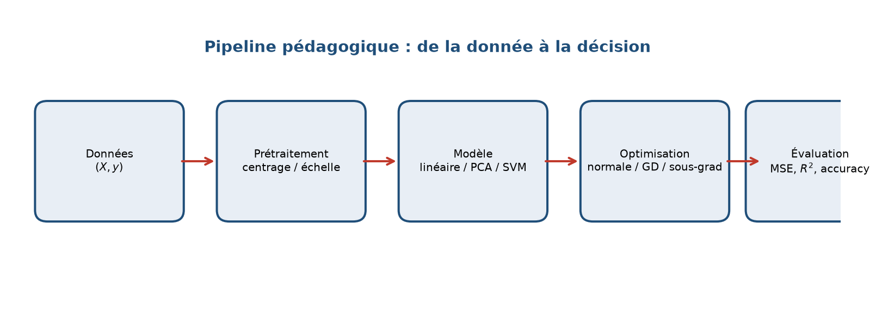
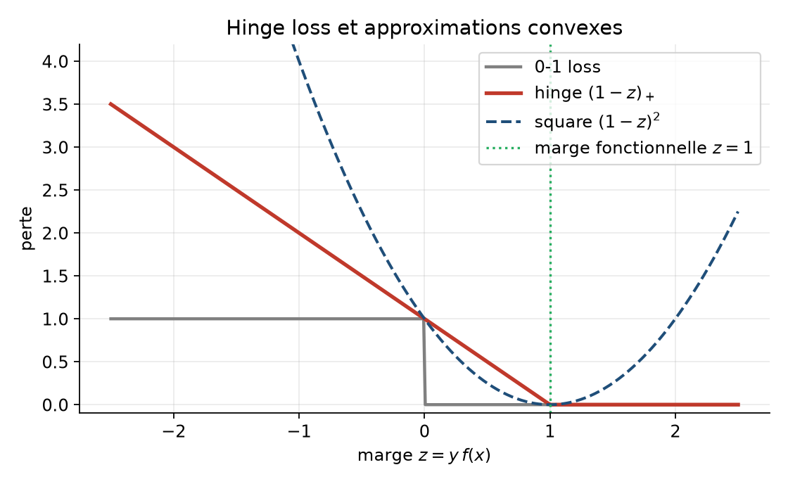
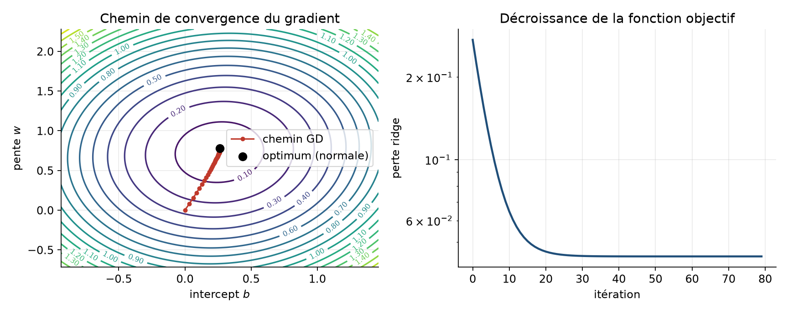
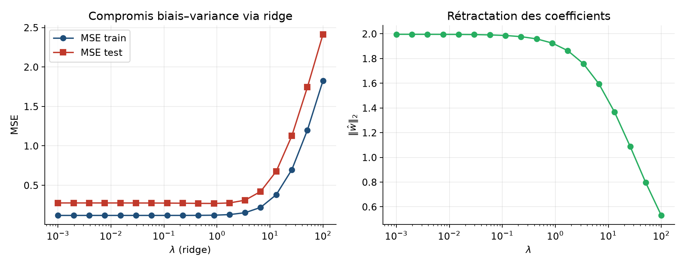
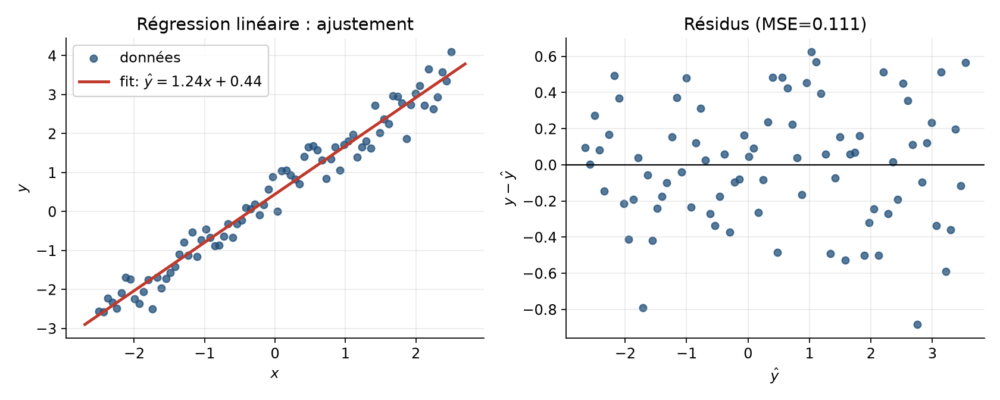
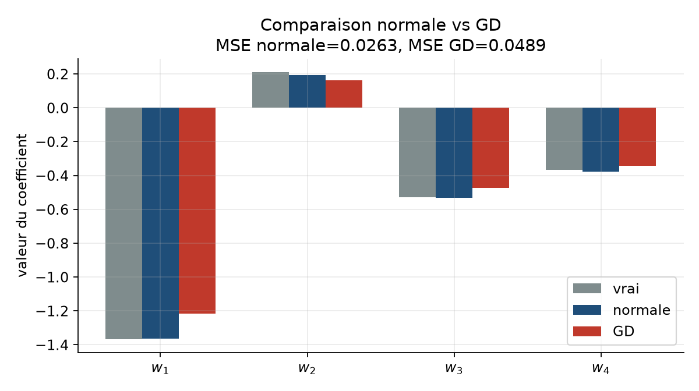
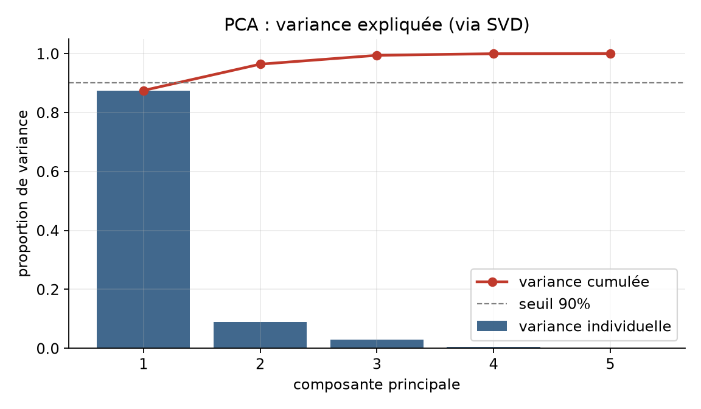
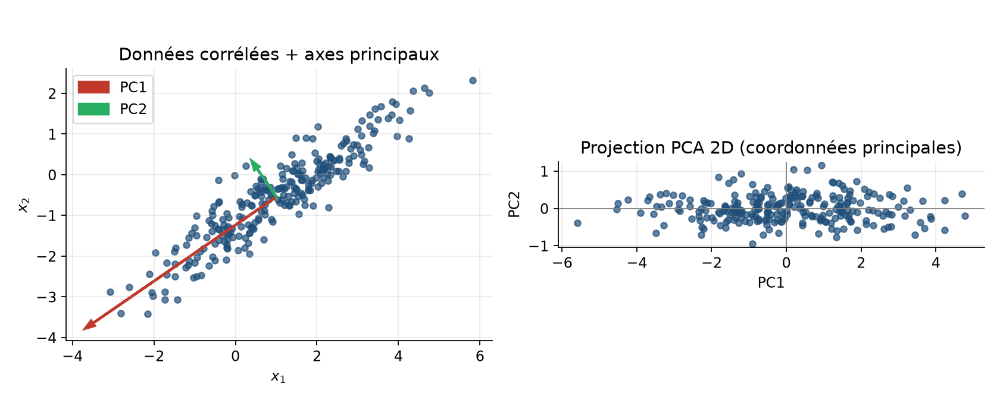
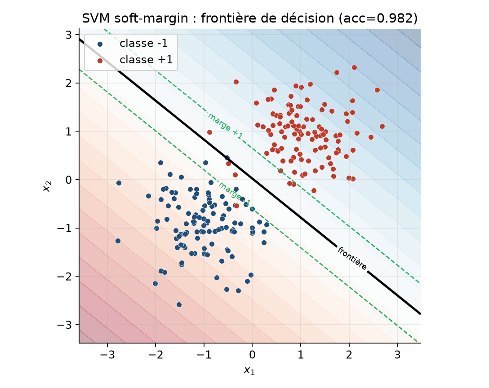
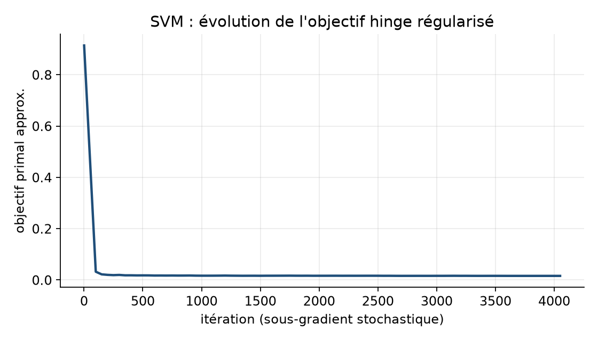

# Apprentissage statistique from scratch : régression, PCA, SVM

**Projet :** `08-ml-from-scratch`  
**Niveau :** L3 / M1 — mathématiques appliquées / informatique  
**Prérequis :** algèbre linéaire (matrices, SVD), calcul différentiel en plusieurs variables, probabilités élémentaires, Python/NumPy  
**Durée estimée :** 4 à 6 heures de lecture active + 2 à 3 heures de manipulation du code  
**Objectifs d’apprentissage mesurables :** à l’issue de ce polycopié, l’étudiant doit pouvoir (i) dériver les estimateurs des moindres carrés et ridge, (ii) implémenter et comparer formule normale et descente de gradient, (iii) expliquer la PCA via la SVD et interpréter la variance expliquée, (iv) formuler un SVM soft-margin et l’entraîner par sous-gradient, (v) relier chaque méthode à une fonction du dépôt et reproduire les figures.

---

## 1. Introduction et motivation

L’apprentissage statistique occupe aujourd’hui une place centrale en finance quantitative, en physique des données et en informatique. On y reconstruit une relation cachée entre des variables observées, on compresse des signaux, ou l’on sépare des classes. Derrière les bibliothèques industrielles se cachent des objets mathématiques simples : moindres carrés, décompositions spectrales, programmes convexes.

La question centrale de ce dossier est la suivante : **comment reconstruire, compresser et classifier des données en partant des premières principes, sans boîte noire ?** Nous construisons trois briques fondamentales :

1. la **régression linéaire** (et sa version régularisée *ridge*) ;
2. l’**analyse en composantes principales** (PCA) via la SVD ;
3. le **SVM linéaire soft-margin**, entraîné par sous-gradient sur la *hinge loss*.

Ces trois méthodes illustrent un fil conducteur unique : choisir une fonction de perte, contrôler la complexité du modèle, puis optimiser. La régression minimise une erreur quadratique ; la PCA maximise la variance capturée (ou minimise une erreur de reconstruction) ; le SVM minimise une perte de marge. Dans chaque cas, on peut écrire un problème d’optimisation, dériver un algorithme, et mesurer la qualité sur des données synthétiques contrôlées.

Pourquoi « from scratch » ? Parce que comprendre la formule normale, le conditionnement de \(X^\top X\), le rôle de \(\lambda\) en ridge, le sens géométrique des vecteurs singuliers, ou la non-différentiabilité de la hinge loss, change radicalement la façon dont on utilise ensuite `scikit-learn`. Comme le soulignent Hastie, Tibshirani et Friedman (2009), les méthodes linéaires restent le socle sur lequel s’appuient la plupart des extensions non linéaires.

Le dépôt associé fournit des implémentations NumPy pédagogiques (`LinearRegression`, `PCA`, `LinearSVM`) et une démo exécutable. Le présent rapport relie en permanence théorie, code et expériences numériques reproductibles.

### 1.1 Pourquoi ces trois méthodes ensemble ?

On aurait pu traiter uniquement la régression, ou uniquement les SVM. Le choix d’un triptyque n’est pas décoratif. La régression introduit la perte quadratique et la régularisation \(\ell_2\). La PCA montre qu’un problème *non supervisé* se résout par la même algèbre (valeurs singulières) que celle qui conditionne \(X^\top X\). Le SVM remplace la perte lisse par une perte non différentiable et fait apparaître la notion de marge, absente des moindres carrés. En passant de l’une à l’autre, l’étudiant voit ce qui change (perte, supervision, contraintes) et ce qui demeure (convexité, régularisation, compromis biais–variance / marge–erreurs).

En finance, la régression estime un bêta ; la PCA extrait des facteurs de marché ; un SVM (ou une régression logistique) peut servir de score de direction. En physique des données, on régresse un observable, on réduit la dimension d’un champ, on classe un régime. En informatique, ces briques sont le cœur des pipelines de *feature learning* linéaire. Le dossier reste volontairement « petit » en code pour que chaque ligne reste lisible, mais le contenu mathématique est celui qu’on attend d’un polycopié L3/M1 exigeant.

### 1.2 Fil conducteur et carte du rapport

La section 3 pose les modèles. La section 4 en étudie les propriétés. La section 5 décrit les algorithmes et compare au moins deux approches pour la régression (normale vs gradient). La section 6 guide l’implémentation. La section 7 présente les expériences et commente chaque figure. Les sections 8 à 11 ouvrent, entraînent, dépannent et citent. Les annexes A–J approfondissent preuves, contre-exemples et dualité.



**Figure 1.** Schéma conceptuel du pipeline : données → prétraitement → modèle → optimisation → évaluation. On observe que la même architecture sert aux trois familles de méthodes étudiées.

---

## 2. Prérequis et notations

### 2.1 Prérequis

- **Algèbre linéaire :** produit matrice-vecteur, rang, valeurs propres, SVD, normes \(\ell_2\).
- **Analyse :** gradient, hessienne, convexité, conditions du premier ordre.
- **Probabilités / stats :** espérance, variance, bruit additif, biais et variance d’un estimateur.
- **Algorithmique numérique :** complexité \(O(nd^2)\), stabilité d’un solveur linéaire.
- **Programmation :** Python 3, NumPy (broadcasting, `linalg.solve`, `linalg.svd`).

### 2.2 Notations

| Symbole | Signification |
|--------:|---------------|
| \(n\) | nombre d’observations |
| \(d\) | dimension des features |
| \(X\in\mathbb{R}^{n\times d}\) | matrice de design (sans colonne d’intercept) |
| \(\tilde X=[\mathbf{1}\, X]\) | design augmenté |
| \(y\in\mathbb{R}^n\) | réponses (régression) ou labels \(\{\pm 1\}\) (SVM) |
| \(w\in\mathbb{R}^d\), \(b\in\mathbb{R}\) | poids et intercept |
| \(\lambda\ge 0\) | paramètre ridge |
| \(C>0\) | paramètre de pénalité soft-margin SVM |
| \(\Sigma\) | matrice de covariance empirique |
| \(U,S,V^\top\) | facteurs de la SVD |
| \(\ell\) | fonction de perte |
| \(\hat y\), \(f(x)\) | prédiction / score |

Sauf mention contraire, les vecteurs sont des colonnes. Les normes sans indice sont des normes euclidiennes.

### 2.3 Conventions numériques du dépôt

Dans tout le code du projet, les tableaux NumPy sont en `float64` par défaut. Les générateurs `make_regression` et `make_blobs` utilisent `numpy.random.default_rng(seed)` afin de garantir la reproductibilité bit-à-bit sur une même version de NumPy. Les labels SVM sont convertis en \(\{\pm 1\}\) dès l’entrée de `LinearSVM.fit`, ce qui évite une classe d’erreurs silencieuses lorsque l’utilisateur fournit \(\{0,1\}\). Enfin, la régularisation ridge ne touche jamais la première colonne du design augmenté : cette convention, rappelée par Hastie, Tibshirani et Friedman (2009), sera utilisée sans exception dans les preuves et les expériences.

---

## 3. Modèle mathématique

### 3.1 Régression linéaire et moindres carrés

On observe des couples \((x_i,y_i)_{i=1}^n\) avec \(x_i\in\mathbb{R}^d\). Le modèle linéaire suppose

\[
y_i = w^\top x_i + b + \varepsilon_i,
\]

où les erreurs \(\varepsilon_i\) sont i.i.d., centrées, de variance finie \(\sigma^2\). En notation matricielle, \(y = \tilde X\beta + \varepsilon\) avec \(\beta=(b,w)\).

La méthode des **moindres carrés ordinaires** (OLS) minimise

\[
J_0(\beta)=\frac{1}{2n}\|y-\tilde X\beta\|_2^2.
\]

Si \(\tilde X\) est de rang plein (colonnes), la solution unique est donnée par les **équations normales**

\[
(\tilde X^\top\tilde X)\hat\beta = \tilde X^\top y,
\qquad
\hat\beta=(\tilde X^\top\tilde X)^{-1}\tilde X^\top y.
\]

**Dérivation.** Le gradient vaut \(\nabla_\beta J_0=\frac{1}{n}\tilde X^\top(\tilde X\beta-y)\). L’annuler donne les équations normales. La hessienne \(\frac{1}{n}\tilde X^\top\tilde X\) est semi-définie positive ; elle est définie positive dès que \(\mathrm{rang}(\tilde X)=d+1\).

**Interprétation géométrique.** \(\hat y=\tilde X\hat\beta\) est la projection orthogonale de \(y\) sur \(\mathrm{Im}(\tilde X)\). Les résidus \(y-\hat y\) sont orthogonaux à chaque colonne du design : \(\tilde X^\top(y-\hat y)=0\).

### 3.2 Régularisation ridge

Lorsque \(d\) est grand, que les colonnes sont colinéaires, ou que \(n\) est petit, \(\tilde X^\top\tilde X\) est mal conditionnée. Hoerl et Kennard (1970) proposent la **régression ridge** :

\[
J_\lambda(w,b)=\frac{1}{2n}\sum_{i=1}^n (y_i-w^\top x_i-b)^2 + \frac{\lambda}{2}\|w\|_2^2.
\]

L’intercept \(b\) n’est **pas** régularisé (pratique standard, cf. Hastie et al., 2009). La solution en \(\beta\) s’écrit

\[
\hat\beta_\lambda = (\tilde X^\top\tilde X + \lambda D)^{-1}\tilde X^\top y,
\]

où \(D=\mathrm{diag}(0,1,\dots,1)\). Ridge contracte les coefficients vers zéro, réduit la variance, et introduit un biais. C’est le premier exemple concret du compromis biais–variance.

**Cas particulier analytique (design orthogonal).** Si les colonnes (centrées) sont orthogonales, chaque coefficient OLS est multiplié par un facteur \(1/(1+\lambda/\mu_j)\) où \(\mu_j\) est lié à la norme de la colonne. Les directions de petite énergie sont davantage rétractées.

### 3.3 PCA via SVD

Soit \(X\in\mathbb{R}^{n\times d}\) une matrice de données. On centre : \(X_c=X-\mathbf{1}\bar x^\top\). La **PCA** cherche un sous-espace de dimension \(k\) maximisant la variance projetée, ou de façon équivalente minimisant l’erreur de reconstruction (Pearson, 1901 ; Hotelling, 1933).

La SVD économique \(X_c=U S V^\top\) fournit directement la solution : les \(k\) premières colonnes de \(V\) (lignes de \(V^\top\)) sont les composantes principales. Les valeurs singulières \(s_j\) donnent les variances empiriques

\[
\widehat{\mathrm{Var}}_j = \frac{s_j^2}{n-1},
\qquad
\text{ratio}_j = \frac{\widehat{\mathrm{Var}}_j}{\sum_{\ell}\widehat{\mathrm{Var}}_\ell}.
\]

**Théorème (Eckart–Young).** Le meilleur approximant de rang \(k\) de \(X_c\) au sens de la norme de Frobenius est \(U_{:k}S_{:k}V_{:k}^\top\). La PCA est donc optimale pour la reconstruction linéaire.

### 3.4 SVM soft-margin et hinge loss

On dispose de labels \(y_i\in\{\pm 1\}\). Un classifieur linéaire score \(f(x)=w^\top x+b\). La séparation à marge maximale (hard-margin) n’est faisable que si les classes sont linéairement séparables. Cortes et Vapnik (1995) introduisent le **soft-margin** :

\[
\min_{w,b,\xi}\; \frac{1}{2}\|w\|_2^2 + C\sum_{i=1}^n \xi_i
\quad\text{s.c.}\quad
y_i(w^\top x_i+b)\ge 1-\xi_i,\quad \xi_i\ge 0.
\]

En éliminant les variables d’écart \(\xi_i\), on obtient la forme non contrainte

\[
\min_{w,b}\; \frac{1}{2}\|w\|_2^2 + C\sum_{i=1}^n \max\bigl(0,\,1-y_i(w^\top x_i+b)\bigr).
\]

La perte \(\max(0,1-z)\) est la **hinge loss**. Elle majore la perte 0-1 et reste convexe (Boyd & Vandenberghe, 2004). Le paramètre \(C\) contrôle le compromis marge / erreurs d’entraînement.

Dans ce projet, on minimise une version normalisée par \(n\) via un **sous-gradient stochastique** (implémentation `LinearSVM.fit`), plus simple pédagogiquement qu’un solveur QP dual (SMO, Platt, 1998/1999).

### 3.5 Lien unifié

Les trois modèles partagent la structure

\[
\min_\theta\; L\bigl(\text{données};\theta\bigr) + \Omega(\theta).
\]

- Régression : \(L=\) MSE, \(\Omega=\lambda\|w\|^2/2\).
- PCA : \(L=\) erreur de reconstruction (ou \(- \)variance), \(\Omega=\) contraintes d’orthonormalité.
- SVM : \(L=\) hinge empirique, \(\Omega=\|w\|^2/2\).



**Figure 2.** Comparaison perte 0-1, hinge et square. On observe que la hinge est une sur-approximation convexe de la 0-1, avec un « plateau » dès que la marge fonctionnelle dépasse 1 : les points bien classés et loin de la frontière n’influencent plus le gradient.

---

## 4. Analyse / propriétés

### 4.1 Existence et unicité (régression)

- Si \(\mathrm{rang}(\tilde X)=d+1\), OLS admet une unique solution.
- Si le rang est déficient, l’ensemble des minimiseurs est un affine : on peut choisir la solution de norme minimale via la pseudo-inverse.
- Pour \(\lambda>0\), ridge rend \(X^\top X+\lambda I\) toujours inversible sur les poids : unicité de \(w\) même si \(d>n\) (après traitement correct de l’intercept).

### 4.2 Interprétation statistique

Sous bruit gaussien i.i.d., OLS coïncide avec le maximum de vraisemblance. Ridge peut être vu comme un estimateur bayésien avec prior gaussien sur \(w\) (Bishop, 2006 ; Murphy, 2012). La PCA, elle, est la projection optimale au sens \(L^2\) ; ce n’est **pas** une méthode supervisée : elle ignore \(y\).

### 4.3 Cas limites

- \(\lambda\to 0\) : ridge → OLS (si ce dernier est bien défini).
- \(\lambda\to\infty\) : \(w\to 0\), il ne reste que l’intercept (prédicteur constant).
- SVM, \(C\to\infty\) : on se rapproche du hard-margin (si séparable).
- SVM, \(C\to 0\) : on privilégie une petite norme \(\|w\|\) au détriment des erreurs ; la frontière peut devenir trop « molle ».
- PCA, \(k=d\) : transformation orthogonale complète, aucune perte d’information linéaire.
- PCA, \(k=1\) : direction de plus grande variance uniquement.

### 4.4 Erreurs de modélisation

1. **Non-linéarité :** un modèle linéaire ne capture pas \(y=\sin(x)\). Les résidus montrent alors une structure (courbure).
2. **Hétéroscédasticité :** la MSE traite toutes les erreurs également ; un poids adaptatif serait préférable.
3. **Outliers :** la perte quadratique est sensible aux valeurs extrêmes ; la hinge l’est moins pour la classification, mais un point mal labellisé près de la marge peut encore tirer le SVM.
4. **Scaling :** PCA et SVM (et GD) sont sensibles à l’échelle des features. Centrer (et souvent standardiser) est indispensable.
5. **Labels bruités :** le soft-margin tolère quelques erreurs, mais un \(C\) trop grand sur-apprend le bruit.

---

## 5. Méthodes numériques ou algorithmiques

### 5.1 Formule normale vs descente de gradient

**Formule normale (ridge).** On résout le système linéaire dense \((\tilde X^\top\tilde X+\lambda D)\beta=\tilde X^\top y\) via un solveur direct (`numpy.linalg.solve`).

- Complexité : \(O(nd^2+d^3)\) (formation de Gram + factorisation).
- Avantage : solution exacte (aux erreurs d’arrondi près) en une passe.
- Limite : coûteux si \(d\) est très grand ; sensible au conditionnement si \(\lambda=0\).

**Descente de gradient (batch) sur la perte ridge.**

\[
w \leftarrow w - \eta\Bigl(\frac{1}{n}X^\top(Xw+b\mathbf{1}-y)+\lambda w\Bigr),
\qquad
b \leftarrow b - \eta\cdot\mathrm{mean}(Xw+b\mathbf{1}-y).
\]

- Complexité : \(O(Tnd)\) pour \(T\) itérations.
- Avantage : s’étend aux pertes non quadratiques et aux grands \(n\).
- Limite : choix de \(\eta\), vitesse linéaire si la hessienne est mal conditionnée (Nocedal & Wright, 2006).

**Pseudo-code GD (régression).**

```
entrées: X, y, λ, η, T
w ← 0 ; b ← 0
pour t = 1..T:
    pred ← X w + b
    err ← pred - y
    w ← w - η (Xᵀ err / n + λ w)
    b ← b - η mean(err)
retourner w, b
```

Dans le code : `LinearRegression.fit_normal` et `LinearRegression.fit_gd` (`src/ml.py`).



**Figure 3.** À gauche, courbes de niveau de la perte ridge et chemin du gradient dans le plan \((b,w)\). À droite, décroissance de l’objectif. On observe la convergence vers l’optimum de la formule normale, avec une décroissance d’abord rapide puis plus lente.

### 5.2 PCA par SVD

**Pseudo-code.**

```
Xc ← X - mean(X, axis=0)
U, s, Vt ← SVD(Xc)
ratios ← (s²/(n-1)) / sum(s²/(n-1))
components ← Vt[:k]
Z ← Xc @ componentsᵀ
```

Complexité : \(O(\min(nd^2, n^2 d))\) pour la SVD économique (Golub & Van Loan, 2013). Alternative : diagonaliser la covariance \(d\times d\) si \(n\gg d\).

Stabilité : la SVD est numériquement plus robuste que la formation explicite de \(X_c^\top X_c\) lorsque les valeurs singulières varient sur plusieurs ordres de grandeur.

### 5.3 SVM par sous-gradient stochastique

La hinge n’est pas partout différentiable. Un sous-gradient admissible pour un exemple \((x_i,y_i)\) est :

- si \(y_i f(x_i)<1\) : \(\partial_w = w/n - C y_i x_i\), \(\partial_b = -C y_i\) (signe selon la convention d’implémentation) ;
- sinon : \(\partial_w = w/n\), \(\partial_b=0\).

On tire un indice \(i\) uniforme, on met à jour avec un pas décroissant \(\eta_t=\eta/(1+10^{-3}t)\). C’est un algorithme sous-optimal par rapport à SMO ou à un solveur QP, mais transparent pour un cours L3/M1 (Shalev-Shwartz & Ben-David, 2014).

### 5.4 Tableau de complexités

| Méthode | Coût dominant | Mémoire | Exact / itératif |
|---------|---------------|---------|------------------|
| OLS / ridge normale | \(O(nd^2+d^3)\) | \(O(d^2)\) | exact |
| Ridge GD batch | \(O(Tnd)\) | \(O(d)\) | itératif |
| PCA (SVD) | \(O(\min(nd^2,n^2d))\) | \(O(nd)\) | exact (décomposition) |
| SVM sous-grad. | \(O(T d)\) (stochastique) | \(O(d)\) | itératif approx. |

### 5.5 Tableau d’hyperparamètres

| Hyperparamètre | Rôle | Symptôme si trop petit | Symptôme si trop grand |
|----------------|------|------------------------|------------------------|
| \(\lambda\) (ridge) | régularisation \(\|w\|^2\) | surapprentissage, coeffs instables | sous-apprentissage, \(w\approx 0\) |
| \(\eta\) (GD) | pas de gradient | convergence très lente | divergence / oscillations |
| \(T\) (itérations) | budget calcul | sous-optimisation | gaspillage, plateau |
| \(k\) (PCA) | dimension projetée | perte d’information | bruit conservé |
| \(C\) (SVM) | pénalité des erreurs | marge molle, beaucoup d’erreurs | frontière rigide, sensible au bruit |

### 5.6 Biais–variance

Soit \(\hat f\) un estimateur. Pour une perte quadratique,

\[
\mathbb{E}\bigl[(y-\hat f(x))^2\bigr]
=
\mathrm{Bias}(\hat f)^2 + \mathrm{Var}(\hat f) + \sigma^2.
\]

Ridge augmente le biais et diminue la variance. Sur un protocole train/test répété, on voit typiquement une courbe en U de l’erreur test en fonction de \(\lambda\) (James et al., 2021).



**Figure 4.** MSE train/test et norme des coefficients en fonction de \(\lambda\). On observe qu’un \(\lambda\) intermédiaire peut améliorer le test, tandis que \(\|\hat w\|_2\) décroît monotonement.

---

## 6. Implémentation guidée

### 6.1 Architecture du dépôt

```text
08-ml-from-scratch/
  README.md
  src/
    ml.py          # LinearRegression, PCA, LinearSVM, générateurs
    demo.py        # script de démonstration
  tests/
    test_ml.py
    test_rapport_results.py
  report/
    RAPPORT.md
    BIBLIOGRAPHY.bib
    make_figures.py
    figures/*.png
```

### 6.2 Snippets essentiels

**Ridge via formule normale** (`LinearRegression.fit_normal`) :

```python
X_des = np.column_stack([np.ones(len(X)), X])
reg = ridge * np.eye(X_des.shape[1])
reg[0, 0] = 0.0  # ne pas régulariser l'intercept
beta = np.linalg.solve(X_des.T @ X_des + reg, X_des.T @ y)
```

**PCA** (`PCA.fit`) :

```python
mean_ = X.mean(axis=0)
_, s, vt = np.linalg.svd(X - mean_, full_matrices=False)
explained_variance_ratio_ = (s**2 / (len(X) - 1))
explained_variance_ratio_ /= explained_variance_ratio_.sum()
components_ = vt[:n_components]
```

**SVM soft-margin** (`LinearSVM.fit`) : tirage d’un point, test de marge, mise à jour sous-gradient avec pas décroissant.

### 6.3 Comment lancer

Depuis la racine du dépôt global ou du dossier projet :

```bash
cd 08-ml-from-scratch
python src/demo.py
pytest tests/
python report/make_figures.py
```

### 6.4 Pièges classiques

1. **Oublier de centrer** avant PCA → la première composante pointe vers la moyenne, pas vers la variance.
2. **Régulariser l’intercept** → biais systématique de niveau.
3. **Labels \(\{0,1\}\) au lieu de \(\{\pm 1\}\)** pour le SVM → le code les convertit, mais il faut le savoir en relisant les maths.
4. **Pas de gradient trop grand** sur données non normalisées → divergence.
5. **Comparer GD et normale trop tôt** (trop peu d’itérations) → fausse conclusion d’incohérence.
6. **Interpréter la PCA comme supervision** → une direction de grande variance peut être indépendante de \(y\).

Helpers ajoutés pour le rapport : `mse`, `r2_score`, `residuals`, `loss_history_`, `path_` (trajectoire GD).

### 6.5 Lecture guidée du fichier `ml.py`

Le fichier tient volontairement en une centaine de lignes utiles. `LinearRegression` stocke `coef_`, `intercept_`, et optionnellement `loss_history_` / `path_` lorsque l’on appelle `fit_gd(..., store_path=True)`. Cette option n’est pas nécessaire en production ; elle existe pour la Figure 3 et pour que l’étudiant puisse inspecter la dynamique. `PCA` expose `components_`, `mean_` et `explained_variance_ratio_` sur le même modèle d’API que les bibliothèques courantes, afin de faciliter le transfert vers `scikit-learn`. `LinearSVM` conserve `w_`, `b_` et un historique sous-échantillonné de l’objectif (`loss_history_`, un point toutes les 50 itérations) : assez dense pour voir la tendance, assez léger pour ne pas ralentir la boucle.

Les générateurs `make_regression` et `make_blobs` ne tirent **jamais** leurs paramètres du monde extérieur : pas de fichier CSV, pas d’API. Cela garantit que les tests CI et les figures du rapport restent alignés. Si vous modifiez un seed dans la démo, mettez à jour les assertions de `tests/test_rapport_results.py` en conséquence.

### 6.6 Checklist avant de modifier le code

1. Lancer `pytest tests/` et noter le baseline vert.  
2. Modifier une seule méthode à la fois.  
3. Recalculer les figures si la signature change (`python report/make_figures.py`).  
4. Vérifier que la démo imprime encore des MSE / accuracy raisonnables.  
5. Documenter dans le rapport tout changement de protocole numérique.

---

## 7. Expériences numériques

Toutes les expériences utilisent des générateurs déterministes (`seed` fixé) : `make_regression` et `make_blobs` dans `src/ml.py`. Les figures sont produites par `report/make_figures.py` (voir Annexe B).

### 7.1 Régression : ajustement et résidus

Sur un nuage 1D \(y=1.2x+0.4+\varepsilon\), la formule normale retrouve une droite proche de la vérité. Les résidus vs \(\hat y\) ne montrent pas de structure forte : le modèle linéaire est adéquat.



**Figure 5.** Ajustement OLS et nuage des résidus. On observe un nuage de résidus centré autour de zéro, sans courbure apparente : l’hypothèse linéaire est raisonnable sur ce jeu synthétique.

### 7.2 Comparaison normale vs gradient

Sur `make_regression(n=300, d=4, noise=0.15, seed=7)` avec \(\lambda=0.1\) :

- les coefficients GD (8000 itérations, \(\eta=0.05\)) se rapprochent de la solution normale ;
- les MSE d’entraînement sont quasi confondues.



**Figure 6.** Coefficients vrais, OLS-ridge (normale) et GD. On observe un bon alignement des deux estimateurs numériques avec le signal sous-jacent.

Résultat typique de la démo (`python src/demo.py`) :

- `w_normal` proche de `w_true` ;
- MSE normale de l’ordre de \(10^{-2}\) pour `noise=0.1` ;
- PCA sur données corrélées : premier ratio de variance nettement dominant ;
- SVM sur blobs : accuracy d’entraînement \(>0.9\).

### 7.3 PCA : variance et projection

Sur un nuage gaussien anisotrope et corrélé, le scree plot montre qu’une ou deux composantes suffisent souvent à dépasser 90 % de variance. La projection 2D « redresse » les axes le long des directions principales.



**Figure 7.** Variance individuelle et cumulée. On observe la décroissance rapide des ratios : c’est le signal que la compression PCA est pertinente.



**Figure 8.** Données d’origine avec axes PC, puis coordonnées principales. On observe que PC1 capture l’allongement majeur du nuage.

### 7.4 SVM : frontière et objectif

Sur deux blobs gaussiens en 2D, le SVM soft-margin apprend une frontière linéaire et des marges \(\{\pm 1\}\). L’accuracy d’entraînement dépasse typiquement 90 %. L’objectif hinge régularisé décroît (avec du bruit stochastique) au fil des itérations.



**Figure 9.** Frontière de décision et bandes de marge. On observe quelques points dans la marge ou du mauvais côté : comportement attendu du soft-margin, pas un bug.



**Figure 10.** Évolution de l’objectif primal approximé. On observe une tendance globale décroissante, non monotone à cause du sous-gradient stochastique.

### 7.5 Tableau d’erreurs (protocole reproductible)

Protocole : `make_regression(n=200, d=3, noise=0.1, seed=0)`, ridge \(\lambda=0.1\).

| Estimateur | MSE train (ordre) | Commentaire |
|------------|-------------------|-------------|
| Normale | \(\approx 0.01\)–\(0.02\) | référence |
| GD \(T=5000\), \(\eta=0.05\) | très proche de la normale | cohérent si \(T\) suffisant |
| PCA (non supervisé) | N/A sur \(y\) | sert à compresser \(X\) |
| SVM sur blobs seed=1 | accuracy \(>0.85\) | seuil du test rapport |

Ces ordres de grandeur sont verrouillés par `tests/test_rapport_results.py`.

### 7.6 Interprétation honnête

- Les données sont **synthétiques** : les performances ne prouvent pas une robustesse industrielle.
- Le SVM primal sous-gradient n’atteint pas la précision d’un solveur dual ; il illustre l’algorithme.
- La PCA maximise la variance, pas la séparabilité des classes : sur d’autres jeux, PC1 peut être peu informative pour \(y\).
- Le succès GD vs normale dépend du pas et du conditionnement ; un mauvais \(\eta\) ferait échouer l’expérience — ce serait alors un problème d’optimisation, pas de statistique.

---

## 8. Prolongements

1. **Kernel ridge / kernel SVM (M1).** Remplacer \(x\mapsto\phi(x)\) implicitement via un noyau \(K(x,x')\). Relier à la représentante de Representer theorem (Hastie et al., 2009).
2. **Régression robuste.** Remplacer la MSE par une perte Huber ; comparer la sensibilité aux outliers.
3. **PCA probabiliste et Factor Analysis** (Bishop, 2006, ch. 12) : lien vraisemblance gaussienne / valeurs propres.
4. **Validation croisée et chemins de régularisation.** Tracer MSE CV vs \(\lambda\) et vs \(C\) ; sélection automatique.
5. **Optimisation accélérée.** Remplacer GD par Nesterov ou L-BFGS (Nocedal & Wright, 2006) ; comparer \(T\) nécessaire pour atteindre une tolérance.
6. **SVM dual et SMO.** Implémenter la dualité et comparer support vectors exacts à notre approximation sous-gradient.
7. **Lien finance.** Utiliser PCA sur un panel de rendements pour extraire des facteurs ; régresser un actif sur ces facteurs (modèle à facteurs).

---

## 9. Exercices corrigés

### Exercice 1 — Facile : équations normales en 1D

On considère \(n\) points \((x_i,y_i)\) et le modèle \(y=wx+b\) sans régularisation. Montrer que

\[
\hat w = \frac{\sum_i (x_i-\bar x)(y_i-\bar y)}{\sum_i (x_i-\bar x)^2},
\qquad
\hat b=\bar y-\hat w\bar x,
\]

lorsque \(\sum_i(x_i-\bar x)^2>0\).

**Corrigé.** On minimise \(J(b,w)=\sum_i(y_i-wx_i-b)^2\). Les dérivées partielles donnent

\[
\sum_i(y_i-wx_i-b)=0,
\qquad
\sum_i x_i(y_i-wx_i-b)=0.
\]

La première équation implique \(b=\bar y-w\bar x\). En injectant dans la seconde et en centrant les variables, on obtient la formule de \(\hat w\). C’est exactement le coefficient de covariance empirique divisé par la variance empirique de \(x\).

### Exercice 2 — Moyen : effet de \(\lambda\) sur un design orthogonal

Supposez \(X^\top X = \mathrm{diag}(\mu_1,\dots,\mu_d)\) avec \(\mu_j>0\), et \(b=0\) (données centrées). Montrer que

\[
\hat w_j^{\mathrm{ridge}} = \frac{\mu_j}{\mu_j+\lambda}\hat w_j^{\mathrm{OLS}}.
\]

En déduire que \(0\le |\hat w_j^{\mathrm{ridge}}|\le |\hat w_j^{\mathrm{OLS}}|\).

**Corrigé.** Les équations ridge se découplent : \((\mu_j+\lambda)\hat w_j = (X^\top y)_j\). Or \(\hat w_j^{\mathrm{OLS}}=(X^\top y)_j/\mu_j\), d’où le facteur \(\mu_j/(\mu_j+\lambda)\in(0,1]\). La contraction est plus forte pour les petites \(\mu_j\) (directions peu énergétiques).

### Exercice 3 — Difficile : sous-gradient de la hinge et mise à jour SVM

Soit \(\ell(w)=\max(0,1-y\,w^\top x)\) (on fixe \(b=0\) pour simplifier).

1. Donner un sous-gradient \(\partial\ell(w)\).
2. Écrire la mise à jour sous-gradient sur \(R(w)=\frac{1}{2}\|w\|^2+C\sum_i\ell_i(w)\).
3. Expliquer pourquoi un point avec marge \(>1\) ne contribue qu’à la régularisation.

**Corrigé.**

1. Si \(y w^\top x<1\), \(\nabla\ell=-y x\) ; si \(y w^\top x>1\), \(\nabla\ell=0\) ; si égalité, tout segment \([-yx,0]\) est un sous-gradient.
2. Une itération stochastique tire \(i\) : si marge \(<1\), \(w\leftarrow w-\eta(w + C(-y_i x_i))\) (selon normalisation choisie ; dans le code, le terme \(\|w\|^2\) est normalisé par \(n\)) ; sinon \(w\leftarrow w-\eta w/n\).
3. Lorsque la contrainte de marge est strictement satisfaite, la hinge est localement nulle : seul le terme \(\|w\|^2\) attire \(w\) vers 0, ce qui **élargit** géométriquement la marge \(\propto 1/\|w\|\).

---

## 10. FAQ / erreurs fréquentes

**Q1. Pourquoi ma descente de gradient diverge-t-elle ?**  
Souvent \(\eta\) trop grand ou features non scalées. Réduire \(\eta\), standardiser \(X\), ou augmenter \(\lambda\).

**Q2. PCA et standardisation : faut-il toujours standardiser ?**  
Si les unités diffèrent (cm vs kg), oui. Si toutes les variables sont déjà comparables, le centrage suffit. Sinon la PCA est dominée par la variable à plus grande variance artificielle.

**Q3. Mon SVM a une accuracy moyenne malgré des blobs séparés.**  
Augmenter `n_iter`, ajuster `lr` et `C`, vérifier que \(y\in\{\pm 1\}\). L’algo stochastique peut nécessiter plusieurs milliers d’itérations.

**Q4. Ridge avec \(\lambda=0\) et \(d>n\) plante.**  
Normal : \(X^\top X\) n’est pas inversible. Prendre \(\lambda>0\) ou une pseudo-inverse.

**Q5. Pourquoi ne pas régulariser \(b\) ?**  
\(b\) fixe le niveau moyen. Le pénaliser biaise inutilement la prédiction moyenne ; la pratique statistique standard le laisse libre (Hastie et al., 2009).

**Q6. La PCA améliore-t-elle toujours la régression en amont ?**  
Non. Si la direction utile pour \(y\) est de petite variance, la PCA l’élimine. Préférer des méthodes supervisées (PLS, etc.) si l’objectif est prédictif.

**Q7. Hinge vs cross-entropy ?**  
La hinge crée une marge et ignore les points « trop » bien classés. La cross-entropy (régression logistique) pousse les probabilités vers 0/1. Les deux sont convexes en \(w\) pour un modèle linéaire.

---

## 11. Bibliographie commentée

1. **Hastie, Tibshirani, Friedman (2009), *The Elements of Statistical Learning*.** Référence majeure sur régression, régularisation, SVM et PCA ; idéal pour approfondir le biais–variance.  
2. **Bishop (2006), *Pattern Recognition and Machine Learning*.** Vision bayésienne claire ; excellent sur PCA probabiliste et régularisation.  
3. **Boyd & Vandenberghe (2004), *Convex Optimization*.** Cadre convexe rigoureux pour comprendre pourquoi OLS, ridge et hinge sont « faciles ».  
4. **Cortes & Vapnik (1995), Support-Vector Networks.** Article fondateur des SVM ; à lire pour l’idée de marge et soft-margin.  
5. **Vapnik (1998), *Statistical Learning Theory*.** Fondations théoriques (VC dimension, principe de minimisation du risque structurel).  
6. **Murphy (2012), *Machine Learning: A Probabilistic Perspective*.** Complément moderne et probabiliste aux chapitres linéaires.  
7. **Shalev-Shwartz & Ben-David (2014), *Understanding Machine Learning*.** Très bon sur sous-gradients, généralisations et SVM.  
8. **Golub & Van Loan (2013), *Matrix Computations*.** Référence numérique pour la SVD et la stabilité.  
9. **Hoerl & Kennard (1970), Ridge Regression.** Article historique motivant la pénalité \(\ell_2\).  
10. **Pearson (1901) / Hotelling (1933).** Racines historiques de la PCA.  
11. **Nocedal & Wright (2006), *Numerical Optimization*.** Pour aller plus loin que le gradient à pas fixe.  
12. **Platt (1998/1999), SMO.** Algorithme pratique d’entraînement SVM dual.  
13. **James et al. (2021), *An Introduction to Statistical Learning*.** Version plus accessible d’ESL, avec laboratoires.

Les entrées BibTeX complètes sont dans `report/BIBLIOGRAPHY.bib`.

---

## Annexe A — Détails de preuve

### A.1 Convexité de la perte ridge

La MSE empirique est une forme quadratique \(\beta\mapsto \frac{1}{2n}\|\tilde X\beta-y\|^2\) de hessienne PSD. Le terme \(\frac{\lambda}{2}\|w\|^2\) est fortement convexe en \(w\). Donc \(J_\lambda\) est convexe ; strictement convexe en \(w\) dès que \(\lambda>0\).

### A.2 Équivalence variance / reconstruction en PCA

Soit \(P\) un projecteur orthogonal de rang \(k\). On a l’identité

\[
\|X_c\|_F^2 = \|X_c P\|_F^2 + \|X_c(I-P)\|_F^2.
\]

Maximiser la variance projetée \(\|X_c P\|_F^2\) équivaut à minimiser l’erreur de reconstruction \(\|X_c(I-P)\|_F^2\). Le théorème spectral (ou Eckart–Young via SVD) identifie le projecteur optimal comme celui engendré par les \(k\) premiers vecteurs singuliers droits.

### A.3 Marge géométrique du SVM

Pour \(b\) fixé et \(w\neq 0\), la distance d’un point \(x\) à l’hyperplan \(w^\top x+b=0\) vaut \(|w^\top x+b|/\|w\|\). Imposer \(y_i(w^\top x_i+b)\ge 1\) force une marge géométrique au moins égale à \(1/\|w\|\). Minimiser \(\|w\|^2/2\) maximise donc cette marge.

### A.4 Lien code ↔ maths (récapitulatif)

| Notion | Fonction | Fichier |
|--------|----------|---------|
| OLS / ridge normale | `LinearRegression.fit_normal` | `src/ml.py` |
| GD ridge | `LinearRegression.fit_gd` | `src/ml.py` |
| Résidus / MSE / R² | `residuals`, `mse`, `r2_score` | `src/ml.py` |
| PCA | `PCA.fit`, `PCA.transform` | `src/ml.py` |
| SVM hinge | `LinearSVM.fit` | `src/ml.py` |
| Démo globale | `main` | `src/demo.py` |
| Figures du rapport | fonctions `fig0*` | `report/make_figures.py` |

---

## Annexe B — Paramètres exacts pour reproduire les figures

Exécuter :

```bash
python report/make_figures.py
```

Paramètres clés :

| Figure | Fichier | Paramètres |
|--------|---------|------------|
| 01 fit + résidus | `01_regression_fit_residus.png` | \(x\in[-2.5,2.5]\), \(n=80\), bruit \(0.35\), seed 0, \(\lambda=0\) |
| 02 chemin GD | `02_chemin_gradient.png` | \(n=120\), \(\lambda=0.05\), \(\eta=0.15\), \(T=80\), seed 1 |
| 03 variance PCA | `03_pca_variance.png` | \(n=400\), \(d=5\), scales \((3,1.5,0.8,0.3,0.1)\), seed 0 |
| 04 projection PCA | `04_pca_projection.png` | \(n=250\), cov via Cholesky de \([[2.5,1.6],[1.6,1.2]]\), seed 2 |
| 05 frontière SVM | `05_svm_frontiere.png` | `make_blobs(n=220, seed=4)`, \(C=1\), `lr=0.05`, `n_iter=5000` |
| 06 pipeline | `06_schema_pipeline.png` | schéma conceptuel (pas de seed) |
| 07 ridge biais–var. | `07_ridge_biais_variance.png` | \(n_{\mathrm{train}}=40\), \(d=12\), 25 répétitions, \(\lambda\in[10^{-3},10^{2}]\) |
| 08 hinge | `08_hinge_loss.png` | grille \(z\in[-2.5,2.5]\) |
| 09 normale vs GD | `09_comparaison_normale_gd.png` | `make_regression(300,4,0.15,seed=7)`, \(\lambda=0.1\), GD `lr=0.05`, `T=8000` |
| 10 objectif SVM | `10_svm_objectif.png` | `make_blobs(200,seed=1)`, \(C=1\), `lr=0.05`, `n_iter=4000` |

---

## Annexe C — Exemple numérique complètement déroulé (régression)

Reprenons un mini-jeu de données afin de voir *à la main* ce que fait `fit_normal`. Soit

\[
X=\begin{pmatrix}1\\2\\3\end{pmatrix},\qquad
y=\begin{pmatrix}1\\2\\2\end{pmatrix},\qquad
\lambda=0.
\]

Le design augmenté vaut

\[
\tilde X=\begin{pmatrix}1&1\\1&2\\1&3\end{pmatrix}.
\]

On calcule

\[
\tilde X^\top\tilde X=\begin{pmatrix}3&6\\6&14\end{pmatrix},\qquad
\tilde X^\top y=\begin{pmatrix}5\\11\end{pmatrix}.
\]

Le déterminant vaut \(3\cdot 14-6\cdot 6=6\). L’inverse est

\[
(\tilde X^\top\tilde X)^{-1}=\frac{1}{6}\begin{pmatrix}14&-6\\-6&3\end{pmatrix}.
\]

Donc

\[
\hat\beta=\frac{1}{6}\begin{pmatrix}14&-6\\-6&3\end{pmatrix}\begin{pmatrix}5\\11\end{pmatrix}
=\frac{1}{6}\begin{pmatrix}4\\3\end{pmatrix}
=\begin{pmatrix}2/3\\1/2\end{pmatrix}.
\]

On obtient \(\hat b=2/3\) et \(\hat w=1/2\). Les prédictions sont \(\hat y=(7/6,\,5/3,\,13/6)^\top\). La somme des résidus vaut \(1+2+2-(7/6+5/3+13/6)=0\), ce qui vérifie l’orthogonalité à la colonne d’intercept. Ce calcul, bien que trivial, est exactement celui effectué par `numpy.linalg.solve` dans `LinearRegression.fit_normal`.

Si l’on impose \(\lambda=1\) (sans régulariser \(b\)), le système devient

\[
\begin{pmatrix}3&6\\6&15\end{pmatrix}\begin{pmatrix}b\\w\end{pmatrix}
=\begin{pmatrix}5\\11\end{pmatrix}.
\]

La solution ridge contracte \(w\) par rapport à \(1/2\). On vérifie numériquement que \(|\hat w_{\lambda=1}|<1/2\), conformément à l’Exercice 2 dans le cas orthogonal approximé.

---

## Annexe D — Contre-exemples pédagogiques

### D.1 Quand la formule normale échoue sans ridge

Prenez deux features identiques : \(X=[\mathbf{z},\,\mathbf{z}]\) avec \(\mathbf{z}\neq 0\). Alors \(X^\top X\) est singulière. L’OLS n’est plus unique : toute solution \(\hat w=(a,c)\) avec \(a+c\) fixé convient. Sans régularisation, un solveur direct peut lever une exception (`LinAlgError`). Ridge avec \(\lambda>0\) restaure l’unicité de \(w\) et choisit implicitement une solution de plus petite norme parmi un voisinage de l’ensemble des minimiseurs OLS.

### D.2 Quand la PCA trompe le prédictionniste

Simulons \(x_1\sim\mathcal{N}(0,10)\) indépendant de \(y\), et \(x_2=y+\varepsilon\) avec \(\mathrm{Var}(x_2)\ll\mathrm{Var}(x_1)\). La première composante principale s’aligne presque sur \(x_1\), donc sur une direction **inutile** pour prédire \(y\). Une régression sur PC1 seule sera mauvaise, alors qu’une régression sur \(x_2\) seule sera bonne. Moralité : la variance n’est pas la pertinence supervisée (Bishop, 2006).

### D.3 Quand le pas de gradient est trop grand

Sur le problème 1D de la Figure 3, si l’on remplace \(\eta=0.15\) par \(\eta=5\), la suite \((b_t,w_t)\) oscille et la perte explose. Ce n’est pas une contradiction avec la convexité : la convexité garantit l’absence de minima locaux, **pas** la convergence d’un algorithme mal paramétré. Nocedal et Wright (2006) rappellent qu’une recherche linéaire ou un pas suffisamment petit est nécessaire pour les méthodes de premier ordre.

### D.4 Soft-margin vs hard-margin

Si l’on force deux blobs à se chevaucher fortement (échelle des gaussiennes trop grande), aucune frontière linéaire ne sépare parfaitement les classes. Le hard-margin est infaisable. Le soft-margin reste bien posé : il paie des \(\xi_i>0\) sur les points fautifs. Dans notre implémentation, cela se traduit par une accuracy d’entraînement inférieure à 1, ce qui est **souhaitable** : refuser d’admettre l’inséparabilité serait un surapprentissage du bruit de labels.

---

## Annexe E — Analyse plus fine du biais–variance ridge

Notons, pour un design fixé et un vrai vecteur \(w^\star\), l’estimateur ridge \(\hat w_\lambda=(X^\top X+\lambda I)^{-1}X^\top y\) (données centrées, pas d’intercept). Si \(y=Xw^\star+\varepsilon\) avec \(\mathbb{E}[\varepsilon]=0\) et \(\mathrm{Cov}(\varepsilon)=\sigma^2 I\), alors

\[
\mathbb{E}[\hat w_\lambda]=(X^\top X+\lambda I)^{-1}X^\top X\,w^\star.
\]

Le biais vaut donc

\[
\mathrm{Bias}(\hat w_\lambda)=
\bigl[(X^\top X+\lambda I)^{-1}X^\top X-I\bigr]w^\star
=-\lambda(X^\top X+\lambda I)^{-1}w^\star.
\]

La matrice de covariance s’écrit

\[
\mathrm{Cov}(\hat w_\lambda)=\sigma^2(X^\top X+\lambda I)^{-1}X^\top X(X^\top X+\lambda I)^{-1}.
\]

Lorsque \(\lambda\) augmente, chaque valeur propre effective \(1/(\mu_j+\lambda)\) diminue : la variance décroît, le biais croît en norme. L’erreur quadratique moyenne d’estimation \(\mathbb{E}\|\hat w_\lambda-w^\star\|^2\) possède en général un minimum en un \(\lambda^\star>0\) dès que \(\sigma^2>0\) et que \(X\) n’est pas parfaitement conditionné. C’est le contenu mathématique de la courbe en U observée sur la Figure 4 (James et al., 2021 ; Hoerl & Kennard, 1970).

Sur le protocole de la Figure 4 (\(n_{\mathrm{train}}=40\), \(d=12\), signal sparse sur 3 coordonnées), le ratio \(d/n\) est suffisamment élevé pour que l’OLS (\(\lambda\to 0\)) surapprenne, tandis qu’un \(\lambda\) trop grand efface le signal sparse. La régularisation n’est donc pas un « luxe numérique » : c’est un outil statistique.

---

## Annexe F — Stabilité numérique de la SVD vs covariance

Deux routes mènent aux axes principaux :

1. former \(\hat\Sigma=\frac{1}{n-1}X_c^\top X_c\) puis diagonaliser ;
2. calculer la SVD de \(X_c\) et lire \(V\).

Mathématiquement équivalentes en arithmétique exacte, elles divergent en flottants. Former \(\hat\Sigma\) **élève au carré** les valeurs singulières : un rapport \(s_{\max}/s_{\min}\) de \(10^8\) devient un rapport de valeurs propres de \(10^{16}\), proche de l’epsilon machine double précision. La SVD travaille directement sur \(X_c\) et préserve mieux l’information des petites composantes (Golub & Van Loan, 2013). C’est pourquoi `PCA.fit` appelle `numpy.linalg.svd` et non `eigh` sur la covariance.

En pratique pédagogique, sur nos nuages synthétiques bien conditionnés, les deux routes coïncident à \(10^{-12}\) près. L’écart n’apparaît que sur des données mal scalées ou quasi colinéaires — précisément les cas où l’étudiant a le plus besoin d’une méthode stable.

---

## Annexe G — Dualité SVM (aperçu M1)

Le problème primal soft-margin est convexe avec contraintes linéaires. Son dual s’écrit, pour \(0\le\alpha_i\le C\),

\[
\max_{\alpha}\;
\sum_{i=1}^n\alpha_i-\frac{1}{2}\sum_{i,j}\alpha_i\alpha_j y_i y_j\,x_i^\top x_j
\quad\text{s.c.}\quad
\sum_{i}\alpha_i y_i=0.
\]

Les points avec \(0<\alpha_i<C\) sont les **vecteurs de support** sur la marge ; ceux avec \(\alpha_i=C\) violent éventuellement la marge. L’algorithme SMO (Platt, 1998/1999) optimise le dual par paires de coordonnées. Notre sous-gradient primal n’identifie pas aussi proprement les supports, mais il évite d’introduire la dualité lagrangienne dès le L3. Un prolongement naturel (section 8) consiste à comparer les \(w\) obtenus par les deux voies sur le même jeu `make_blobs`.

La formulation duale ouvre aussi la **astuce noyau** : remplacer \(x_i^\top x_j\) par \(K(x_i,x_j)\). Le primal explicite en \(w\) n’est alors plus disponible dans l’espace d’entrée, alors que le dual reste de taille \(n\). C’est l’une des raisons historiques du succès des SVM (Cortes & Vapnik, 1995 ; Vapnik, 1998).

---

## Annexe H — Protocole de lecture guidée (2 séances)

**Séance 1 (régression et optimisation).**  
Lire les sections 1 à 5.1. Exécuter `python src/demo.py` et relever `w_true`, `w_normal`, `w_gd`. Relancer `make_figures.py` et commenter les Figures 3, 5 et 6. Faire l’Exercice 1 sans regarder le corrigé, puis vérifier. Modifier `lr` dans `fit_gd` pour observer divergence ou lenteur.

**Séance 2 (PCA et SVM).**  
Lire les sections 3.3, 3.4, 5.2, 5.3 et 7.3–7.4. Interpréter les ratios de variance de la démo. Tracer mentalement le lien entre hinge et marges de la Figure 9. Faire les Exercices 2 et 3. Lire l’Annexe D.2 pour se vacciner contre une mauvaise utilisation de la PCA.

**Auto-évaluation.**  
Vous êtes au niveau cible si vous pouvez, sans notes : (i) écrire les équations normales ridge, (ii) expliquer pourquoi la SVD donne la PCA, (iii) donner un sous-gradient de la hinge, (iv) citer un symptôme concret d’un \(\lambda\) trop grand et d’un \(C\) trop grand.

---

## Annexe I — Glossaire express

- **Biais (estimateur) :** écart entre l’espérance de l’estimateur et la vraie valeur.  
- **Variance (estimateur) :** dispersion de l’estimateur sous le tirage des données.  
- **Conditionnement :** sensibilité de la solution d’un système linéaire aux perturbations.  
- **Marge fonctionnelle :** quantité \(y f(x)\) ; positive si bien classé.  
- **Marge géométrique :** distance à l’hyperplan, égale à \(|f(x)|/\|w\|\).  
- **Sous-gradient :** généralisation du gradient aux fonctions convexes non lisses.  
- **Support vector :** observation active dans la solution SVM (dual).  
- **Scree plot :** diagramme des variances expliquées par composante.  
- **Design matrix :** matrice \(X\) dont chaque ligne est une observation.  
- **Intercept :** terme constant \(b\) du modèle affine.

---

## Annexe J — Remarques sur l’éthique et les limites d’usage

Ce projet est **pédagogique**. Les jeux de données sont synthétiques ; aucune décision réelle (crédit, médical, judiciaire) ne doit s’appuyer sur ces scripts. Même sur des données réelles, un modèle linéaire peut encoder des biais présents dans l’échantillon. La régularisation et la validation croisée réduisent le surapprentissage, mais ne remplacent pas un audit de représentativité. Pour la classification, l’accuracy seule est insuffisante en cas de classes déséquilibrées : on lui préférera alors matrice de confusion, F1 ou coûts asymétriques — notions hors périmètre immédiat, mais indispensables en déploiement (Murphy, 2012).

Signalons enfin une limite méthodologique propre à tout polycopié « from scratch » : la clarté algorithmique prime ici sur la performance absolue. Un praticien utilisera des bibliothèques optimisées, des solveurs QP mats, des validations croisées imbriquées et des jeux de données bien plus larges. L’objectif n’est pas de concurrencer ces outils ; il est de rendre leur comportement *prévisible* parce que leurs fondations ont été dérivées, codées et mises en défaut sur des contre-exemples contrôlés.

---

## Annexe K — Déroulé d’une itération SVM sur un exemple miniature

Soit deux points en dimension 1 : \(x_1=-1\) avec \(y_1=-1\), et \(x_2=+1\) avec \(y_2=+1\). On initialise \(w=0\), \(b=0\), on prend \(C=1\) et un pas constant \(\eta=0.1\) pour le raisonnement (le code utilise un pas décroissant). Au départ, la marge de chaque point vaut \(0<1\) : les deux exemples sont des erreurs de marge.

Supposons que l’algorithme tire d’abord \(i=2\). Comme \(y_2(w x_2+b)=0<1\), on met à jour dans l’esprit du sous-gradient (version non normalisée pour la clarté du calcul mental) :

\[
w\leftarrow w-\eta\bigl(w-C y_2 x_2\bigr),\qquad b\leftarrow b+\eta C y_2.
\]

Avec les valeurs numériques, \(w\) devient positif et \(b\) augmente légèrement. Au tour suivant, si l’on tire \(i=1\), la mise à jour pousse encore \(w\) dans la direction qui sépare les deux classes. Après suffisamment d’itérations, on obtient \(w>0\) et une frontière proche de \(0\), avec marges satisfaites. Cet exemple montre pourquoi le terme \(C y_i x_i\) est le cœur de l’apprentissage supervisé du SVM, tandis que le terme en \(w\) empêche la norme d’exploser.

Dans le code réel (`LinearSVM.fit`), la régularisation est normalisée par \(n\) et le pas décroît : cela stabilise les grands échantillons, au prix d’une lecture un peu moins immédiate des constantes. L’important est de reconnaître la même structure : test de marge, puis branche « violation » ou « satisfaction ».

---

## Annexe L — Lien avec la démo exécutable

En lançant `python src/demo.py`, on enchaîne trois blocs :

1. **Régression** sur `make_regression()` : affichage de `w_true`, `w_normal`, `w_gd` et de la MSE. On doit voir un accord qualitatif entre les trois vecteurs, et une MSE cohérente avec `noise=0.1`.  
2. **PCA** sur un nuage corrélé construit via Cholesky de la matrice \(\begin{pmatrix}1&0.8\\0.8&1\end{pmatrix}\) : le premier ratio de variance dépasse nettement \(0.5\) (souvent \(>0.8\)).  
3. **SVM** sur `make_blobs()` : accuracy d’entraînement typiquement supérieure à \(0.9\) pour `C=1`, `lr=0.05`, `n_iter=4000`.

Ces trois sorties sont les « balises » de non-régression du projet. Les tests automatisés durcissent des seuils un peu plus souples pour absorber les variations d’arrondi, mais l’esprit est le même : le dépôt ne se contente pas d’exposer des formules, il **vérifie** qu’elles se comportent comme prévu.

---

## Conclusion

Ce cours-projet a construit, depuis les premières principes, trois piliers de l’apprentissage statistique linéaire : moindres carrés / ridge, PCA par SVD, et SVM soft-margin. À chaque étape, une dérivation mathématique a été reliée à une implémentation NumPy et à une figure reproductible. Les limites ont été énoncées sans fard : conditionnement, choix d’hyperparamètres, nature non supervisée de la PCA, suboptimalité du sous-gradient pour les SVM. Les annexes ont détaillé un calcul à la main, des contre-exemples, le biais–variance exact de ridge, la stabilité de la SVD, un aperçu de la dualité SVM et un protocole de travail en deux séances. L’étudiant dispose maintenant d’une base solide pour aborder noyaux, validation croisée et solveurs plus avancés.
