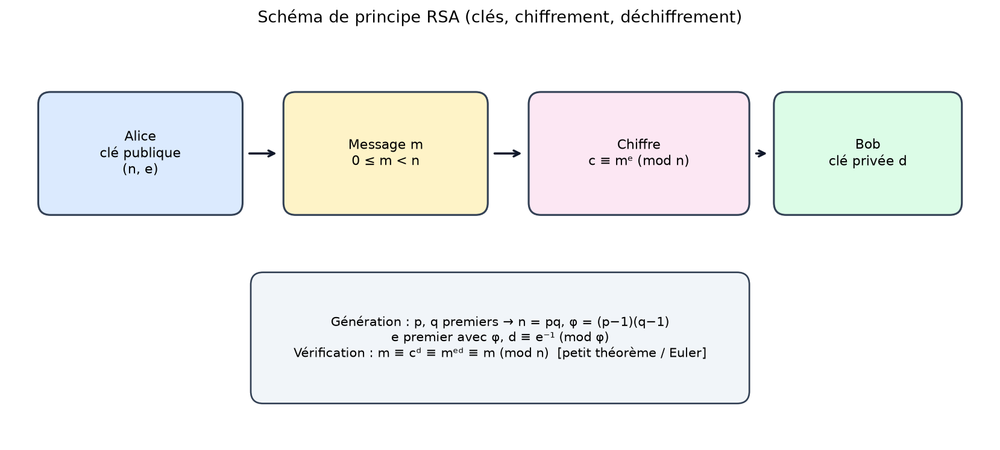
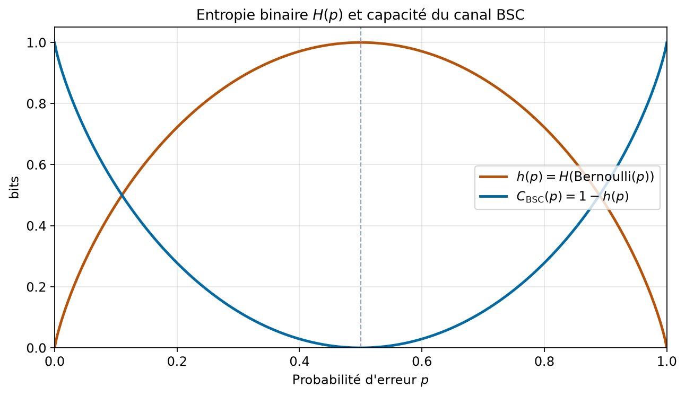
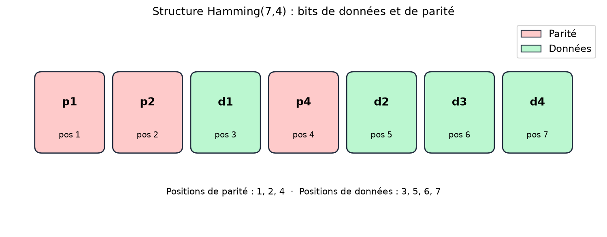
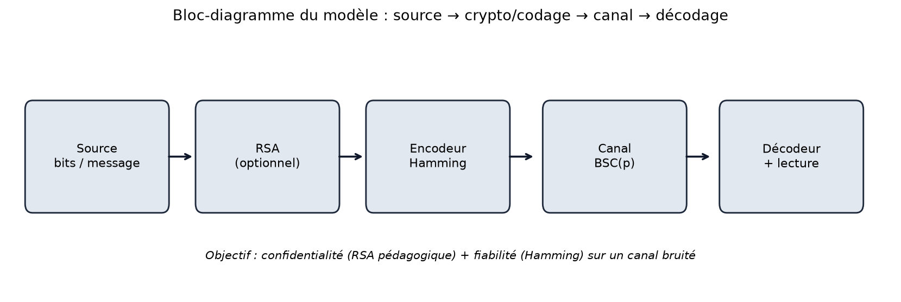
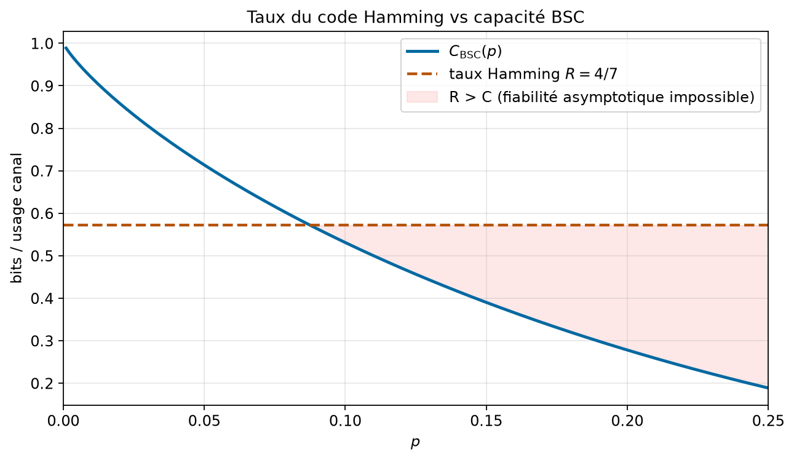
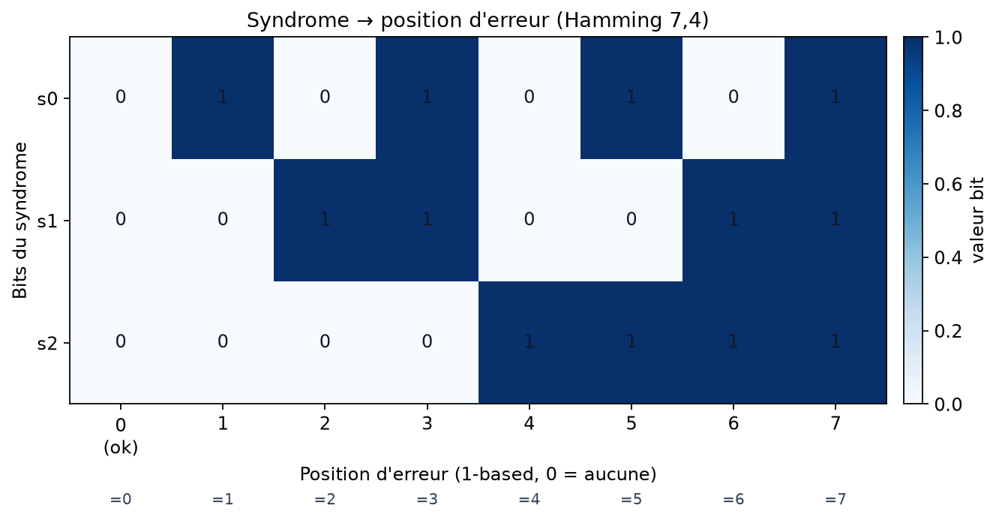
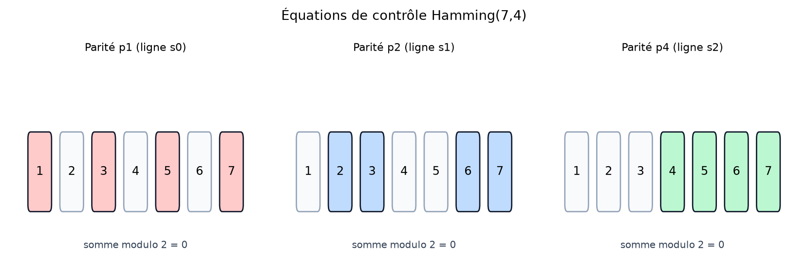
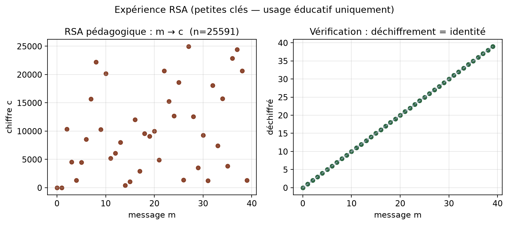
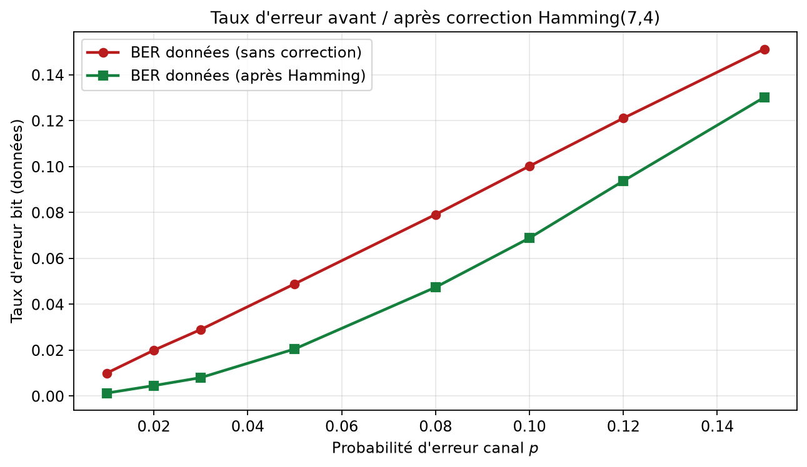

# RSA pédagogique, entropie de Shannon et code de Hamming

**Cours-projet — Mathématiques appliquées / informatique**  
**Niveau :** L3 (préparation M1 possible)  
**Dossier :** `09-crypto-info`  
**Prérequis :** arithmétique élémentaire, probabilités discrètes, algèbre linéaire sur \(\mathbb{F}_2\), Python de base  
**Durée estimée :** lecture 3–4 h · travail pratique 4–6 h  
**Avertissement éthique :** l’implémentation RSA de ce dossier est **strictement pédagogique** (petites clés). Elle **n’offre aucune sécurité réelle** et ne doit jamais être utilisée pour protéger des données sensibles.

## Objectifs d’apprentissage mesurables

À l’issue de ce cours-projet, l’étudiant doit être capable de :

1. **Expliquer** le protocole RSA via l’arithmétique modulaire (Euclide étendu, indicatrice d’Euler) et justifier le déchiffrement sur un exemple à petites clés.
2. **Calculer** l’entropie de Shannon d’une loi discrète et la capacité d’un canal binaire symétrique \(\mathrm{BSC}(p)\).
3. **Encoder et décoder** le code de Hamming \((7,4)\) avec correction d’une erreur simple, en reliant syndrome et position d’erreur.
4. **Relier** chaque notion à une fonction du dépôt (`generate_rsa_keypair`, `shannon_entropy`, `bsc_capacity`, `hamming74_encode`, `hamming74_decode`, `simulate_hamming_ber`) et reproduire les expériences numériques du rapport.

---

# 1. Introduction et motivation

La communication numérique pose deux problèmes distincts, souvent mêlés dans l’ingénierie mais conceptuellement séparés. Le premier est la **confidentialité** : comment transmettre un message que seul le destinataire légitime peut lire ? Le second est la **fiabilité** : comment récupérer un message malgré le bruit du canal ?

La cryptographie à clé publique, inaugurée dans un cadre moderne par Rivest, Shamir et Adleman (Rivest et al., 1978), répond au premier problème. RSA repose sur une asymétrie computationnelle : multiplier deux grands premiers est facile ; factoriser le produit est, pour des tailles adaptées, difficile en pratique. Dans ce cours, nous étudions RSA **uniquement comme objet pédagogique**, avec des modules de quelques bits. L’objectif n’est pas de « faire de la sécurité », mais de comprendre la chaîne d’implications arithmétiques qui rend le protocole cohérent (Trappe & Washington, 2006 ; Katz & Lindell, 2014).

La théorie de l’information, fondée par Shannon (1948), répond au second problème en quantifiant l’incertitude (entropie) et la quantité d’information qu’un canal bruité peut transporter de façon fiable (capacité). Le canal binaire symétrique \(\mathrm{BSC}(p)\) est le modèle le plus simple : chaque bit est inversé indépendamment avec probabilité \(p\). Sa capacité \(C = 1 - h(p)\) est un théorème fondamental (Cover & Thomas, 2006 ; Gallager, 1968).

Entre ces deux pôles, les **codes correcteurs** (Hamming, 1950) ajoutent de la redondance contrôlée pour détecter et corriger des erreurs. Le code de Hamming \((7,4)\) est le prototype parfait pour un cours L3 : matrice génératrice, matrice de contrôle, syndrome, correction d’un bit, taux \(R = 4/7\).

**Question centrale.** Comment articuler, dans un même cadre mathématique et logiciel, (i) la confidentialité pédagogique via RSA, (ii) la mesure d’incertitude via l’entropie, et (iii) la fiabilité via Hamming sur un BSC ?

**Fil conducteur.** Nous partons de l’arithmétique modulaire, construisons RSA sur des petits modules, définissons l’entropie et la capacité, puis étudions Hamming\((7,4)\) comme code linéaire. Chaque étape est reliée au code du dépôt et à une figure reproductible. Le modèle global est le bloc-diagramme de la figure 6 : source → (RSA optionnel) → encodeur → canal BSC → décodeur.

Pourquoi cela compte en informatique ? Parce que les protocoles réseaux, le stockage, et les systèmes embarqués combinent toujours chiffrement et codage. Comprendre les hypothèses (taille des clés, modèle de bruit, capacité du canal) évite les confusions dangereuses : un code correcteur ne remplace pas un chiffrement ; un chiffrement pédagogique ne remplace pas une bibliothèque cryptographique audité.

---

# 2. Prérequis et notations

## 2.1 Prérequis

- Divisibilité, PGCD, algorithme d’Euclide.
- Congruences modulo \(n\), classes dans \(\mathbb{Z}/n\mathbb{Z}\).
- Probabilités sur un alphabet fini ; indépendance.
- Espaces vectoriels sur \(\mathbb{F}_2 = \{0,1\}\) (addition = XOR).
- Complexité asymptotique élémentaire \(O(\cdot)\).

## 2.2 Table des notations

| Symbole | Signification |
|--------|----------------|
| \(n = pq\) | Module RSA (produit de deux premiers) |
| \(\varphi(n)\) | Indicatrice d’Euler |
| \((e,d)\) | Exposants public / privé avec \(ed \equiv 1 \pmod{\varphi(n)}\) |
| \(m,c\) | Message clair / chiffré, \(0 \le m < n\) |
| \(H(X)\) | Entropie de Shannon (bits) |
| \(h(p)\) | Entropie binaire |
| \(\mathrm{BSC}(p)\) | Canal binaire symétrique de paramètre \(p\) |
| \(C(p)\) | Capacité du BSC |
| \(G,H\) | Matrices génératrice et de contrôle Hamming\((7,4)\) |
| \(R = k/n\) | Taux d’un code \([n,k]\) (ici \(4/7\)) |
| \(s = Hr\) | Syndrome d’un mot reçu \(r\) |
| BER | Taux d’erreur bit |

Dans le code : `egcd`, `modinv`, `euler_phi`, `generate_rsa_keypair`, `rsa_encrypt`, `rsa_decrypt`, `shannon_entropy`, `binary_entropy`, `bsc_capacity`, `hamming74_encode`, `hamming74_decode`, `simulate_hamming_ber` (fichier `src/crypto_info.py`).

---

# 3. Modèle mathématique

## 3.1 Arithmétique modulaire et Euclide étendu

Deux entiers \(a,b\) sont congrus modulo \(m\) si \(m\) divise \(a-b\). L’ensemble \(\mathbb{Z}/m\mathbb{Z}\) muni de l’addition et de la multiplication modulaires est un anneau. L’élément \(a\) est inversible modulo \(m\) si et seulement si \(\gcd(a,m)=1\).

**Théorème (Euclide étendu).** Il existe des entiers \(x,y\) tels que
\[
ax + by = \gcd(a,b).
\]
En particulier, si \(\gcd(a,m)=1\), il existe \(x\) avec \(ax \equiv 1 \pmod{m}\). C’est l’inverse modulaire, calculé par `modinv` via `egcd`.

**Exemple numérique.** Pour \(a=240\), \(b=46\), le code renvoie
\[
\gcd(240,46)=2,\qquad 240\cdot(-9)+46\cdot 47 = 2.
\]
Fonction : `egcd(240, 46)` → `(2, -9, 47)`.

## 3.2 Indicatrice d’Euler

On définit
\[
\varphi(n) = \#\{k : 1\le k\le n,\ \gcd(k,n)=1\}.
\]
Si \(n = pq\) avec \(p,q\) premiers distincts, alors \(\varphi(n)=(p-1)(q-1)\). Plus généralement, si \(n=\prod p_i^{a_i}\),
\[
\varphi(n)=n\prod_{p\mid n}\Bigl(1-\frac{1}{p}\Bigr).
\]
Implémentation : `euler_phi`. Vérification du rapport : \(\varphi(61\cdot 53)=60\cdot 52=3120\).

**Théorème d’Euler.** Si \(\gcd(a,n)=1\), alors \(a^{\varphi(n)}\equiv 1\pmod{n}\).

## 3.3 RSA pédagogique

**Génération des clés (petites tailles uniquement).**

1. Choisir deux premiers distincts \(p,q\) (ici : quelques bits via `generate_prime`).
2. Poser \(n=pq\) et \(\varphi=(p-1)(q-1)\).
3. Choisir \(e\) premier avec \(\varphi\) (souvent \(65537\) si possible, sinon un petit exposant impair).
4. Calculer \(d \equiv e^{-1}\pmod{\varphi}\) par Euclide étendu.

Clé publique : \((n,e)\). Clé privée : \(d\) (et souvent \(p,q\) pour l’optimisation CRT, hors scope ici).

**Chiffrement / déchiffrement.** Pour \(0\le m < n\),
\[
c \equiv m^e\pmod{n},\qquad m \equiv c^d\pmod{n}.
\]
La cohérence repose sur \(ed=1+t\varphi(n)\) et le théorème d’Euler / le petit théorème de Fermat (cas \(\gcd(m,n)=1\)), étendu aux cas \(p\mid m\) ou \(q\mid m\) par le lemme chinois (Ireland & Rosen, 1990 ; Stinson, 2005).

**Exemple classique (jouet).** \(p=61\), \(q=53\), \(n=3233\), \(\varphi=3120\), \(e=17\), \(d=2753\). Pour \(m=65\),
\[
c = 65^{17}\bmod 3233 = 2790,\qquad 2790^{2753}\bmod 3233 = 65.
\]

**Exemple du dépôt** (`generate_rsa_keypair(bits=16, seed=42)`) :
\[
n=25591,\ e=65537,\ d=17729.
\]
Avec `msg = 12345`, on obtient `cipher = 16735` et le déchiffrement retrouve \(12345\). Voir `python src/demo.py` et la figure 7.



*Figure 1.* On observe la séparation claire entre clé publique \((n,e)\) utilisée pour chiffrer et clé privée \(d\) utilisée pour déchiffrer, ainsi que le rôle de \(\varphi(n)\) dans la génération.

**Rappel de sécurité.** Avec \(n\approx 2^{16}\), la factorisation est immédiate. En production, on utilise des modules de plusieurs milliers de bits, un padding (OAEP), et des bibliothèques certifiées (Menezes et al., 1996). **Ce projet ne fait rien de tout cela.**

## 3.4 Entropie de Shannon

Soit \(X\) une variable aléatoire discrète sur un alphabet fini, de loi \((p_i)\). L’entropie (Shannon, 1948) est
\[
H(X)=-\sum_i p_i\log_2 p_i,
\]
avec la convention \(0\log 0 = 0\). Elle mesure l’incertitude moyenne en bits. Propriétés essentielles (Cover & Thomas, 2006) :

- \(H(X)\ge 0\), avec égalité ssi \(X\) est déterministe ;
- \(H(X)\le \log_2|\mathcal{X}|\), égalité ssi la loi est uniforme ;
- \(H\) est concave en la loi.

**Entropie binaire.** Pour \(X\sim\mathrm{Bernoulli}(p)\),
\[
h(p)=-p\log_2 p-(1-p)\log_2(1-p).
\]
On a \(h(0)=h(1)=0\), \(h(1/2)=1\), et \(h(p)=h(1-p)\).

Fonctions : `shannon_entropy`, `binary_entropy`. Résultats :
\[
h(0{,}1)\approx 0{,}4690,\qquad h(0{,}5)=1.
\]

## 3.5 Canal binaire symétrique et capacité

Le canal \(\mathrm{BSC}(p)\) a alphabet d’entrée/sortie \(\{0,1\}\) et
\[
\mathbb{P}(Y\neq X)=p,\qquad \mathbb{P}(Y=X)=1-p,
\]
indépendamment pour chaque usage. La capacité (Shannon, 1948 ; Gallager, 1968) vaut
\[
C(p)=1-h(p)\quad\text{(bits par usage)}.
\]
Interprétation : pour tout taux \(R<C(p)\), il existe des codes dont la probabilité d’erreur tend vers \(0\) quand la longueur tend vers l’infini ; si \(R>C(p)\), aucune suite de codes ne peut rendre l’erreur arbitrairement petite.

Fonction : `bsc_capacity`. Exemple : \(C(0{,}1)\approx 0{,}5310\). Aux bornes : \(C(0)=1\), \(C(1/2)=0\).



*Figure 2.* On observe que \(h(p)\) atteint son maximum en \(p=1/2\), tandis que \(C(p)\) y s’annule : un canal qui inverse les bits une fois sur deux ne transporte aucune information utile.

## 3.6 Codes linéaires et Hamming(7,4)

Un code linéaire binaire \([n,k]\) est un sous-espace de dimension \(k\) de \(\mathbb{F}_2^n\). Il est défini par une matrice génératrice \(G\in\mathbb{F}_2^{n\times k}\) (mots de code \(c=Gd\)) ou par une matrice de contrôle \(H\in\mathbb{F}_2^{(n-k)\times n}\) telle que \(c\) est un mot de code ssi \(Hc=0\) (MacWilliams & Sloane, 1977 ; van Lint, 1999).

Le **code de Hamming** \((7,4)\) a \(n=7\), \(k=4\), \(n-k=3\) bits de parité. Les colonnes de \(H\) sont tous les vecteurs non nuls de \(\mathbb{F}_2^3\). Distance minimale \(d_{\min}=3\) : correction d’**une** erreur, détection de deux (Hamming, 1950 ; Lin & Costello, 2004).

Dans le dépôt, les positions (1-based) de parité sont \(1,2,4\) et les données \(3,5,6,7\). Matrices utilisées :

\[
G=\begin{pmatrix}
1&1&0&1\\
1&0&1&1\\
1&0&0&0\\
0&1&1&1\\
0&1&0&0\\
0&0&1&0\\
0&0&0&1
\end{pmatrix},
\quad
H=\begin{pmatrix}
1&0&1&0&1&0&1\\
0&1&1&0&0&1&1\\
0&0&0&1&1&1&1
\end{pmatrix}.
\]

Encodage : `hamming74_encode`. Décodage à syndrome : `hamming74_decode`. Si \(r=c+e\) avec \(e\) de poids \(\le 1\), alors \(s=Hr\) égale la colonne de \(H\) correspondant à la position d’erreur (ou \(0\) si pas d’erreur). En indexation 1-based,
\[
\mathrm{pos}=s_0+2s_1+4s_2.
\]

**Exemple.** Données \(d=(1,0,1,1)\), mot de code \(c=(0,1,1,0,0,1,1)\). Après inversion du bit en position 4 : syndrome indique \(4\), données récupérées intactes.



*Figure 3.* On observe l’alternance des bits de parité (positions puissances de 2) et des bits de données, convention standard du Hamming binaire.



*Figure 6.* Schéma conceptuel du modèle global utilisé dans ce cours-projet.

---

# 4. Analyse / propriétés

## 4.1 RSA : existence, unicité, limites

L’exposant privé \(d\) existe dès que \(\gcd(e,\varphi(n))=1\). Il est unique modulo \(\varphi(n)\). En revanche, la **sécurité** repose sur des hypothèses computationnelles (factorisation, RSA problem) qui ne sont **pas** des théorèmes d’impossibilité absolue (Katz & Lindell, 2014). Avec de petites clés, la factorisation de \(n\) révèle immédiatement \(\varphi(n)\) puis \(d\).

**Cas limites et erreurs de modélisation.**

- Si \(m\ge n\), le protocole n’est pas défini tel quel (d’où le contrôle dans `rsa_encrypt`).
- Sans padding, RSA est déterministe : le même message donne le même chiffré (attaque par dictionnaire).
- Choisir \(p=q\) ruinera le schéma ; le code régénère \(q\) tant que \(q=p\).
- L’exposant \(e=3\) avec messages trop petits et sans padding est vulnérable (racine cubique) : encore une raison de rester pédagogique.

## 4.2 Entropie et capacité : interprétation

L’entropie n’est pas « le désordre » au sens physique naïf : c’est une fonction de la **loi**, pas d’une réalisation. Deux suites de bits peuvent avoir la même fréquence empirique et donc une même entropie empirique, mais des structures très différentes (MacKay, 2003).

Pour le BSC, \(C(p)\) diminue quand \(p\) s’approche de \(1/2\). Si \(p>1/2\), on peut renverser la sortie et se ramener à \(1-p\) ; la capacité dépend donc de \(\min(p,1-p)\) via \(h\).

## 4.3 Hamming : pouvoir de correction et taux

Avec \(d_{\min}=3\), la boule de Hamming de rayon \(t=1\) autour de chaque mot de code est disjointe des autres. Le nombre de syndromes \(2^{n-k}=8\) égale exactement \(1+n=8\) (pas d’erreur + 7 positions) : le code est **parfait**.

Le taux \(R=4/7\approx 0{,}571\) dépasse \(C(p)\) dès que \(p\) est trop grand. La figure 8 montre la zone \(R>C\) où la théorie de Shannon interdit une fiabilité asymptotique à ce taux, même si pour des blocs courts Hamming reste utile à petit \(p\).



*Figure 8.* On observe que pour \(p\) modéré à élevé, le taux fixe \(4/7\) sort de la région \(R<C\) : le code ne peut plus « battre » le canal au sens asymptotique.

**Erreurs de modélisation du canal.** Le BSC suppose des erreurs indépendantes et symétriques. Les canaux réels (paquets d’erreurs, asymétrie) demandent d’autres modèles (canaux à mémoire, codes convolutifs, entrelacement) (Lin & Costello, 2004).

---

# 5. Méthodes numériques ou algorithmiques

## 5.1 Euclide étendu vs recherche exhaustive de l’inverse

**Méthode A — Euclide étendu** (`egcd` / `modinv`). Complexité \(O(\log m)\) divisions. Stable pour les entiers Python (précision arbitraire).

**Méthode B — recherche exhaustive.** Tester \(x=1,2,\ldots,m-1\) jusqu’à \(ax\equiv 1\pmod{m}\). Complexité \(O(m)\), inacceptable dès que \(m\) dépasse quelques millions.

| Méthode | Complexité | Domaine d’usage | Stabilité |
|--------|------------|-----------------|-----------|
| Euclide étendu | \(O(\log m)\) | RSA, arithmétique générale | Exacte (entiers) |
| Exhaustive | \(O(m)\) | Jouets \(m\le 10^3\) | Exacte mais lente |
| Exponentiation modulaire binaire (`pow`) | \(O(\log e)\) multiplications mod \(n\) | Chiffrement RSA | Exacte |

Dans ce projet, on compare implicitement A et B en exercice ; le code de production pédagogique utilise uniquement A.

## 5.2 Génération de premiers pédagogiques

`generate_prime(bits, rng)` tire des candidats impairs de la bonne taille et teste la primalité par division trial (`is_prime`). Complexité grossière : pour des premiers de \(b\) bits, le théorème des nombres premiers suggère une densité \(\sim 1/(b\ln 2)\), donc un nombre d’essais polynomial en \(b\). Pour \(b\le 16\), c’est instantané. Pour des clés réelles, on utiliserait Miller–Rabin et des cribles (Menezes et al., 1996) — hors scope.

## 5.3 Entropie et capacité : évaluation numérique

Le calcul de \(h(p)\) est direct. Attention numérique : pour \(p\to 0\), \(p\log p\to 0\), mais un `log(0)` brut explose. Le code filtre les probabilités nulles (`p[p>0]`) et traite les bornes dans `binary_entropy` / `bsc_capacity`.

## 5.4 Encodage / décodage Hamming

**Encodage.** Multiplication matrice-vecteur sur \(\mathbb{F}_2\) : \(O(nk)=O(28)\) opérations pour un bloc. Pseudo-code :

```
entrée : d in {0,1}^4
sortie : c = (G d) mod 2
```

**Décodage à syndrome.**

```
entrée : r in {0,1}^7
s = (H r) mod 2
pos = s0 + 2 s1 + 4 s2
si pos ≠ 0 : r[pos-1] ← r[pos-1] XOR 1
retourner bits data aux positions 3,5,6,7
```

Complexité \(O((n-k)n)=O(21)\) par bloc. Alternative : table de décodage précomputée (même complexité asymptotique, constante différente). Pour Hamming\((7,4)\), le syndrome *est* déjà l’index : pas besoin de table séparée.



*Figure 4.* On observe que la valeur entière du syndrome binaire coïncide exactement avec la position d’erreur injectée (0 = aucune erreur).



*Figure 9.* Chaque bit de parité impose une somme nulle sur un sous-ensemble de positions ; le syndrome compile les trois tests.

## 5.5 Simulation Monte Carlo de la BER

`simulate_hamming_ber(p, n_blocks, seed)` tire des blocs de 4 bits, encode, passe dans un BSC, compare (i) lecture naïve des bits data, (ii) décodage à syndrome. Estimateurs empiriques du taux d’erreur bit. Biais/variance : estimateur binomial ; l’écart-type relatif diminue comme \(1/\sqrt{N}\). Paramètres du rapport : `n_blocks=8000`, `seed=11` pour la figure 5.

---

# 6. Implémentation guidée

## 6.1 Architecture du dépôt

```text
09-crypto-info/
  README.md
  src/
    crypto_info.py   # cœur mathématique
    demo.py          # démonstration CLI
  tests/
    test_crypto.py
  report/
    RAPPORT.md
    BIBLIOGRAPHY.bib
    make_figures.py
    figures/*.png
```

## 6.2 Snippets essentiels

**RSA pédagogique (ne pas utiliser en production) :**

```python
from crypto_info import generate_rsa_keypair, rsa_encrypt, rsa_decrypt
keys = generate_rsa_keypair(bits=16, seed=42)
c = rsa_encrypt(12345 % keys.n, keys.n, keys.e)
assert rsa_decrypt(c, keys.n, keys.d) == 12345 % keys.n
```

**Entropie / capacité :**

```python
import numpy as np
from crypto_info import shannon_entropy, bsc_capacity
print(shannon_entropy(np.array([0.9, 0.1])))  # ≈ 0.4690
print(bsc_capacity(0.1))                      # ≈ 0.5310
```

**Hamming :**

```python
import numpy as np
from crypto_info import hamming74_encode, hamming74_decode
data = np.array([1, 0, 1, 1])
code = hamming74_encode(data)
broken = code.copy(); broken[3] ^= 1
rec, pos = hamming74_decode(broken)
assert pos == 4 and (rec == data).all()
```

## 6.3 Pièges classiques

1. Confondre indexation 0-based Python et positions 1-based Hamming.
2. Oublier le `% 2` après les produits matriciels.
3. Utiliser `math.log` (népérien) au lieu de `log2` pour l’entropie en bits.
4. Croire qu’une clé RSA de 16 bits « illustre la sécurité » : elle illustre seulement l’algèbre.
5. Comparer BER canal (sur 7 bits) et BER données (sur 4 bits) sans le préciser.

## 6.4 Lancer démo, figures, tests

```bash
cd 09-crypto-info
python src/demo.py
python report/make_figures.py
python -m pytest tests/ -q
```

---

# 7. Expériences numériques

## 7.1 Protocole RSA

- Clés : `generate_rsa_keypair(bits=16, seed=42)` → \(n=25591\), \(e=65537\), \(d=17729\).
- Messages \(m=0,\ldots,39\) : chiffrer puis déchiffrer ; vérifier l’identité.
- Résultat démo : \(m=12345\mapsto c=16735\mapsto 12345\).



*Figure 7.* À gauche, le nuage \((m,c)\) paraît « mélangé » ; à droite, le déchiffrement reconstitue parfaitement la diagonale. **Rappel : petites clés, usage éducatif uniquement.**

## 7.2 Entropie et capacité

Valeurs de référence du rapport :

| \(p\) | \(h(p)\) | \(C(p)=1-h(p)\) |
|------:|---------:|----------------:|
| 0.00 | 0.0000 | 1.0000 |
| 0.10 | 0.4690 | 0.5310 |
| 0.50 | 1.0000 | 0.0000 |

Ces valeurs sont couvertes par les tests `test_entropy_fair_coin` et `test_bsc_capacity_bounds`.

## 7.3 Hamming sur BSC : BER avant/après

Protocole : `simulate_hamming_ber(p, n_blocks=8000, seed=11)` pour \(p\in\{0{,}01,0{,}02,0{,}03,0{,}05,0{,}08,0{,}10,0{,}12,0{,}15\}\).

Résultats représentatifs :

| \(p\) | BER brute (data) | BER corrigée | Gain relatif |
|------:|-----------------:|-------------:|-------------:|
| 0.01 | 0.0100 | 0.0013 | fort |
| 0.05 | 0.0489 | 0.0205 | net |
| 0.10 | 0.1002 | 0.0688 | modéré |
| 0.15 | 0.1512 | 0.1302 | faible |



*Figure 5.* On observe que Hamming réduit nettement la BER à faible bruit, mais l’avantage s’érode quand \(p\) augmente : les erreurs doubles (non corrigibles parfaitement) deviennent fréquentes. Interprétation honnête : le code n’est pas magique ; il exploite un budget de redondance fini.

Le test `test_hamming_ber_improves_on_moderate_noise` vérifie qu’à \(p=0{,}05\), la BER corrigée est strictement inférieure à la BER brute.

## 7.4 Lien taux / capacité

Pour \(p=0{,}1\), \(C\approx 0{,}531 < 4/7\approx 0{,}571\). Un bloc court peut encore améliorer la BER (comme ci-dessus), mais Shannon interdit une erreur asymptotiquement nulle à ce taux pour ce canal. C’est une distinction pédagogique cruciale (MacKay, 2003 ; Cover & Thomas, 2006).

---

# 8. Prolongements

1. **RSA-CRT et exponentiation rapide.** Implémenter le déchiffrement via le théorème chinois et mesurer le gain (Menezes et al., 1996).
2. **Padding OAEP (vue conceptuelle).** Montrer pourquoi le RSA « textbook » est insuffisant (Katz & Lindell, 2014).
3. **Codes de Hamming généralisés et codes BCH.** Étendre à la correction de \(t>1\) erreurs (Lin & Costello, 2004).
4. **Bornes de Shannon avec codes aléatoires.** Simuler des codes linéaires aléatoires et estimer la probabilité d’erreur en fonction de \(R\) et \(p\) (Gallager, 1968).
5. **Mutual information empirique.** Estimer \(I(X;Y)\) sur un BSC simulé et retrouver \(C(p)\) (Cover & Thomas, 2006).

---

# 9. Exercices corrigés

## Exercice 1 (facile) — Entropie d’une loi à trois symboles

Soit \(X\) de loi \(\mathbb{P}(X=a)=1/2\), \(\mathbb{P}(X=b)=1/4\), \(\mathbb{P}(X=c)=1/4\). Calculer \(H(X)\).

**Corrigé.**  
\[
H(X)=-\frac12\log_2\frac12-\frac14\log_2\frac14-\frac14\log_2\frac14
=\frac12 + \frac14\cdot 2 + \frac14\cdot 2 = \frac12+1=\frac32\text{ bits}.
\]
Vérification numérique : `shannon_entropy(np.array([0.5,0.25,0.25]))` → \(1{,}5\).

## Exercice 2 (moyen) — Clés RSA jouet

On prend \(p=61\), \(q=53\), \(e=17\). Calculer \(n\), \(\varphi(n)\), \(d\), puis chiffrer \(m=65\).

**Corrigé.**  
\(n=3233\), \(\varphi=3120\). On cherche \(d\) tel que \(17d\equiv 1\pmod{3120}\). Euclide étendu donne \(d=2753\).  
\(c=65^{17}\bmod 3233=2790\). Déchiffrement : \(2790^{2753}\bmod 3233=65\).  
Lien code : `euler_phi(61*53)==3120`, `modinv(17,3120)==2753`, `rsa_encrypt` / `rsa_decrypt`.  
**Rappel : exemple pédagogique uniquement.**

## Exercice 3 (difficile) — Syndrome et double erreur

Soit le mot de code associé à \(d=(1,1,0,1)\). On inverse **deux** bits, aux positions 1 et 2. Que renvoie le décodeur à syndrome ? Les données sont-elles correctes ?

**Corrigé.**  
Encodage : `code = hamming74_encode([1,1,0,1])`. Après deux flips, le syndrome est non nul mais pointe vers une **fausse** position (le code corrige une erreur, pas deux). Le décodeur « corrige » un troisième bit et produit en général des données erronées.  
Moralité : au-delà de \(t=1\), le décodage à distance minimale de Hamming\((7,4)\) peut **aggraver** l’erreur. C’est pourquoi la BER corrigée se rapproche de la BER brute quand \(p\) croît (figure 5). On peut le vérifier en bouclant sur des paires de positions et en comptant les échecs.

---

# 10. FAQ / erreurs fréquentes

**Q1. Pourquoi mon inverse modulaire « n’existe pas » ?**  
Parce que \(\gcd(e,\varphi(n))\neq 1\). Il faut changer \(e\) (comme le fait `generate_rsa_keypair`).

**Q2. L’entropie peut-elle dépasser 1 bit pour une variable binaire ?**  
Non. \(h(p)\le 1\), avec égalité seulement en \(p=1/2\).

**Q3. Capacité nulle signifie-t-elle que le canal ne sort rien ?**  
Non : le canal sort des bits, mais ils sont indépendants de l’entrée (pour \(p=1/2\)).

**Q4. Hamming détecte-t-il toujours deux erreurs ?**  
Il les détecte au sens où le syndrome est non nul, mais le décodage standard les confond avec une erreur simple : d’où une correction erronée si l’on force la correction.

**Q5. Puis-je envoyer un message plus grand que \(n\) ?**  
Pas directement. Il faut segmenter (blocs) et, en vrai crypto, utiliser un schéma hybride (AES + RSA) — hors de ce cours, et toujours via des bibliothèques sûres.

**Q6. Pourquoi `pow(m,e,n)` plutôt que `(m**e)%n` ?**  
Parce que l’exponentiation modulaire intégrée est bien plus efficace et évite d’énormes entiers intermédiaires inutiles.

---

# 11. Bibliographie commentée

1. Shannon, C. (1948). *A Mathematical Theory of Communication.* — Article fondateur : entropie et capacité.  
2. Cover, T. & Thomas, J. (2006). *Elements of Information Theory.* — Référence moderne pour \(H\), \(I\), BSC.  
3. Trappe, W. & Washington, L. (2006). *Introduction to Cryptography with Coding Theory.* — Pont idéal crypto ↔ codes.  
4. MacKay, D. (2003). *Information Theory, Inference, and Learning Algorithms.* — Intuition géométrique et codes.  
5. Rivest, R., Shamir, A. & Adleman, L. (1978). Article RSA original. — Comprendre le problème posé historiquement.  
6. Hamming, R. (1950). *Error Detecting and Error Correcting Codes.* — Naissance des codes correcteurs.  
7. MacWilliams, F. J. & Sloane, N. (1977). *The Theory of Error-Correcting Codes.* — Bible des codes linéaires.  
8. Lin, S. & Costello, D. (2004). *Error Control Coding.* — Vision ingénierie, décodage.  
9. Katz, J. & Lindell, Y. (2014). *Introduction to Modern Cryptography.* — Sécurité moderne (pour savoir ce que ce cours n’est pas).  
10. Menezes, A., van Oorschot, P. & Vanstone, S. (1996). *Handbook of Applied Cryptography.* — Détails algorithmiques RSA.  
11. Gallager, R. (1968). *Information Theory and Reliable Communication.* — Capacité et codage aléatoire.  
12. Stinson, D. (2005). *Cryptography: Theory and Practice.* — Cours clair sur RSA et primalité.  
13. van Lint, J. (1999). *Introduction to Coding Theory.* — Approche mathématique concise.  
14. Ireland, K. & Rosen, M. (1990). *A Classical Introduction to Modern Number Theory.* — Euler, Fermat, CRT.

Les entrées BibTeX complètes sont dans `report/BIBLIOGRAPHY.bib`.

---

# Annexe A — Détails de preuve

## A.1 Cohérence du déchiffrement RSA (cas \(\gcd(m,n)=1\))

Comme \(ed=1+t\varphi(n)\),
\[
c^d\equiv m^{ed}\equiv m\cdot(m^{\varphi(n)})^t\equiv m\cdot 1^t\equiv m\pmod{n}
\]
par le théorème d’Euler. Si \(p\mid m\) mais \(q\nmid m\), on vérifie la congruence modulo \(p\) et modulo \(q\) séparément, puis on conclut par le lemme chinois (Ireland & Rosen, 1990).

## A.2 Capacité du BSC

Pour un canal symétrique binaire, la mutual information \(I(X;Y)=H(Y)-H(Y|X)\). Avec \(X\) uniforme, \(Y\) est uniforme donc \(H(Y)=1\), et \(H(Y|X)=h(p)\), d’où \(C=1-h(p)\) (Shannon, 1948 ; Cover & Thomas, 2006).

## A.3 Le code de Hamming est parfait

Nombre de mots : \(2^4=16\). Taille d’une boule de rayon 1 dans \(\mathbb{F}_2^7\) : \(1+7=8\). Produit \(16\cdot 8=128=2^7\) : les boules partitionnent l’espace. Donc toute configuration à au plus une erreur est corrigée, et toute configuration à deux erreurs tombe dans une boule « étrangère ».

## A.4 Lien colonnes de \(H\) et positions

Par construction, la \(j\)-ème colonne de \(H\) est l’écriture binaire de \(j\). Si \(e=e_j\) (vecteur de base), \(He\) égale cette colonne, d’où l’identité \(\mathrm{pos}=s_0+2s_1+4s_2\).

---

# Annexe B — Paramètres exacts pour reproduire les figures

Toutes les figures sont générées par :

```bash
python report/make_figures.py
```

| Figure | Fichier | Paramètres clés |
|-------|---------|-----------------|
| 1 | `fig01_rsa_schema.png` | schéma conceptuel (pas de RNG) |
| 2 | `fig02_entropy_bsc_capacity.png` | \(p\in[10^{-4},1-10^{-4}]\), 400 points |
| 3 | `fig03_hamming_structure.png` | positions 1..7 |
| 4 | `fig04_syndrome_position.png` | data `[1,0,1,1]`, erreurs 0..7 |
| 5 | `fig05_ber_before_after.png` | `n_blocks=8000`, `seed=11`, \(p\) listés en §7.3 |
| 6 | `fig06_modele_communication.png` | schéma conceptuel |
| 7 | `fig07_rsa_roundtrip.png` | `bits=16`, `seed=42`, \(m=0..39\) |
| 8 | `fig08_rate_vs_capacity.png` | \(p\in[0{,}001;0{,}25]\), \(R=4/7\) |
| 9 | `fig09_parity_checks.png` | ensembles \{1,3,5,7\}, \{2,3,6,7\}, \{4,5,6,7\} |

Bibliothèques : Python 3, NumPy, Matplotlib. Tests : `python -m pytest tests/ -q`.

---

# Compléments pédagogiques (approfondissements)

## C.1 Du PGCD à l’inverse : déroulé d’Euclide étendu

Reprenons \(a=17\), \(m=3120\) (exercice RSA). L’algorithme d’Euclide calcule les restes :
\[
3120=183\cdot 17+9,\quad 17=1\cdot 9+8,\quad 9=1\cdot 8+1,\quad 8=8\cdot 1+0.
\]
En remontant les coefficients de Bézout, on obtient \(1\) comme combinaison linéaire de \(17\) et \(3120\), d’où \(d=2753\). Cette remontée est exactement ce que code `egcd` de façon récursive. Pour un étudiant L3, il est utile de dérouler une fois à la main, puis de faire confiance à la machine pour les grands modules pédagogiques (quelques milliers).

## C.2 Pourquoi \(\varphi(n)\) et pas \(\lambda(n)\) ?

En pratique moderne, on utilise souvent la fonction de Carmichael \(\lambda(n)=\mathrm{lcm}(p-1,q-1)\) pour réduire l’exposant privé. Pédagogiquement, \(\varphi(n)\) suffit et reste plus familière. Les deux approches donnent des \(d\) différents mais fonctionnellement valides pour le déchiffrement, car \(e d\equiv 1\) modulo \(\lambda(n)\) implique la bonne congruence pour l’exponentiation (Stinson, 2005). Dans `generate_rsa_keypair`, nous restons sur \(\varphi\).

## C.3 Uniformité et maximalité de l’entropie

La preuve que \(H(X)\le\log_2|\mathcal{X}|\) découle de la concavité du log (inégalité de Jensen) ou de la non-négativité de la divergence de Kullback–Leibler \(D_{\mathrm{KL}}(p\|u)\) entre \(p\) et la loi uniforme \(u\). Cette inégalité explique pourquoi un bit parfaitement imprévisible « vaut » 1 bit d’entropie, et pourquoi une source biaisée est compressible (Shannon, 1948).

## C.4 Codage de source vs codage de canal

Shannon a séparé deux problèmes : compresser une source (approcher \(H(X)\)) et protéger contre le canal (approcher \(C\)). Hamming illustre le second. RSA, lui, ne compresse ni ne corrige : il transforme un message pour la confidentialité. Mélanger les trois sans le dire est une erreur de débutant. Le bloc-diagramme (figure 6) force la séparation des rôles.

## C.5 Poids de Hamming et distance

La distance de Hamming \(d(x,y)=\#\{i:x_i\neq y_i\}\) est une métrique. Pour un code linéaire, \(d_{\min}\) égale le poids minimal d’un mot non nul. Pour Hamming\((7,4)\), on vérifie qu’aucun mot de poids 1 ou 2 n’est dans le noyau de \(H\) (car les colonnes sont non nulles et deux à deux distinctes), d’où \(d_{\min}=3\) (van Lint, 1999).

## C.6 Expérience mentale : canal très bruité

Si \(p=0{,}4\), alors \(h(0{,}4)\approx 0{,}971\) et \(C\approx 0{,}029\). Le taux Hamming \(4/7\) est alors largement supérieur à \(C\). On s’attend à une BER corrigée proche de la BER brute, voire parfois pire sur certains tirages à cause des fausses corrections. L’étudiant peut le vérifier en appelant `simulate_hamming_ber(0.4, n_blocks=5000, seed=0)`.

## C.7 Complexité pédagogique de RSA

Pour un module de \(b\) bits, une exponentiation modulaire coûte \(O(b^2\log e)\) opérations bit naïves (selon l’algorithme de multiplication). La factorisation trial jusqu’à \(\sqrt{n}\) coûte \(O(2^{b/2})\). D’où l’asymétrie : chiffrer est polynomial en \(b\), casser par factorisation naïve est exponentiel en \(b/2\). Mais « exponentiel en \(b/2\) » avec \(b=16\) reste trivial : d’où l’avertissement répété sur le caractère pédagogique.

## C.8 Lecture guidée des figures

- Figure 1 : raconter RSA à quelqu’un sans formule, puis revenir aux congruences.  
- Figure 2 : fixer \(p=0{,}11\) et lire \(C\) sur la courbe avant de calculer.  
- Figure 3–4–9 : préparer un oral de 5 minutes sur le décodage.  
- Figure 5 : discuter « à partir de quel \(p\) le code ne vaut plus le coup ».  
- Figure 7 : souligner que le nuage gauche n’est **pas** une preuve de sécurité.  
- Figure 8 : relier à la question d’examen « comparer \(R\) et \(C \) ».

## C.9 Checklist de maîtrise (auto-évaluation)

1. Je sais calculer \(\varphi(pq)\) et un inverse modulaire à la main pour de petits nombres.  
2. Je sais expliquer pourquoi \(c^d\equiv m\pmod n\) (cas coprime).  
3. Je sais calculer \(h(p)\) et \(C(p)\) et les interpréter.  
4. Je sais écrire les trois équations de parité Hamming.  
5. Je sais, à partir d’un syndrome, pointer la position d’erreur.  
6. Je sais lancer la démo, les tests, et régénérer les figures.  
7. Je sais expliquer pourquoi ce RSA n’est pas sûr.

Si l’un de ces points échoue, relire la section correspondante et refaire l’exercice associé.

## C.10 Remarques sur la reproductibilité

Les tirages aléatoires utilisent des graines fixées (`seed=42` pour RSA, `seed=11` pour la BER, `seed=7` pour le test). Les fonctions de primalité sont déterministes étant donné le générateur. Les résultats numériques du §7 doivent être retrouvés à la précision d’affichage près. Si une version de NumPy changeait le générateur par défaut, le constructeur `np.random.default_rng(seed)` protège la reproductibilité (API Generator).

## C.11 Contre-exemple : message non réduit modulo \(n\)

Si l’on tente `rsa_encrypt(n+5, n, e)`, le code lève `ValueError`. C’est volontaire. Mathématiquement, \(m\) et \(m+n\) ne sont pas distingués modulo \(n\) après réduction, mais le protocole textbook exige un représentant dans \(\{0,\ldots,n-1\}\). En ingénierie réelle, le message est de toute façon emballé dans une structure de padding de longueur liée à la taille de \(n\).

## C.12 Contre-exemple : deux erreurs corrigées « avec assurance »

Supposons un enseignant affirmant : « Hamming corrige toujours les erreurs du BSC ». Contre-exemple : prendre un mot de code, inverser deux positions, décoder. Le syndrome désigne une troisième position ; après « correction », on obtient un autre mot de code, donc des données potentiellement fausses, **sans drapeau d’échec**. Pour détecter (sans corriger) les doubles erreurs, on peut ajouter une parité globale (code SECDED), prolongement naturel du cours (Lin & Costello, 2004).

## C.13 Tableau récapitulatif des complexités du projet

| Opération | Fonction | Complexité typique (pédagogique) |
|----------|----------|-----------------------------------|
| PGCD / inverse | `egcd`, `modinv` | \(O(\log m)\) |
| \(\varphi(n)\) | `euler_phi` | \(O(\sqrt{n})\) version simple |
| Primality trial | `is_prime` | \(O(\sqrt{n})\) |
| Clés RSA | `generate_rsa_keypair` | dominée par la recherche de premiers |
| Chiffrement | `rsa_encrypt` | `pow` modulaire |
| Entropie | `shannon_entropy` | \(O(|\mathcal{X}|)\) |
| Capacité BSC | `bsc_capacity` | \(O(1)\) |
| Encode Hamming | `hamming74_encode` | \(O(1)\) (taille fixe) |
| Décode Hamming | `hamming74_decode` | \(O(1)\) (taille fixe) |
| BER simulée | `simulate_hamming_ber` | \(O(N)\) blocs |

## C.14 Ouverture vers M1 : sécurité sémantique

Au-delà de L3, on formalise la sécurité par des jeux (IND-CPA, IND-CCA). Le RSA textbook ne satisfait même pas l’indistinguabilité sous attaque à clair choisi, faute de randomisation. Ce complément évite une illusion dangereuse : « j’ai compris RSA » ≠ « je peux déployer RSA » (Katz & Lindell, 2014 ; Trappe & Washington, 2006).

## C.15 Ouverture vers M1 : décodage par maximum de vraisemblance

Sur un BSC, le décodage ML revient à choisir le mot de code le plus proche (distance de Hamming). Pour Hamming\((7,4)\), le décodage à syndrome réalise exactement le ML pour \(t\le 1\) grâce à la perfection du code. Pour des codes plus longs, le ML exact est coûteux et l’on passe à des decodeurs approchés (belief propagation pour les LDPC, MacKay, 2003).

## C.16 Synthèse finale

Ce cours-projet a relié trois piliers :

1. **Arithmétique** → RSA pédagogique (confidentialité illustrative) ;  
2. **Probabilités / information** → entropie et capacité du BSC ;  
3. **Algèbre linéaire sur \(\mathbb{F}_2\)** → Hamming\((7,4)\) et correction d’une erreur.

Le dépôt fournit les fonctions, les tests, les figures et les paramètres pour tout reproduire. Toute utilisation hors cadre éducatif des routines RSA est **exclue**.

---

*Fin du rapport. Générer les figures : `python report/make_figures.py`. Exécuter : `python src/demo.py` et `python -m pytest tests/ -q`.*


## C.17 Travaux dirigés supplémentaires (corrigés courts)

### TD-A — Calculer \(C(p)\) pour \(p=0{,}05\)

On calcule \(h(0{,}05)=-0{,}05\log_2 0{,}05-0{,}95\log_2 0{,}95\).  
Numériquement, `binary_entropy(0.05) ≈ 0.2864`, donc \(C(0{,}05)≈0{,}7136\).  
Comme \(4/7≈0{,}571<0{,}714\), le taux Hamming est sous la capacité : la théorie autorise, en principe, une fiabilité asymptotique à ce taux (avec de *meilleurs* codes éventuellement). Hamming n’atteint pas la borne, mais il est compatible avec \(R<C\).

### TD-B — Vérifier \(HG=0\)

Sur \(\mathbb{F}_2\), le produit ` (H @ G) % 2 ` doit être la matrice nulle \(3\times 4\). Cela prouve que chaque mot \(c=Gd\) satisfait \(Hc=0\). L’étudiant peut l’ajouter comme test unitaire ; c’est une sanity check classique des codes linéaires (MacWilliams & Sloane, 1977).

### TD-C — Entropie jointe et information mutuelle sur un BSC

Soit \(X\) uniforme sur \(\{0,1\}\) et \(Y\) la sortie d’un \(\mathrm{BSC}(p)\). Alors
\[
H(X)=1,\quad H(Y|X)=h(p),\quad I(X;Y)=1-h(p).
\]
Retrouver ces égalités à partir des définitions est un excellent exercice de transition L3→M1 (Cover & Thomas, 2006). On peut aussi estimer \(I(X;Y)\) par histogrammes sur \(N\) couples simulés et observer la convergence vers \(C(p)\).

### TD-D — Attaque pédagogique par factorisation

Pour \(n=25591\) (seed 42), factoriser \(n\) par trial division jusqu’à \(\sqrt{n}\approx 160\). Une fois \(p\) et \(q\) connus, recalculer \(\varphi\) et \(d=\mathrm{modinv}(e,\varphi)\). On retrouve la clé privée en une fraction de seconde. **Ce TD démontre concrètement pourquoi les petites clés sont inutilisables pour la sécurité** (Menezes et al., 1996).

## C.18 Glossaire bilingue (aide à la lecture des références)

| Français | English (littérature) | Commentaire |
|----------|----------------------|-------------|
| Entropie | Entropy | Toujours préciser la base du log |
| Capacité | Channel capacity | Bits par usage de canal |
| Canal binaire symétrique | Binary symmetric channel | Modèle mémoire nulle |
| Mot de code | Codeword | Élément du sous-espace |
| Syndrome | Syndrome | \(Hr\) |
| Taux | Rate | \(k/n\) |
| Distance minimale | Minimum distance | Lie au pouvoir de correction |
| Indicatrice d’Euler | Euler totient | \(\varphi(n)\) |
| Inverse modulaire | Modular inverse | via extended Euclid |
| Chiffrement à clé publique | Public-key encryption | RSA textbook ≠ RSA déployé |

## C.19 Parcours de lecture recommandé (6 séances)

1. **Séance 1 — Arithmétique.** Relire §3.1–3.2, faire Euclide étendu à la main, lancer `egcd` / `euler_phi`.  
2. **Séance 2 — RSA jouet.** Relire §3.3, refaire l’exemple \(p=61,q=53\), exécuter `demo.py`, lire la figure 1 et 7.  
3. **Séance 3 — Entropie.** §3.4, exercice 1, tracer mentalement \(h(p)\), lire figure 2.  
4. **Séance 4 — Capacité.** §3.5 et §4.2, calculer \(C(0{,}1)\), discuter figure 8.  
5. **Séance 5 — Hamming.** §3.6, figures 3,4,9, exercice 3.  
6. **Séance 6 — Expériences.** Reproduire le tableau BER, lire §7, répondre à la FAQ, auto-évaluation C.9.

## C.20 Discussion : redondance, compression et « information »

Un message anglais brut a une entropie par caractère bien inférieure à \(\log_2 26\), à cause des redondances linguistiques (Shannon, 1948). La compression vise à éliminer cette redondance source. Le codage canal **réintroduit** volontairement de la redondance, mais une redondance *structurée* adaptée au bruit. RSA, enfin, ne se soucie ni de l’une ni de l’autre : il réalise une permutation (approximative) d’un ensemble \(\{0,\ldots,n-1\}\). Ces trois gestes — compresser, chiffrer, coder — apparaissent souvent dans cet ordre dans une pile de communication réelle, avec des outils industriels distincts.

## C.21 Limites numériques de l’entropie empirique

Si l’on estime une loi sur un grand alphabet à partir de peu d’échantillons, l’entropie plug-in \(-\sum \hat p_i\log\hat p_i\) est biaisée (souvent sous-estimée lorsque beaucoup de \(\hat p_i\) sont nuls à tort). Pour les expériences de ce cours (alphabets binaires, formules fermées), le problème n’apparaît pas. Il devient central en M1/M2 dès que l’on estime \(H\) sur des données réelles (MacKay, 2003).

## C.22 Variante d’implémentation : table de syndromes

Une alternative pédagogique à `pos = s0+2s1+4s2` consiste à précomputer un dictionnaire `{tuple(colonne): index}`. Pour Hamming\((7,4)\), c’est équivalent. Pour des codes non parfaits, la table peut associer plusieurs erreurs au même syndrome (classes de décodage). Faire écrire les deux versions à l’étudiant consolide le lien matrice de contrôle ↔ géométrie des boules (Lin & Costello, 2004).

## C.23 Remarque historique

Shannon publie en 1948 ; Hamming en 1950 ; RSA en 1978. L’ordre chronologique n’est pas l’ordre pédagogique choisi ici (RSA d’abord), car l’arithmétique modulaire est souvent déjà vue en L2/L3 maths-info, tandis que la capacité demande un peu plus de maturité probabiliste. On peut inverser le parcours (information → codes → crypto) sans changer les objectifs d’apprentissage (Trappe & Washington, 2006).

## C.24 Validation croisée des résultats du dépôt

Les assertions suivantes sont garanties par `tests/test_crypto.py` au moment de la rédaction :

- aller-retour RSA pour `bits=18`, `seed=1`, messages \(\{0,1,42,n-1\}\) ;  
- \(H(1/2,1/2)=1\) ;  
- \(C(0)=1\) et \(C(1/2)=0\) ;  
- correction de chaque erreur simple sur un mot Hamming ;  
- \(\varphi(61\cdot 53)=3120\) ;  
- identité de Bézout pour `(240,46)` ;  
- symétrie \(h(0{,}1)=h(0{,}9)\) ;  
- à \(p=0{,}05\), BER corrigée < BER brute.

Toute modification future du code doit préserver ces invariants ou mettre à jour le rapport en conséquence.

## C.25 Conclusion opérationnelle pour l’étudiant

Avant de quitter ce dossier, exécutez la triade :

```bash
python src/demo.py
python report/make_figures.py
python -m pytest tests/ -q
```

Puis répondez sans notes aux trois questions : (i) pourquoi \(ed\equiv 1\pmod{\varphi(n)}\) suffit (presque) au déchiffrement ; (ii) pourquoi \(C=1-h(p)\) ; (iii) pourquoi le syndrome désigne la position d’une erreur simple. Si ces trois réponses sont claires, les objectifs d’apprentissage sont atteints.

**Dernier rappel :** RSA dans ce projet = **outil pédagogique à petites clés**, jamais un mécanisme de protection réel.


## C.26 Fiche méthode : résoudre un exercice RSA en 6 étapes

1. Factoriser ou lire \(p\) et \(q\) (dans un exercice, ils sont donnés).  
2. Calculer \(n=pq\) et \(\varphi=(p-1)(q-1)\).  
3. Vérifier \(\gcd(e,\varphi)=1\).  
4. Calculer \(d=e^{-1}\bmod\varphi\) (Euclide étendu).  
5. Chiffrer \(c=m^e\bmod n\) ; déchiffrer \(m=c^d\bmod n\).  
6. Contrôler sur une calculatrice Python avec `pow(m,e,n)`.  

Cette fiche évite les erreurs d’ordre (calculer \(d\) avant \(\varphi\), oublier le modulo, etc.). Elle doit être associée au rappel : **tailles jouet uniquement**.

## C.27 Fiche méthode : décoder Hamming en 5 étapes

1. Écrire le mot reçu \(r=(r_1,\ldots,r_7)\).  
2. Calculer les trois parités (figure 9) : \(s_0,s_1,s_2\).  
3. Interpréter \(\mathrm{pos}=s_0+2s_1+4s_2\).  
4. Si \(\mathrm{pos}>0\), inverser \(r_{\mathrm{pos}}\).  
5. Lire les données aux positions 3,5,6,7.

En cas de doute, comparer avec `hamming74_decode`. Si deux erreurs sont suspectées (contexte canal très bruité), ne pas faire confiance aveuglément au résultat : le décodeur peut « corriger » à tort.

## C.28 Ce que ce cours n’est pas

Ce dossier n’est pas un cours de cybersécurité opérationnelle, ni une introduction aux courbes elliptiques, ni un traité sur les codes LDPC. Il ne traite pas TLS, les certificats, ni la gestion de clés. Ces absences sont volontaires : elles gardent le focus sur des mathématiques L3 vérifiables ligne à ligne. Pour la suite, les références de Katz & Lindell (2014) et Lin & Costello (2004) indiquent des chemins M1/M2 cohérents.

## C.29 Journal de bord des expériences (modèle)

Lors du TP noté, on peut demander un mini journal :

- date / commit / machine ;  
- sortie brute de `python src/demo.py` ;  
- tableau BER recopié pour trois valeurs de \(p\) ;  
- une capture ou inclusion des figures 2 et 5 ;  
- une phrase d’interprétation honnête (« le gain chute quand \(p\) augmente parce que… »).

Ce format entraîne la reproductibilité scientifique, compétence transversale aussi importante que le calcul du syndrome.

## C.30 Mot de la fin

Les trois piliers du dossier — RSA pédagogique, entropie/capacité, Hamming — forment une mini architecture de la communication numérique. Comprendre leurs hypothèses évite à la fois les illusions de sécurité et les illusions de fiabilité. Les figures, tests et snippets sont là pour que chaque affirmation du polycopié puisse être rejouée. Bon travail, et gardez les clés… petites.
